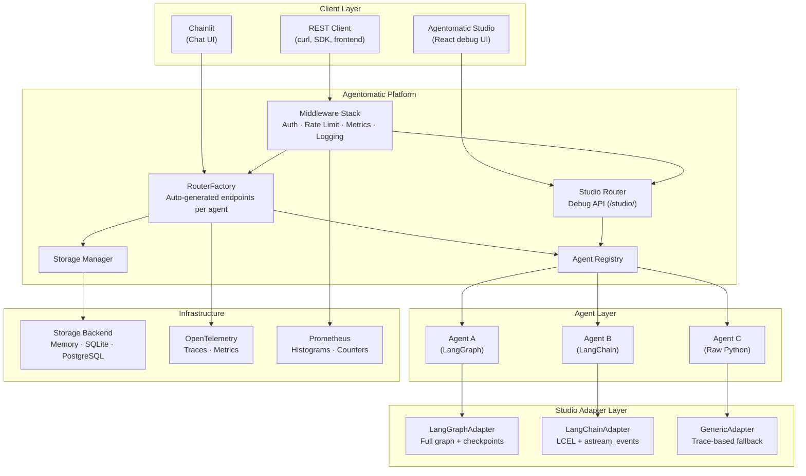
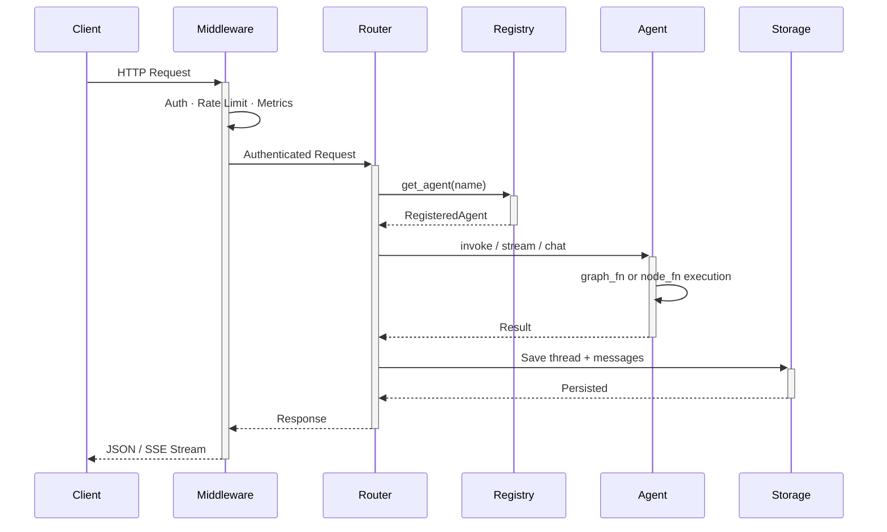
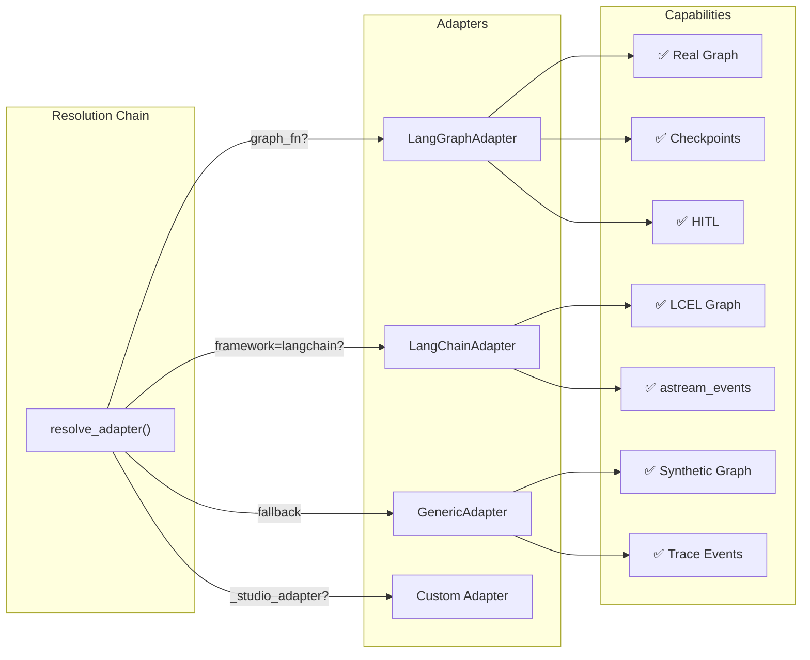

# Architecture Overview

Agentomatic follows a **convention-over-configuration** design where agents are discovered, registered, and served with minimal boilerplate.

---

## High-Level Architecture

---

## Request Flow

---

## Studio Architecture

The Studio uses an **adapter pattern** to provide debugging capabilities across different agent frameworks:

---

## Core Components

### AgentPlatform

The central orchestrator. Created via `AgentPlatform.from_folder()` which:

1. **Scans** the agents directory for valid agent folders
2. **Imports** each agent's `__init__.py` to extract `manifest` and `node_fn`/`graph_fn`
3. **Registers** agents into the `AgentRegistry`
4. **Generates** REST endpoints per agent via `RouterFactory`
5. **Mounts** middleware, Studio router, and Chainlit UI as requested

### Agent Registry

An in-memory registry that holds `RegisteredAgent` instances. Each agent carries:

- **manifest** — `AgentManifest` with name, description, framework, schemas
- **node_fn** — The async callable that processes state
- **graph_fn** — Optional LangGraph `StateGraph` factory
- **config** — Optional Pydantic configuration class
- **prompt_manager** — Template versioning from `prompts.json`

### RouterFactory

Auto-generates 20+ FastAPI endpoints per agent:

| Category | Endpoints |
|---|---|
| **Execution** | `POST /invoke`, `POST /invoke/stream`, `POST /chat` |
| **A2A Protocol** | `GET /card`, `POST /a2a/tasks` |
| **Threads** | `GET/POST /threads`, `GET /threads/{id}/messages` |
| **HITL** | `POST /threads/{id}/approve`, `POST /threads/{id}/reject` |
| **Inspection** | `GET /health`, `GET /config`, `GET /prompts` |
| **Forking** | `POST /threads/{id}/fork`, `GET /threads/{id}/lineage` |

### Storage Layer

Abstract `BaseStore` with implementations:

- **MemoryStore** — In-process dict, perfect for development
- **SQLAlchemyStore** — PostgreSQL / SQLite via async SQLAlchemy

---

## Key Design Decisions

1. **Convention over configuration** — Drop a folder, get a full API
2. **Everything is optional** — Only `__init__.py` is required
3. **Override anything** — Custom `api.py` routers replace auto-generated ones
4. **Async-first** — All I/O uses async/await
5. **ABC-based storage** — Swap backends without code changes
6. **Universal Studio** — Adapter pattern degrades gracefully across frameworks
7. **Middleware pipeline** — Composable, ordered middleware with per-request context
