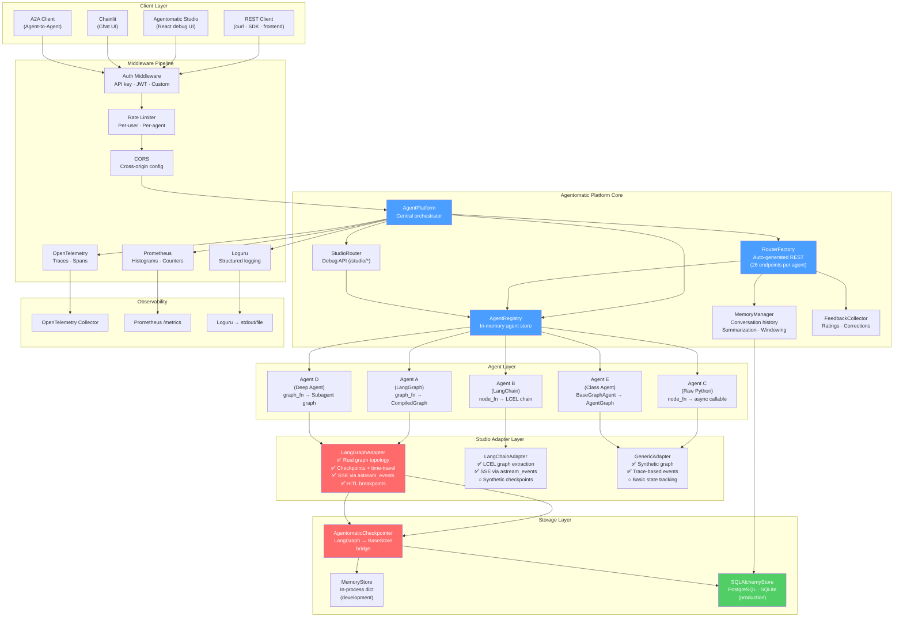
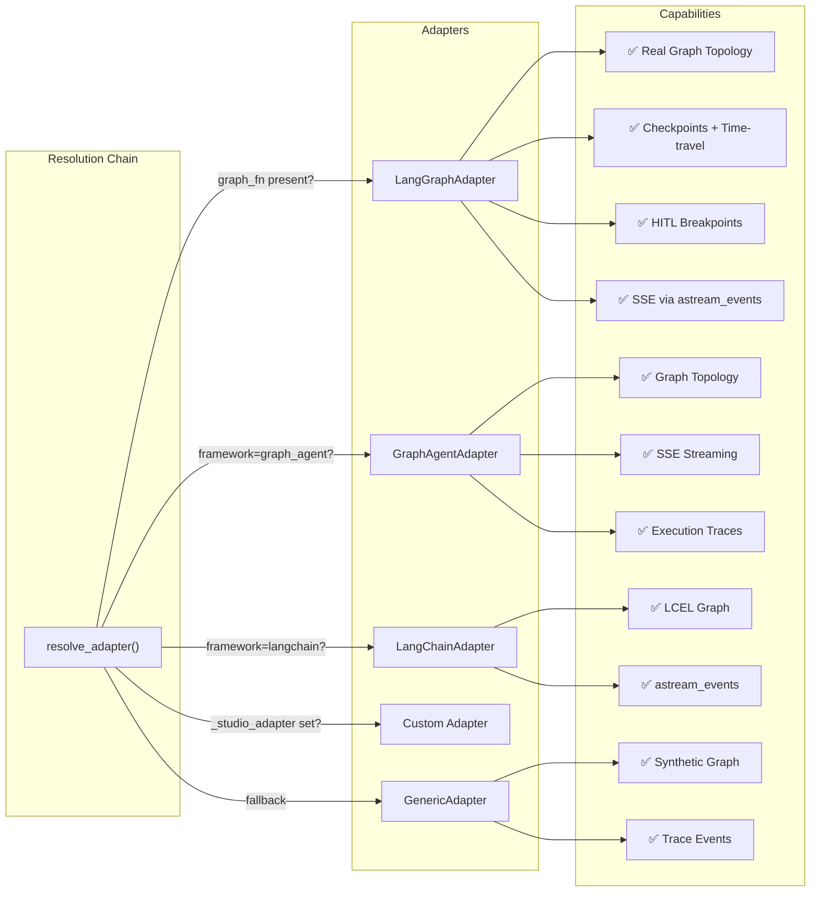
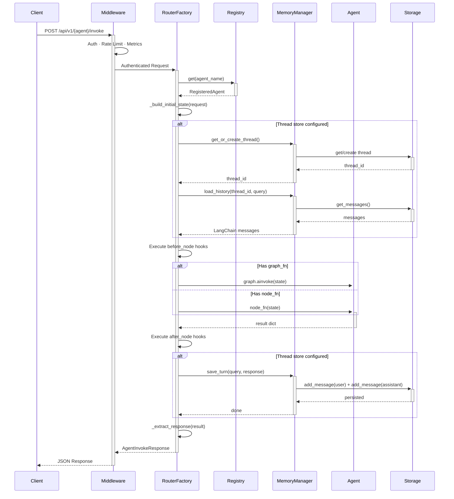
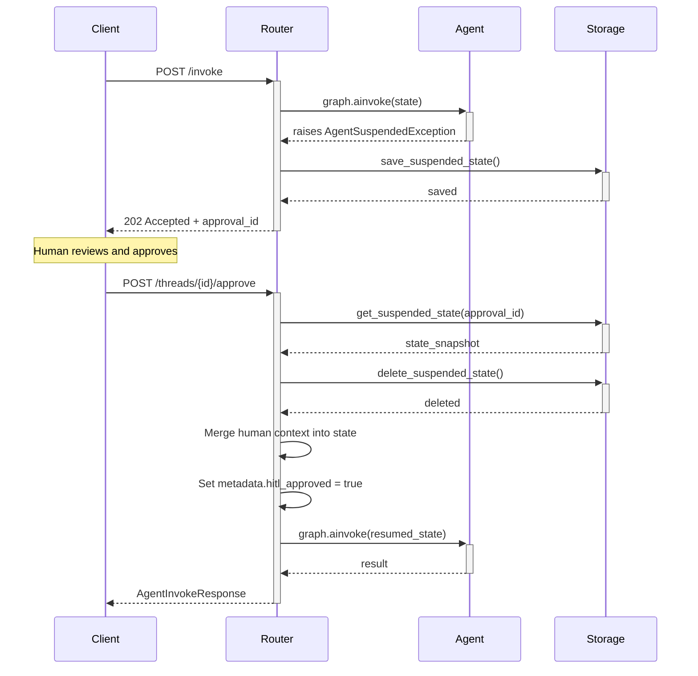
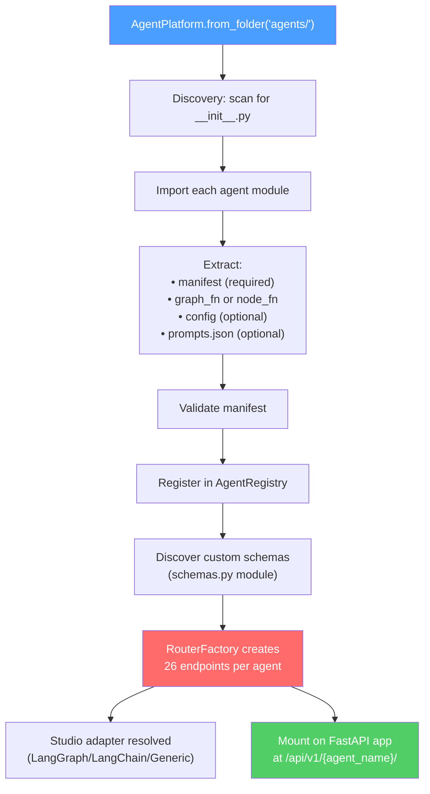
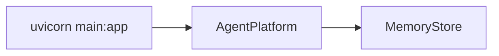
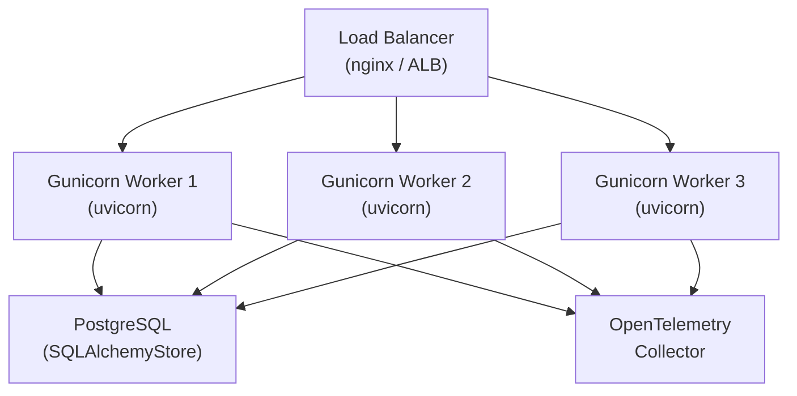
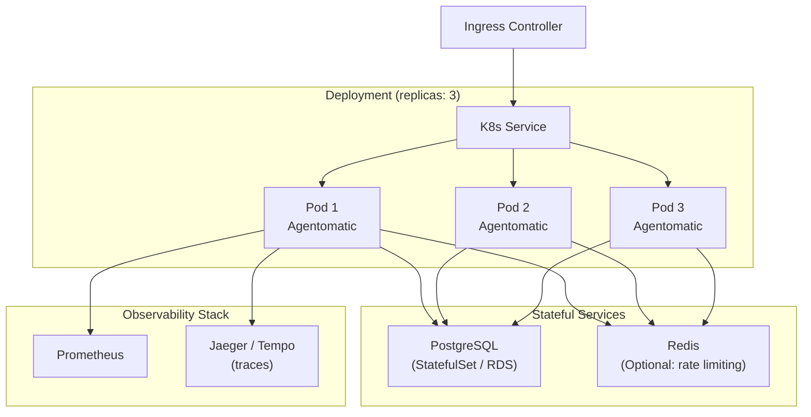
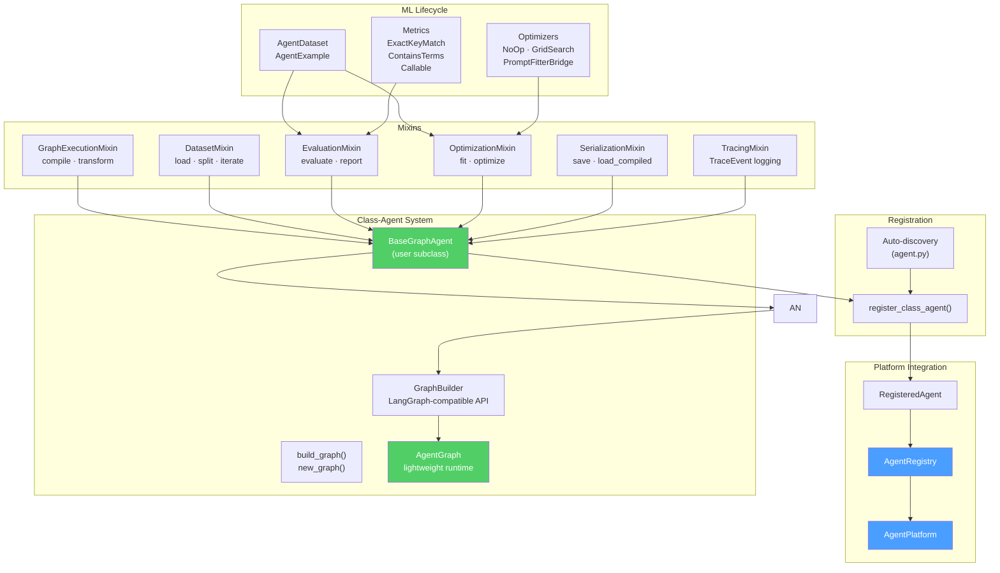

# Architecture Overview

Agentomatic follows a **convention-over-configuration** design where agents are discovered, registered, and served with minimal boilerplate. This page describes the system architecture, component relationships, request lifecycle, and deployment patterns.

---

## System Architecture



---

## Component Descriptions

### AgentPlatform

The central orchestrator. Created via `AgentPlatform.from_folder()`:

1. **Scans** the agents directory for valid agent folders
2. **Imports** each agent's `__init__.py` to extract `manifest` and `node_fn`/`graph_fn`
3. **Registers** agents into the `AgentRegistry`
4. **Generates** REST endpoints per agent via `RouterFactory`
5. **Mounts** middleware, Studio router, and Chainlit UI as requested

```python
from agentomatic import AgentPlatform
from agentomatic.storage import SQLAlchemyStore

platform = AgentPlatform.from_folder(
    "agents/",
    store=SQLAlchemyStore("postgresql+asyncpg://..."),
    enable_studio=True,
    enable_chainlit=True,
)
app = platform.app  # FastAPI application
```

### AgentRegistry

An in-memory registry holding `RegisteredAgent` instances. Each agent carries:

| Field | Type | Description |
|---|---|---|
| `name` | `str` | Machine name (folder name) |
| `slug` | `str` | URL-safe identifier |
| `manifest` | `AgentManifest` | Name, description, framework, version |
| `node_fn` | `Callable` | Async callable that processes state |
| `graph_fn` | `Callable \| None` | LangGraph `StateGraph` factory |
| `config` | `BaseModel \| None` | Pydantic configuration |
| `prompt_manager` | `PromptManager \| None` | Template versioning from `prompts.json` |
| `module_path` | `str \| None` | Python module path for schema discovery |

### RouterFactory

Auto-generates a full FastAPI router per agent with 26 endpoints:

| Category | Endpoints | Description |
|---|---|---|
| **Execution** | `POST /invoke`, `POST /invoke/stream`, `POST /chat` | Sync, streaming, session-aware |
| **A2A Protocol** | `GET /card`, `POST /a2a/tasks`, `GET /a2a/tasks/{id}` | Agent-to-agent interop |
| **Threads** | `POST /threads`, `GET /threads`, `GET /threads/{id}`, `PATCH /threads/{id}`, `DELETE /threads/{id}` | Full CRUD |
| **Messages** | `GET /threads/{id}/messages`, `DELETE /threads/{id}/messages`, `GET /threads/{id}/summary` | History + summarization |
| **HITL** | `GET /threads/{id}/pending`, `POST /threads/{id}/approve`, `POST /threads/{id}/reject` | Human-in-the-loop approval |
| **Forking** | `POST /threads/{id}/fork`, `GET /threads/{id}/lineage` | Thread branching + ancestry |
| **Feedback** | `POST /feedback`, `GET /feedback`, `GET /feedback/export` | User ratings + JSONL export |
| **Inspection** | `GET /health`, `GET /config`, `GET /prompts` | Agent health + config |
| **Optimization** | `POST /optimize/invoke` | Full-context pipeline for DeepEval |

### Studio Adapters

The Studio uses an **adapter pattern** to provide debugging capabilities across different agent frameworks:



Each adapter implements the `StudioAdapter` ABC:

- **`get_graph()`** — Returns `StudioGraphTopology` with nodes and edges
- **`stream_execution()`** — Yields `StudioRunEvent` via SSE
- **`get_state()`** — Returns `StudioStateSnapshot` for a thread
- **`update_state()`** — Applies partial state updates
- **`get_history()`** — Returns checkpoint history

### Storage Layer

Abstract `BaseStore` with swappable implementations:

| Store | Backend | Use Case |
|---|---|---|
| `MemoryStore` | In-process `dict` | Development, testing, CI |
| `SQLAlchemyStore` | PostgreSQL / SQLite | Production deployment |

The `AgentomaticCheckpointer` bridges LangGraph's `BaseCheckpointSaver` to `BaseStore`, enabling checkpoint persistence through the same storage backend used for threads and messages.

---

## Request Lifecycle

### Invoke Flow



### HITL Suspend/Resume Flow



---

## Agent Registration Flow



### Agent Folder Structure

```
agents/
├── my_agent/
│   ├── __init__.py       # Required: manifest + graph_fn/node_fn
│   ├── prompts.json      # Optional: prompt versions
│   ├── schemas.py        # Optional: custom request/response models
│   ├── config.py         # Optional: Pydantic config class
│   └── api.py            # Optional: custom router (replaces auto-generated)
└── another_agent/
    └── __init__.py
```

---

## Deployment Patterns

### Single Process (Development)



```python
# main.py
from agentomatic import AgentPlatform
from agentomatic.storage import MemoryStore

platform = AgentPlatform.from_folder("agents/", store=MemoryStore())
app = platform.app

# uvicorn main:app --reload --port 8000
```

### Multi-Worker (Staging / Production)



```bash
gunicorn main:app \
  --worker-class uvicorn.workers.UvicornWorker \
  --workers 4 \
  --bind 0.0.0.0:8000
```

!!! warning "MemoryStore is Not Multi-Worker Safe"
    Use `SQLAlchemyStore` when running with multiple workers. `MemoryStore` is per-process and does not share state.

### Containerized (Kubernetes)



```dockerfile
FROM python:3.12-slim
WORKDIR /app
COPY . .
RUN pip install -e ".[all]"
EXPOSE 8000
CMD ["uvicorn", "main:app", "--host", "0.0.0.0", "--port", "8000"]
```

```yaml
# k8s deployment excerpt
apiVersion: apps/v1
kind: Deployment
spec:
  replicas: 3
  template:
    spec:
      containers:
        - name: agentomatic
          image: myregistry/agentomatic:latest
          ports:
            - containerPort: 8000
          env:
            - name: DATABASE_URL
              valueFrom:
                secretKeyRef:
                  name: db-credentials
                  key: url
          livenessProbe:
            httpGet:
              path: /health
              port: 8000
          readinessProbe:
            httpGet:
              path: /readiness
              port: 8000
```

---

## Class-Agent Architecture (v0.7)

The **Class-Owned Graph Agent** system introduces an alternative agent paradigm: define agents as Python classes with an ML-inspired lifecycle, using a built-in graph runtime that requires no LangGraph dependency.

### Component Overview



### ML Lifecycle

Class agents follow a training-inspired workflow:

```mermaid
sequenceDiagram
    participant Dev as Developer
    participant Agent as BaseGraphAgent
    participant Graph as AgentGraph
    participant DS as AgentDataset
    participant Opt as Optimizer

    Dev->>Agent: compile(dataset, metrics, optimizer)
    Agent->>Graph: Build graph from build_graph()
    Agent->>Agent: Store metrics + optimizer refs

    Dev->>Agent: fit(dataset)
    Agent->>Opt: optimize(agent, dataset)
    Opt-->>Agent: Optimized parameters

    Dev->>Agent: evaluate(test_split, metrics)
    loop Each example
        Agent->>Graph: Execute graph
        Graph-->>Agent: Output
        Agent->>Agent: Score with metrics
    end
    Agent-->>Dev: EvaluationReport

    Dev->>Agent: transform(input_data)
    Agent->>Graph: Execute compiled graph
    Graph-->>Agent: State
    Agent-->>Dev: Output dict

    Dev->>Agent: save("path/")
    Agent-->>Dev: Serialized state + config
```

### Key Classes

| Class | Module | Purpose |
|---|---|---|
| `BaseGraphAgent[S]` | `agentomatic.agents` | Abstract base — subclass to define your agent |
| `build_graph()` | `BaseGraphAgent` | Primary override — wire nodes with `new_graph()` |
| `GraphBuilder` | `agentomatic.agents.builder` | LangGraph-compatible API for graph construction |
| `AgentGraph` | `agentomatic.agents.graph` | Lightweight graph runtime (sync + async) |
| `AgentDataset` | `agentomatic.agents.types` | JSONL-backed dataset with train/test splits |
| `AgentExample` | `agentomatic.agents.types` | Single input/expected-output pair |
| `TraceEvent` | `agentomatic.agents.types` | Per-node execution trace event |
| `register_class_agent()` | `AgentRegistry` | Register a class agent into the platform |

### Integration with Platform

Class agents integrate with the platform through `register_class_agent()`, which wraps the agent's `transform()` method as a standard `node_fn` and registers it as a `RegisteredAgent`:

```python
from __future__ import annotations

from agentomatic.agents import BaseGraphAgent


class MyAgent(BaseGraphAgent[MyState]):
    agent_name = "my_agent"

    def build_graph(self):
        g = self.new_graph()
        g.add_node("process", self.process)
        g.set_entry_point("process")
        g.set_finish_point("process")
        return g.compile()

    # ... methods ...

# Register into the platform
agent = MyAgent(llm=my_llm)
agent.compile(dataset, metrics)
registry.register_class_agent(agent)
```

Alternatively, the platform auto-discovers class agents via `agent.py` files using the `agentomatic init --template class` scaffold.

---

## Extension Points

Agentomatic is designed for extensibility at every layer:

| Extension Point | Mechanism | Example |
|---|---|---|
| **Custom agents** | Drop folder in `agents/` | Any Python async function |
| **Custom routers** | `api.py` in agent folder | Replace auto-generated endpoints |
| **Custom schemas** | `schemas.py` in agent folder | Domain-specific request/response models |
| **Custom adapters** | `_studio_adapter` attribute | Framework-specific Studio integration |
| **Before/after hooks** | `register_before_node_hook()` | Audit logging, security scanning |
| **Storage backends** | Subclass `BaseStore` | Custom databases, cloud storage |
| **Middleware** | FastAPI middleware | Auth, rate limiting, custom headers |
| **Prompt versions** | `prompts.json` | A/B testing, version management |
| **LLM providers** | `get_llm(provider=...)` | OpenAI, Azure, Ollama, Anthropic |
| **Checkpointers** | `AgentomaticCheckpointer` | Bridge any store to LangGraph |

---

## Key Design Decisions

1. **Convention over configuration** — Drop a folder, get a full API
2. **Everything is optional** — Only `__init__.py` with a manifest is required
3. **Override anything** — Custom `api.py` routers replace auto-generated ones
4. **Async-first** — All I/O uses `async`/`await`
5. **ABC-based storage** — Swap backends without code changes
6. **Universal Studio** — Adapter pattern degrades gracefully across frameworks
7. **Middleware pipeline** — Composable, ordered middleware with per-request context
8. **Schema discovery** — Custom Pydantic models auto-integrate into OpenAPI docs
9. **Checkpoint bridge** — Single storage backend for threads, messages, and LangGraph checkpoints
10. **HITL as first-class** — Suspend/resume built into the router factory, not bolted on
11. **Class agents** — ML lifecycle (`compile`/`fit`/`evaluate`/`transform`) with zero framework deps
12. **Composable pipelines** — YAML, Builder, and decorator interfaces for multi-agent orchestration
