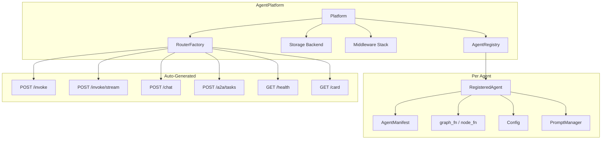
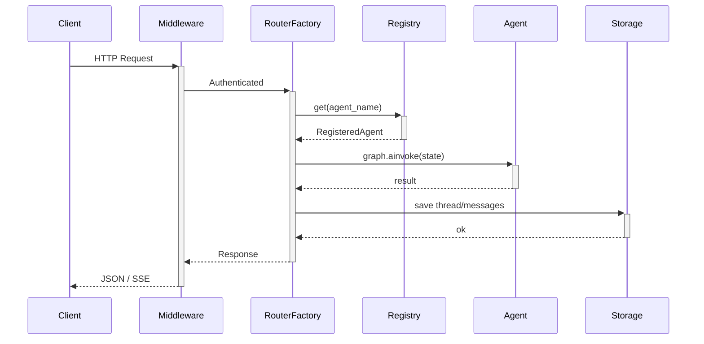

# Architecture Overview

## Core Components

## Request Flow

## Key Design Decisions

1. **Convention over configuration** — drop a folder, get an API
2. **Everything is optional** — only `__init__.py` required
3. **Override anything** — custom routers replace auto-generated ones
4. **Async-first** — all I/O is async
5. **ABC-based storage** — swap backends without code changes
