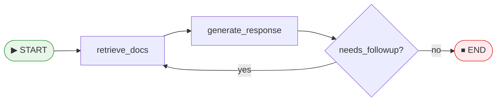
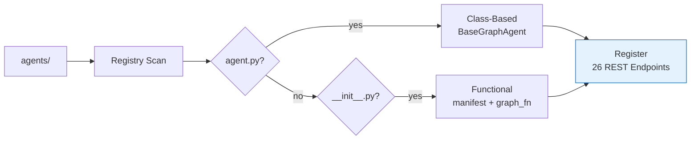
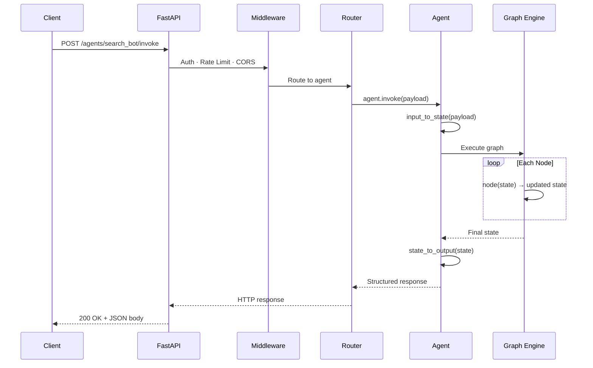
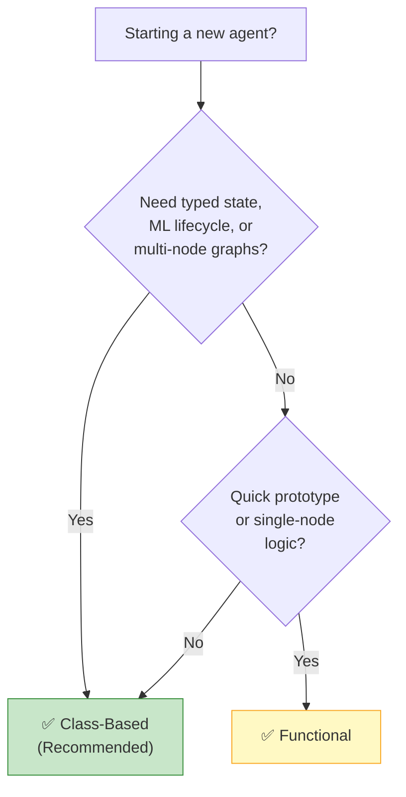

# Concepts & Glossary

Build a mental model of Agentomatic before writing your first line of code.
This page covers every core abstraction, shows how a request flows end-to-end,
and helps you choose the right pattern for your agent.

---

## 🧩 Core Concepts

Every Agentomatic application is built from a handful of composable primitives.
Learn these once and everything else clicks into place.

### :material-robot-outline: Agent

A **self-contained unit of AI logic** that processes requests and returns
responses. An agent can be as simple as a single function or as complex as a
multi-step execution graph with branching, loops, and tool calls.

```python
from agentomatic.agents import BaseGraphAgent

class MyAgent(BaseGraphAgent[MyState]):
    """A class-based agent — all logic in one file."""
    ...
```

!!! tip "Think of it as…"
    A micro-service with exactly one job. It receives input, does smart work
    (often involving an LLM), and returns structured output.

---

### :material-circle-double: Node

A **single processing step** within an agent's execution graph. Each node
receives the current state, performs work (LLM call, tool use, data transform),
and returns the updated state.

```python
def retrieve_docs(self, state: MyState) -> dict:
    """Node: fetch relevant documents from the knowledge base."""
    state.documents = self.retriever.search(state.query)
    return {"documents": state.documents}
```

Nodes are the atoms of your agent — keep them small and focused.

---

### :material-database-outline: State

The **data structure passed between nodes** during a single execution run.
It acts as shared memory for the entire graph.

=== "Class-Based (`@dataclass`)"

    ```python
    from __future__ import annotations
    from dataclasses import dataclass, field

    @dataclass
    class MyState:
        query: str = ""
        documents: list[str] = field(default_factory=list)
        answer: str = ""
    ```

=== "Functional (`dict`)"

    ```python
    # State is just a plain dictionary
    state = {
        "query": "",
        "documents": [],
        "answer": "",
    }
    ```

!!! info "Immutability in Practice"
    Nodes return a `dict` of updated fields. The framework merges these updates
    into the current state — you never need to mutate state in-place.

---

### :material-graph-outline: Graph

The **directed flow of nodes** that defines an agent's logic. Nodes are
connected by **edges** (linear) or **conditional edges** (branching).



Graphs are built declaratively inside `build_graph()` (class-based) or
`graph_fn()` (functional). The framework compiles them into an optimised
execution plan.

---

### :material-card-account-details-outline: Manifest

An **`AgentManifest` dataclass** that declares an agent's identity — name,
slug, description, framework, and version. The registry reads the manifest
to know what agents exist and how to route to them.

```python
from agentomatic.core.manifest import AgentManifest

manifest = AgentManifest(
    name="Search Bot",
    slug="search_bot",
    description="Knowledge-base search with citations.",
    framework="langgraph",
    version="1.0.0",
)
```

!!! note "Class-based agents generate their manifest automatically"
    If you use `BaseGraphAgent`, the manifest is derived from class attributes.
    You only write one explicitly when using the functional pattern.

---

### :material-message-text-outline: Thread

A **conversation session with persistent history**. Each thread has a unique
`thread_id` and stores messages across multiple requests, enabling multi-turn
dialogue.

```python
# Client-side: continue a conversation
response = client.post(
    "/agents/search_bot/chat",
    json={
        "message": "Tell me more about that last point.",
        "thread_id": "abc-123",   # ← same thread
    },
)
```

Threads are stored in the configured [storage backend](../guide/storage.md)
(SQLite, PostgreSQL, or in-memory).

---

### :material-server-outline: Platform

The **`AgentPlatform`** — the FastAPI server that hosts, discovers, and serves
all agents. Created with a single call:

```python
from agentomatic import AgentPlatform

platform = AgentPlatform.from_folder("./agents")
platform.run()  # 🚀 FastAPI is live
```

The platform handles middleware (auth, rate limiting, CORS), health checks,
and the Studio debugger — you focus on agent logic.

---

### :material-folder-search-outline: Discovery

The **automatic process** where the registry scans your `agents/` folder at
startup, imports each agent module, reads its manifest (or introspects the
`BaseGraphAgent` subclass), and registers it with REST endpoints.



!!! tip "Zero configuration"
    Drop a new folder into `agents/`, restart the server, and your agent is
    live — complete with docs, streaming, threads, and Studio integration.

---

### :material-monitor-dashboard: Studio

The **visual debugger** (React frontend) that ships with Agentomatic. Studio
shows graph topology, execution state, node timings, and time-travel
debugging so you can step through each node's input/output.

```bash
# Launch the platform with Studio enabled
agentomatic run --studio
```

See [Agentomatic Studio](../guide/studio.md) for the full guide.

---

### :material-api: Endpoint

One of the **26 auto-generated REST API routes** per agent. Every registered
agent automatically receives endpoints for:

| Category | Example Routes |
|----------|---------------|
| **Execution** | `/invoke`, `/stream`, `/batch` |
| **Chat** | `/chat`, `/chat/stream` |
| **Threads** | `/threads`, `/threads/{id}/history` |
| **Introspection** | `/config`, `/schema`, `/graph`, `/health` |
| **Management** | `/feedback`, `/state`, `/metrics` |

!!! info "No boilerplate"
    You never write a route. The platform generates them from your agent class
    and serves an OpenAPI spec at `/docs`.

---

### :material-timer-sand: Task & Execution Modes

A **unit of work tracked by the platform's task engine**. The same resource can
be invoked in several **execution modes** — *sync* (wait for the result),
*streaming* (SSE), *async* (submit now, poll later), *batch* (many inputs), or
A2A. Async/batch calls return a **`TaskRecord`** with a status
(`queued → running → succeeded/failed/cancelled`) and live `progress`, pollable
at `/api/v1/tasks/{id}`.

```bash
# Submit an async job, then poll it
curl -X POST /api/v1/my_agent/invoke/async -d '{"query": "long job"}'
curl /api/v1/tasks/task_abc123    # → {"status": "running", "progress": {...}}
```

!!! tip "Think of it as…"
    A background job with a receipt. Perfect for long-running work (e.g. document
    ingestion) where a UI submits, then shows a progress bar. See
    [Tasks & Execution Modes](../guide/tasks.md).

---

### :material-cube-outline: Plugin

A **classical ML model wrapped as a deployable resource** (`BaseMLPlugin`). Drop
it in `plugins/` and it's auto-discovered with `/predict` endpoints — callable
sync, async, or as a task, and usable as a pipeline step. Use it to serve
scikit-learn, PyTorch, or any model alongside your LLM agents. See
[ML Plugins](../guide/ml-plugins.md).

---

### :material-vector-polyline: Pipeline

A **declarative graph that chains resources** — agents, plugins, endpoints,
ingestors, transforms, loops, and sub-pipelines — with explicit data-passing
between steps. Defined in YAML under `pipelines/`, with conditionals, retries,
timeouts, rollback/compensation, and optional schema enforcement. See
[Pipelines](../guide/pipelines.md).

---

### :material-file-import-outline: Ingestor

A **user-defined ingestion/RAG job packaged as a resource** (`BaseIngestor`).
Agentomatic handles the *ops* (discovery, endpoints, task tracking, progress);
you bring the *implementation* by reusing any library (PDF→markdown, splitters,
embedders, vector stores). Drop it in `ingestion/`. See
[Ingestion & RAG](../guide/ingestion.md).

---

## 🔀 How a Request Flows

Every request — whether REST, streaming, or chat — follows the same path
through the system:



| Step | What Happens |
|------|-------------|
| **1. Middleware** | Auth tokens are validated, rate limits are checked, CORS headers are set. |
| **2. Router** | The platform routes to the correct agent by slug. |
| **3. `input_to_state()`** | Your raw request payload is transformed into the agent's state dataclass. |
| **4. Graph Execution** | Nodes run in topological order. Conditional edges choose branches dynamically. |
| **5. `state_to_output()`** | The final state is transformed into your response schema. |

---

## ⚖️ Two Patterns: Class-Based vs Functional

Agentomatic supports **two ways** to define agents. Both are fully
auto-discovered and receive the same 26 REST endpoints.

### Choosing a Pattern



### Side-by-Side Comparison

=== "Class-Based (Recommended)"

    ```python title="agents/search_bot/agent.py"
    from __future__ import annotations

    from dataclasses import dataclass, field

    from agentomatic.agents import BaseGraphAgent
    from agentomatic.agents.graph import GraphBuilder


    @dataclass
    class SearchState:
        query: str = ""
        documents: list[str] = field(default_factory=list)
        answer: str = ""


    class SearchBot(BaseGraphAgent[SearchState]):
        name = "Search Bot"
        description = "Knowledge-base search with citations."

        def build_graph(self, builder: GraphBuilder) -> None:
            builder.add_node("retrieve", self.retrieve_docs)
            builder.add_node("generate", self.generate_response)
            builder.add_edge("retrieve", "generate")
            builder.set_entry_point("retrieve")
            builder.set_finish_point("generate")

        def retrieve_docs(self, state: SearchState) -> dict:
            state.documents = ["doc1", "doc2"]
            return {"documents": state.documents}

        def generate_response(self, state: SearchState) -> dict:
            state.answer = f"Based on {len(state.documents)} docs..."
            return {"answer": state.answer}

        def input_to_state(self, payload: dict) -> SearchState:
            return SearchState(query=payload.get("query", ""))

        def state_to_output(self, state: SearchState) -> dict:
            return {"answer": state.answer}
    ```

    !!! tip "Why class-based?"
        - **Typed state** — catch bugs at development time
        - **ML lifecycle** — `compile() → fit() → evaluate() → transform()`
        - **Self-contained** — one file, one class, one import
        - **Graph viz** — Studio renders your `build_graph()` topology

=== "Functional"

    ```python title="agents/search_bot/__init__.py"
    from __future__ import annotations

    from agentomatic.core.manifest import AgentManifest

    manifest = AgentManifest(
        name="Search Bot",
        slug="search_bot",
        description="Knowledge-base search with citations.",
        framework="langgraph",
        version="1.0.0",
    )


    def retrieve_docs(state: dict) -> dict:
        """Node: fetch relevant documents."""
        state["documents"] = ["doc1", "doc2"]
        return state


    def generate_response(state: dict) -> dict:
        """Node: produce an answer from documents."""
        state["answer"] = f"Based on {len(state['documents'])} docs..."
        return state


    def graph_fn():
        """Build and return the LangGraph StateGraph."""
        from langgraph.graph import StateGraph

        g = StateGraph(dict)
        g.add_node("retrieve", retrieve_docs)
        g.add_node("generate", generate_response)
        g.add_edge("retrieve", "generate")
        g.set_entry_point("retrieve")
        g.set_finish_point("generate")
        return g.compile()
    ```

    !!! note "When to use functional"
        - Quick prototypes or single-node agents
        - Gradual migration from raw LangGraph code
        - Scripts that don't need typed state or ML lifecycle

### Feature Matrix

| Feature | Class-Based | Functional |
|---------|:-----------:|:----------:|
| Typed `@dataclass` state | ✅ | ❌ |
| ML lifecycle (`compile/fit/evaluate`) | ✅ | ❌ |
| `build_graph()` with `GraphBuilder` | ✅ | ❌ |
| `input_to_state()` / `state_to_output()` | ✅ | ❌ |
| Auto-generated 26 endpoints | ✅ | ✅ |
| Studio graph visualization | ✅ | ✅ |
| Custom config (`config.py`) | ✅ | ✅ |
| Custom schemas (`schemas.py`) | ✅ | ✅ |
| Prompt management (`prompts.json`) | ✅ | ✅ |
| Tool definitions (`tools.py`) | ✅ | ✅ |

---

## 📁 Key Files at a Glance

Every agent lives in a subfolder under `agents/`. Here's what each file does:

| File | Pattern | Purpose |
|------|---------|---------|
| `agent.py` | Class-Based | Your `BaseGraphAgent` subclass — nodes, graph, state transforms |
| `__init__.py` | Functional | Module-level `manifest` + `node_fn` / `graph_fn` |
| `config.py` | Both | Pydantic settings model — LLM params, feature flags, thresholds |
| `schemas.py` | Both | Custom request/response models (overrides auto-generated ones) |
| `prompts.json` | Both | Versioned prompt templates with variable interpolation |
| `tools.py` | Both | LangChain-compatible tool definitions for tool-calling agents |
| `api.py` | Both | Custom FastAPI routers (add or override auto-generated routes) |
| `.env.example` | Both | Environment variable blueprint for your agent |
| `README.md` | Both | Agent-level documentation |

!!! info "Only one file is required"
    **Class-based**: `agent.py` is the only mandatory file.
    **Functional**: `__init__.py` with a `manifest` is the only mandatory file.
    Everything else is optional — add files as your agent grows.

```text
agents/
├── search_bot/
│   ├── agent.py         ← REQUIRED (class-based)
│   ├── config.py        ← optional
│   ├── schemas.py       ← optional
│   ├── tools.py         ← optional
│   ├── prompts.json     ← optional
│   └── README.md        ← optional
│
└── echo_bot/
    ├── __init__.py      ← REQUIRED (functional)
    └── config.py        ← optional
```

---

## 🗺️ What's Next?

You now have the vocabulary to navigate every part of Agentomatic.
Pick your path:

| Goal | Page |
|------|------|
| :material-rocket-launch: **Run your first agent in 60 seconds** | [Quick Start](quickstart.md) |
| :material-school-outline: **Step-by-step agent tutorial** | [Your First Agent](first-agent.md) |
| :material-code-braces: **Deep dive into class-based agents** | [Class-Based Agents](../guide/class-agents.md) |
| :material-folder-cog-outline: **File conventions & discovery** | [Agent Structure & Discovery](../guide/agent-structure.md) |
| :material-book-open-page-variant: **Patterns & recipes** | [Cookbook & Recipes](../guide/cookbook.md) |
| :material-monitor-dashboard: **Visual debugging with Studio** | [Agentomatic Studio](../guide/studio.md) |
| :material-wrench-outline: **Configure LLMs & middleware** | [Configuration](../guide/configuration.md) |

!!! tip "Recommended Reading Order"
    **Concepts** (you are here) → [Quick Start](quickstart.md) →
    [Your First Agent](first-agent.md) → [Class-Based Agents](../guide/class-agents.md) →
    [Cookbook](../guide/cookbook.md)
