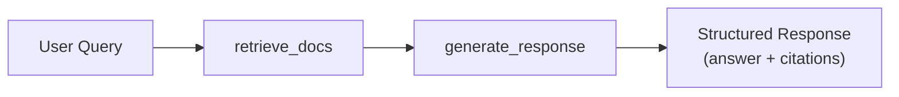

# Your First Agent

Build a production-ready agent from scratch — step by step, with every line explained.

---

## What You'll Build

In this tutorial, you'll create a **knowledge base search agent** that:

1. Receives a user query via REST API
2. Retrieves relevant documents from a knowledge base
3. Generates a grounded response using an LLM
4. Returns structured output with citations and suggestions

By the end, you'll understand the full agent lifecycle — from folder structure to Studio debugging.



---

## Step 1: Create the Agent Folder

Use the CLI to scaffold a new agent:

```bash
agentomatic init search_bot --template full
```

This creates a complete agent package:

```text
agents/search_bot/
├── __init__.py      # ← Required: manifest + entry point
├── graph.py         # ← LangGraph orchestration flow
├── nodes.py         # ← Node execution logic
├── config.py        # ← Agent settings (Pydantic model)
├── schemas.py       # ← Custom request/response schemas
├── tools.py         # ← LangChain-compatible tools
├── api.py           # ← Custom routers (override auto-generated routes)
├── prompts.json     # ← Versioned prompt templates
├── langgraph.json   # ← LangGraph Studio local settings
├── .env.example     # ← Environment blueprint
└── README.md        # ← Agent documentation
```

!!! info "Only `__init__.py` is required"
    The only mandatory file is `__init__.py` with a `manifest` and either a `graph_fn` or `node_fn`. Everything else is optional — add files as your agent grows in complexity.

---

## Step 2: Declare the Agent Manifest

The manifest is your agent's identity card. Open `agents/search_bot/__init__.py`:

```python title="agents/search_bot/__init__.py"
from agentomatic import AgentManifest
from .graph import get_graph

manifest = AgentManifest(  # (1)!
    name="search_bot",                              # (2)!
    slug="search-bot",                               # (3)!
    description="Knowledge base search assistant.",  # (4)!
    intent_keywords=["search", "find", "document"],  # (5)!
    version="1.0.0",                                 # (6)!
    framework="langgraph",                           # (7)!
)

def graph_fn():  # (8)!
    """Return the compiled LangGraph StateGraph."""
    return get_graph()
```

1. `AgentManifest` is an immutable dataclass — once created, it cannot be modified
2. `name` must match the folder name exactly (`agents/search_bot/`)
3. `slug` is the URL-safe identifier used in API routes — `/api/v1/search-bot/invoke`
4. `description` appears in the Swagger docs and Studio UI
5. `intent_keywords` are used by orchestrator agents for automatic routing
6. `version` follows SemVer — shown in health check responses
7. `framework` tells Agentomatic which adapter to use: `"langgraph"`, `"langchain"`, or `"custom"`
8. `graph_fn` is called lazily on first request — the graph is compiled and cached

---

## Step 3: Understand `graph_fn` vs `node_fn`

Before writing your agent logic, you need to decide which entry point to use:

=== "graph_fn — For Graph-Based Agents"

    Use `graph_fn` when your agent has **multiple steps** and you want **full Studio debugging**:

    ```python title="__init__.py"
    def graph_fn():
        """Return a compiled LangGraph StateGraph."""
        return get_graph()  # Returns CompiledStateGraph
    ```

    **Benefits:**

    - :material-check: Full graph visualization in Studio
    - :material-check: Time-travel debugging (inspect state at any node)
    - :material-check: SSE streaming shows node-by-node progress
    - :material-check: Works with LangGraph, Deep Agent, and any graph compiler

    **When to choose:**

    - Multi-step workflows (retrieve → process → respond)
    - Branching or conditional logic
    - Tool-calling agents
    - Any agent where you want visual debugging

=== "node_fn — For Single-Function Agents"

    Use `node_fn` when your agent is a **single async function**:

    ```python title="__init__.py"
    async def node_fn(state: dict[str, Any]) -> dict[str, Any]:
        """Execute the agent logic in one step."""
        return {"response": "Hello!"}
    ```

    **Benefits:**

    - :material-check: Simpler — no graph setup required
    - :material-check: Works with LangChain LCEL, plain Python, or any framework
    - :material-check: Still gets all REST endpoints (invoke, stream, chat, etc.)

    **When to choose:**

    - Single-step agents (one LLM call)
    - LCEL chain wrappers
    - Prototyping and testing
    - Pure Python logic with no orchestration

!!! warning "You must export exactly one of `graph_fn` or `node_fn`"
    Both are optional, but at least one must be defined in your `__init__.py`. If both are present, `graph_fn` takes priority.

---

## Step 4: Build the Graph

Create the LangGraph `StateGraph` that orchestrates your agent's nodes:

```python title="agents/search_bot/graph.py"
from langgraph.graph import StateGraph, END
from agentomatic import BaseAgentState  # (1)!
from .nodes import retrieve_docs, generate_response

def get_graph():
    """Build and compile the search bot graph."""
    builder = StateGraph(BaseAgentState)  # (2)!

    # Add nodes — each is an async function
    builder.add_node("retrieve_docs", retrieve_docs)      # (3)!
    builder.add_node("generate_response", generate_response)

    # Define the flow
    builder.set_entry_point("retrieve_docs")               # (4)!
    builder.add_edge("retrieve_docs", "generate_response") # (5)!
    builder.add_edge("generate_response", END)             # (6)!

    return builder.compile()  # (7)!
```

1. `BaseAgentState` is Agentomatic's default `TypedDict` with fields like `current_query`, `response`, `messages`, `steps_taken`, and `citations` — all with reducers for parallel-safe writes
2. The `StateGraph` uses `BaseAgentState` as its state schema — every node reads from and writes to this dict
3. Nodes are registered by name — this name appears in Studio, SSE events, and `steps_taken`
4. `set_entry_point` defines the first node to execute
5. `add_edge` connects nodes in sequence — you can also use `add_conditional_edges` for branching
6. `END` is a special sentinel that terminates the graph
7. `.compile()` returns a `CompiledStateGraph` — this is what `graph_fn` returns to Agentomatic

---

## Step 5: Implement the Nodes

Each node is an async function that receives the state dict and returns updates:

```python title="agents/search_bot/nodes.py"
from typing import Any
from langchain_ollama import ChatOllama
from langchain_core.messages import HumanMessage


async def retrieve_docs(state: dict[str, Any]) -> dict[str, Any]:  # (1)!
    """Retrieve relevant documents from the knowledge base."""
    query = state.get("current_query", "")  # (2)!

    # --- Replace with real vector DB (Qdrant, Chroma, Pinecone, etc.) ---
    docs = [
        "Company policy: Employees get 25 days of paid time off per year.",
        "Requesting leaves: Submit requests in the employee portal 2 weeks in advance.",
    ]

    return {  # (3)!
        "citations": [{"source": "company_handbook.pdf", "page": 10}],
        "metadata": {"retrieved_docs": docs},
        "steps_taken": ["retrieve_docs"],
    }


async def generate_response(state: dict[str, Any]) -> dict[str, Any]:
    """Generate a grounded response using retrieved documents."""
    query = state.get("current_query", "")
    context = state.get("metadata", {}).get("retrieved_docs", [])  # (4)!

    # Build a grounded prompt with context
    prompt = (
        "Answer the question based ONLY on the following context.\n\n"
        "Context:\n" + "\n".join(f"- {doc}" for doc in context) +
        f"\n\nQuestion: {query}"
    )

    llm = ChatOllama(model="mistral:7b", temperature=0.1)  # (5)!
    result = await llm.ainvoke([HumanMessage(content=prompt)])

    return {
        "response": result.content,  # (6)!
        "suggestions": ["How to request leaves?", "PTO balance check"],
        "steps_taken": ["generate_response"],
    }
```

1. Nodes receive the full state as a `dict[str, Any]` and return a partial update dict
2. `current_query` is populated by Agentomatic from the request body's `"query"` field
3. Return only the fields you want to update — reducers handle merging (e.g., `steps_taken` uses `operator.add` for list concatenation)
4. Read from `metadata` written by the previous node — state flows through the graph
5. Swap `ChatOllama` for `ChatOpenAI`, `ChatAnthropic`, or any LangChain-compatible LLM
6. `response` is the field that Agentomatic returns to the client as the main answer

---

## Step 6: Add Tools to Your Agent

Extend your agent with LangChain-compatible tools:

```python title="agents/search_bot/tools.py"
from langchain_core.tools import tool


@tool
def search_knowledge_base(query: str) -> str:
    """Search the company knowledge base for relevant documents.

    Args:
        query: The search query string.
    """
    # Replace with real vector DB search
    results = {
        "leave policy": "Employees get 25 days PTO per year.",
        "remote work": "Remote work is allowed 3 days per week.",
    }
    for keyword, answer in results.items():
        if keyword in query.lower():
            return answer
    return "No relevant documents found."


@tool
def get_employee_info(employee_id: str) -> str:
    """Look up employee information by ID.

    Args:
        employee_id: The employee's unique identifier.
    """
    # Replace with real database lookup
    return f"Employee {employee_id}: Jane Doe, Engineering, joined 2023."
```

Then bind the tools to your LLM in the node:

```python title="agents/search_bot/nodes.py (updated)"
from .tools import search_knowledge_base, get_employee_info

async def generate_response(state: dict[str, Any]) -> dict[str, Any]:
    """Generate a response using tools if needed."""
    query = state.get("current_query", "")

    llm = ChatOllama(model="mistral:7b", temperature=0.1)
    llm_with_tools = llm.bind_tools(  # (1)!
        [search_knowledge_base, get_employee_info]
    )

    result = await llm_with_tools.ainvoke([HumanMessage(content=query)])

    return {
        "response": result.content,
        "steps_taken": ["generate_response"],
    }
```

1. `.bind_tools()` enables the LLM to call your tools — LangGraph handles tool execution in a tool node if you set one up

!!! tip "For full tool-calling agents"
    If you want the LLM to autonomously choose and execute tools in a loop, use LangGraph's `ToolNode` and `tools_condition`. See the [Agent Structure Guide](../guide/agent-structure.md) for a complete tool-calling example.

---

## Step 7: Configure Agent Settings

Define a typed configuration with Pydantic:

```python title="agents/search_bot/config.py"
from pydantic import BaseModel, Field


class AgentConfig(BaseModel):  # (1)!
    prompt_version: str = Field("v1", description="Active prompt version")
    temperature: float = Field(0.2, ge=0.0, le=2.0, description="Sampling temperature")
    max_tokens: int = Field(2048, description="Maximum completion tokens")
    llm_model: str = Field("mistral:7b", description="LLM model name")
    vector_store_url: str = Field(
        "http://localhost:6333",
        description="Vector database URL",
    )
```

1. The class must be named `AgentConfig` — Agentomatic auto-discovers it from `config.py`

Configuration is accessible via the REST API:

```bash
# Read current config
curl http://localhost:8000/api/v1/search-bot/config

# Update at runtime (no restart needed)
curl -X POST http://localhost:8000/api/v1/search-bot/config \
  -H "Content-Type: application/json" \
  -d '{"temperature": 0.5, "llm_model": "llama3:8b"}'
```

---

## Step 8: Test Your Agent

### Start the Platform

```bash
agentomatic run --studio --reload
```

### Test via REST API

=== "curl"

    ```bash
    curl -X POST http://localhost:8000/api/v1/search-bot/invoke \
      -H "Content-Type: application/json" \
      -d '{"query": "What is the leave policy?"}'
    ```

=== "Python"

    ```python title="test_search_bot.py"
    import httpx

    response = httpx.post(
        "http://localhost:8000/api/v1/search-bot/invoke",
        json={"query": "What is the leave policy?"},
    )
    data = response.json()
    print(f"Response: {data['response']}")
    print(f"Citations: {data['citations']}")
    print(f"Steps: {data['steps_taken']}")
    ```

=== "Interactive CLI"

    ```bash
    agentomatic test search_bot
    ```

### Expected Response

```json
{
  "response": "According to company policy, employees receive 25 days of paid time off per year. To request leave, submit your request through the employee portal at least 2 weeks in advance.",
  "agent_type": "agent-search_bot",
  "thread_id": "auto-generated-uuid",
  "suggestions": ["How to request leaves?", "PTO balance check"],
  "citations": [{"source": "company_handbook.pdf", "page": 10}],
  "steps_taken": ["retrieve_docs", "generate_response"],
  "metadata": {"retrieved_docs": ["..."]},
  "duration_ms": 842.5
}
```

### Verify Health

```bash
curl http://localhost:8000/api/v1/search-bot/health
```

```json
{
  "agent": "search_bot",
  "slug": "search-bot",
  "version": "1.0.0",
  "framework": "langgraph",
  "node_fn_ready": false,
  "graph_ready": true,
  "has_config": true,
  "status": "healthy"
}
```

---

## Step 9: Debug with Studio

Open **Agentomatic Studio** at `http://localhost:8000/studio/ui/` to visually inspect your agent:

### What Studio Shows You

| Feature | Description |
|---------|-------------|
| :material-graph: **Graph View** | Interactive visualization of your agent's node and edge topology |
| :material-play-circle: **Execute** | Run your agent with custom input directly from the UI |
| :material-waves: **SSE Streaming** | Watch node-by-node execution in real-time |
| :material-history: **Time-Travel** | Step backward and forward through execution history |
| :material-magnify: **State Inspector** | Examine the full state dict at any point in execution |
| :material-pencil: **Live Editing** | Modify state values and re-run from any node |

!!! tip "Studio works with every framework"
    Studio uses universal adapters — whether your agent uses LangGraph, Deep Agent, or a custom graph, Studio can inspect it. For `node_fn`-based agents, Studio shows metadata and execution logs instead of a graph view.

    See the [Studio Guide](../guide/studio.md) for advanced features like custom graph providers, state providers, and stream providers using Studio decorators.

---

## :material-compass: What's Next?

Congratulations! You've built a complete agent with document retrieval, LLM generation, tools, and typed configuration. Here's where to go from here:

| Topic | What You'll Learn |
|-------|-------------------|
| **[Agent Structure](../guide/agent-structure.md)** | All manifest fields, optional files, and override patterns |
| **[Input & Output Schemas](../guide/schemas.md)** | Custom request/response validation with Pydantic models |
| **[Prompt Management](../guide/prompts.md)** | Template versioning, hot-reload, and `prompts.json` format |
| **[Storage Backends](../guide/storage.md)** | Switch from MemoryStore to SQLite or PostgreSQL |
| **[Middleware](../guide/middleware.md)** | Add auth, rate limiting, and custom middleware |
| **[Prompt Optimization](../guide/optimization.md)** | Auto-tune prompts with 7 strategies and 8 metrics |
| **[Agentomatic Studio](../guide/studio.md)** | Advanced debugging — custom providers and decorators |
| **[Deep Agent Integration](../guide/deep-agents.md)** | Build hierarchical agents with the Deep Agent framework |
