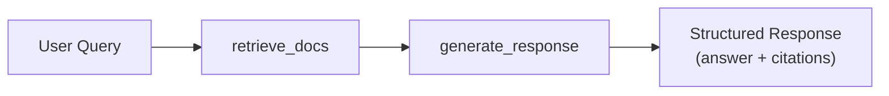

# Your First Agent

Build a production-ready agent from scratch — step by step, with every line explained.

---

## What You'll Build

In this tutorial, you'll create a **knowledge base search agent** that:

1. Receives a user query via REST API
2. Retrieves relevant documents from a knowledge base
3. Generates a grounded response using an LLM
4. Returns structured output with citations and suggestions

By the end, you'll understand the full agent lifecycle — from folder structure to Studio debugging.



---

## Step 1: Create the Agent Folder

Use the CLI to scaffold a new agent:

```bash
agentomatic init search_bot --template full
```

This creates a complete agent package:

```text
agents/search_bot/
├── __init__.py      # ← Optional: Python package init
├── agent.py         # ← REQUIRED: Contains your BaseGraphAgent subclass
├── config.py        # ← Agent settings (Pydantic model)
├── schemas.py       # ← Custom request/response schemas
├── tools.py         # ← LangChain-compatible tools
├── api.py           # ← Custom routers (override auto-generated routes)
├── prompts.json     # ← Versioned prompt templates
├── langgraph.json   # ← LangGraph Studio local settings
├── .env.example     # ← Environment blueprint
└── README.md        # ← Agent documentation
```

!!! info "Only `agent.py` is required"
    The only mandatory file is `agent.py` containing your agent class. Everything else is optional — add files as your agent grows in complexity.

---

## Step 2: Declare the Agent Class

Agentomatic uses a modern, ML-inspired class pattern for agents. Open `agents/search_bot/agent.py`:

```python title="agents/search_bot/agent.py"
from __future__ import annotations

from dataclasses import dataclass, field
from typing import Any
from agentomatic.agents import BaseGraphAgent

@dataclass
class SearchBotState:
    """Agent state — per-run transient data."""
    request: str = ""
    citations: list[dict[str, Any]] = field(default_factory=list)
    output: dict[str, Any] = field(default_factory=dict)


class SearchBotAgent(BaseGraphAgent[SearchBotState]):
    """Knowledge base search assistant."""

    agent_name = "search_bot"
    agent_description = "Knowledge base search assistant."
    agent_framework = "graph_agent"

    def __init__(self, *, llm: Any = None) -> None:
        super().__init__()
        self.llm = llm
        self.system_prompt = "You are a helpful assistant."

    def build_graph(self):
        """Wire the execution graph."""
        g = self.new_graph()
        g.add_node("retrieve", self.retrieve)
        g.add_node("generate", self.generate)
        g.set_entry_point("retrieve")
        g.add_edge("retrieve", "generate")
        g.set_finish_point("generate")
        return g.compile()

    # --- Node Methods ---

    def retrieve(self, state: SearchBotState) -> SearchBotState:
        # Simulate retrieval
        state.citations = [
            {"content": f"Document about {state.request}", "source": "knowledge_base"}
        ]
        return state

    def generate(self, state: SearchBotState) -> SearchBotState:
        context = "\n".join(d.get("content", "") for d in state.citations)
        state.output = {
            "response": f"Based on the knowledge base: Answer to '{state.request}' using context: {context}",
            "agent_type": "search_bot",
            "citations": state.citations,
        }
        return state

    # --- State Conversion ---

    def input_to_state(self, input_data: dict[str, Any]) -> SearchBotState:
        return SearchBotState(request=input_data.get("current_query", ""))

    def state_to_output(self, state: SearchBotState) -> dict[str, Any]:
        return state.output
```

### Understanding the Class Pattern

1. **State**: The `@dataclass` defines what variables are tracked during execution.
2. **Metadata**: `agent_name`, `agent_description`, and `agent_framework` are automatically extracted by Agentomatic's registry to build the API endpoints.
3. **`__init__`**: The perfect place to inject dependencies (like database clients or LLMs).
4. **`build_graph`**: Uses agentomatic's built-in `GraphBuilder` to wire your steps together into an execution graph.
5. **Nodes**: Plain Python methods (like `retrieve` and `generate`) that take the state and return the updated state.
6. **I/O Conversion**: `input_to_state` and `state_to_output` map the REST API's JSON payload to your typed state.

Agentomatic automatically discovers this class, instantiates it, and serves it over the API and Studio!

---

## Step 3: Run and Test

Start your platform:

```bash
agentomatic run
```

Test your agent:

=== "curl"

    ```bash
    curl -X POST http://localhost:8000/api/v1/search_bot/invoke \
      -H "Content-Type: application/json" \
      -d '{"query": "What is machine learning?"}'
    ```

=== "CLI"

    ```bash
    agentomatic test search_bot
    ```

=== "Python"

    ```python
    import httpx

    resp = httpx.post(
        "http://localhost:8000/api/v1/search_bot/invoke",
        json={"query": "What is machine learning?"},
    )
    print(resp.json()["response"])
    ```

Expected response:

```json
{
  "response": "Based on the knowledge base: Answer to 'What is machine learning?' using context: Document about What is machine learning?",
  "agent_type": "search_bot",
  "citations": [{"content": "Document about What is machine learning?", "source": "knowledge_base"}],
  "thread_id": null,
  "suggestions": [],
  "duration_ms": 12.5
}
```

---

## Step 4: Enable Studio Debugging

See your agent's graph topology and execution flow in the visual debugger:

```bash
agentomatic run --studio
```

Then open **http://localhost:8000/studio/** in your browser. You'll see:

- **Graph View** — Visual representation of your `retrieve → generate` pipeline
- **State Panel** — Inspect the state at each node during execution
- **History** — Time-travel through past executions

!!! tip "SSE Streaming"
    Try the streaming endpoint to see real-time execution:
    ```bash
    curl -N -X POST http://localhost:8000/api/v1/search_bot/invoke/stream \
      -H "Content-Type: application/json" \
      -d '{"query": "What is deep learning?"}'
    ```

---

## Step 5: Add Multi-Turn Conversations

Enable persistent chat by adding a storage backend:

```python title="main.py"
from agentomatic import AgentPlatform
from agentomatic.storage import SQLAlchemyStore

store = SQLAlchemyStore("sqlite:///./data/agents.db")

platform = AgentPlatform.from_folder(
    "agents/",
    store=store,
)

app = platform.build()
```

Now use the `/chat` endpoint with a `thread_id` for multi-turn conversations:

```bash
# First message
curl -X POST http://localhost:8000/api/v1/search_bot/chat \
  -H "Content-Type: application/json" \
  -d '{"content": "What is ML?", "thread_id": "session-1"}'

# Follow-up (same thread_id — agent remembers context)
curl -X POST http://localhost:8000/api/v1/search_bot/chat \
  -H "Content-Type: application/json" \
  -d '{"content": "Give me more details", "thread_id": "session-1"}'
```

---

## :material-alert-circle: Common Mistakes

!!! warning "Pitfalls to avoid"

    **1. Forgetting to return state from node methods**
    ```python
    # ❌ Wrong — returns None
    def retrieve(self, state):
        state.citations = [...]
    
    # ✅ Correct
    def retrieve(self, state):
        state.citations = [...]
        return state
    ```

    **2. Wrong key in `input_to_state`**
    
    The REST API maps `query` → `current_query` in the state dict:
    ```python
    def input_to_state(self, data):
        return MyState(query=data.get("current_query", ""))  # ← Not "query"
    ```

    **3. Missing `response` key in output**
    
    `state_to_output()` must return a dict with at minimum a `"response"` key:
    ```python
    def state_to_output(self, state):
        return {"response": state.answer}  # ← Must include "response"
    ```

    **4. Forgetting `super().__init__()` in custom `__init__`**
    ```python
    def __init__(self, *, llm=None):
        super().__init__()  # ← Don't forget this!
        self.llm = llm
    ```

---

## What's Next?

Now that you have a working agent, explore these topics to build production-ready systems:

| Topic | Link | When You Need It |
|-------|------|------------------|
| **Add more nodes & conditional routing** | [Class-Based Agents](../guide/class-agents.md) | Complex multi-step workflows |
| **Copy-paste recipes** | [Cookbook & Recipes](../guide/cookbook.md) | Common patterns ready to use |
| **Custom request/response schemas** | [Input & Output Schemas](../guide/schemas.md) | Domain-specific API contracts |
| **Versioned prompts** | [Prompt Management](../guide/prompts.md) | A/B testing prompt variants |
| **Persistent conversations** | [Storage Backends](../guide/storage.md) | Multi-turn chat with history |
| **Visual debugging** | [Agentomatic Studio](../guide/studio.md) | Graph visualization & time-travel |
| **ML lifecycle** | [Class-Based Agents — ML Pipeline](../guide/class-agents.md#ml-lifecycle) | Optimize, evaluate, and deploy |
| **Deploy to production** | [Configuration](../guide/configuration.md) | Auth, rate limiting, CORS |
