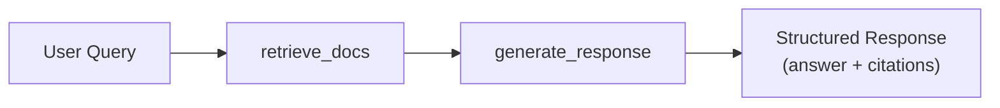

# Your First Agent

Build a production-ready agent from scratch — step by step, with every line explained.

---

## What You'll Build

In this tutorial, you'll create a **knowledge base search agent** that:

1. Receives a user query via REST API
2. Retrieves relevant documents from a knowledge base
3. Generates a grounded response using an LLM
4. Returns structured output with citations and suggestions

By the end, you'll understand the full agent lifecycle — from folder structure to Studio debugging.



---

## Step 1: Create the Agent Folder

Use the CLI to scaffold a new agent:

```bash
agentomatic init search_bot --template full
```

This creates a complete agent package:

```text
agents/search_bot/
├── __init__.py      # ← Optional: Python package init
├── agent.py         # ← REQUIRED: Contains your BaseGraphAgent subclass
├── config.py        # ← Agent settings (Pydantic model)
├── schemas.py       # ← Custom request/response schemas
├── tools.py         # ← LangChain-compatible tools
├── api.py           # ← Custom routers (override auto-generated routes)
├── prompts.json     # ← Versioned prompt templates
├── langgraph.json   # ← LangGraph Studio local settings
├── .env.example     # ← Environment blueprint
└── README.md        # ← Agent documentation
```

!!! info "Only `agent.py` is required"
    The only mandatory file is `agent.py` containing your agent class. Everything else is optional — add files as your agent grows in complexity.

---

## Step 2: Declare the Agent Class

Agentomatic uses a modern, ML-inspired class pattern for agents. Open `agents/search_bot/agent.py`:

```python title="agents/search_bot/agent.py"
from dataclasses import dataclass, field
from typing import Any
from agentomatic.agents import BaseGraphAgent

@dataclass
class SearchBotState:
    """Agent state — per-run transient data."""
    request: str = ""
    citations: list[dict[str, Any]] = field(default_factory=list)
    output: dict[str, Any] = field(default_factory=dict)


class SearchBotAgent(BaseGraphAgent[SearchBotState]):
    """Knowledge base search assistant."""

    agent_name = "search_bot"
    agent_description = "Knowledge base search assistant."
    agent_framework = "graph_agent"

    def __init__(self, *, llm: Any = None) -> None:
        super().__init__()
        self.llm = llm
        self.system_prompt = "You are a helpful assistant."

    def build_graph(self):
        """Wire the execution graph."""
        g = self.new_graph()
        g.add_node("retrieve", self.retrieve)
        g.add_node("generate", self.generate)
        g.set_entry_point("retrieve")
        g.add_edge("retrieve", "generate")
        g.set_finish_point("generate")
        return g.compile()

    # --- Node Methods ---

    def retrieve(self, state: SearchBotState) -> SearchBotState:
        # Simulate retrieval
        state.citations = [
            {"content": f"Document about {state.request}", "source": "knowledge_base"}
        ]
        return state

    def generate(self, state: SearchBotState) -> SearchBotState:
        context = "\n".join(d.get("content", "") for d in state.citations)
        state.output = {
            "response": f"Based on the knowledge base: Answer to '{state.request}' using context: {context}",
            "agent_type": "search_bot",
            "citations": state.citations,
        }
        return state

    # --- State Conversion ---

    def input_to_state(self, input_data: dict[str, Any]) -> SearchBotState:
        return SearchBotState(request=input_data.get("current_query", ""))

    def state_to_output(self, state: SearchBotState) -> dict[str, Any]:
        return state.output
```

### Understanding the Class Pattern

1. **State**: The `@dataclass` defines what variables are tracked during execution.
2. **Metadata**: `agent_name`, `agent_description`, and `agent_framework` are automatically extracted by Agentomatic's registry to build the API endpoints.
3. **`__init__`**: The perfect place to inject dependencies (like database clients or LLMs).
4. **`build_graph`**: Uses LangGraph under the hood to wire your steps together.
5. **Nodes**: Plain python methods (like `retrieve` and `generate`) that take the state and return the updated state.
6. **I/O Conversion**: `input_to_state` and `state_to_output` map the REST API's JSON payload to your typed state.

Agentomatic automatically discovers this class, instantiates it, and serves it over the API and Studio!
