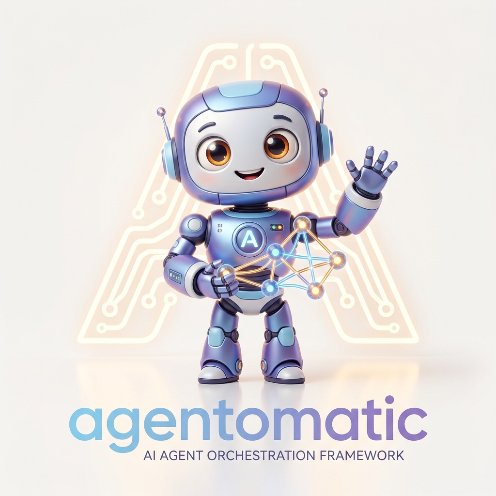

# Installation

<div align="center">
  
  <h3>Getting Started Stack</h3>
</div>

---

## Requirements

- **Python 3.11+** (Python 3.12 and 3.13 are fully supported).
- **Package Manager**: `pip`, `uv`, or `poetry`.

!!! tip "Check your Python version"
    ```bash
    python --version  # Must be ≥ 3.11
    ```

---

## Quick Install

=== "pip"
    ```bash
    pip install agentomatic
    ```

=== "uv"
    ```bash
    uv add agentomatic
    ```

=== "poetry"
    ```bash
    poetry add agentomatic
    ```

---

## Full Install (Recommended)

To enable the bundled production features (including prompt optimization,
database persistence, OpenTelemetry tracing, and Studio), install with the
`all` extras flag. Chainlit is intentionally separate; add the `ui` extra when
you need the graphical chat playground.

```bash
pip install "agentomatic[all]"

# Or with uv
uv add agentomatic --extra all
```

---

## Optional Extras

If you prefer a lightweight install, you can select only the modules and dependencies you need:

| Extra Flag | Install Command | What It Enables |
|---|---|---|
| `langgraph` | `pip install "agentomatic[langgraph]"` | Direct support for LangGraph StateGraphs |
| `langchain` | `pip install "agentomatic[langchain]"` | LangChain and community integration helpers |
| `ollama` | `pip install "agentomatic[ollama]"` | Local Ollama LLM provider integrations |
| `openai` | `pip install "agentomatic[openai]"` | OpenAI API provider integrations |
| `azure` | `pip install "agentomatic[azure]"` | Azure OpenAI provider integration |
| `vertex` | `pip install "agentomatic[vertex]"` | Google Vertex AI provider integration |
| `metrics` | `pip install "agentomatic[metrics]"` | Prometheus exporter metrics |
| `db` | `pip install "agentomatic[db]"` | SQLAlchemy engines + local SQLite support |
| `db-postgres` | `pip install "agentomatic[db-postgres]"` | SQLAlchemy async PostgreSQL client driver |
| `cli` | `pip install "agentomatic[cli]"` | Rich terminal formatting + interactive select prompt controls |
| `ui` | `pip install "agentomatic[ui]"` | Graphical Chainlit chat debug console |
| `studio` | `pip install "agentomatic[studio]"` | Agentomatic Studio visual debugger |
| `optimize` | `pip install "agentomatic[optimize]"` | DSPy-style optimizer loop + DeepEval validation |
| `telemetry` | `pip install "agentomatic[telemetry]"` | OpenTelemetry APM tracing exporters |
| `dotenv` | `pip install "agentomatic[dotenv]"` | Explicit `.env` loading support |
| `security` | `pip install "agentomatic[security]"` | JWT, OAuth2, and cryptographic security features |
| `swarm` | `pip install "agentomatic[swarm]"` | LangGraph swarm orchestration |
| `vector` | `pip install "agentomatic[vector]"` | Local vector/embedding helper dependencies |
| `docs` | `pip install "agentomatic[docs]"` | MkDocs/Mike documentation build toolchain |
| `dev` | `pip install "agentomatic[dev]"` | Test, lint, typing, build, and release-development tools |
| `all` | `pip install "agentomatic[all]"` | Everything except the vendor LLM drivers and the Chainlit UI — see the note below |

!!! warning "What `all` does *not* include"

    `all` covers `langgraph`, `ollama`, `metrics`, `db`, `cli`, `studio`,
    `optimize`, `telemetry`, `dotenv`, `security`, `swarm` and `vector`.

    It deliberately leaves out the vendor LLM drivers — `openai`, `azure`,
    `vertex` — which follow the provider-agnostic principle: you install the
    SDK for the backend you actually use. It also leaves out `db-postgres`
    (an alternative to `db`) and `ui` (Chainlit), which is a heavy dependency.

    So `agentomatic ui` needs `pip install "agentomatic[ui]"` even after an
    `all` install. Add what you need alongside it:

    ```bash
    pip install "agentomatic[all,openai,ui]"
    ```

!!! tip "Quote the extras in zsh/bash"

    Square brackets are glob syntax in most shells, so quote them:
    `pip install "agentomatic[all]"`. Unquoted, zsh fails with
    `no matches found`.

!!! note "Combining extras"
    You can combine multiple extras in a single install command:
    ```bash
    pip install "agentomatic[langgraph,db,metrics]"
    ```

---

## Development Installation (From Source)

To contribute to the framework or run custom builds:

=== "pip"
    ```bash
    git clone https://github.com/UnicoLab/agentomatic.git
    cd agentomatic
    pip install -e ".[all,dev]"
    pre-commit install  # Installs git commit linter hooks
    ```

=== "uv"
    ```bash
    git clone https://github.com/UnicoLab/agentomatic.git
    cd agentomatic
    uv sync --all-extras
    pre-commit install
    ```

---

## Verify Installation

Verify your local environment health, connectivity, and dependencies using the built-in diagnostic test:

```bash
agentomatic doctor
```

### Expected Diagnostic Output

```text
╭──────────────── 🩺 Environment Health Check ────────────────╮
│ Component              │ Status │ Details                    │
├────────────────────────┼────────┼────────────────────────────┤
│ Python                 │ ✅     │ 3.11+                      │
│ fastapi                │ ✅     │ installed                  │
│ uvicorn                │ ✅     │ installed                  │
│ pydantic               │ ✅     │ installed                  │
│ loguru                 │ ✅     │ installed                  │
│ httpx                  │ ✅     │ installed                  │
│ langgraph [langgraph]  │ ✅/❌  │ installed or install hint  │
│ sqlalchemy [db]        │ ✅/❌  │ installed or install hint  │
│ Agents directory       │ ✅/❌  │ discovered agents / path   │
│ Stacks directory       │ ✅/❌  │ discovered stacks / hint   │
╰────────────────────────┴────────┴────────────────────────────╯
```

Exact package versions and optional-extra rows vary by environment. `doctor`
checks `langgraph`, `langchain_core`, `rich`, `questionary`, `chainlit`,
`sqlalchemy`, `prometheus_client`, `dotenv`, JWT/crypto support, and swarm
support when they are installed; it does not contact an LLM provider.

---

## ❓ Troubleshooting

??? question "Command `agentomatic` not found after install"
    Make sure you installed the CLI extra: `pip install "agentomatic[cli]"` or `pip install "agentomatic[all]"`.
    If using a virtual environment, verify it's activated.

??? question "`ModuleNotFoundError: No module named 'langgraph'`"
    LangGraph is optional. Install it with: `pip install "agentomatic[langgraph]"`.
    Class-based agents using `BaseGraphAgent` do NOT require LangGraph.

!!! tip "Next Step"
    Now that the installation is complete, proceed to the [Quick Start](quickstart.md) guide!
