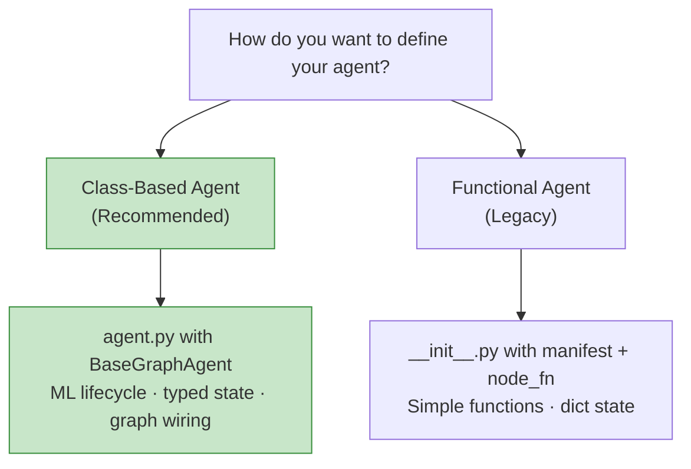
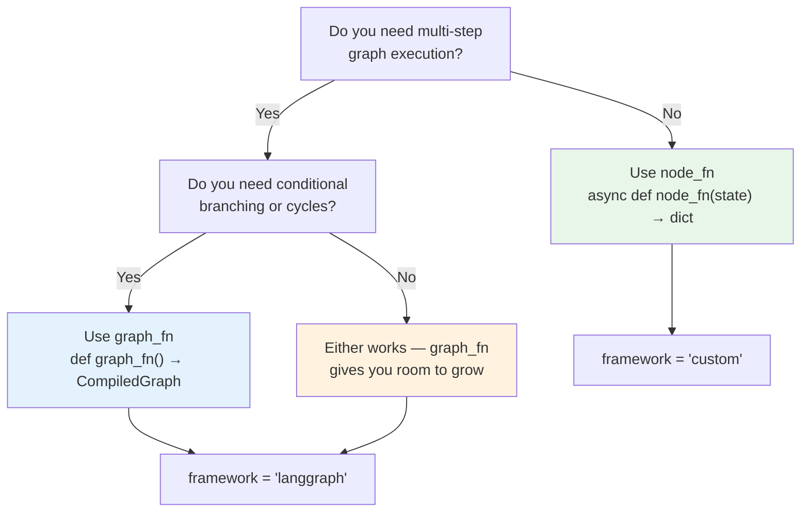
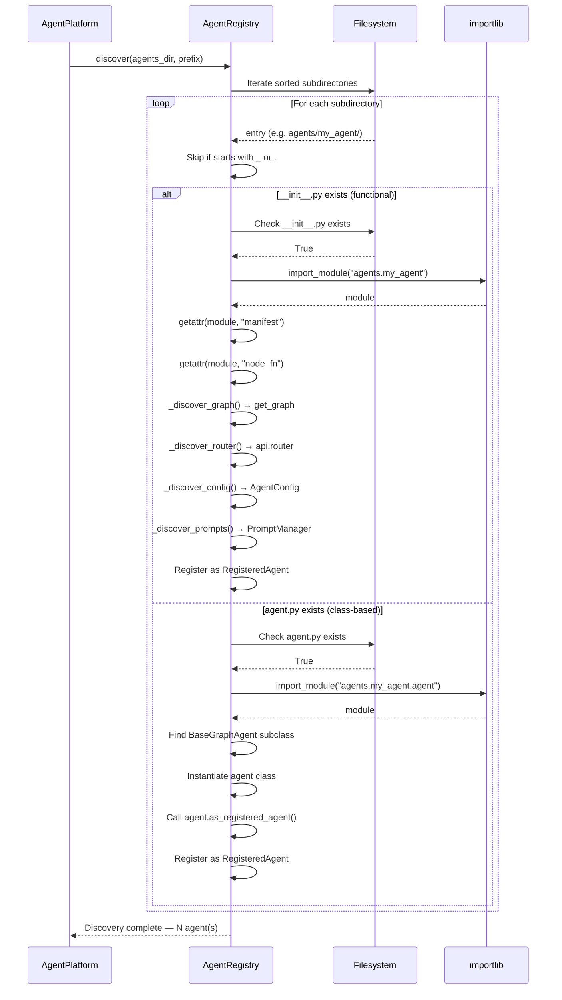

# Agent Structure & Overrides

<div align="center">
  
  <h3>Directory Conventions, Discovery, and Customization Reference</h3>
</div>

---

Agentomatic follows a **convention-over-configuration** model. Each agent lives in a subfolder under your configured agents directory. By dropping files with specific names into this folder, you override default behaviors, customize schemas, configure hyper-parameters, inject custom routers, and define tools.

---

## 🎯 Choose Your Agent Pattern

Agentomatic supports **two patterns** for defining agents. Both are fully auto-discovered and get the same 26 REST endpoints.



=== "Class-Based (Recommended)"

    ```text
    agents/my_agent/
    ├── agent.py         ← REQUIRED: BaseGraphAgent subclass
    ├── config.py        ← Optional: Pydantic config
    ├── schemas.py       ← Optional: custom request/response
    ├── tools.py         ← Optional: LangChain tools
    ├── prompts.json     ← Optional: versioned prompts
    └── README.md        ← Optional: documentation
    ```

    !!! tip "Start here"
        Class-based agents give you typed state, ML lifecycle (`compile → fit → evaluate → transform`), and built-in graph visualization. See [Class-Based Agents](class-agents.md) for the full guide.

=== "Functional (Legacy)"

    ```text
    agents/my_agent/
    ├── __init__.py      ← REQUIRED: manifest + node_fn/graph_fn
    ├── graph.py         ← Optional: LangGraph StateGraph
    ├── nodes.py         ← Optional: node functions
    ├── config.py        ← Optional: Pydantic config
    └── prompts.json     ← Optional: versioned prompts
    ```

    !!! note "Still fully supported"
        The functional pattern works perfectly and is ideal for simple agents or when integrating existing LangGraph code.

---

## 📂 Complete Directory Blueprint

Every agent lives inside a folder under the agents directory. Here is the full blueprint showing all recognized files and their roles:

```text
agents/
├── my_agent/
│   ├── __init__.py          # [REQUIRED]  Manifest + node_fn/graph_fn entrypoint
│   ├── graph.py             # [OPTIONAL]  LangGraph StateGraph pipeline definition
│   ├── nodes.py             # [OPTIONAL]  Logic blocks (nodes) for your graph/agent
│   ├── config.py            # [OPTIONAL]  Pydantic configuration schema (auto-exposed)
│   ├── schemas.py           # [OPTIONAL]  Custom API input/output models
│   ├── prompts.json         # [OPTIONAL]  JSON-based versioned prompt templates
│   ├── tools.py             # [OPTIONAL]  LangChain tools for tool-calling agents
│   ├── api.py               # [OPTIONAL]  Custom router (REPLACES auto-generated endpoints)
│   ├── langgraph.json       # [OPTIONAL]  LangGraph Studio visual debugger config
│   ├── .env.example         # [OPTIONAL]  Template for agent-specific env variables
│   └── README.md            # [OPTIONAL]  Documentation for this agent
├── another_agent/
│   └── ...
└── orchestrator/
    └── ...
```

### File Role Reference

| File | Required | Discovery Phase | Purpose |
|------|----------|----------------|---------|
| `agent.py` | **Yes** (class-based) | `_discover_class_agent()` | Contains a `BaseGraphAgent` subclass. Alternative to `__init__.py` + manifest. |
| `__init__.py` | **Yes** (functional) | `importlib.import_module()` | Must export `manifest: AgentManifest` and either `node_fn` or `graph_fn` |
| `graph.py` | No | `_discover_graph()` | Exports `get_graph()` returning a compiled `StateGraph` |
| `nodes.py` | No | Imported by `graph.py` | Individual processing functions used as graph nodes |
| `config.py` | No | `_discover_config()` | Exports a Pydantic `BaseModel` class named `{AgentName}Config` |
| `schemas.py` | No | Parsed at build time | Overrides `AgentInvokeRequest` / `AgentInvokeResponse` for OpenAPI |
| `prompts.json` | No | `_discover_prompts()` | Versioned prompt templates loaded into `PromptManager` |
| `tools.py` | No | Imported by nodes | Exports `agent_tools` list of LangChain `@tool` functions |
| `api.py` | No | `_discover_router()` | Exports `router: APIRouter` replacing all auto-generated routes |
| `langgraph.json` | No | LangGraph Studio | Studio debugger configuration pointing to the graph entrypoint |
| `.env.example` | No | Manual | Template for required environment variables |
| `README.md` | No | Manual | Agent-specific documentation |

---

## 🪪 AgentManifest Field Reference

The `AgentManifest` is a frozen dataclass that serves as the **identity card** for every agent. It is declared in `__init__.py` and discovered automatically by the registry.

```python
from agentomatic import AgentManifest

manifest = AgentManifest(
    name="my_agent",
    slug="my-agent",
    description="Analyzes documents and formats summaries.",
    intent_keywords=["summarize", "analyze", "explain"],
    version="1.2.0",
    framework="custom",
    is_subagent=False,
    metadata={"cost_center": "A1", "team": "data-science"},
)
```

### Complete Field Table

| Field | Type | Default | Description |
|-------|------|---------|-------------|
| `name` | `str` | **(required)** | Short machine name. **Must match the folder name** exactly. Used in URL paths (`/api/v1/{name}/invoke`). |
| `slug` | `str` | **(required)** | Full unique identifier (e.g. `my-platform-agent-holidays`). Shown in the UI, used in A2A agent cards. |
| `description` | `str` | `""` | Human-readable description. Displayed in Swagger docs, agent cards, and the Studio UI. |
| `intent_keywords` | `list[str]` | `[]` | Keywords used by the orchestrator for intent-based routing. When a user query matches these keywords, this agent is selected. |
| `version` | `str` | `"1.0.0"` | Semantic version string. Shown in health checks and A2A discovery. |
| `is_subagent` | `bool` | `True` | When `True`, the agent gets its own auto-generated REST endpoints and appears in listings. Set `False` for orchestrators or hidden utility agents. |
| `framework` | `str` | `"langgraph"` | Agent framework type. Determines how the agent is invoked. One of: `"langgraph"`, `"langchain"`, `"graph_agent"`, or `"custom"`. Class-based agents auto-set this to `"graph_agent"`. |
| `metadata` | `dict[str, Any]` | `{}` | Arbitrary metadata dictionary. Passed through to A2A agent cards and available at runtime via `agent.manifest.metadata`. |

!!! info "Frozen Dataclass"
    `AgentManifest` is defined with `@dataclass(frozen=True, slots=True)`, meaning instances are **immutable** after creation. This ensures manifest consistency throughout the agent lifecycle.

---

## ⚡ `graph_fn` vs `node_fn` — Choosing Your Entrypoint

Every agent must export at least one of these two callables. They determine **how** your agent processes requests.



### `node_fn` — Simple Direct Processing

Best for single-step agents, lightweight utilities, or when wrapping external APIs.

```python
# agents/simple_agent/__init__.py
from agentomatic import AgentManifest

manifest = AgentManifest(
    name="simple_agent",
    slug="simple-agent",
    description="A straightforward processing agent.",
    framework="custom",
)

async def node_fn(state: dict) -> dict:
    """Invoked directly when the client hits /invoke or /chat."""
    query = state.get("current_query", "")
    return {
        "response": f"Processed: {query}",
        "steps_taken": ["parsing", "done"],
        "suggestions": ["Show analytics", "Draft email"],
    }
```

### `graph_fn` — LangGraph Multi-Step Pipeline

Best for complex workflows with multiple stages, conditional branching, tool calling, or human-in-the-loop patterns.

```python
# agents/pipeline_agent/__init__.py
from agentomatic import AgentManifest

manifest = AgentManifest(
    name="pipeline_agent",
    slug="pipeline-agent",
    description="Multi-step processing pipeline.",
    framework="langgraph",
)

def graph_fn():
    """Return the compiled LangGraph StateGraph."""
    from .graph import get_graph
    return get_graph()

async def node_fn(state: dict) -> dict:
    """Fallback: invoke the graph directly."""
    return await graph_fn().ainvoke(state)
```

### Comparison Table

| Feature | `node_fn` | `graph_fn` |
|---------|-----------|------------|
| **Signature** | `async def node_fn(state: dict) → dict` | `def graph_fn() → CompiledStateGraph` |
| **Complexity** | Single function | Multi-node state graph |
| **Branching** | Manual if/else | Declarative edge routing |
| **Visualization** | Not applicable | LangGraph Studio support |
| **Checkpointing** | Not built-in | Automatic via `AgentomaticCheckpointer` |
| **Human-in-the-Loop** | Manual implementation | Native interrupt support |
| **Best for** | Simple tasks, API wrappers | Complex pipelines, RAG, agents with tools |

!!! tip "Providing Both"
    It is common practice to export **both** `graph_fn` and `node_fn` in your `__init__.py`. The `node_fn` can simply delegate to the graph: `return await graph_fn().ainvoke(state)`. This gives you the graph's power while keeping a clean fallback entrypoint.

---

## 🔍 Module Auto-Discovery

When the platform starts, `AgentRegistry.discover()` scans your agents directory and automatically registers every valid agent. Here is the full discovery flow:



### Discovery Rules

1. **Directory scanning**: Only top-level subdirectories of `agents_dir` are scanned (no recursive nesting).
2. **Skip rules**: Directories starting with `_` or `.` are ignored.
3. **Entry requirement**: The directory must contain **either** `__init__.py` (functional) **or** `agent.py` (class-based) — or both.
4. **Priority**: When `__init__.py` exists, functional discovery runs first. If the `__init__.py` has no valid `AgentManifest`, the registry falls back to class-agent discovery via `agent.py`.
5. **Manifest requirement (functional)**: The module must export a `manifest` variable that is an `AgentManifest` instance.
6. **Subclass requirement (class-based)**: The `agent.py` module must contain a concrete `BaseGraphAgent` subclass.
7. **Import path**: Computed as `{package_prefix}.{folder_name}` (functional) or `{package_prefix}.{folder_name}.agent` (class-based).

!!! info "Class-Based Agent Discovery"
    When `agent.py` exists (even without `__init__.py`), the registry imports it, scans for `BaseGraphAgent` subclasses, instantiates them, and calls `as_registered_agent()` to register the agent. The agent's `agent_name` class attribute determines the API URL path.

### Enhancement Discovery Order

After the manifest is found, the registry probes for optional enhancements in this order:

| Step | Module | Attribute Searched | Enhancement |
|------|--------|--------------------|-------------|
| 1 | `{module}.graph` | `get_graph` | `agent.graph_fn` — compiled LangGraph |
| 2 | `{module}.api` | `router` | `agent.router` — custom FastAPI router |
| 3 | `{module}.config` | `{Name}Config` or `config` | `agent.config` — Pydantic settings instance |
| 4 | `{dir}/prompts.json` | File exists | `agent.prompt_manager` — loaded `PromptManager` |

!!! info "Config Class Naming"
    The registry looks for a class named `{AgentNameTitleCase}Config`. For an agent named `my_agent`, it searches for `MyAgentConfig`. If not found, it falls back to a module-level `config` attribute.

### Console Output During Discovery

```
🔍 Discovering agents in /app/agents
  ✅ Registered: qa_agent (agent-qa) +graph +config +prompts
  ✅ Registered: summarizer (agent-summarizer) +graph +router
  ✅ Registered: calculator (agent-calculator) (minimal)
  ❌ Failed to discover broken_agent: SyntaxError in __init__.py
📦 Discovery complete — 3 agents registered
```

---

## 🛠️ Required Files

### `__init__.py` — Manifest & Entrypoint

Every agent **must** export two core objects:

1. **`manifest`**: An `AgentManifest` instance declaring identity and metadata.
2. **`node_fn`** and/or **`graph_fn`**: The execution entry point callable.

=== "Simple Agent"

    ```python
    # agents/my_agent/__init__.py
    from agentomatic import AgentManifest

    manifest = AgentManifest(
        name="my_agent",
        slug="my-agent",
        description="Analyzes documents and formats summaries.",
        intent_keywords=["summarize", "analyze", "explain"],
        version="1.2.0",
        framework="custom",
        is_subagent=True,
    )

    async def node_fn(state: dict) -> dict:
        query = state.get("current_query", "")
        return {
            "response": f"Processed: {query}",
            "steps_taken": ["parsing", "done"],
            "suggestions": ["Show analytics", "Draft email"],
        }
    ```

=== "Graph-Based Agent"

    ```python
    # agents/pipeline_agent/__init__.py
    from agentomatic import AgentManifest

    manifest = AgentManifest(
        name="pipeline_agent",
        slug="pipeline-agent",
        description="Multi-step document pipeline.",
        intent_keywords=["pipeline", "process"],
        framework="langgraph",
    )

    def graph_fn():
        from .graph import get_graph
        return get_graph()

    async def node_fn(state: dict) -> dict:
        return await graph_fn().ainvoke(state)
    ```

=== "Orchestrator (Hidden)"

    ```python
    # agents/orchestrator/__init__.py
    from agentomatic import AgentManifest

    manifest = AgentManifest(
        name="orchestrator",
        slug="master-orchestrator",
        description="Routes requests to specialized sub-agents.",
        is_subagent=False,  # No auto-generated routes
        framework="langgraph",
    )

    def graph_fn():
        from .graph import get_graph
        return get_graph()
    ```

---

## 🔌 Optional Overrides

### 1. `graph.py` & `nodes.py` — LangGraph Pipelines

For multi-step agents using **LangGraph**, separate your StateGraph configuration (`graph.py`) from your functional nodes (`nodes.py`).

=== "graph.py"

    ```python
    # agents/my_agent/graph.py
    from functools import lru_cache
    from langgraph.graph import END, StateGraph
    from agentomatic import BaseAgentState
    from . import nodes

    def build_graph() -> StateGraph:
        g = StateGraph(BaseAgentState)
        g.add_node("classify", nodes.classify)
        g.add_node("process", nodes.process)
        g.add_node("format", nodes.format_output)

        g.set_entry_point("classify")
        g.add_conditional_edges(
            "classify",
            nodes.route_by_intent,
            {"process": "process", "skip": "format"},
        )
        g.add_edge("process", "format")
        g.add_edge("format", END)
        return g

    @lru_cache(maxsize=1)
    def get_graph():
        return build_graph().compile()
    ```

=== "nodes.py"

    ```python
    # agents/my_agent/nodes.py
    from typing import Any

    async def classify(state: dict[str, Any]) -> dict[str, Any]:
        """Classify the user's intent."""
        query = state.get("current_query", "")
        intent = "process" if len(query) > 10 else "skip"
        return {"steps_taken": ["classified"], "metadata": {"intent": intent}}

    def route_by_intent(state: dict[str, Any]) -> str:
        """Conditional edge: route based on classification."""
        return state.get("metadata", {}).get("intent", "process")

    async def process(state: dict[str, Any]) -> dict[str, Any]:
        """Main processing logic."""
        return {"response": f"Processed: {state.get('current_query', '')}"}

    async def format_output(state: dict[str, Any]) -> dict[str, Any]:
        """Format the final output."""
        return {"steps_taken": ["formatted"]}
    ```

### 2. `config.py` — Agent-Specific Settings

Define a Pydantic `BaseModel` representing agent configuration. Agentomatic instantiates this class automatically and exposes it at `/api/v1/{agent_name}/config` and inside the chat playground.

```python
# agents/my_agent/config.py
from pydantic import BaseModel, Field

class MyAgentConfig(BaseModel):
    """Agent-specific configuration."""

    prompt_version: str = Field("v1", description="Active prompt key")
    temperature: float = Field(0.2, ge=0.0, le=2.0)
    max_tokens: int = Field(2048)
    llm_model: str = Field("ollama/mistral:7b")
    enable_memory: bool = Field(True, description="Enable conversation memory")
```

Access this configuration dynamically in your nodes:

```python
from agentomatic import AgentRegistry

config = AgentRegistry().get("my_agent").config
print(config.temperature)  # 0.2
```

### 3. `schemas.py` — API Contract Overrides

Override the default `AgentInvokeRequest` / `AgentInvokeResponse` schemas. Agentomatic parses this file and **automatically rebuilds the FastAPI OpenAPI contracts and Swagger documentation**.

```python
# agents/my_agent/schemas.py
from pydantic import BaseModel, Field

class CustomInvokeRequest(BaseModel):
    query: str = Field(..., description="The input query text")
    user_id: str = Field("guest")
    file_attachment_url: str | None = Field(None)

class CustomInvokeResponse(BaseModel):
    response: str = Field(..., description="Markdown response text")
    tokens_used: int = Field(0)
    success: bool = Field(True)
```

> 📚 For complete reference on naming conventions and validation, see the [Input & Output Schemas Guide](schemas.md).

### 4. `prompts.json` — Versioned Prompt Templates

Decouples prompt text from code, enabling hot-reloads and A/B testing.

```json
{
  "v1": {
    "system": "You are a concise assistant.",
    "user_template": "Query: {query}"
  },
  "v2": {
    "system": "You are a creative assistant.",
    "user_template": "Tell me a story about {query}"
  }
}
```

Format templates using the built-in `PromptManager`:

```python
from agentomatic import PromptManager
from pathlib import Path

pm = PromptManager("my_agent", Path(__file__).parent / "prompts.json")
prompt = pm.format_prompt(version="v1", prompt_type="user_template", query="AI")
```

### 5. `tools.py` — LangChain Tools

Define tools for function-calling agents:

```python
# agents/my_agent/tools.py
from langchain_core.tools import tool

@tool
def calculate_salary(employee_id: str) -> float:
    """Query base salary for a given employee id."""
    return 5500.00

@tool
def search_database(query: str) -> str:
    """Search the internal database for records."""
    return f"Found 3 records matching '{query}'"

agent_tools = [calculate_salary, search_database]
```

### 6. `api.py` — Custom FastAPI Router

If `api.py` exports a `router`, **Agentomatic drops all 26 auto-generated endpoints** for this agent and mounts your custom router instead.

```python
# agents/my_agent/api.py
from fastapi import APIRouter, File, UploadFile
from agentomatic import APIResponse, handle_api_errors

router = APIRouter()

@router.post("/custom-action")
@handle_api_errors
async def custom_action(data: dict) -> APIResponse:
    return APIResponse(success=True, data={"result": "Custom processing"})

@router.post("/upload")
async def upload_file(file: UploadFile = File(...)):
    contents = await file.read()
    return {"filename": file.filename, "size": len(contents)}
```

---

## 🏗️ Agent Patterns

### Pattern 1: Single Agent (Minimal)

The simplest setup — one agent with a direct processing function.

```text
agents/
└── helper/
    └── __init__.py     # manifest + node_fn
```

### Pattern 2: Multi-Agent Platform

Multiple independent agents, each with their own specialization.

```text
agents/
├── qa_agent/          # Question answering
│   ├── __init__.py
│   ├── graph.py
│   └── nodes.py
├── summarizer/        # Document summarization
│   ├── __init__.py
│   ├── graph.py
│   └── nodes.py
└── translator/        # Text translation
    ├── __init__.py
    └── config.py
```

### Pattern 3: Orchestrator + Sub-Agents

A coordinator agent routes requests to specialized sub-agents.

```text
agents/
├── orchestrator/              # Routes to sub-agents
│   ├── __init__.py            # is_subagent=False
│   ├── graph.py               # Intent-routing graph
│   └── nodes.py
├── billing_agent/             # Handles billing queries
│   ├── __init__.py            # is_subagent=True
│   ├── graph.py
│   └── tools.py
└── support_agent/             # Handles support tickets
    ├── __init__.py            # is_subagent=True
    ├── graph.py
    └── config.py
```

```python
# agents/orchestrator/nodes.py
from agentomatic import AgentRegistry

async def route(state: dict) -> dict:
    """Route to the appropriate sub-agent."""
    query = state.get("current_query", "")
    registry = AgentRegistry()

    # Check intent keywords across registered agents
    keywords = registry.get_intent_keywords()
    for agent_name, kw_list in keywords.items():
        if any(k in query.lower() for k in kw_list):
            agent = registry.get(agent_name)
            if agent and agent.node_fn:
                return await agent.node_fn(state)

    return {"response": "I'm not sure how to help with that."}
```

### Pattern 4: Programmatic Registration

Register agents without a filesystem folder — useful for dynamically generated agents.

```python
from agentomatic import AgentPlatform, AgentManifest

platform = AgentPlatform(agents_dir="agents/")

# Register a programmatic agent
platform.register_agent(
    manifest=AgentManifest(
        name="dynamic_agent",
        slug="dynamic-agent",
        description="Created at runtime",
    ),
    node_fn=my_processing_function,
)

app = platform.build()
```

---

## 🔄 RegisteredAgent Internal Structure

When an agent is successfully discovered, it is stored as a `RegisteredAgent` dataclass:

| Attribute | Type | Source |
|-----------|------|--------|
| `manifest` | `AgentManifest` | `__init__.py` — `manifest` variable |
| `node_fn` | `Callable \| None` | `__init__.py` — `node_fn` variable |
| `graph_fn` | `Callable \| None` | `graph.py` — `get_graph` function |
| `module_path` | `str` | Computed import path (e.g. `agents.my_agent`) |
| `router` | `APIRouter \| None` | `api.py` — `router` variable, or auto-generated |
| `config` | `Any \| None` | `config.py` — instantiated config class |
| `prompt_manager` | `PromptManager \| None` | `prompts.json` — loaded into manager |

The `RegisteredAgent` also provides a `health_check()` method that reports on each component:

```python
agent = registry.get("my_agent")
health = await agent.health_check()
# {
#     "agent": "my_agent",
#     "slug": "my-agent",
#     "version": "1.2.0",
#     "framework": "langgraph",
#     "node_fn_ready": True,
#     "graph_ready": True,
#     "prompt_versions": ["v1", "v2"],
#     "has_config": True,
#     "status": "healthy"
# }
```

---

## ❓ Troubleshooting Discovery

??? question "My agent isn't being discovered"
    Check these common causes:

    1. **Missing required file**: Class agents need `agent.py`, functional agents need `__init__.py`
    2. **Folder starts with `_` or `.`**: These are skipped during scanning
    3. **Import error in your code**: Check the console for `❌ Failed to discover` messages
    4. **Wrong directory**: Make sure your agents are in the configured `agents_dir` (default: `agents/`)
    5. **No BaseGraphAgent subclass**: For class agents, the file must contain a class that inherits from `BaseGraphAgent`

??? question "My agent shows as `(minimal)` in discovery"
    This means only the manifest was found — no `graph_fn`, `node_fn`, `config`, or prompts. Check that your entrypoint function is correctly exported.

??? question "Agent name doesn't match folder name"
    For functional agents, `manifest.name` **must** match the folder name exactly. For class agents, `agent_name` is used instead.

---

## Related Documentation

| Topic | Link |
|-------|------|
| Class-based agent deep dive | [Class-Based Agents](class-agents.md) |
| Custom request/response schemas | [Input & Output Schemas](schemas.md) |
| Versioned prompt templates | [Prompt Management](prompts.md) |
| Visual debugging with Studio | [Agentomatic Studio](studio.md) |
| All CLI commands | [CLI Reference](../cli/commands.md) |
| Platform configuration | [Configuration](configuration.md) |
