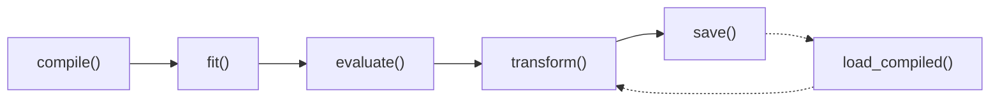
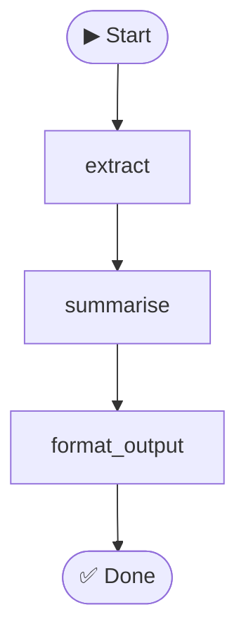

# Class-Based Agents

<div align="center">
  
  <h3>Agent = Class · Node = Method · Graph = Internal Runtime</h3>
</div>

---

## 📖 Overview

Class-based agents let you define an **entire agent as a single Python class**.
Instead of spreading logic across `__init__.py`, `graph.py`, and `nodes.py`
inside a folder, you write one file where:

| Concept | Class Agent | Folder Agent |
|---------|-------------|--------------|
| **Agent** | Python class inheriting `BaseGraphAgent` | Package directory |
| **Nodes** | Plain methods wired in `build_graph()` | Functions in `nodes.py` |
| **Resources** | Instance attributes (`self.llm`, `self.db`) | Module-level globals |
| **State** | `@dataclass` per-run transient data | `TypedDict` dictionary |
| **Graph** | Explicit wiring in `build_graph()`, cached lazily | Explicit `StateGraph` |

The class-agent system adds an **ML-like lifecycle** on top:

```
compile() → fit() → evaluate() → transform()
```

This mirrors scikit-learn's API: prepare an optimization strategy, run it,
score against a test set, then serve predictions — all on the same object.

!!! info "Backward Compatible"
    Class-based agents work **alongside** folder-based agents.
    The `AgentRegistry` discovers both styles automatically.
    You can migrate incrementally — no big-bang rewrite needed.

---

## 🚀 Quick Start

=== "build_graph() API (Recommended)"

    The `build_graph()` API gives you explicit control over the graph
    topology using agentomatic's built-in `GraphBuilder`. Define nodes
    as plain methods and wire them in `build_graph()`.

    ```python
    from __future__ import annotations

    from dataclasses import dataclass, field
    from typing import Any

    from agentomatic.agents import BaseGraphAgent


    @dataclass
    class SummaryState:
        """Per-run transient state."""

        query: str = ""
        chunks: list[str] = field(default_factory=list)
        summary: str = ""


    class SummaryAgent(BaseGraphAgent[SummaryState]):
        """Summarises documents into concise briefs."""

        agent_name = "summarizer"
        agent_description = "Document summarisation agent"

        def __init__(self, *, llm: Any = None) -> None:
            super().__init__()
            self.llm = llm
            self.system_prompt = "You are a summarisation expert."

        # --- graph wiring ---

        def build_graph(self):
            g = self.new_graph()
            g.add_node("extract", self.extract)
            g.add_node("summarise", self.summarise)
            g.add_node("format_output", self.format_output)
            g.set_entry_point("extract")
            g.add_edge("extract", "summarise")
            g.add_edge("summarise", "format_output")
            g.set_finish_point("format_output")
            return g.compile()

        # --- node methods (plain methods, no decorators) ---

        def extract(self, state: SummaryState) -> SummaryState:
            """Split input into chunks."""
            state.chunks = [state.query[i : i + 200]
                            for i in range(0, len(state.query), 200)]
            return state

        def summarise(self, state: SummaryState) -> SummaryState:
            """Summarise each chunk (placeholder)."""
            state.summary = " ".join(
                f"[{c[:30]}...]" for c in state.chunks
            )
            return state

        def format_output(self, state: SummaryState) -> SummaryState:
            """Prepare the final response."""
            return state

        # --- state conversion ---

        def input_to_state(
            self, input_data: dict[str, Any],
        ) -> SummaryState:
            return SummaryState(
                query=input_data.get("query", ""),
            )

        def state_to_output(
            self, state: SummaryState,
        ) -> dict[str, Any]:
            return {
                "summary": state.summary,
                "num_chunks": len(state.chunks),
            }


    # Usage
    agent = SummaryAgent(llm="openai/gpt-4o")
    result = agent.transform({"query": "Long document text..."})
    print(result)
    # {"summary": "[Long document t...]", "num_chunks": 1}
    ```

=== "Decorator API (Legacy)"

    For simple linear chains, you can use `@agent_node` decorators
    as a shorthand. The framework auto-builds the graph from
    decorator metadata.

    ```python
    from __future__ import annotations

    from dataclasses import dataclass
    from typing import Any

    from agentomatic.agents import BaseGraphAgent, agent_node


    @dataclass
    class QAState:
        question: str = ""
        answer: str = ""


    class QAAgent(BaseGraphAgent[QAState]):
        agent_name = "qa_bot"

        def __init__(self, *, llm: Any = None) -> None:
            super().__init__()
            self.llm = llm

        @agent_node(entrypoint=True)
        def retrieve(self, state: QAState) -> QAState:
            state.answer = f"Answer for: {state.question}"
            return state

        @agent_node(after="retrieve", finish=True)
        def generate(self, state: QAState) -> QAState:
            return state

        def input_to_state(self, data: dict[str, Any]) -> QAState:
            return QAState(question=data.get("query", ""))

        def state_to_output(self, state: QAState) -> dict[str, Any]:
            return {"answer": state.answer}
    ```

!!! tip "Which API should I choose?"
    Use **`build_graph()`** for all new agents — it's explicit, flexible,
    and familiar to LangGraph users.
    The **decorator API** is still supported as a convenience for
    simple linear chains, but `build_graph()` is recommended.

---

## 🧩 Core Concepts

### State

Every agent defines a **`@dataclass`** that holds per-run transient data.
The state is created fresh for each `transform()` call — no cross-request
leakage.

```python
from __future__ import annotations

from dataclasses import dataclass, field
from typing import Any


@dataclass
class MyState:
    """Per-run transient state."""

    query: str = ""
    context: list[str] = field(default_factory=list)
    response: str = ""
    metadata: dict[str, Any] = field(default_factory=dict)
```

Two abstract methods bridge between raw I/O and the state:

| Method | Direction | Purpose |
|--------|-----------|---------|
| `input_to_state(input_data)` | `dict → State` | Parse raw input into the typed state |
| `state_to_output(state)` | `State → dict` | Extract the response payload |

```python
def input_to_state(
    self, input_data: dict[str, Any],
) -> MyState:
    return MyState(query=input_data.get("query", ""))

def state_to_output(
    self, state: MyState,
) -> dict[str, Any]:
    return {"response": state.response}
```

### Nodes

Nodes are **plain methods** that accept state and return state.
You wire them into a graph inside `build_graph()` using `new_graph()`:

```python
def build_graph(self):
    g = self.new_graph()
    g.add_node("parse", self.parse)          # register nodes
    g.add_node("generate", self.generate)
    g.set_entry_point("parse")               # set start
    g.add_edge("parse", "generate")          # connect
    g.set_finish_point("generate")           # set end
    return g.compile()                       # build & validate

def parse(self, state: MyState) -> MyState:
    """Parse user input."""
    ...

def generate(self, state: MyState) -> MyState:
    """Call LLM."""
    ...
```

!!! info "GraphBuilder API (LangGraph-Compatible)"
    `GraphBuilder` supports both fluent chaining and imperative styles:

    | LangGraph-style | Fluent-chain |
    |----|----|
    | `g.add_node("x", fn)` | `.node("x", fn)` |
    | `g.add_edge("x", "y")` | `.edge("x", "y")` |
    | `g.set_entry_point("x")` | `.entrypoint("x")` |
    | `g.set_finish_point("x")` | `.finish("x")` |
    | `g.add_conditional_edge(...)` | `.conditional_edge(...)` |
    | `g.compile()` | `.build()` |

??? note "Decorator fallback (`@agent_node`)"
    For simple linear chains, you can use `@agent_node` decorators
    instead of `build_graph()`. The framework auto-builds the graph
    from decorator metadata:

    ```python
    @agent_node(entrypoint=True)
    def parse(self, state): ...

    @agent_node(after="parse", finish=True)
    def generate(self, state): ...
    ```

    | Parameter | Default | Purpose |
    |---|---|---|
    | `entrypoint` | `False` | Mark as graph entry |
    | `after` | `None` | Predecessor node |
    | `finish` | `False` | Mark as terminal |

    !!! warning
        Decorators can't express conditional edges, loops, or
        complex topologies. Use `build_graph()` for those.

### Graph

The `AgentGraph` is built **lazily** on first access via `agent.graph`.
Once built, it is cached. Call `agent.invalidate_graph()` to force a
rebuild (done automatically after `compile()` and `fit()`).

```python
agent = MyAgent(llm=my_llm)

# First access triggers build
print(agent.graph.node_names)
# ['parse', 'generate']

# Force rebuild
agent.invalidate_graph()
```

**Conditional edges** for branching:

```python
def build_graph(self):
    g = self.new_graph()
    g.add_node("classify", self.classify)
    g.add_node("handle_a", self.handle_a)
    g.add_node("handle_b", self.handle_b)
    g.set_entry_point("classify")
    g.add_conditional_edge(
        "classify",
        self.route,
        {"a": "handle_a", "b": "handle_b"},
    )
    g.set_finish_point("handle_a")
    g.set_finish_point("handle_b")
    return g.compile()

def route(self, state: MyState) -> str:
    return "a" if "urgent" in state.query else "b"
```

### Transform

`transform()` is the end-to-end inference method:

```
input_data → input_to_state() → graph.invoke() → state_to_output() → output
```

```python
# Synchronous
result = agent.transform({"query": "Summarise this report"})

# Asynchronous
result = await agent.atransform({"query": "Summarise this report"})

# Alias
result = agent.invoke({"query": "..."})  # same as transform()
```

Each call records a **trace** for observability (see
[Observability](#observability-tracing)).

---

## 🧬 ML Lifecycle

Class-based agents expose a scikit-learn-style lifecycle:



### `compile(dataset?, metrics?, optimizer?, loss?)`

Prepares the optimization strategy — Keras-style. Stores the dataset,
metrics, optimizer, and an optional `loss` objective, then invalidates the
graph. Every argument is optional; anything omitted here can be supplied to
`fit()`.

```python
from agentomatic.agents import (
    AgentDataset,
    ExactKeyMatchMetric,
    ContainsTermsMetric,
    GridSearchOptimizer,
)

agent = MyAgent(llm=my_llm)
dataset = AgentDataset.from_jsonl("data.jsonl")

agent.compile(
    dataset,
    metrics=[
        ExactKeyMatchMetric(["summary", "risks"]),
        ContainsTermsMetric(["risk", "mitigation"]),
    ],
    optimizer=GridSearchOptimizer({"temperature": [0.0, 0.3, 0.7]}),
    loss=ExactKeyMatchMetric(["summary"]),  # objective to minimise (1 - score)
)
```

The `loss` accepts a `Loss`, any metric-like object (converted to
`1 - score`), or a `(example, prediction) -> float` callable. Returns `self`
for chaining.

Under the hood, `compile()` normalises whatever you pass via `resolve_loss()`:

| Input | Wrapped as | Meaning |
|-------|------------|---------|
| a `Loss` subclass | used as-is | full control over the objective |
| a metric-like object | `MetricLoss` | `loss = 1 - metric.score(...)` |
| a `callable(example, prediction)` | `CallableLoss` | your own scalar objective |

```python
from agentomatic.agents import Loss, MetricLoss, CallableLoss, resolve_loss

# Any of these are valid `loss=` arguments:
loss = MetricLoss(ExactKeyMatchMetric(["summary"]))         # 1 - score
loss = CallableLoss(lambda ex, pred: abs(pred["n"] - ex.expected["n"]))
loss = resolve_loss(my_metric)                              # explicit coercion
```

### `fit(dataset?, *, epochs=1, verbose=1, callbacks=None, validation_data=None)`

Trains the agent and returns a Keras-style **`History`**. Each epoch runs the
compiled optimizer (if any), applies config changes, then evaluates on the
training data — and on `validation_data` if provided — recording per-epoch
metric and `loss` values.

```python
history = agent.fit(dataset, epochs=5, validation_data=dataset.validation)
# INFO: Epoch 1/5 - accuracy: 0.72 - loss: 0.28 - val_accuracy: 0.68 - val_loss: 0.32
# ...

print(history.history["loss"])       # [0.28, 0.21, 0.18, 0.17, 0.17]
print(history.best("val_loss", "min"))  # (3, 0.19)
print(history.summary())
```

`History` exposes `.history` (log-key → per-epoch values), `.epoch`,
`.params`, and helpers `final(key)`, `best(key, mode)`, `to_dict()`, and
`summary()`. It is also stored on `agent.history`.

#### Callbacks & early stopping

Pass `Callback` instances to hook into training. `EarlyStopping` halts when a
monitored key stops improving (by flipping `agent.stop_training`):

```python
from agentomatic.agents import EarlyStopping

history = agent.fit(
    dataset,
    epochs=20,
    callbacks=[EarlyStopping(monitor="val_loss", mode="min", patience=2)],
)
```

Write your own by subclassing `Callback` and overriding any of
`on_train_begin`, `on_epoch_begin`, `on_epoch_end(epoch, logs)`, or
`on_train_end`.

#### Wiring into the optimization engine

To run the full prompt-optimization engine as the optimizer, use
`PromptFitterBridge` — `fit()` runs it, applies the best prompt config back
onto the agent, and stashes the full `PromptFitResult` on
`agent._last_fit_result`:

```python
from agentomatic.agents import PromptFitterBridge

agent.compile(
    dataset,
    metrics=[ExactKeyMatchMetric(["summary"])],
    optimizer=PromptFitterBridge(task_model="ollama/qwen2.5:7b"),
)
history = agent.fit(dataset)
result = agent._last_fit_result  # optimize.PromptFitResult
```

### `evaluate(dataset, metrics)`

Scores the agent against a test set. Runs `transform()` on each example,
computes all metrics, and returns an `EvaluationReport`.

```python
report = agent.evaluate(dataset.test, [
    ExactKeyMatchMetric(["summary"]),
])

print(report.summary())
# Evaluation Report: summarizer
#   Dataset: data
#   Examples: 10
#   Pass Rate: 80.0%
#   Scores:
#     exact_key_match: 0.900
```

### `save(path)` / `load_compiled(path)`

Persist and restore the compiled state:

```python
# Save
agent.save("compiled/summarizer_v1")
# Creates: config.json, metadata.json, evaluation_history.json

# Load into a fresh instance
fresh = MyAgent(llm=my_llm)
fresh.load_compiled("compiled/summarizer_v1")
```

??? example "Full ML Workflow"

    ```python
    from __future__ import annotations

    from agentomatic.agents import (
        AgentDataset,
        ExactKeyMatchMetric,
        ContainsTermsMetric,
        GridSearchOptimizer,
    )
    from my_agent import MyAgent

    # 1. Create agent
    agent = MyAgent(llm="openai/gpt-4o")

    # 2. Load dataset
    dataset = AgentDataset.from_jsonl("data.jsonl")
    print(f"Loaded {len(dataset)} examples")
    print(f"  Train: {len(dataset.train)}")
    print(f"  Test:  {len(dataset.test)}")

    # 3. Define metrics
    metrics = [
        ExactKeyMatchMetric(["summary", "risks"]),
        ContainsTermsMetric(["risk", "mitigation"]),
    ]

    # 4. Compile with optimizer
    agent.compile(
        dataset,
        metrics,
        optimizer=GridSearchOptimizer({
            "temperature": [0.0, 0.2, 0.5],
            "system_prompt": [
                "You are a risk analyst.",
                "You are a concise summariser.",
            ],
        }),
    )

    # 5. Fit (runs grid search)
    agent.fit(dataset)

    # 6. Evaluate on test set
    report = agent.evaluate(dataset.test, metrics)
    print(report.summary())

    # 7. Save compiled state
    agent.save("compiled/v1")

    # 8. Later — reload and serve
    production = MyAgent(llm="openai/gpt-4o")
    production.load_compiled("compiled/v1")
    result = production.transform({"query": "Assess project risks"})
    ```

---

## 📦 Datasets

### `AgentExample`

A single evaluation example with structured I/O:

```python
from agentomatic.agents import AgentExample

example = AgentExample(
    id="ex_001",
    input={"query": "Summarise quarterly earnings"},
    expected_output={
        "summary": "Revenue grew 12% YoY...",
        "risks": ["supply chain", "fx exposure"],
    },
    metadata={"domain": "finance", "difficulty": "medium"},
    rubric={"completeness": "Must mention revenue and risks"},
    tags=["finance", "summarisation"],
    split="train",
)
```

| Field | Type | Purpose |
|-------|------|---------|
| `id` | `str` | Unique identifier |
| `input` | `dict` | Input data for `transform()` |
| `expected_output` | `dict \| None` | Ground-truth output |
| `metadata` | `dict` | Arbitrary metadata (domain, difficulty…) |
| `rubric` | `dict` | Per-dimension evaluation criteria |
| `tags` | `list[str]` | Tags for filtering / grouping |
| `split` | `str` | `"train"`, `"validation"`, or `"test"` |

### `AgentDataset`

A collection with automatic train / validation / test splitting:

```python
from agentomatic.agents import AgentDataset

# From JSONL file
dataset = AgentDataset.from_jsonl("data.jsonl")

# From a list of dicts
dataset = AgentDataset.from_list([
    {
        "id": "ex_001",
        "input": {"query": "hello"},
        "expected_output": {"response": "Hi there!"},
        "split": "train",
    },
    {
        "id": "ex_002",
        "input": {"query": "bye"},
        "expected_output": {"response": "Goodbye!"},
        "split": "test",
    },
])

# Access splits
train_examples = dataset.train       # split == "train"
val_examples   = dataset.validation  # split in ("validation", "val")
test_examples  = dataset.test        # split == "test"

# Filter by tags
finance = dataset.filter_by_tags("finance", "quarterly")

# Save
dataset.to_jsonl("output.jsonl")
```

### JSONL Format

Each line is a JSON object. The `id` is auto-generated if missing.

```json
{"id": "ex_001", "split": "train", "input": {"query": "Summarise Q1"}, "expected_output": {"summary": "..."}, "metadata": {"domain": "finance"}}
{"id": "ex_002", "split": "train", "input": {"query": "List risks"}, "expected_output": {"risks": ["..."]}, "tags": ["risk"]}
{"id": "ex_003", "split": "test", "input": {"query": "Analyse trend"}, "expected_output": {"summary": "..."}}
```

---

## 📏 Metrics

All metrics implement the `Metric` protocol:

```python
class Metric(Protocol):
    name: str

    def score(
        self,
        example: AgentExample,
        prediction: dict[str, Any],
    ) -> float:
        """Return a score between 0.0 and 1.0."""
        ...
```

### Built-in Metrics

| Metric | What it Scores | Example |
|--------|---------------|---------|
| `ExactKeyMatchMetric` | Fraction of required keys present in prediction | `ExactKeyMatchMetric(["summary", "risks"])` |
| `ContainsTermsMetric` | Fraction of terms found in any string value | `ContainsTermsMetric(["risk", "mitigation"])` |
| `CallableMetric` | Custom function `(example, prediction) → float` | `CallableMetric("custom", my_fn)` |
| `OptimizeMetricAdapter` | Bridge to `agentomatic.optimize.BaseMetric` | `OptimizeMetricAdapter(existing_metric)` |

### Custom Metrics

Write your own by implementing the protocol:

```python
from __future__ import annotations

from typing import Any

from agentomatic.agents import AgentExample


class ResponseLengthMetric:
    """Score based on response length (0-1 normalised)."""

    name = "response_length"

    def score(
        self,
        example: AgentExample,
        prediction: dict[str, Any],
    ) -> float:
        text = prediction.get("response", "")
        # Normalise: 200 chars = 1.0
        return min(len(text) / 200, 1.0)
```

Or use `CallableMetric` for one-liners:

```python
from agentomatic.agents import CallableMetric

has_citations = CallableMetric(
    "has_citations",
    lambda ex, pred: 1.0 if pred.get("citations") else 0.0,
)
```

---

## ⚙️ Optimizers

Optimizers implement the `Optimizer` protocol and are passed to
`compile()`:

```python
class Optimizer(Protocol):
    def optimize(
        self,
        agent: Any,
        dataset: AgentDataset,
        metrics: Sequence[Metric],
    ) -> dict[str, Any]:
        """Return optimised config values."""
        ...
```

### Built-in Optimizers

| Optimizer | Strategy | When to Use |
|-----------|----------|-------------|
| `NoOpOptimizer` | Returns `{}` — no changes | Baseline runs, CI smoke tests |
| `GridSearchOptimizer` | Brute-force search over param combinations | Small param grids (< 50 combos) |
| `PromptFitterBridge` | Bridge to `agentomatic.optimize.PromptFitter` | Advanced prompt optimization |

=== "NoOpOptimizer"

    ```python
    from agentomatic.agents import NoOpOptimizer

    agent.compile(dataset, metrics, optimizer=NoOpOptimizer())
    agent.fit(dataset)
    # No parameters changed — just establishes a baseline
    ```

=== "GridSearchOptimizer"

    ```python
    from agentomatic.agents import GridSearchOptimizer

    optimizer = GridSearchOptimizer(
        param_grid={
            "temperature": [0.0, 0.2, 0.5],
            "system_prompt": [
                "Be concise.",
                "Be thorough and detailed.",
            ],
        },
        max_examples=10,  # cap per combination
    )

    agent.compile(dataset, metrics, optimizer=optimizer)
    agent.fit(dataset)
    # Best combo is applied to agent automatically
    ```

=== "PromptFitterBridge"

    ```python
    from agentomatic.agents import PromptFitterBridge

    optimizer = PromptFitterBridge(
        agent_name="summarizer",
        task_model="ollama/qwen2.5:7b",
        rewrite_model="openai/gpt-4.1",
    )

    agent.compile(dataset, metrics, optimizer=optimizer)
    agent.fit(dataset)
    ```

    !!! note "Requires `agentomatic[optimize]`"
        The PromptFitter bridge requires the optimize extra:
        `pip install "agentomatic[optimize]"`

---

## 🔍 Observability & Tracing

Every `transform()` call records a trace of per-node execution.

### `get_last_trace()`

Returns a list of `TraceEvent` objects from the most recent run:

```python
agent.transform({"query": "Hello"})

for event in agent.get_last_trace():
    print(
        f"  {event.node_name}: "
        f"{event.duration_ms:.1f}ms "
        f"[{event.status}]"
    )
# extract: 0.3ms [success]
# summarise: 45.2ms [success]
# format_output: 0.1ms [success]
```

### `TraceEvent` Fields

| Field | Type | Description |
|-------|------|-------------|
| `node_name` | `str` | Name of the executed node |
| `started_at` | `datetime` | UTC timestamp when node started |
| `finished_at` | `datetime \| None` | UTC timestamp when node finished |
| `duration_ms` | `float` | Wall-clock duration in milliseconds |
| `status` | `"success" \| "error" \| "skipped"` | Execution outcome |
| `error` | `str \| None` | Error message if status is `"error"` |
| `metadata` | `dict` | Arbitrary metadata |

### Mermaid Visualisation

Generate a graph diagram from any agent:

```python
print(agent.visualize())
```



### Trace History

Access all recorded traces (useful for batch evaluation analysis):

```python
all_traces = agent.get_trace_history()
print(f"Total runs: {len(all_traces)}")
```

---

## 🔗 Registry Integration

Class-based agents integrate with the existing Agentomatic platform
through the `AgentRegistry`.

### Manual Registration

```python
from __future__ import annotations

from agentomatic.core.registry import AgentRegistry

registry = AgentRegistry()

# Option 1: register_class_agent (recommended)
agent = MyAgent(llm=my_llm)
registry.register_class_agent(agent)

# Option 2: convert to RegisteredAgent first
registered = agent.as_registered_agent()
# registered.manifest, registered.node_fn, registered.graph_fn
```

### Automatic Discovery

Place your class agent in an `agent.py` file inside the agents directory.
The registry scans for `BaseGraphAgent` subclasses automatically:

```text
agents/
├── summarizer/
│   └── agent.py          ← class agent (auto-discovered)
├── chatbot/
│   ├── __init__.py       ← folder agent (classic)
│   ├── graph.py
│   └── nodes.py
```

```python
# agent.py is discovered automatically
class SummaryAgent(BaseGraphAgent[SummaryState]):
    agent_name = "summarizer"
    ...
```

### Platform Integration

```python
from agentomatic import AgentPlatform

platform = AgentPlatform.from_folder("agents/")
app = platform.build()
# Both folder-based AND class-based agents are registered
```

!!! tip "Manifest Generation"
    `agent.to_manifest()` auto-generates an `AgentManifest` from
    class metadata (`agent_name`, `agent_description`,
    `agent_version`, `agent_framework`).

---

## ⚖️ Comparison Table

| Feature | Folder-based | Class-based |
|---------|:-------------|:------------|
| **Definition** | `__init__.py` + `graph.py` + `nodes.py` | Single `agent.py` |
| **State** | `TypedDict` (`BaseAgentState`) | `@dataclass` (any shape) |
| **Resources** | Module-level or closure | `self.llm`, `self.db` |
| **Graph** | Explicit `StateGraph` construction | Explicit `build_graph()` wiring |
| **Graph Framework** | LangGraph required | No dependency (internal runtime) |
| **Evaluation** | Manual scripting | `agent.evaluate(dataset, metrics)` |
| **Optimization** | `PromptFitter` (separate API) | `agent.compile()` + `agent.fit()` |
| **Serialization** | Not built-in | `agent.save()` / `load_compiled()` |
| **Tracing** | Studio adapter | `agent.get_last_trace()` |
| **Scaffolding** | `agentomatic init --template basic` | `agentomatic init --template class` |
| **Registry** | Auto from `__init__.py` | Auto from `agent.py` |

---

## 🔄 Migration Guide

Migrating a folder-based agent to a class-based agent is straightforward.

### Step 1 — Define the State

Replace the `TypedDict` / `BaseAgentState` with a `@dataclass`:

```diff
- from agentomatic import BaseAgentState
- # state is a dict throughout
+ from dataclasses import dataclass, field
+
+ @dataclass
+ class MyState:
+     query: str = ""
+     response: str = ""
+     context: list[str] = field(default_factory=list)
```

### Step 2 — Move Nodes into the Class

Convert standalone functions to methods and wire via `build_graph()`:

```diff
- # nodes.py
- async def process(state: dict) -> dict:
-     query = state.get("current_query", "")
-     return {"response": f"Processed: {query}"}

+ def build_graph(self):
+     g = self.new_graph()
+     g.add_node("process", self.process)
+     g.set_entry_point("process")
+     g.set_finish_point("process")
+     return g.compile()
+
+ def process(self, state: MyState) -> MyState:
+     state.response = f"Processed: {state.query}"
+     return state
```

### Step 3 — Add State Conversion

Implement the two abstract methods:

```python
def input_to_state(
    self, input_data: dict[str, Any],
) -> MyState:
    return MyState(
        query=input_data.get("current_query", ""),
    )

def state_to_output(
    self, state: MyState,
) -> dict[str, Any]:
    return {"response": state.response}
```

### Step 4 — Remove Boilerplate

Delete the files that the class agent replaces:

```diff
  agents/my_agent/
- ├── __init__.py     # manifest + node_fn
- ├── graph.py        # StateGraph
- ├── nodes.py        # functions
+ └── agent.py        # class agent (single file)
```

!!! success "Done!"
    Your agent now has evaluation, optimization, tracing, and
    serialization built in — with zero extra code.

---

## 🏗️ Scaffolding

Generate a class-based agent with the CLI:

```bash
agentomatic init my_agent --template class
```

This creates:

```text
agents/my_agent/
├── agent.py          # BaseGraphAgent subclass
├── dataset.jsonl     # Sample train/test data
├── train.py          # ML workflow script
└── README.md         # Documentation
```

??? example "Generated `agent.py`"

    ```python
    """Class-based agent: my_agent."""
    from __future__ import annotations

    from dataclasses import dataclass, field
    from typing import Any

    from agentomatic.agents import BaseGraphAgent


    @dataclass
    class MyAgentState:
        """Agent state — per-run transient data."""

        request: str = ""
        context: list[str] = field(default_factory=list)
        output: dict[str, Any] = field(default_factory=dict)


    class MyAgentAgent(BaseGraphAgent[MyAgentState]):
        """ML-like class agent for my_agent."""

        agent_name = "my_agent"
        agent_description = "MyAgent agent"

        def __init__(self, *, llm: Any = None) -> None:
            super().__init__()
            self.llm = llm
            self.system_prompt = "You are a helpful assistant."

        # --- Graph Definition ---

        def build_graph(self):
            """Wire the execution graph."""
            g = self.new_graph()
            g.add_node("process", self.process)
            g.add_node("generate", self.generate)
            g.set_entry_point("process")
            g.add_edge("process", "generate")
            g.set_finish_point("generate")
            return g.compile()

        # --- Node Methods ---

        def process(
            self, state: MyAgentState,
        ) -> MyAgentState:
            """Process the input request."""
            state.context = [f"Processed: {state.request}"]
            return state

        def generate(
            self, state: MyAgentState,
        ) -> MyAgentState:
            """Generate the final output."""
            state.output = {
                "response": f"Result for: {state.request}",
                "agent_type": "my_agent",
            }
            return state

        def input_to_state(
            self, input_data: dict[str, Any],
        ) -> MyAgentState:
            return MyAgentState(
                request=input_data.get("request", ""),
            )

        def state_to_output(
            self, state: MyAgentState,
        ) -> dict[str, Any]:
            return state.output
    ```

??? example "Generated `train.py`"

    ```python
    """Train script for my_agent — ML-like workflow."""
    from __future__ import annotations

    from pathlib import Path

    from .agent import MyAgentAgent

    from agentomatic.agents import AgentDataset
    from agentomatic.agents.metrics import (
        ContainsTermsMetric,
        ExactKeyMatchMetric,
    )
    from agentomatic.agents.optimizers import NoOpOptimizer


    def main() -> None:
        """Run the ML-like training workflow."""
        # 1. Create agent
        agent = MyAgentAgent(llm=None)

        # 2. Load dataset
        data_path = Path(__file__).parent / "dataset.jsonl"
        dataset = AgentDataset.from_jsonl(str(data_path))
        print(f"Loaded {len(dataset)} examples")

        # 3. Compile
        metrics = [
            ExactKeyMatchMetric(["response"]),
            ContainsTermsMetric(["Result"]),
        ]
        agent.compile(dataset, metrics, optimizer=NoOpOptimizer())

        # 4. Fit
        agent.fit(dataset)

        # 5. Evaluate
        report = agent.evaluate(dataset.test, metrics)
        print(report.summary())

        # 6. Inference
        result = agent.transform({"request": "Test query"})
        print(f"Output: {result}")

        # 7. Save
        agent.save("compiled/my_agent")
        print("Done!")


    if __name__ == "__main__":
        main()
    ```

??? example "Generated `dataset.jsonl`"

    ```json
    {"id": "my_agent_001", "split": "train", "input": {"request": "Help me with task planning"}, "expected_output": {"response": "Here is a plan..."}, "metadata": {"domain": "general", "difficulty": "easy"}}
    {"id": "my_agent_002", "split": "train", "input": {"request": "Summarize this document"}, "expected_output": {"response": "Summary: ..."}, "metadata": {"domain": "general", "difficulty": "medium"}}
    {"id": "my_agent_003", "split": "test", "input": {"request": "Analyze the risks"}, "expected_output": {"response": "Risks identified: ..."}, "metadata": {"domain": "general", "difficulty": "hard"}}
    ```

---

## 📚 API Reference

### `BaseGraphAgent[StateT]`

| Method / Property | Returns | Description |
|-------------------|---------|-------------|
| `transform(input_data)` | `dict` | End-to-end sync inference |
| `atransform(input_data)` | `dict` | End-to-end async inference |
| `invoke(input_data)` | `dict` | Alias for `transform()` |
| `compile(dataset, metrics, optimizer?)` | `self` | Prepare optimization |
| `fit(dataset)` | `self` | Run optimization |
| `evaluate(dataset, metrics)` | `EvaluationReport` | Score on dataset |
| `save(path)` | `None` | Persist compiled state |
| `load_compiled(path)` | `None` | Restore compiled state |
| `graph` | `AgentGraph` | Lazy-built execution graph |
| `invalidate_graph()` | `None` | Force graph rebuild |
| `get_last_trace()` | `list[TraceEvent]` | Last execution trace |
| `get_trace_history()` | `list[list[TraceEvent]]` | All traces |
| `visualize()` | `str` | Mermaid diagram |
| `to_manifest()` | `AgentManifest` | Generate manifest |
| `as_registered_agent()` | `RegisteredAgent` | Convert for registry |
| `load_dataset(path)` | `AgentDataset` | Load dataset from file |

### Class Metadata

| Attribute | Default | Purpose |
|-----------|---------|---------|
| `agent_name` | `""` | Machine name (used in registry) |
| `agent_description` | `""` | Human-readable description |
| `agent_version` | `"1.0.0"` | Semantic version |
| `agent_framework` | `"graph_agent"` | Framework identifier |

---

## ❓ Common Mistakes & FAQ

??? bug "Node method doesn't return state"
    Every node method **must** return the updated state object. If you forget
    `return state`, the graph will pass `None` to the next node.

    ```python
    # ❌ Wrong — missing return
    def process(self, state: MyState) -> MyState:
        state.output = {"response": "Hello"}

    # ✅ Correct
    def process(self, state: MyState) -> MyState:
        state.output = {"response": "Hello"}
        return state
    ```

??? bug "Forgot to call `super().__init__()`"
    If you override `__init__`, you **must** call `super().__init__()` first:

    ```python
    def __init__(self, *, llm=None):
        super().__init__()  # ← Don't forget this!
        self.llm = llm
    ```

??? bug "Graph not rebuilding after code changes"
    The graph is cached after the first `build_graph()` call. If you change
    your graph topology, call `self.invalidate_graph()` to force a rebuild.

??? question "Can I use async node methods?"
    Yes! Both sync and async node methods work. The graph runtime handles
    both:

    ```python
    async def process(self, state: MyState) -> MyState:
        result = await some_async_llm_call(state.query)
        state.output = {"response": result}
        return state
    ```

??? question "How do I use class agents with `prompts.json`?"
    Class agents work with all optional overrides. Place a `prompts.json`
    in your agent's folder and use `PromptManager` in your node methods:

    ```python
    from agentomatic import PromptManager

    class MyAgent(BaseGraphAgent[MyState]):
        def __init__(self):
            super().__init__()
            self.prompts = PromptManager.from_file(
                "agents/my_agent/prompts.json"
            )

        def generate(self, state):
            prompt = self.prompts.format(
                "v1", "user_template", query=state.query
            )
            # Use prompt with your LLM...
    ```

??? question "How do I add custom schemas to a class agent?"
    Create a `schemas.py` file in your agent's folder. Agentomatic discovers
    it automatically:

    ```python
    # agents/my_agent/schemas.py
    from pydantic import BaseModel, Field

    class CustomInvokeRequest(BaseModel):
        query: str = Field(..., description="User question")
        language: str = Field("en", description="Response language")
        max_length: int = Field(500, description="Max response length")
    ```

    The auto-generated `/invoke` endpoint will now use your custom schema
    for both validation and Swagger docs.

??? question "What's the difference between `transform()` and `invoke()`?"
    They are identical — `invoke()` is simply an alias for `transform()`.
    Both execute the full pipeline:
    `input_to_state() → graph execution → state_to_output()`.

??? question "`current_query` vs `query` — which key should I use in `input_to_state`?"
    The REST API sends `query` in the `AgentInvokeRequest` body. The router
    maps this to `current_query` in the state dict before invoking your
    agent. In class agents, you control `input_to_state()` directly, so use
    whatever key your API sends:

    ```python
    def input_to_state(self, input_data):
        # input_data comes directly from the REST request body
        return MyState(query=input_data.get("query", ""))
    ```

---

## 📚 Related Documentation

| Topic | Link | When You Need It |
|-------|------|------------------|
| Agent folder structure & discovery | [Agent Structure](agent-structure.md) | Understanding how agents are found |
| Custom request/response schemas | [Input & Output Schemas](schemas.md) | Domain-specific API contracts |
| Versioned prompt templates | [Prompt Management](prompts.md) | A/B testing prompts |
| Storage & conversation memory | [Storage Backends](storage.md) | Persistent chat threads |
| Visual debugging | [Agentomatic Studio](studio.md) | Graph visualization & time-travel |
| HITL, thread forking, A/B routing | [Platform Features](platform-features.md) | Advanced production features |
| Platform configuration | [Configuration](configuration.md) | Auth, CORS, rate limiting |
| Scaffolding templates | [Templates](templates.md) | `agentomatic init` options |
| CLI commands | [CLI Reference](../cli/commands.md) | All available commands |
| Full REST API reference | [API Reference](../architecture/api-reference.md) | Every endpoint documented |
