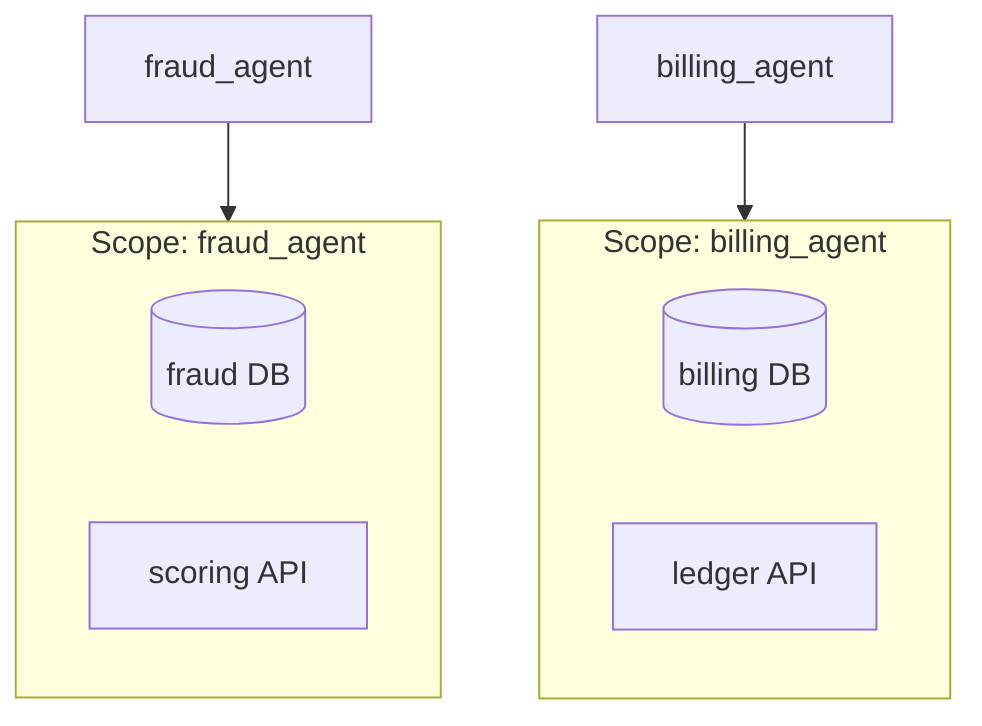

# Per-Agent Connections

When you deploy multiple agents, each often needs its **own** authenticated
resources: a dedicated database (with its own credentials) and one or more
external HTTP services (with their own auth). Connections let you declare these
once, per agent, and access them at runtime with almost no boilerplate.

Connections provide:

- Per-agent (scoped) databases, **vector stores** and HTTP services
- **Purpose tagging** (memory, RAG, vector search, cache, analytics…) so
  features find backends by intent
- Connect to *any* backend (redis, mongo, elasticsearch, neo4j, feature
  stores) — with a **zero-class factory** or a registered type
- Lazy, pooled SQLAlchemy async engines
- Authenticated HTTP clients (API key, bearer, basic, OAuth2)
- `${ENV}` interpolation so credentials never live in code
- Auto-discovery from an agent's `connections.py`
- Lifecycle management (initialised on startup, closed on shutdown)
- Per-request access via `request.state.connections` ([middleware](#accessing-connections-from-middleware))
- Health checks surfaced through the [control plane](control-plane.md)

!!! tip "Wiring a custom / specialised client?"
    To integrate **any** custom Python client (a vendor SDK, an in-house
    wrapper, a graph/time-series DB, a sync-only SDK) with correct lifecycle,
    see the dedicated guide:
    [Custom DB & Vector Store Connections](custom-connections.md).

## Connection kinds and purposes

A connection has a **kind** (how it connects) and a **purpose** (what it is
used for). The two are orthogonal — the same Postgres database can serve
conversation `MEMORY` while a separate one serves `ANALYTICS`.

| Kind | Config | Typical purposes |
| --- | --- | --- |
| `database` | `DatabaseConnectionConfig` | `memory`, `rag`, `analytics`, `general` |
| `vector` | `VectorConnectionConfig` | `vector`, `rag`, `documents` |
| `http` | `HttpConnectionConfig` | `rag`, `general` |
| *custom* | your config | anything (e.g. `cache`) |

```python
from agentomatic.connections import ConnectionPurpose, DatabaseConnectionConfig

DatabaseConnectionConfig(
    name="memory",
    url="${MEMORY_DB_URL}",
    purpose=ConnectionPurpose.MEMORY,
)
```

Look connections up by purpose regardless of kind:

```python
conns = get_connections("rag_agent")
for name, conn in conns.by_purpose(ConnectionPurpose.RAG).items():
    ...  # every RAG backend (database + vector store + http)

vector_store = conns.first_for_purpose(ConnectionPurpose.VECTOR)
```

## Concept: scopes

Every set of connections belongs to a **scope** — usually an agent name, or the
shared `platform` scope. This keeps each agent's credentials and pools
isolated.



## Scaffolding connections

```bash
agentomatic init fraud_agent --template connection --dir agents
```

This generates a `connections.py` you can drop into your agent package:

```text
agents/fraud_agent/
├── connections.py    # CONNECTIONS = [...]
├── .env.example      # DB + service credentials
└── README.md
```

## Declaring connections

Agentomatic discovers a module-level `CONNECTIONS` list in your agent's
`connections.py`:

```python
from agentomatic.connections import DatabaseConnectionConfig, HttpConnectionConfig
from agentomatic.endpoints import AuthType, UpstreamAuthConfig

CONNECTIONS = [
    DatabaseConnectionConfig(
        name="main",
        url="${FRAUD_DB_URL}",           # SQLAlchemy async URL
        username="${FRAUD_DB_USER}",     # optional; spliced into URL
        password="${FRAUD_DB_PASSWORD}",
        pool_size=5,
    ),
    HttpConnectionConfig(
        name="scoring_api",
        base_url="${FRAUD_SCORING_URL}",
        auth=UpstreamAuthConfig(
            type=AuthType.OAUTH2_CLIENT_CREDENTIALS,
            token_url="${FRAUD_TOKEN_URL}",
            client_id="${FRAUD_CLIENT_ID}",
            client_secret="${FRAUD_CLIENT_SECRET}",
        ),
    ),
]
```

!!! note "Database driver"
    Database URLs must use an async driver, e.g.
    `postgresql+asyncpg://host/db`, `mysql+aiomysql://host/db`, or
    `sqlite+aiosqlite:///./local.db`. Install with `pip install 'agentomatic[db]'`.

## Using connections at runtime

Inside your agent code, grab the scope and use the connection:

=== "Database"
    ```python
    from sqlalchemy import text
    from agentomatic.connections import get_connections

    conns = get_connections("fraud_agent")
    async with conns.database("main").session() as session:
        rows = await session.execute(text("SELECT count(*) FROM cases"))
        total = rows.scalar_one()
    ```

=== "HTTP service"
    ```python
    from agentomatic.connections import get_connections

    conns = get_connections("fraud_agent")
    result = await conns.http("scoring_api").post("/score", payload={"amount": 42})
    if result.ok:
        score = result.data["score"]
    ```

## Vector stores (RAG & vector search)

Declare a vector store the same way you declare a database. Pick a provider
and the native client is built lazily on first use:

```python
from agentomatic.connections import ConnectionPurpose, VectorConnectionConfig

CONNECTIONS = [
    VectorConnectionConfig(
        name="kb",
        provider="qdrant",              # qdrant | chroma | weaviate | pinecone | milvus
        url="${QDRANT_URL}",
        api_key="${QDRANT_API_KEY}",
        collection="knowledge_base",
        dimension=1536,
        purpose=ConnectionPurpose.RAG,
    ),
]
```

Use it in your agent:

```python
from agentomatic.connections import get_connections

kb = get_connections("rag_agent").vector("kb")
client = kb.client          # native async provider client
await client.search(collection_name=kb.collection, query_vector=embedding, limit=5)
```

!!! note "pgvector"
    For `pgvector`, use a `DatabaseConnectionConfig` with
    `purpose=ConnectionPurpose.VECTOR` — the index lives inside Postgres, so
    you query it through the SQLAlchemy session.

!!! tip "Install the provider"
    Vector clients are optional dependencies, imported lazily. Install what you
    use, e.g. `pip install qdrant-client` or `pip install chromadb`. A missing
    library raises a clear error with the install command.

### Custom / any vector backend

Register your own provider (or override a built-in) with a builder callable:

```python
from agentomatic.connections import register_vector_provider

def build_my_store(cfg):
    return MyVectorClient(cfg.url, api_key=cfg.api_key, **cfg.options)

register_vector_provider("my_store", build_my_store)
# then reference provider="my_store" in a VectorConnectionConfig
```

## Connecting to *any* backend

Databases, vector stores and HTTP services cover most needs, but the
connection system is fully pluggable — connect to redis, mongo, elasticsearch,
neo4j, dynamodb, or an in-house SDK.

### Zero-class: a factory (recommended)

The lowest-code path needs **no new classes** — just point a
`CustomConnectionConfig` at any factory callable (or dotted import path). The
platform builds it lazily, resolves `${ENV}` in `args`/`kwargs`, handles
sync *and* async factories, and auto-detects lifecycle methods
(`aclose`/`close`/`disconnect` on shutdown, `ping`/`health_check` for health):

```python
from agentomatic.connections import ConnectionPurpose, CustomConnectionConfig

CONNECTIONS = [
    CustomConnectionConfig(
        name="cache",
        factory="redis.asyncio.from_url",   # dotted path "pkg.mod:func" or a callable
        args=["${REDIS_URL}"],
        purpose=ConnectionPurpose.CACHE,
    ),
    CustomConnectionConfig(
        name="search",
        factory="elasticsearch:AsyncElasticsearch",
        kwargs={"hosts": ["${ES_URL}"], "api_key": "${ES_API_KEY}"},
        purpose=ConnectionPurpose.RAG,
    ),
]
```

Grab the native client with one line — it initialises on demand:

```python
from agentomatic.connections import get_connections

redis = await get_connections("agent").client("cache")
await redis.set("k", "v")
```

### Full control: register a type

When you want a richer wrapper (custom methods, metrics, retries), register a
config class and a builder once — then it works everywhere connections do
(auto-discovery, purpose lookup, health checks, lifecycle, middleware):

```python
from pydantic import BaseModel
from agentomatic.connections import ConnectionPurpose, register_connection_type


class RedisConnectionConfig(BaseModel):
    name: str
    url: str
    purpose: ConnectionPurpose = ConnectionPurpose.CACHE


class RedisConnection:
    def __init__(self, config: RedisConnectionConfig) -> None:
        self.config = config
        self._client = None

    @property
    def name(self) -> str:
        return self.config.name

    async def initialize(self) -> None:
        import redis.asyncio as redis
        self._client = redis.from_url(self.config.url)

    async def health_check(self) -> dict:
        return {"connection": self.name, "kind": "redis", "status": "configured"}

    async def close(self) -> None:
        if self._client is not None:
            await self._client.aclose()


register_connection_type(RedisConnectionConfig, RedisConnection)
```

Your builder must return an object exposing `name`, `async initialize()`,
`async health_check()` and `async close()`.

## Backing conversation memory with a connection

Reuse an agent's own (authenticated) database as its memory store. Declare a
connection with `purpose=ConnectionPurpose.MEMORY`, then build a store that
**shares** the connection's engine and pool:

```python
from agentomatic.connections import get_connections

db = get_connections("support_agent").database("memory")
store = await db.create_store()      # SQLAlchemyStore on the same engine
platform = AgentPlatform.from_folder("agents/", store=store)
```

## Accessing connections from middleware

With `enable_connections_context=True` (the default), every request carries
the routed agent's connection manager on `request.state`, so handlers and
custom middleware never need a global lookup:

```python
async def handler(request: Request):
    db = request.state.connections.database("main")
    kb = request.state.connections.vector("kb")
    ...
```

For agent routes (`{api_prefix}/{agent}/...`) `request.state.connections` is
that agent's scope; otherwise it is the shared platform scope, which is always
available at `request.state.platform_connections`.

## Registering programmatically

If you prefer explicit wiring, pass connection configs to the platform or
register a scope directly:

```python
from agentomatic import AgentPlatform
from agentomatic.connections import DatabaseConnectionConfig, register_connections

# Platform-wide connections
platform = AgentPlatform(
    connections=[DatabaseConnectionConfig(name="main", url="${DB_URL}")],
)

# Or register an agent-scoped set
register_connections(
    "fraud_agent",
    [DatabaseConnectionConfig(name="main", url="${FRAUD_DB_URL}")],
)
```

## Health and observability

Each connection acquisition emits `agentomatic_connection_calls_total`
(labelled by connection name and status). Health for every scope is available
through the control plane at `GET /api/v1/control/connections`. See the
[Observability guide](observability.md).
