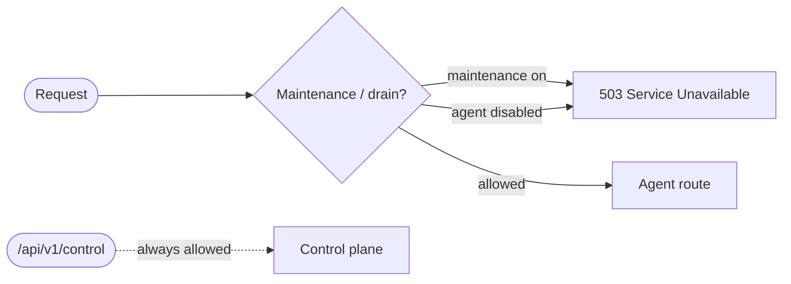

# Production Control Plane

The control plane is a production-oriented admin API for observing and
operating your platform at runtime — inspect agents, endpoints, and
connections; drain or re-enable individual agents; toggle maintenance mode;
and read a sanitised configuration snapshot.

It is opt-in and can be protected by a shared secret.

## Enabling

```python
from agentomatic import AgentPlatform

platform = AgentPlatform(
    enable_control_plane=True,
    control_token="${CONTROL_TOKEN}",  # required for mutating operations
)
app = platform.build()
```

Routes are mounted under `/api/v1/control`.

!!! warning "Protect the control plane"
    Mutating endpoints require the `X-Control-Token` header to match
    `control_token`. Leave `control_token` empty only in trusted local
    environments. In production, also place it behind network policy / auth.

## Introspection endpoints

| Method & Path | Description |
| ------------- | ----------- |
| `GET /api/v1/control` | High-level platform overview (counts, uptime, maintenance). |
| `GET /api/v1/control/agents` | List agents with auth requirements, connections, and health. |
| `GET /api/v1/control/agents/{name}` | Detail for a single agent. |
| `GET /api/v1/control/endpoints` | List registered custom endpoints. |
| `GET /api/v1/control/connections` | Connection health grouped by scope. |
| `GET /api/v1/control/health` | Aggregate health across agents + connections. |
| `GET /api/v1/control/metrics/summary` | Coarse operational counters. |
| `GET /api/v1/control/config` | Sanitised effective configuration. |

```bash
curl http://localhost:8000/api/v1/control | jq
```

## Operations (mutating)

These require the control token.

=== "Drain an agent"
    Stop routing traffic to a single agent (its routes return `503`):

    ```bash
    curl -X POST http://localhost:8000/api/v1/control/agents/fraud_agent/disable \
      -H "X-Control-Token: $CONTROL_TOKEN"
    ```

=== "Re-enable an agent"
    ```bash
    curl -X POST http://localhost:8000/api/v1/control/agents/fraud_agent/enable \
      -H "X-Control-Token: $CONTROL_TOKEN"
    ```

=== "Maintenance mode"
    Block all agent traffic platform-wide (returns `503`) while keeping the
    control plane reachable:

    ```bash
    curl -X POST http://localhost:8000/api/v1/control/maintenance \
      -H "X-Control-Token: $CONTROL_TOKEN" \
      -H "Content-Type: application/json" \
      -d '{"enabled": true}'
    ```

## Request gating

When the control plane is enabled, a maintenance middleware sits in front of
your agent routes:



- Platform-wide `maintenance_mode` → all agent routes return `503`.
- A disabled agent → only that agent's routes return `503`.
- The control plane itself remains reachable so you can turn things back on.

## Typical rollout flow

1. Enable maintenance mode before a risky migration.
2. Run your migration / deploy.
3. Verify with `GET /api/v1/control/health`.
4. Disable maintenance mode to resume traffic.

Combine with the [Observability stack](observability.md) for dashboards and
alerts during the operation.
