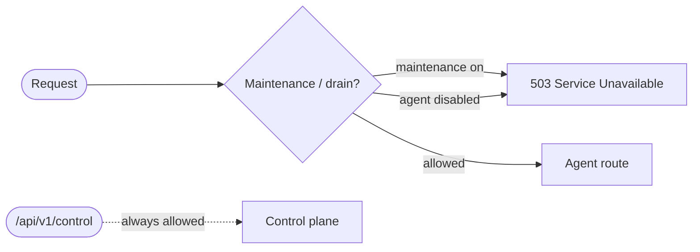

# Production Control Plane

The control plane is a production-oriented admin API for observing and
operating your platform at runtime — inspect agents, endpoints, and
connections; drain or re-enable individual agents; toggle maintenance mode;
and read a sanitised configuration snapshot.

It is opt-in and follows the platform's normal API authentication policy. A
separate shared secret protects its mutating operations.

## Enabling

```python
from agentomatic import AgentPlatform

platform = AgentPlatform(
    enable_control_plane=True,
    control_token="${CONTROL_TOKEN}",  # required for mutating operations
)
app = platform.build()
```

Routes are mounted under `/api/v1/control`.

!!! warning "Protect the control plane"
    Reads use the same API-key or JWT policy as the rest of the platform.
    Mutating endpoints additionally require the `X-Control-Token` header to
    match `control_token`. Leave `control_token` empty only in trusted local
    environments. In production, also place it behind network policy / auth.

## Introspection endpoints

| Method & Path | Description |
| ------------- | ----------- |
| `GET /api/v1/control` | High-level platform overview (counts, uptime, maintenance, and the non-secret `control_token_required` mutation requirement). |
| `GET /api/v1/control/agents` | List agents with auth requirements, connections, and safe readiness signals. |
| `GET /api/v1/control/agents/{name}` | Detail for a single agent. |
| `GET /api/v1/control/endpoints` | List registered custom endpoints. |
| `GET /api/v1/control/connections` | Redacted connection health grouped by scope. |
| `GET /api/v1/control/connections/{scope}/{name}` | Run one named connection probe; returns the same redacted health contract. |
| `GET /api/v1/control/health` | Aggregate health across agents + connections (safe, redacted readiness signals). |
| `GET /api/v1/control/metrics/summary` | Coarse operational counters. |
| `GET /api/v1/control/config` | Sanitised effective configuration. |

```bash
curl -H "X-API-Key: $AGENTOMATIC_API_KEY" \
  http://localhost:8000/api/v1/control | jq
```

Connection diagnostics deliberately include only safe operational fields
(`status`, name, kind, purpose, backend/provider, and a sanitised error).
They never return configured URLs/DSNs, request headers, or arbitrary driver
metadata. Use server logs and the returned error id for detailed diagnostics.

The overview deliberately reveals only whether a control token is required;
it never reveals the token itself. Studio uses that flag to keep Drain and
Maintenance controls disabled until an operator supplies `X-Control-Token` in
the current browser session, avoiding a misleading 401-after-click workflow.

## Operations (mutating)

These require the control token, plus the normal API credentials whenever
platform authentication is enabled.

=== "Drain an agent"
    Stop routing traffic to a single agent (its routes return `503`):

    ```bash
    curl -X POST http://localhost:8000/api/v1/control/agents/fraud_agent/disable \
      -H "X-API-Key: $AGENTOMATIC_API_KEY" \
      -H "X-Control-Token: $CONTROL_TOKEN"
    ```

=== "Re-enable an agent"
    ```bash
    curl -X POST http://localhost:8000/api/v1/control/agents/fraud_agent/enable \
      -H "X-API-Key: $AGENTOMATIC_API_KEY" \
      -H "X-Control-Token: $CONTROL_TOKEN"
    ```

=== "Maintenance mode"
    Block all agent traffic platform-wide (returns `503`) while keeping the
    control plane reachable:

    ```bash
    curl -X POST http://localhost:8000/api/v1/control/maintenance \
      -H "X-API-Key: $AGENTOMATIC_API_KEY" \
      -H "X-Control-Token: $CONTROL_TOKEN" \
      -H "Content-Type: application/json" \
      -d '{"enabled": true}'
    ```

## Request gating

When the control plane is enabled, a maintenance middleware sits in front of
your agent routes:


```mermaid
flowchart LR
    Req([Request]) --> MW{Maintenance / drain?}
    MW -->|maintenance on| B[503 Service Unavailable]
    MW -->|agent disabled| B
    MW -->|allowed| Route[Agent route]
    Control([/api/v1/control]) -.always allowed.-> CP[Control plane]
```

- Platform-wide `maintenance_mode` → all agent routes return `503`.
- A disabled agent → only that agent's routes return `503`.
- The control plane itself remains reachable so you can turn things back on.

!!! warning "Control-plane state is per-process and does not survive a restart"

    `maintenance_mode` and the set of disabled agents live in memory for the
    lifetime of the process. They are **not** persisted, so any restart — a
    redeploy, a crash-restart, a rolling update, or scaling to a new replica —
    resets them to "maintenance off, nothing disabled".

    Two consequences worth planning around in production:

    - An agent you drained comes back **live** after a deploy. If a drain has
      to outlast a restart, enforce it upstream (load balancer, ingress rule,
      or by removing the agent from `AGENTOMATIC_AGENTS`) rather than relying
      on the control plane alone.
    - With more than one replica, a control call only affects the **replica
      that served it**. Route control requests to every replica, or treat the
      control plane as a per-instance debugging tool rather than a
      fleet-wide switch.

    Both toggles are enforced on the hot request path (not merely reported),
    and an agent mounted under both its folder name and its manifest slug is
    disabled under both aliases.

## Typical rollout flow

1. Enable maintenance mode before a risky migration.
2. Run your migration / deploy.
3. Verify with `GET /api/v1/control/health`.
4. Disable maintenance mode to resume traffic.

Combine with the [Observability stack](observability.md) for dashboards and
alerts during the operation.
