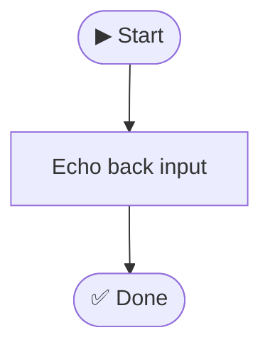
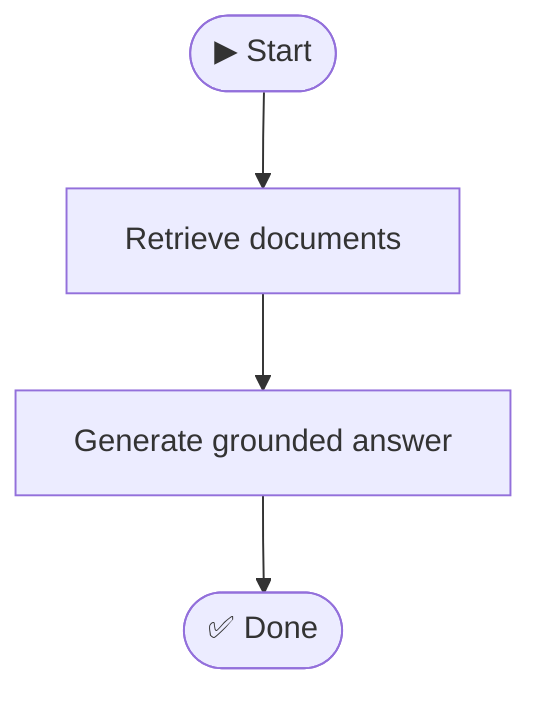
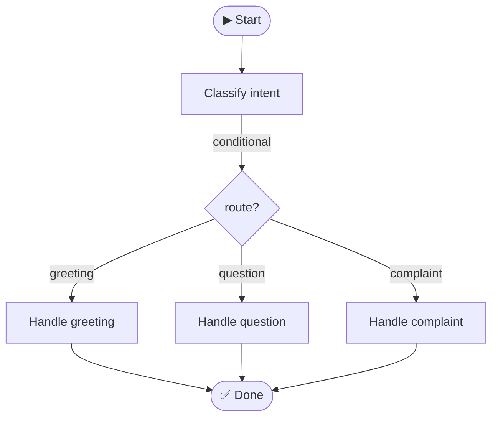
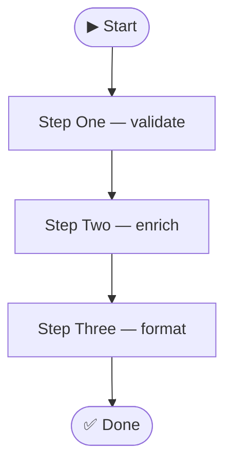
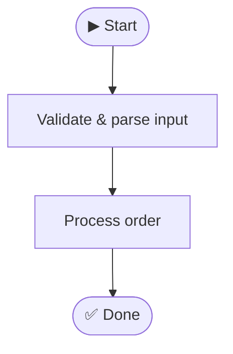
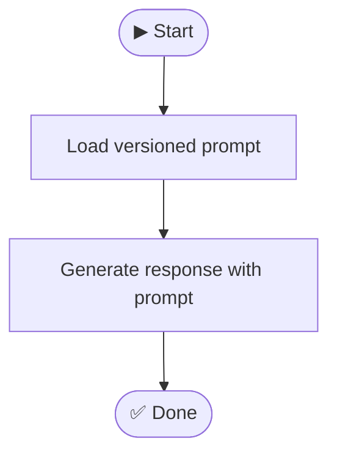
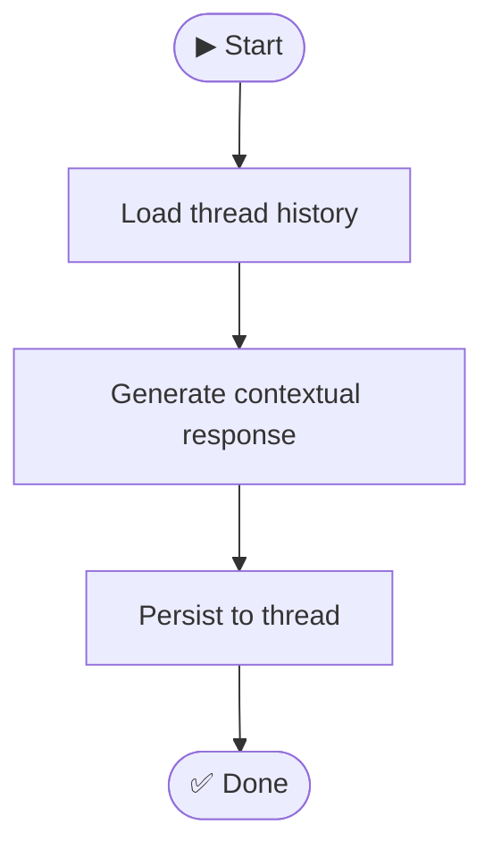
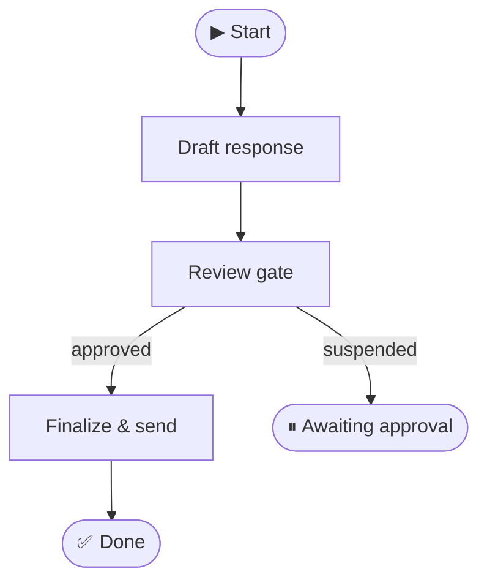
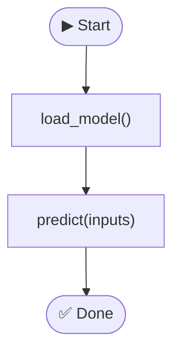
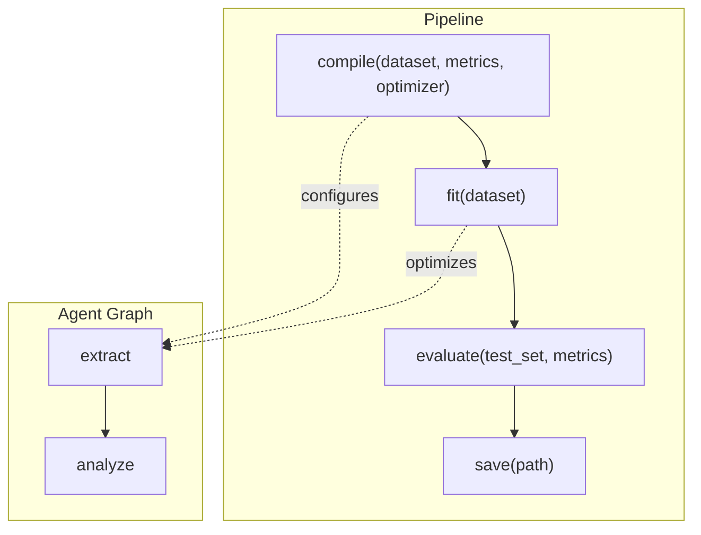

# 📖 Cookbook — 10 Real-World Recipes

Copy-paste-ready patterns for common agentomatic use cases.
Every recipe uses the **exact API** from `agentomatic.agents` —
no stubs, no TODOs, no placeholders.

---

## Table of Contents

| # | Recipe | Description |
|---|--------|-------------|
| 1 | [Minimal Echo Agent](#recipe-1-minimal-echo-agent) | Simplest possible agent — single node that echoes input |
| 2 | [RAG Agent](#recipe-2-rag-agent-retrieve-generate) | Two-node pipeline: retrieve documents, then generate |
| 3 | [Conditional Router](#recipe-3-conditional-router) | Route to different nodes based on intent classification |
| 4 | [@agent_node Decorator](#recipe-4-agent_node-decorator) | Decorator-only graph wiring — no `build_graph()` needed |
| 5 | [Custom Schemas](#recipe-5-custom-schemas) | Pydantic input/output validation with `schemas.py` |
| 6 | [Prompt Versioning](#recipe-6-prompt-versioning) | `prompts.json` + `PromptManager` for A/B testing |
| 7 | [Multi-Turn Chat](#recipe-7-multi-turn-chat) | Thread-based conversation with memory |
| 8 | [Human-in-the-Loop](#recipe-8-human-in-the-loop) | `AgentSuspendedException` for approval workflows |
| 9 | [ML Plugin](#recipe-9-ml-plugin) | `BaseMLPlugin` wrapping a scikit-learn model |
| 10 | [Evaluate & Optimize](#recipe-10-evaluate-optimize) | `compile() → fit() → evaluate()` pipeline |

---

## Recipe 1 — Minimal Echo Agent

> Simplest possible agent — single node that echoes input.



```python
from __future__ import annotations

from dataclasses import dataclass
from typing import Any

from agentomatic.agents import BaseGraphAgent


@dataclass
class EchoState:
    """Minimal state with query in, response out."""

    query: str = ""
    response: str = ""


class EchoAgent(BaseGraphAgent[EchoState]):
    """The simplest possible agent — echoes the user's input."""

    agent_name = "echo"
    agent_description = "Echoes back user input"
    agent_framework = "graph_agent"

    def build_graph(self):
        g = self.new_graph()                     # (1)!
        g.add_node("echo", self.echo)            # (2)!
        g.set_entry_point("echo")                # (3)!
        g.set_finish_point("echo")               # (4)!
        return g.compile()                       # (5)!

    def echo(self, state: EchoState) -> EchoState:
        state.response = f"You said: {state.query}"
        return state

    def input_to_state(self, input_data: dict[str, Any]) -> EchoState:
        return EchoState(query=input_data.get("current_query", ""))

    def state_to_output(self, state: EchoState) -> dict[str, Any]:
        return {"response": state.response}


# --- Usage ---
agent = EchoAgent()
result = agent.transform({"current_query": "hello world"})
print(result)  # {"response": "You said: hello world"}
```

1. `new_graph()` returns a `GraphBuilder` — agentomatic's own builder, not LangGraph.
2. `add_node(name, handler)` registers a callable node.
3. `set_entry_point()` marks where execution begins.
4. `set_finish_point()` marks where execution ends.
5. `compile()` validates the graph and returns an `AgentGraph` runtime.

!!! tip "When to use this pattern"
    Start here for any agent. Once it works, add more nodes, edges,
    or conditional routing as your logic grows.

---

## Recipe 2 — RAG Agent (Retrieve / Generate)

> Two-node pipeline: retrieve documents, then generate a grounded response.



```python
from __future__ import annotations

from dataclasses import dataclass, field
from typing import Any

from agentomatic.agents import BaseGraphAgent


@dataclass
class RAGState:
    """State carrying the query, retrieved docs, and final answer."""

    query: str = ""
    documents: list[str] = field(default_factory=list)
    response: str = ""


class RAGAgent(BaseGraphAgent[RAGState]):
    """Retrieve-then-generate agent."""

    agent_name = "rag_agent"
    agent_description = "Retrieves documents and generates a grounded response"
    agent_framework = "graph_agent"

    def __init__(self, *, knowledge_base: list[str] | None = None) -> None:
        super().__init__()
        self.knowledge_base = knowledge_base or [
            "Agentomatic uses a graph-based execution model.",
            "Agents are defined as Python classes with typed state.",
            "The GraphBuilder provides both fluent and LangGraph-style APIs.",
            "Evaluation uses the Metric protocol with score().",
        ]

    def build_graph(self):
        g = self.new_graph()
        g.add_node("retrieve", self.retrieve)
        g.add_node("generate", self.generate)
        g.set_entry_point("retrieve")
        g.add_edge("retrieve", "generate")
        g.set_finish_point("generate")
        return g.compile()

    def retrieve(self, state: RAGState) -> RAGState:
        """Simple keyword retrieval over the knowledge base."""
        query_lower = state.query.lower()
        state.documents = [
            doc for doc in self.knowledge_base
            if any(word in doc.lower() for word in query_lower.split())
        ]
        if not state.documents:
            state.documents = [self.knowledge_base[0]]
        return state

    def generate(self, state: RAGState) -> RAGState:
        """Generate an answer grounded in the retrieved documents."""
        context = "\n".join(f"- {doc}" for doc in state.documents)
        state.response = (
            f"Based on {len(state.documents)} document(s):\n"
            f"{context}\n\n"
            f"Answer: The information above addresses '{state.query}'."
        )
        return state

    def input_to_state(self, input_data: dict[str, Any]) -> RAGState:
        return RAGState(query=input_data.get("current_query", ""))

    def state_to_output(self, state: RAGState) -> dict[str, Any]:
        return {
            "response": state.response,
            "citations": state.documents,
        }


# --- Usage ---
agent = RAGAgent()
result = agent.transform({"current_query": "How does evaluation work?"})
print(result["response"])
```

!!! note "Swap in a real vector store"
    Replace the `retrieve()` body with calls to ChromaDB, FAISS, or any
    embedding-based retriever. The graph structure stays exactly the same.

---

## Recipe 3 — Conditional Router

> Routes to different nodes based on intent classification using
> `add_conditional_edge()`.



```python
from __future__ import annotations

from dataclasses import dataclass
from typing import Any

from agentomatic.agents import BaseGraphAgent


@dataclass
class RouterState:
    """State with a routing_decision field for conditional edges."""

    query: str = ""
    intent: str = ""
    response: str = ""


class ConditionalRouterAgent(BaseGraphAgent[RouterState]):
    """Classifies intent and routes to the right handler."""

    agent_name = "router"
    agent_description = "Routes queries by intent"
    agent_framework = "graph_agent"

    INTENT_KEYWORDS: dict[str, list[str]] = {
        "greeting": ["hello", "hi", "hey", "good morning"],
        "question": ["what", "how", "why", "when", "where", "?"],
        "complaint": ["bad", "broken", "issue", "problem", "terrible"],
    }

    def build_graph(self):
        g = self.new_graph()
        g.add_node("classify", self.classify)
        g.add_node("handle_greeting", self.handle_greeting)
        g.add_node("handle_question", self.handle_question)
        g.add_node("handle_complaint", self.handle_complaint)

        g.set_entry_point("classify")

        # Conditional edge — route function returns the next node name
        g.add_conditional_edge(
            "classify",
            self.route,
            routes={
                "greeting": "handle_greeting",
                "question": "handle_question",
                "complaint": "handle_complaint",
            },
        )

        g.set_finish_point("handle_greeting")
        g.set_finish_point("handle_question")
        g.set_finish_point("handle_complaint")
        return g.compile()

    def classify(self, state: RouterState) -> RouterState:
        """Classify the query into an intent category."""
        query_lower = state.query.lower()
        for intent, keywords in self.INTENT_KEYWORDS.items():
            if any(kw in query_lower for kw in keywords):
                state.intent = intent
                return state
        state.intent = "question"  # default fallback
        return state

    def route(self, state: RouterState) -> str:
        """Return the intent — maps to node name via routes dict."""
        return state.intent

    def handle_greeting(self, state: RouterState) -> RouterState:
        state.response = f"Hello! How can I help you today?"
        return state

    def handle_question(self, state: RouterState) -> RouterState:
        state.response = f"Great question! Let me look into: {state.query}"
        return state

    def handle_complaint(self, state: RouterState) -> RouterState:
        state.response = (
            f"I'm sorry to hear about this issue. "
            f"Let me escalate: {state.query}"
        )
        return state

    def input_to_state(self, input_data: dict[str, Any]) -> RouterState:
        return RouterState(query=input_data.get("current_query", ""))

    def state_to_output(self, state: RouterState) -> dict[str, Any]:
        return {"response": state.response, "intent": state.intent}


# --- Usage ---
agent = ConditionalRouterAgent()

print(agent.transform({"current_query": "hello there"}))
# {"response": "Hello! How can I help you today?", "intent": "greeting"}

print(agent.transform({"current_query": "this is broken!"}))
# {"response": "I'm sorry to hear about this issue. ...", "intent": "complaint"}
```

!!! info "How `add_conditional_edge` works"
    The `condition` function receives the current state and returns a string.
    The optional `routes` dict maps that string to a node name.
    If no mapping is found, the graph terminates via the `END` sentinel.

---

## Recipe 4 — `@agent_node` Decorator

> No `build_graph()` needed — use decorators to wire the graph automatically.



```python
from __future__ import annotations

from dataclasses import dataclass
from typing import Any

from agentomatic.agents import BaseGraphAgent, agent_node


@dataclass
class PipelineState:
    """State flowing through a three-step pipeline."""

    query: str = ""
    validated: bool = False
    enriched_data: str = ""
    response: str = ""


class DecoratorAgent(BaseGraphAgent[PipelineState]):
    """Three-step pipeline using only @agent_node decorators."""

    agent_name = "decorator_agent"
    agent_description = "Demonstrates decorator-based graph wiring"
    agent_framework = "graph_agent"

    @agent_node(entrypoint=True)
    def step_one(self, state: PipelineState) -> PipelineState:
        """Validate input."""
        state.validated = len(state.query.strip()) > 0
        return state

    @agent_node(after="step_one")
    def step_two(self, state: PipelineState) -> PipelineState:
        """Enrich with additional data."""
        if state.validated:
            state.enriched_data = f"[enriched] {state.query.upper()}"
        else:
            state.enriched_data = "[no input to enrich]"
        return state

    @agent_node(after="step_two", finish=True)
    def step_three(self, state: PipelineState) -> PipelineState:
        """Format the final response."""
        state.response = f"Result: {state.enriched_data}"
        return state

    def input_to_state(self, input_data: dict[str, Any]) -> PipelineState:
        return PipelineState(query=input_data.get("current_query", ""))

    def state_to_output(self, state: PipelineState) -> dict[str, Any]:
        return {
            "response": state.response,
            "validated": state.validated,
        }


# --- Usage ---
agent = DecoratorAgent()
result = agent.transform({"current_query": "decorate me"})
print(result)
# {"response": "Result: [enriched] DECORATE ME", "validated": True}
```

??? info "Decorator parameters reference"
    | Parameter | Type | Description |
    |-----------|------|-------------|
    | `name` | `str | None` | Override node name (defaults to method name) |
    | `after` | `str | None` | Predecessor node — creates an edge |
    | `entrypoint` | `bool` | Mark as graph entry point |
    | `finish` | `bool` | Mark as graph finish node |
    | `description` | `str | None` | Human-readable description |
    | `metadata` | `dict | None` | Arbitrary metadata dict |

---

## Recipe 5 — Custom Schemas

> Pydantic input/output validation with a `schemas.py` module.



=== "schemas.py"

    ```python
    from __future__ import annotations

    from pydantic import BaseModel, Field


    class OrderInput(BaseModel):
        """Validated input for the order-processing agent."""

        product_name: str = Field(
            ..., min_length=1, max_length=200,
            description="Name of the product to order",
        )
        quantity: int = Field(
            ..., ge=1, le=1000,
            description="Number of units",
        )
        customer_email: str = Field(
            ..., pattern=r"^[\w.+-]+@[\w-]+\.[\w.]+$",
            description="Customer email address",
        )


    class OrderOutput(BaseModel):
        """Validated output from the order-processing agent."""

        order_id: str = Field(
            ..., description="Generated order ID",
        )
        total_price: float = Field(
            ..., ge=0, description="Total price in USD",
        )
        confirmation: str = Field(
            ..., description="Human-readable confirmation",
        )
    ```

=== "agent.py"

    ```python
    from __future__ import annotations

    import uuid
    from dataclasses import dataclass
    from typing import Any

    from agentomatic.agents import BaseGraphAgent

    from .schemas import OrderInput, OrderOutput


    PRICE_CATALOG: dict[str, float] = {
        "widget": 9.99,
        "gadget": 24.99,
        "gizmo": 49.99,
    }


    @dataclass
    class OrderState:
        """Internal processing state."""

        raw_input: dict[str, Any] | None = None
        validated: OrderInput | None = None
        order_id: str = ""
        total_price: float = 0.0
        response: str = ""


    class OrderAgent(BaseGraphAgent[OrderState]):
        agent_name = "order_agent"
        agent_description = "Processes product orders with validation"
        agent_framework = "graph_agent"

        def build_graph(self):
            g = self.new_graph()
            g.add_node("validate", self.validate_input)
            g.add_node("process", self.process_order)
            g.set_entry_point("validate")
            g.add_edge("validate", "process")
            g.set_finish_point("process")
            return g.compile()

        def validate_input(self, state: OrderState) -> OrderState:
            """Parse and validate input through the Pydantic schema."""
            state.validated = OrderInput.model_validate(state.raw_input)
            return state

        def process_order(self, state: OrderState) -> OrderState:
            """Look up price and create the order."""
            inp = state.validated
            assert inp is not None
            unit_price = PRICE_CATALOG.get(inp.product_name.lower(), 19.99)
            state.order_id = f"ORD-{uuid.uuid4().hex[:8].upper()}"
            state.total_price = round(unit_price * inp.quantity, 2)
            state.response = (
                f"Order {state.order_id}: "
                f"{inp.quantity}x {inp.product_name} = ${state.total_price}"
            )
            return state

        def input_to_state(self, input_data: dict[str, Any]) -> OrderState:
            return OrderState(raw_input=input_data)

        def state_to_output(self, state: OrderState) -> dict[str, Any]:
            return OrderOutput(
                order_id=state.order_id,
                total_price=state.total_price,
                confirmation=state.response,
            ).model_dump()


    # --- Usage ---
    agent = OrderAgent()
    result = agent.transform({
        "product_name": "Widget",
        "quantity": 3,
        "customer_email": "alice@example.com",
    })
    print(result)
    # {"order_id": "ORD-A1B2C3D4", "total_price": 29.97, "confirmation": "..."}
    ```

!!! warning "Validation errors"
    If `OrderInput.model_validate()` fails, a Pydantic `ValidationError` will
    propagate as a `RuntimeError` from the graph runtime — node `'validate'`
    failed. Catch it in your calling code or add an error-handling node.

---

## Recipe 6 — Prompt Versioning

> Use `prompts.json` and `PromptManager` to A/B test prompt versions.



=== "prompts.json"

    ```json
    {
      "v1": {
        "system": "You are a helpful assistant. Be concise.",
        "user_template": "Answer this question: {query}"
      },
      "v2": {
        "system": "You are an expert assistant. Provide detailed, structured answers with examples.",
        "user_template": "## Question\n{query}\n\n## Instructions\nProvide a thorough answer with examples."
      }
    }
    ```

=== "agent.py"

    ```python
    from __future__ import annotations

    from dataclasses import dataclass
    from pathlib import Path
    from typing import Any

    from agentomatic.agents import BaseGraphAgent
    from agentomatic.prompts import PromptManager


    @dataclass
    class PromptState:
        """State with prompt versioning support."""

        query: str = ""
        prompt_version: str = "v1"
        system_prompt: str = ""
        user_prompt: str = ""
        response: str = ""


    class VersionedPromptAgent(BaseGraphAgent[PromptState]):
        agent_name = "versioned_prompt"
        agent_description = "Demonstrates prompt versioning"
        agent_framework = "graph_agent"

        def __init__(
            self,
            *,
            prompts_file: str | Path = "prompts.json",
        ) -> None:
            super().__init__()
            self.prompt_manager = PromptManager(
                agent_name=self.agent_name,
                prompts_file=prompts_file,
            )

        def build_graph(self):
            g = self.new_graph()
            g.add_node("load_prompt", self.load_prompt)
            g.add_node("generate", self.generate)
            g.set_entry_point("load_prompt")
            g.add_edge("load_prompt", "generate")
            g.set_finish_point("generate")
            return g.compile()

        def load_prompt(self, state: PromptState) -> PromptState:
            """Load the system and user prompts for the requested version."""
            version = state.prompt_version

            system = self.prompt_manager.get_prompt(
                version=version,
                prompt_type="system",
            )
            user = self.prompt_manager.format_prompt(
                version=version,
                prompt_type="user_template",
                query=state.query,
            )

            state.system_prompt = system or "You are a helpful assistant."
            state.user_prompt = user or state.query
            return state

        def generate(self, state: PromptState) -> PromptState:
            """Generate response (replace with real LLM call)."""
            state.response = (
                f"[System: {state.system_prompt[:50]}...]\n"
                f"[User: {state.user_prompt[:80]}...]\n"
                f"Generated answer for: {state.query}"
            )
            return state

        def input_to_state(self, input_data: dict[str, Any]) -> PromptState:
            return PromptState(
                query=input_data.get("current_query", ""),
                prompt_version=input_data.get("prompt_version", "v1"),
            )

        def state_to_output(self, state: PromptState) -> dict[str, Any]:
            return {
                "response": state.response,
                "prompt_version": state.prompt_version,
            }


    # --- Usage ---
    agent = VersionedPromptAgent(prompts_file="prompts.json")
    versions = agent.prompt_manager.list_versions()  # ["v1", "v2"]

    result_v1 = agent.transform({
        "current_query": "What is RAG?",
        "prompt_version": "v1",
    })
    result_v2 = agent.transform({
        "current_query": "What is RAG?",
        "prompt_version": "v2",
    })
    ```

??? tip "PromptManager API quick reference"
    | Method | Description |
    |--------|-------------|
    | `get_prompt(version, prompt_type)` | Get raw template string |
    | `format_prompt(version, prompt_type, **kwargs)` | Format template with variables |
    | `list_versions()` | List all available version keys |
    | `reload(path)` | Hot-reload prompts from disk |
    | `as_langchain_template(version, prompt_type)` | Convert to LangChain `PromptTemplate` |
    | `as_chat_template(version)` | Convert to LangChain `ChatPromptTemplate` |

---

## Recipe 7 — Multi-Turn Chat

> Thread-based conversation with message history.



```python
from __future__ import annotations

import uuid
from dataclasses import dataclass, field
from typing import Any

from agentomatic.agents import BaseGraphAgent


@dataclass
class ChatMessage:
    """A single chat message."""

    role: str  # "user" or "assistant"
    content: str


@dataclass
class ChatState:
    """State for multi-turn chat with thread memory."""

    thread_id: str = ""
    user_message: str = ""
    history: list[ChatMessage] = field(default_factory=list)
    response: str = ""


# Simple in-memory thread store (replace with DB in production)
THREAD_STORE: dict[str, list[ChatMessage]] = {}


class MultiTurnChatAgent(BaseGraphAgent[ChatState]):
    agent_name = "chat_agent"
    agent_description = "Multi-turn chat with thread memory"
    agent_framework = "graph_agent"

    def build_graph(self):
        g = self.new_graph()
        g.add_node("load_history", self.load_history)
        g.add_node("respond", self.respond)
        g.add_node("save_history", self.save_history)
        g.set_entry_point("load_history")
        g.add_edge("load_history", "respond")
        g.add_edge("respond", "save_history")
        g.set_finish_point("save_history")
        return g.compile()

    def load_history(self, state: ChatState) -> ChatState:
        """Load existing conversation from the thread store."""
        if not state.thread_id:
            state.thread_id = f"thread-{uuid.uuid4().hex[:8]}"
        state.history = list(THREAD_STORE.get(state.thread_id, []))
        return state

    def respond(self, state: ChatState) -> ChatState:
        """Generate a response considering conversation history."""
        turn_count = len(state.history) // 2 + 1
        history_summary = (
            f" (continuing turn {turn_count})"
            if state.history
            else " (new conversation)"
        )

        state.response = (
            f"I understand you said: '{state.user_message}'"
            f"{history_summary}. "
            f"Previous messages: {len(state.history)}."
        )
        return state

    def save_history(self, state: ChatState) -> ChatState:
        """Persist the new messages to the thread store."""
        if state.thread_id not in THREAD_STORE:
            THREAD_STORE[state.thread_id] = []
        THREAD_STORE[state.thread_id].append(
            ChatMessage(role="user", content=state.user_message)
        )
        THREAD_STORE[state.thread_id].append(
            ChatMessage(role="assistant", content=state.response)
        )
        return state

    def input_to_state(self, input_data: dict[str, Any]) -> ChatState:
        return ChatState(
            thread_id=input_data.get("thread_id", ""),
            user_message=input_data.get("current_query", ""),
        )

    def state_to_output(self, state: ChatState) -> dict[str, Any]:
        return {
            "response": state.response,
            "thread_id": state.thread_id,
            "message_count": len(
                THREAD_STORE.get(state.thread_id, [])
            ),
        }


# --- Usage ---
agent = MultiTurnChatAgent()

r1 = agent.transform({"current_query": "Hi, I'm Alice"})
tid = r1["thread_id"]  # save for follow-ups

r2 = agent.transform({
    "current_query": "What's the weather?",
    "thread_id": tid,
})
print(r2)
# {"response": "... (continuing turn 2). Previous messages: 2.", ...}
```

!!! note "Production thread storage"
    Replace the `THREAD_STORE` dict with a database or use the built-in
    thread endpoints (`POST /threads`, `GET /threads/{tid}/messages`)
    provided by agentomatic's router factory.

---

## Recipe 8 — Human-in-the-Loop

> Suspend execution for manual approval using `AgentSuspendedException`.



```python
from __future__ import annotations

import uuid
from dataclasses import dataclass
from typing import Any

from agentomatic.agents import BaseGraphAgent
from agentomatic.core import AgentSuspendedException


@dataclass
class ApprovalState:
    """State for a human-in-the-loop approval workflow."""

    query: str = ""
    draft: str = ""
    approved: bool = False
    approval_id: str = ""
    response: str = ""


class HumanInTheLoopAgent(BaseGraphAgent[ApprovalState]):
    agent_name = "hitl_agent"
    agent_description = "Requires human approval before sending"
    agent_framework = "graph_agent"

    def __init__(self, *, auto_approve: bool = False) -> None:
        super().__init__()
        self.auto_approve = auto_approve

    def build_graph(self):
        g = self.new_graph()
        g.add_node("draft", self.create_draft)
        g.add_node("review", self.review_gate)
        g.add_node("finalize", self.finalize)
        g.set_entry_point("draft")
        g.add_edge("draft", "review")
        g.add_edge("review", "finalize")
        g.set_finish_point("finalize")
        return g.compile()

    def create_draft(self, state: ApprovalState) -> ApprovalState:
        """Create a draft response for review."""
        state.draft = (
            f"Dear Customer,\n\n"
            f"Regarding your inquiry: {state.query}\n\n"
            f"We would like to offer a full refund.\n\n"
            f"Best regards,\nSupport Team"
        )
        state.approval_id = f"approval-{uuid.uuid4().hex[:8]}"
        return state

    def review_gate(self, state: ApprovalState) -> ApprovalState:
        """Gate that suspends execution if not pre-approved."""
        if self.auto_approve or state.approved:
            return state

        # Suspend execution — the platform stores the state
        # and exposes it via GET /threads/{tid}/pending
        raise AgentSuspendedException(
            approval_id=state.approval_id,
            node_name="review",
            state_snapshot={
                "draft": state.draft,
                "query": state.query,
                "approval_id": state.approval_id,
            },
            message=(
                f"Draft response requires approval. "
                f"Review ID: {state.approval_id}"
            ),
        )

    def finalize(self, state: ApprovalState) -> ApprovalState:
        """Finalize the approved response."""
        state.response = f"[APPROVED] {state.draft}"
        return state

    def input_to_state(self, input_data: dict[str, Any]) -> ApprovalState:
        return ApprovalState(
            query=input_data.get("current_query", ""),
            approved=input_data.get("approved", False),
        )

    def state_to_output(self, state: ApprovalState) -> dict[str, Any]:
        return {
            "response": state.response,
            "approval_id": state.approval_id,
        }


# --- Usage (auto-approve for demo) ---
agent = HumanInTheLoopAgent(auto_approve=True)
result = agent.transform({"current_query": "I want a refund"})
print(result["response"])  # "[APPROVED] Dear Customer, ..."
```

!!! warning "Suspension in production"
    When `AgentSuspendedException` is raised, the platform catches it and:

    1. Stores the `state_snapshot` in the thread's pending queue
    2. Returns an HTTP 202 Accepted to the caller
    3. Exposes `GET /threads/{tid}/pending` for the reviewer
    4. `POST /threads/{tid}/approve` resumes execution from the suspended node
    5. `POST /threads/{tid}/reject` discards the pending state

---

## Recipe 9 — ML Plugin

> Wrap a scikit-learn model with `BaseMLPlugin` for auto-generated REST APIs.



=== "plugin.py"

    ```python
    from __future__ import annotations

    from pydantic import BaseModel, Field

    from agentomatic.plugins.ml import BaseMLPlugin


    # --- Pydantic schemas ---

    class IrisInput(BaseModel):
        """Input features for iris classification."""

        sepal_length: float = Field(..., ge=0, le=10)
        sepal_width: float = Field(..., ge=0, le=10)
        petal_length: float = Field(..., ge=0, le=10)
        petal_width: float = Field(..., ge=0, le=10)


    class IrisOutput(BaseModel):
        """Prediction result."""

        species: str
        confidence: float = Field(..., ge=0, le=1)
        class_probabilities: dict[str, float]


    # --- Plugin ---

    class IrisClassifier(BaseMLPlugin[IrisInput, IrisOutput]):
        """Scikit-learn iris classifier exposed as an agentomatic plugin."""

        plugin_name = "iris_classifier"
        plugin_description = "Classifies iris flowers by species"
        plugin_version = "1.0.0"

        def __init__(self) -> None:
            super().__init__()
            self._model = None
            self._label_names = ["setosa", "versicolor", "virginica"]

        async def load_model(self) -> None:
            """Train a simple model on the iris dataset."""
            from sklearn.datasets import load_iris
            from sklearn.ensemble import RandomForestClassifier

            data = load_iris()
            self._model = RandomForestClassifier(
                n_estimators=100, random_state=42,
            )
            self._model.fit(data.data, data.target)
            self._is_loaded = True

        async def predict(self, inputs: IrisInput) -> IrisOutput:
            """Run inference on the loaded model."""
            assert self._model is not None, "Call load_model() first"

            features = [[
                inputs.sepal_length,
                inputs.sepal_width,
                inputs.petal_length,
                inputs.petal_width,
            ]]

            prediction = self._model.predict(features)[0]
            probabilities = self._model.predict_proba(features)[0]

            return IrisOutput(
                species=self._label_names[prediction],
                confidence=float(max(probabilities)),
                class_probabilities={
                    name: round(float(prob), 4)
                    for name, prob in zip(
                        self._label_names, probabilities
                    )
                },
            )

        def model_card(self) -> dict:
            """Return metadata about the model."""
            base = super().model_card()
            base.update({
                "algorithm": "RandomForestClassifier",
                "n_estimators": 100,
                "features": [
                    "sepal_length", "sepal_width",
                    "petal_length", "petal_width",
                ],
                "labels": self._label_names,
            })
            return base
    ```

=== "usage.py"

    ```python
    import asyncio
    from plugin import IrisClassifier, IrisInput

    async def main():
        clf = IrisClassifier()
        await clf.load_model()

        # Check schemas
        print(clf.get_input_schema().model_json_schema())
        print(clf.get_output_schema().model_json_schema())

        # Predict
        result = await clf.predict(IrisInput(
            sepal_length=5.1,
            sepal_width=3.5,
            petal_length=1.4,
            petal_width=0.2,
        ))
        print(result.species)      # "setosa"
        print(result.confidence)   # 0.99

        # Model card
        print(clf.model_card())

    asyncio.run(main())
    ```

!!! tip "Auto-generated REST endpoints"
    When registered with agentomatic, the plugin automatically gets:

    - `POST /predict` — calls `predict()` with validated input
    - `GET /model-card` — returns `model_card()` metadata
    - `GET /health` — checks `is_loaded` status

---

## Recipe 10 — Evaluate / Optimize

> Full ML-like pipeline: `compile() → fit() → evaluate()`.



```python
from __future__ import annotations

from dataclasses import dataclass
from typing import Any

from agentomatic.agents import (
    AgentDataset,
    AgentExample,
    BaseGraphAgent,
    ExactKeyMatchMetric,
    GridSearchOptimizer,
)


@dataclass
class AnalysisState:
    """State for a text analysis agent."""

    query: str = ""
    response: str = ""
    summary: str = ""
    sentiment: str = ""


class AnalysisAgent(BaseGraphAgent[AnalysisState]):
    """Agent with tunable parameters for optimization."""

    agent_name = "analysis_agent"
    agent_description = "Analyzes text with configurable behavior"
    agent_framework = "graph_agent"

    def __init__(self) -> None:
        super().__init__()
        # Tunable parameters — GridSearchOptimizer can set these
        self.detail_level: str = "brief"
        self.include_sentiment: bool = True

    def build_graph(self):
        g = self.new_graph()
        g.add_node("extract", self.extract)
        g.add_node("analyze", self.analyze)
        g.set_entry_point("extract")
        g.add_edge("extract", "analyze")
        g.set_finish_point("analyze")
        return g.compile()

    def extract(self, state: AnalysisState) -> AnalysisState:
        """Extract key information from the query."""
        words = state.query.split()
        state.summary = (
            " ".join(words[:5]) + "..."
            if len(words) > 5
            else state.query
        )
        return state

    def analyze(self, state: AnalysisState) -> AnalysisState:
        """Analyze text based on current configuration."""
        parts = [f"Summary: {state.summary}"]

        if self.detail_level == "detailed":
            parts.append(
                f"Word count: {len(state.query.split())}"
            )

        if self.include_sentiment:
            # Simple heuristic sentiment
            positive = {"good", "great", "love", "excellent"}
            negative = {"bad", "terrible", "hate", "awful"}
            words = set(state.query.lower().split())
            if words & positive:
                state.sentiment = "positive"
            elif words & negative:
                state.sentiment = "negative"
            else:
                state.sentiment = "neutral"
            parts.append(f"Sentiment: {state.sentiment}")

        state.response = " | ".join(parts)
        return state

    def input_to_state(
        self, input_data: dict[str, Any],
    ) -> AnalysisState:
        return AnalysisState(
            query=input_data.get("current_query", ""),
        )

    def state_to_output(
        self, state: AnalysisState,
    ) -> dict[str, Any]:
        return {
            "response": state.response,
            "summary": state.summary,
            "sentiment": state.sentiment,
        }


# ============================================================
# Build dataset
# ============================================================

dataset = AgentDataset.from_list(
    [
        {
            "id": "ex_001",
            "input": {"current_query": "This product is great and I love it"},
            "expected_output": {
                "response": "...",
                "summary": "...",
                "sentiment": "positive",
            },
            "split": "train",
        },
        {
            "id": "ex_002",
            "input": {"current_query": "The service was terrible today"},
            "expected_output": {
                "response": "...",
                "summary": "...",
                "sentiment": "negative",
            },
            "split": "train",
        },
        {
            "id": "ex_003",
            "input": {"current_query": "I placed an order yesterday"},
            "expected_output": {
                "response": "...",
                "summary": "...",
                "sentiment": "neutral",
            },
            "split": "test",
        },
    ],
    name="sentiment_data",
)

# ============================================================
# Metrics
# ============================================================

metrics = [
    ExactKeyMatchMetric(
        ["response", "summary", "sentiment"],
        name="has_all_keys",
    ),
]

# ============================================================
# compile() → fit() → evaluate() → save()
# ============================================================

agent = AnalysisAgent()

# 1. Compile — configure the optimization strategy
agent.compile(
    dataset=dataset,
    metrics=metrics,
    optimizer=GridSearchOptimizer(
        param_grid={
            "detail_level": ["brief", "detailed"],
            "include_sentiment": [True, False],
        },
        max_examples=10,
    ),
)

# 2. Fit — run the optimizer and apply best config
agent.fit(dataset)

# 3. Evaluate on test split
report = agent.evaluate(dataset.test, metrics)
print(report.summary())
# Evaluation Report: analysis_agent
#   Dataset: inline
#   Examples: 1
#   Pass Rate: 100.0%
#   Scores:
#     has_all_keys: 1.000

# 4. Save compiled state
agent.save("./checkpoints/analysis_agent")

# 5. Inspect traces
for event in agent.get_last_trace():
    print(f"  {event.node_name}: {event.status} ({event.duration_ms:.1f}ms)")
```

!!! info "The ML-like lifecycle"
    | Method | Purpose |
    |--------|---------|
    | `compile(dataset, metrics, optimizer)` | Set optimization strategy |
    | `fit(dataset)` | Run the optimizer, apply best config |
    | `evaluate(examples, metrics)` | Score predictions on a test set |
    | `save(path)` | Persist config, metadata, evaluation history |
    | `load_compiled(path)` | Restore a previously saved checkpoint |

??? example "Loading a saved checkpoint"
    ```python
    restored = AnalysisAgent()
    restored.load_compiled("./checkpoints/analysis_agent")
    # Compiled config is applied — agent uses the optimized params
    result = restored.transform({"current_query": "New query here"})
    ```

---

## What's Next?

!!! success "You're ready to build"
    These 10 recipes cover the most common patterns. Mix and match them —
    combine RAG with routing, add human-in-the-loop to any agent,
    or wrap the whole thing in the evaluate/optimize pipeline.

- **API Reference** — full method signatures for every class
- **[CLI Guide](../cli/commands.md)** — `agentomatic init`, `run`, `test`
- **Studio Guide** — visual debugging dashboard
