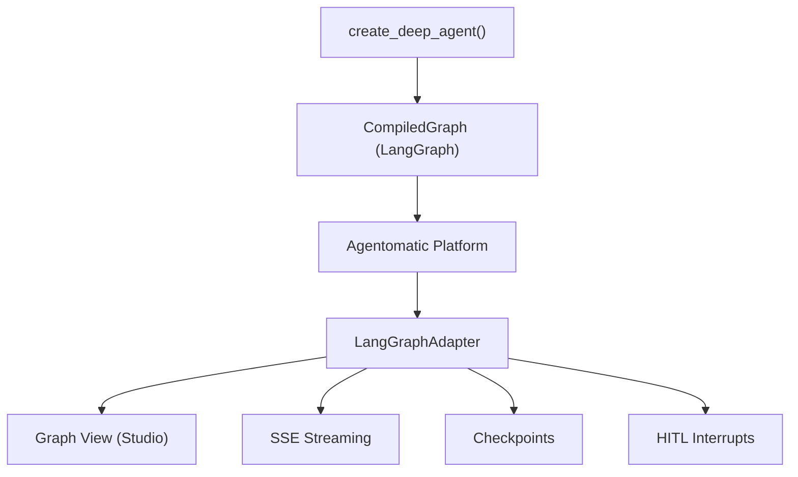

# Deep Agent Integration

Agentomatic provides **first-class support** for LangChain's [Deep Agents](https://docs.langchain.com/oss/python/deepagents/overview) — the batteries-included agent harness built on LangGraph.

Since `create_deep_agent()` returns a standard LangGraph `CompiledGraph`, Agentomatic Studio automatically provides:

- 🗺️ **Graph visualization** — see the agent's planning, tool use, and delegation flow
- 🔄 **Real-time streaming** — watch every node execute with SSE events
- 🧩 **Subagent tracking** — monitor delegated subtasks in real time
- 📋 **Task planning** — visualize `write_todos` planning output
- ⏸️ **HITL interrupts** — pause execution for human review and resume
- ⏪ **Time travel** — checkpoint-based state inspection and replay

---

## Quick Start

### 1. Scaffold a deep agent

```bash
agentomatic init my_research_agent --template deepagent
```

This generates:

```
agents/my_research_agent/
├── __init__.py     # AgentManifest + graph_fn
├── agent.py        # create_deep_agent() definition
├── config.py       # Configuration model
├── README.md       # Agent documentation
├── prompts.json    # Prompt versions
└── .env.example    # Environment variables
```

### 2. Configure your model

Edit `agents/my_research_agent/agent.py`:

=== "Google Gemini"

    ```python
    agent = create_deep_agent(
        model="google_genai:gemini-3.5-flash",
        system_prompt="You are an expert research assistant.",
        tools=[internet_search],
    )
    ```

=== "OpenAI"

    ```python
    agent = create_deep_agent(
        model="openai:gpt-4o",
        system_prompt="You are an expert research assistant.",
        tools=[internet_search],
    )
    ```

=== "Anthropic"

    ```python
    agent = create_deep_agent(
        model="anthropic:claude-sonnet-4-6",
        system_prompt="You are an expert research assistant.",
        tools=[internet_search],
    )
    ```

### 3. Launch with Studio

```bash
agentomatic run --studio
```

Open [http://localhost:8000/studio/ui/](http://localhost:8000/studio/ui/) to see your deep agent's graph, streaming execution, and debugging tools.

---

## How It Works

### Architecture



Deep Agent internally builds a LangGraph `StateGraph` with these key nodes:

| Node | Purpose | Studio Visualization |
|------|---------|---------------------|
| `agent` | Main LLM reasoning loop | Agent node (blue) |
| `write_todos` | Task planning and breakdown | Planning node (purple) |
| `task` | Subagent delegation | Subagent node (green) |
| `tools` | Tool execution (search, fs, etc.) | Tool node (orange) |

### Adapter Detection

Agentomatic auto-detects deep_agent graphs and enables enhanced features:

1. **Framework hint**: Set `framework="langgraph"` in your manifest (default for deepagent template)
2. **Graph inspection**: The adapter inspects graph nodes for deep_agent signatures (`write_todos`, `task`)
3. **Enhanced events**: Subagent delegation and planning events are mapped to dedicated SSE event types

---

## Full Example

### `__init__.py`

```python
"""Research Agent — Deep Agent with Agentomatic."""
from __future__ import annotations

from typing import Any

from agentomatic import AgentManifest

manifest = AgentManifest(
    name="researcher",
    slug="agent-researcher",
    description="Research assistant with planning and subagent delegation",
    intent_keywords=["research", "analyze", "report"],
    framework="langgraph",
)


def graph_fn():
    """Return the compiled deep agent graph."""
    from .agent import create_agent
    return create_agent()


async def node_fn(state: dict[str, Any]) -> dict[str, Any]:
    """Invoke the deep agent."""
    return await graph_fn().ainvoke(state)
```

### `agent.py`

```python
"""Deep Agent definition for researcher."""
from __future__ import annotations

import os
from functools import lru_cache

from tavily import TavilyClient


tavily = TavilyClient(api_key=os.environ.get("TAVILY_API_KEY", ""))


def internet_search(query: str, max_results: int = 5) -> str:
    """Search the internet for information."""
    results = tavily.search(query, max_results=max_results)
    return "\n".join(
        f"- {r['title']}: {r['content'][:200]}"
        for r in results.get("results", [])
    )


@lru_cache(maxsize=1)
def create_agent():
    """Create and compile the deep agent."""
    from deepagents import create_deep_agent

    return create_deep_agent(
        model="google_genai:gemini-3.5-flash",
        system_prompt=(
            "You are an expert research assistant. "
            "Break complex tasks into steps using write_todos, "
            "then conduct thorough research and compile reports."
        ),
        tools=[internet_search],
    )
```

---

## Subagents

Deep Agent's subagent delegation is fully visible in Studio:

```python
from deepagents import create_deep_agent

agent = create_deep_agent(
    model="anthropic:claude-sonnet-4-6",
    subagents=[
        {
            "name": "researcher",
            "model": "google_genai:gemini-3.5-flash",
            "tools": [internet_search],
        },
        {
            "name": "writer",
            "model": "openai:gpt-4o",
            "tools": [],
        },
    ],
)
```

In Studio's Graph View, you'll see:

- **Main agent node** with connections to the `task` tool
- **Subagent events** (`subagent_start`, `subagent_end`) appearing in the Debug panel
- **Delegation tracking** showing which subagent handled which task

---

## Human-in-the-Loop (HITL)

Deep Agent supports HITL via LangGraph's `interrupt` mechanism. When the agent hits an interrupt:

1. Studio receives a `breakpoint_hit` event
2. The graph pauses and state is persisted via checkpointing
3. The Studio UI shows an **"Approve / Reject"** panel
4. On approval, Studio calls `POST /studio/agents/{name}/threads/{tid}/resume`
5. Execution continues from the interrupt point

### Enabling HITL

HITL works automatically when your deep agent has:

- A **checkpointer** configured (required for state persistence)
- Tools that trigger `interrupt` via deep_agent middleware

```python
from langgraph.checkpoint.memory import MemorySaver

agent = create_deep_agent(
    model="anthropic:claude-sonnet-4-6",
    tools=[sensitive_tool],
)

# Compile with checkpointer for HITL
compiled = agent.compile(checkpointer=MemorySaver())
```

---

## Studio SSE Events

When running a deep agent through Studio, you'll receive these enhanced events:

| Event Type | Description | When |
|-----------|-------------|------|
| `node_start` | A graph node begins execution | Every node transition |
| `node_end` | A graph node completes | Every node completion |
| `message_chunk` | LLM token streaming | During LLM inference |
| `task_update` | Planning tool (`write_todos`) output | When agent plans tasks |
| `subagent_start` | Subagent begins work | When `task` tool delegates |
| `subagent_end` | Subagent completes | When delegation returns |
| `breakpoint_hit` | Execution paused for HITL | At interrupt points |
| `run_complete` | Full execution finished | End of run |

---

## Middleware Integration

Deep Agent middleware works transparently with Agentomatic. All middleware events are captured by the Studio adapter:

```python
from deepagents import create_deep_agent
from deepagents.middleware import (
    SummarizationMiddleware,
    ModelCallLimitMiddleware,
)

agent = create_deep_agent(
    model="anthropic:claude-sonnet-4-6",
    middleware=[
        SummarizationMiddleware(max_tokens=8000),
        ModelCallLimitMiddleware(max_calls=50),
    ],
)
```

Studio captures middleware activity through the standard `on_chain_start`/`on_chain_end` event stream.

---

## Testing

Use the `agentomatic demo` command to test Studio without a deep_agent:

```bash
agentomatic demo
```

For deep_agent testing, use `--studio` with your agents directory:

```bash
agentomatic run --agents-dir agents --studio
```

## API Reference

### Studio Endpoints (relevant for deep_agent)

| Method | Endpoint | Description |
|--------|----------|-------------|
| `GET` | `/studio/agents/{name}/graph` | Get deep_agent graph topology |
| `POST` | `/studio/agents/{name}/runs/stream` | Stream deep_agent execution via SSE |
| `GET` | `/studio/agents/{name}/threads/{tid}/state` | Inspect deep_agent state |
| `POST` | `/studio/agents/{name}/threads/{tid}/resume` | Resume from HITL interrupt |
| `GET` | `/studio/agents/{name}/threads/{tid}/history` | Checkpoint history |
