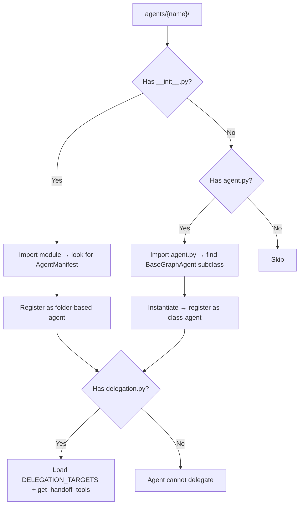
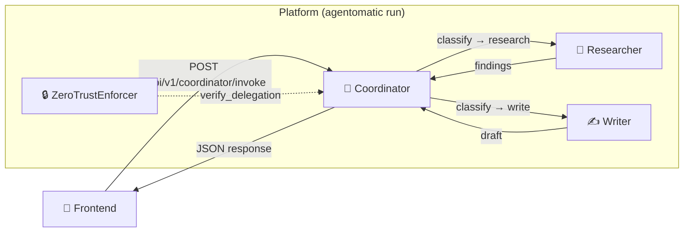

# Delegation & Multi-Agent Orchestration

<div align="center">
  
  <h3>Chain Agents Together with Zero Boilerplate</h3>
</div>

---

Agentomatic supports **agent-to-agent (A2A) communication** out of the box.
Create specialist agents, wire an orchestrator, and everything is auto-discovered
when you run `agentomatic run`.

---

## End-to-End Example: Multi-Agent System

The most common pattern is a **coordinator** that routes user queries to
specialist agents. Here's the complete setup:

### Folder Structure

```
agents/
├── coordinator/            # Orchestrator — routes to specialists
│   ├── __init__.py
│   ├── agent.py            # CoordinatorAgent (BaseGraphAgent)
│   └── delegation.py       # DELEGATION_TARGETS + get_handoff_tools()
│
├── researcher/             # Specialist 1 — factual lookups
│   ├── __init__.py
│   └── agent.py
│
└── writer/                 # Specialist 2 — content generation
    ├── __init__.py
    └── agent.py
```

### Step 1: Create the Specialist Agents

Each specialist is a standard class-based agent:

=== "Researcher"

    ```bash
    agentomatic init researcher --template basic
    ```

    ```python
    # agents/researcher/agent.py
    from __future__ import annotations

    from dataclasses import dataclass
    from typing import Any

    from agentomatic.agents import BaseGraphAgent


    @dataclass
    class ResearcherState:
        request: str = ""
        output: dict[str, Any] = None

        def __post_init__(self):
            if self.output is None:
                self.output = {}


    class ResearcherAgent(BaseGraphAgent[ResearcherState]):
        agent_name = "researcher"
        agent_description = "Performs factual research and lookups"

        def build_graph(self):
            g = self.new_graph()
            g.add_node("research", self.research)
            g.set_entry_point("research")
            g.set_finish_point("research")
            return g.compile()

        def research(self, state: ResearcherState) -> ResearcherState:
            # TODO: Replace with real search / RAG
            state.output = {
                "response": f"Research findings about: {state.request}",
                "sources": ["source_1", "source_2"],
            }
            return state

        def input_to_state(self, data: dict[str, Any]) -> ResearcherState:
            return ResearcherState(request=data.get("current_query", ""))

        def state_to_output(self, state: ResearcherState) -> dict[str, Any]:
            return state.output
    ```

=== "Writer"

    ```bash
    agentomatic init writer --template basic
    ```

    ```python
    # agents/writer/agent.py
    from __future__ import annotations

    from dataclasses import dataclass
    from typing import Any

    from agentomatic.agents import BaseGraphAgent


    @dataclass
    class WriterState:
        request: str = ""
        output: dict[str, Any] = None

        def __post_init__(self):
            if self.output is None:
                self.output = {}


    class WriterAgent(BaseGraphAgent[WriterState]):
        agent_name = "writer"
        agent_description = "Generates content and written material"

        def build_graph(self):
            g = self.new_graph()
            g.add_node("write", self.write)
            g.set_entry_point("write")
            g.set_finish_point("write")
            return g.compile()

        def write(self, state: WriterState) -> WriterState:
            # TODO: Replace with real LLM content generation
            state.output = {
                "response": f"Written content about: {state.request}",
                "word_count": 250,
            }
            return state

        def input_to_state(self, data: dict[str, Any]) -> WriterState:
            return WriterState(request=data.get("current_query", ""))

        def state_to_output(self, state: WriterState) -> dict[str, Any]:
            return state.output
    ```

### Step 2: Create the Coordinator Agent

The coordinator is the **orchestrator** — it decides at runtime which
specialist to call. It needs two files: `agent.py` and `delegation.py`.

#### `delegation.py` — Define Delegation Targets

This file is **auto-discovered** by the registry. It must export:

- `DELEGATION_TARGETS` — list of agent names this agent may call
- `get_handoff_tools()` — function that returns LangChain-compatible handoff tools

```python
# agents/coordinator/delegation.py
"""Delegation configuration for the coordinator agent."""
from __future__ import annotations

from agentomatic.delegation import AgentDelegator

# Agents this coordinator is allowed to delegate to.
# The ZeroTrustEnforcer blocks any delegation not in this list.
DELEGATION_TARGETS = ["researcher", "writer"]


def get_handoff_tools():
    """Create handoff tools for all delegation targets.

    Resolution order:
    1. langgraph-swarm (in-process) if installed and use_swarm=True
    2. HTTP delegation via POST /api/v1/{agent}/invoke (fallback)
    """
    delegator = AgentDelegator(use_swarm=True)
    return delegator.create_handoffs(
        targets=DELEGATION_TARGETS,
        descriptions={
            "researcher": "Delegate factual research and lookup questions",
            "writer": "Delegate content writing and summarisation tasks",
        },
    )
```

#### `agent.py` — The Coordinator Logic

```python
# agents/coordinator/agent.py
"""Coordinator agent that routes queries to specialists."""
from __future__ import annotations

from dataclasses import dataclass, field
from typing import Any

from agentomatic.agents import BaseGraphAgent


@dataclass
class CoordinatorState:
    request: str = ""
    classification: str = ""
    output: dict[str, Any] = field(default_factory=dict)


class CoordinatorAgent(BaseGraphAgent[CoordinatorState]):
    """Routes user queries to the appropriate specialist agent."""

    agent_name = "coordinator"
    agent_description = "Orchestrator that routes to researcher or writer"

    def build_graph(self):
        g = self.new_graph()
        g.add_node("classify", self.classify)
        g.add_node("route", self.route)
        g.set_entry_point("classify")
        g.add_edge("classify", "route")
        g.set_finish_point("route")
        return g.compile()

    def classify(self, state: CoordinatorState) -> CoordinatorState:
        """Classify the user query to determine routing."""
        query = state.request.lower()
        if any(kw in query for kw in ["research", "find", "lookup", "fact"]):
            state.classification = "researcher"
        elif any(kw in query for kw in ["write", "draft", "blog", "summarize"]):
            state.classification = "writer"
        else:
            state.classification = "researcher"  # default
        return state

    def route(self, state: CoordinatorState) -> CoordinatorState:
        """Route to the appropriate specialist via delegation."""
        from .delegation import get_handoff_tools

        tools = get_handoff_tools()
        # Find the right handoff tool
        target_tool = None
        for tool in tools:
            tool_name = getattr(tool, "name", getattr(tool, "__name__", ""))
            if state.classification in tool_name:
                target_tool = tool
                break

        if target_tool:
            result = target_tool(state.request)
            state.output = {"response": result, "routed_to": state.classification}
        else:
            state.output = {"response": f"No handler for: {state.request}"}
        return state

    def input_to_state(self, data: dict[str, Any]) -> CoordinatorState:
        return CoordinatorState(request=data.get("current_query", ""))

    def state_to_output(self, state: CoordinatorState) -> dict[str, Any]:
        return state.output
```

### Step 3: Run the Platform

```bash
agentomatic run
```

The platform auto-discovers all three agents and their delegation configs:

```
🔍 Discovering agents in agents/
  ✅ Registered: coordinator (coordinator) +delegation
  ✅ Registered: researcher (researcher)
  ✅ Registered: writer (writer)
📦 Discovery complete — 3 agents registered
```

### Step 4: Call from the Frontend

All agents get REST endpoints automatically. Call the **coordinator** and it
routes internally:

```bash
# Call the coordinator — it routes to the right specialist
curl -X POST http://localhost:8000/api/v1/coordinator/invoke \
  -H "Content-Type: application/json" \
  -d '{"query": "Research the latest trends in LLM agents"}'
```

Response:

```json
{
  "response": "Research findings about: Research the latest trends in LLM agents",
  "routed_to": "researcher"
}
```

You can also call specialists directly:

```bash
# Call the researcher directly
curl -X POST http://localhost:8000/api/v1/researcher/invoke \
  -H "Content-Type: application/json" \
  -d '{"query": "What is RAG?"}'

# Call the writer directly
curl -X POST http://localhost:8000/api/v1/writer/invoke \
  -H "Content-Type: application/json" \
  -d '{"query": "Write a blog post about AI agents"}'
```

---

## How Auto-Discovery Works

When `agentomatic run` starts, the registry scans `agents/` and for each
agent folder:



The key files the registry looks for:

| File | Purpose | Auto-discovered? |
|------|---------|:---:|
| `agent.py` | `BaseGraphAgent` subclass | ✅ |
| `__init__.py` | `AgentManifest` + `node_fn` | ✅ |
| `delegation.py` | `DELEGATION_TARGETS` + `get_handoff_tools()` | ✅ |
| `graph.py` | Custom LangGraph `StateGraph` | ✅ |
| `config.py` | Agent configuration | ✅ |
| `security.py` | `AgentSecurityPolicy` | ✅ |
| `schemas.py` | I/O validation | ✅ |
| `llm.py` | LLM provider config | ✅ |
| `tools.py` | Custom tools | ✅ |
| `api.py` | Custom API router | ✅ |

---

## What Is Delegation?

Delegation is the mechanism by which one agent transfers control—or a
sub-task—to another agent that is better suited for the job. Unlike a fixed
pipeline where the execution order is predefined, delegation is **dynamic**:
the calling agent decides *at runtime* which peer to invoke based on the
current conversation context.

Agentomatic provides two complementary delegation primitives:

| Primitive | Class | Purpose |
|-----------|-------|---------|
| **Handoff tools** | `create_agent_handoff` / `AgentDelegator` | Give an agent LangChain-compatible tools that route queries to other agents. |
| **Swarm orchestration** | `SwarmOrchestrator` | Coordinate multiple agents as a cohesive unit with configurable patterns. |

## When to Use Delegation vs. Pipelines

| Criterion | Delegation | Pipeline |
|-----------|-----------|----------|
| **Routing logic** | Dynamic — agent chooses at runtime | Static — defined at graph construction |
| **Best for** | Open-ended user queries, triage/routing | Deterministic multi-step workflows |
| **Error handling** | Per-handoff retry & failover | Graph-level error edges |
| **Coupling** | Loose — agents are independent | Tight — steps share state |
| **API endpoint** | `POST /api/v1/{coordinator}/invoke` | `POST /api/v1/pipelines/{name}/run` |

!!! tip "Rule of thumb"
    Use **delegation** when the *model* should pick the next agent. Use a
    **pipeline** (e.g. a LangGraph `StateGraph`) when *you* know the execution
    order at design time.

---

## Handoff Transport Modes

The `create_agent_handoff` factory picks the best transport automatically:

=== "Swarm (in-process) — Recommended"

    When `langgraph-swarm` is installed and `use_swarm=True` (default), the
    tool uses `create_handoff_tool` from `langgraph_swarm` for zero-latency
    in-process delegation:

    ```python
    from agentomatic.delegation import create_agent_handoff

    tool = create_agent_handoff(
        "researcher",
        description="Delegate research questions",
        use_swarm=True,  # default
    )
    ```

    Install: `pip install langgraph-swarm`

=== "HTTP (cross-process)"

    When `langgraph-swarm` is not installed—or when `use_swarm=False`—the
    tool falls back to an HTTP POST to the platform REST API:

    ```python
    from agentomatic.delegation import create_agent_handoff

    tool = create_agent_handoff(
        "researcher",
        description="Delegate research questions",
        platform_url="http://localhost:8000",
        use_swarm=False,
    )
    # Calls POST /api/v1/researcher/invoke with {"query": "..."}
    ```

    The HTTP call uses a **60-second timeout** via `httpx`.

!!! note "Graceful degradation"
    If neither `langgraph-swarm` nor `langchain_core` is installed, the factory
    returns a plain Python callable so your agent still functions—just without
    framework-level tool metadata.

---

## `AgentDelegator` — Batch Handoff Creation

For agents that delegate to multiple peers, `AgentDelegator` creates handoff
tools in batch:

```python
from agentomatic.delegation import AgentDelegator

delegator = AgentDelegator(platform_url="http://localhost:8000", use_swarm=True)
tools = delegator.create_handoffs(
    targets=["support_agent", "billing_agent", "tech_agent"],
    descriptions={
        "support_agent": "General customer support queries",
        "billing_agent": "Payment and invoice questions",
        "tech_agent": "Technical troubleshooting",
    },
)
```

---

## Swarm Orchestration

For more advanced multi-agent collaboration, use the `SwarmOrchestrator`:

```python
from agentomatic.delegation import SwarmOrchestrator

orchestrator = SwarmOrchestrator()

orchestrator.register_agent("researcher", researcher_graph)
orchestrator.register_agent("writer", writer_graph)
orchestrator.register_agent("reviewer", reviewer_graph)

swarm = orchestrator.create_swarm(pattern="handoff")
result = await swarm.ainvoke(
    {"messages": [{"role": "user", "content": "Research LLM trends and draft a report"}]}
)
```

### Orchestration Patterns

| Pattern | Status | Description |
|---------|--------|-------------|
| `handoff` | :white_check_mark: Stable | Uses `langgraph-swarm` for agent-to-agent handoffs. Requires `pip install langgraph-swarm`. |
| `supervisor` | :construction: Planned | A central supervisor node dispatches to the appropriate agent. |
| `round_robin` | :construction: Planned | Cycles through agents in registration order. |

!!! warning "Supervisor & round-robin patterns"
    The `supervisor` and `round_robin` patterns return a placeholder that
    raises `NotImplementedError` when invoked. Use the `handoff` pattern for
    production workloads, or implement a custom `StateGraph` with supervisor
    routing.

---

## Security Policies for Delegation

Agentomatic enforces delegation rules through the **Zero-Trust Enforcer**.
Every delegation attempt is checked against the source agent's
`AgentSecurityPolicy`:

```python
# agents/coordinator/security.py
from agentomatic.security import AgentSecurityPolicy

policy = AgentSecurityPolicy(
    allowed_delegation_targets=["researcher", "writer"],
)
```

The `ZeroTrustEnforcer` automatically picks up this policy and blocks
any delegation not in the allow list:

```python
from agentomatic.security import ZeroTrustEnforcer

enforcer = ZeroTrustEnforcer()
enforcer.register_policy("coordinator", policy)

# Check programmatically
ok, reason = enforcer.verify_delegation("coordinator", "researcher")  # ✅
ok, reason = enforcer.verify_delegation("coordinator", "db_agent")    # ❌
```

All delegation checks produce **structured audit logs** via `loguru`:

```
security.audit | event=delegation_allowed agent=coordinator context={'target': 'researcher'}
security.audit | event=delegation_denied  agent=coordinator context={'target': 'db_agent'}
```

---

## API Reference

Every registered agent automatically gets these endpoints:

| Endpoint | Method | Description |
|----------|--------|-------------|
| `/api/v1/{agent}/invoke` | `POST` | Synchronous invocation |
| `/api/v1/{agent}/invoke/stream` | `POST` | SSE streaming response |
| `/api/v1/{agent}/chat` | `POST` | Conversational (multi-turn) |
| `/api/v1/{agent}/health` | `GET` | Health check |
| `/api/v1/{agent}/config` | `GET` | Agent configuration |
| `/api/v1/{agent}/prompts` | `GET` | Prompt versions |
| `/api/v1/{agent}/card` | `GET` | Model card |

For pipelines:

| Endpoint | Method | Description |
|----------|--------|-------------|
| `/api/v1/pipelines` | `GET` | List all pipelines |
| `/api/v1/pipelines/{name}/run` | `POST` | Execute a pipeline |
| `/api/v1/pipelines/{name}/config` | `GET` | Pipeline configuration |
| `/api/v1/pipelines/{name}/validate` | `GET` | Pre-flight validation |
| `/api/v1/pipelines/{name}/visualize` | `GET` | Mermaid diagram |

---

## Delegation Flow Diagram



---

## Troubleshooting

??? question "My handoff tool is using HTTP instead of in-process swarm calls"
    The factory falls back to HTTP when `langgraph-swarm` is not installed.
    Install it with:

    ```bash
    pip install langgraph-swarm
    ```

    Then verify `use_swarm=True` (the default) in your `create_agent_handoff`
    or `AgentDelegator` call.

??? question "I get `delegation_denied` in the audit logs"
    The `ZeroTrustEnforcer` is blocking the delegation because the source
    agent's `AgentSecurityPolicy.allowed_delegation_targets` does not include
    the target agent name. Add the target to the list or update the policy.

??? question "`ValueError: Agent 'x' is already registered` in the SwarmOrchestrator"
    Agent names must be unique within a single `SwarmOrchestrator`. If you
    need to replace an agent, call `orchestrator.unregister_agent("x")` first,
    then re-register with the new graph.

??? question "How do I call a specific agent directly from the frontend?"
    Every agent gets its own REST endpoint. Just call it:

    ```bash
    curl -X POST http://localhost:8000/api/v1/researcher/invoke \
      -H "Content-Type: application/json" \
      -d '{"query": "What is RAG?"}'
    ```

??? question "How do I chain agents in a fixed order?"
    Use a **pipeline** instead of delegation. See [Pipelines](pipelines.md).

---

## Related Documentation

| Topic | Page |
|-------|------|
| Pipelines (static orchestration) | [Pipelines](pipelines.md) |
| Agent structure & files | [Agent Structure](agent-structure.md) |
| Class-based agents | [Class Agents](class-agents.md) |
| Security & Zero Trust | [Security](security.md) |
| LLM providers & failovers | [LLM Providers](llm-providers.md) |
| Templates | [Templates](templates.md) |
