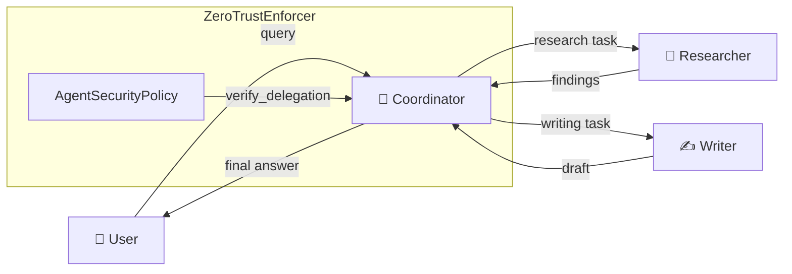

# Delegation & Swarm Orchestration

Agentomatic supports advanced **agent-to-agent (A2A) communication** patterns
out of the box, allowing agents to hand off tasks to one another or collaborate
in dynamic swarms.

## What Is Delegation?

Delegation is the mechanism by which one agent transfers control—or a
sub-task—to another agent that is better suited for the job. Unlike a fixed
pipeline where the execution order is predefined, delegation is **dynamic**:
the calling agent decides *at runtime* which peer to invoke based on the
current conversation context.

Agentomatic provides two complementary delegation primitives:

| Primitive | Class | Purpose |
|-----------|-------|---------|
| **Handoff tools** | `create_agent_handoff` / `AgentDelegator` | Give an agent LangChain-compatible tools that route queries to other agents. |
| **Swarm orchestration** | `SwarmOrchestrator` | Coordinate multiple agents as a cohesive unit with configurable patterns. |

## When to Use Delegation vs. Pipelines

| Criterion | Delegation | Pipeline |
|-----------|-----------|----------|
| **Routing logic** | Dynamic — agent chooses at runtime | Static — defined at graph construction |
| **Best for** | Open-ended user queries, triage/routing | Deterministic multi-step workflows |
| **Error handling** | Per-handoff retry & failover | Graph-level error edges |
| **Coupling** | Loose — agents are independent | Tight — steps share state |

!!! tip "Rule of thumb"
    Use **delegation** when the *model* should pick the next agent. Use a
    **pipeline** (e.g. a LangGraph `StateGraph`) when *you* know the execution
    order at design time.

## Configuring `delegation_targets` in the Manifest

Every agent declares which peers it may delegate to through the
`delegation_targets` field of its `AgentManifest`:

```python
from agentomatic.core.manifest import AgentManifest

manifest = AgentManifest(
    name="coordinator",
    slug="my-platform-coordinator",
    description="Routes user queries to specialist agents",
    delegation_targets=["researcher", "writer"],  # (1)!
)
```

1. Only the agents listed here can be called via handoff tools. The
   `ZeroTrustEnforcer` will block any other delegation attempt.

!!! warning "Empty list = no delegation"
    If `delegation_targets` is left empty (the default), the agent is **not
    allowed** to delegate to any other agent. This is enforced by
    `AgentSecurityPolicy.allowed_delegation_targets`.

## Complete Example

The following example wires up a **coordinator** agent that delegates queries
to a **researcher** (for factual lookups) and a **writer** (for content
generation).

```python
from __future__ import annotations

from langchain_openai import ChatOpenAI
from langgraph.prebuilt import create_react_agent

from agentomatic.delegation import AgentDelegator

# 1. Create the delegator
delegator = AgentDelegator(use_swarm=True)

# 2. Build handoff tools for the two specialist agents
handoff_tools = delegator.create_handoffs(
    targets=["researcher", "writer"],
    descriptions={
        "researcher": "Delegate factual research questions",
        "writer": "Delegate content writing or summarisation tasks",
    },
)

# 3. Combine with any other tools the coordinator needs
coordinator_tools = [*handoff_tools]

# 4. Create the coordinator agent
model = ChatOpenAI(model="gpt-4o", temperature=0)
coordinator = create_react_agent(model, coordinator_tools)

# 5. Invoke
result = await coordinator.ainvoke(
    {"messages": [{"role": "user", "content": "Write a blog post about LLM agents"}]}
)
```

## Handoff Tools

The `create_agent_handoff` factory creates a single handoff tool. It
follows a **resolution order** to pick the most capable transport:

=== "Swarm (in-process)"

    When `langgraph-swarm` is installed and `use_swarm=True` (default), the
    tool uses `create_handoff_tool` from `langgraph_swarm` for zero-latency
    in-process delegation:

    ```python
    from agentomatic.delegation import create_agent_handoff

    tool = create_agent_handoff(
        "researcher",
        description="Delegate research questions",
        use_swarm=True,  # default
    )
    ```

=== "HTTP (cross-process)"

    When `langgraph-swarm` is not installed—or when `use_swarm=False`—the
    tool falls back to an HTTP POST to the platform REST API:

    ```python
    from agentomatic.delegation import create_agent_handoff

    tool = create_agent_handoff(
        "researcher",
        description="Delegate research questions",
        platform_url="http://localhost:8000",
        use_swarm=False,
    )
    # Calls POST /api/v1/researcher/invoke with {"query": "..."}
    ```

    The HTTP call uses a **60-second timeout** via `httpx`.

!!! note "Graceful degradation"
    If neither `langgraph-swarm` nor `langchain_core` is installed, the factory
    returns a plain Python callable so your agent still functions—just without
    framework-level tool metadata.

## `AgentDelegator`

For agents that delegate to multiple peers, `AgentDelegator` provides a
convenience method that creates handoff tools in batch:

```python
from agentomatic.delegation import AgentDelegator

delegator = AgentDelegator(platform_url="http://localhost:8000", use_swarm=True)
tools = delegator.create_handoffs(
    targets=["support_agent", "billing_agent", "tech_agent"],
    descriptions={
        "support_agent": "General customer support queries",
        "billing_agent": "Payment and invoice questions",
        "tech_agent": "Technical troubleshooting",
    },
)
```

## Swarm Orchestration

The `SwarmOrchestrator` manages a group of agents that collaborate to solve a
complex problem.

```python
from agentomatic.delegation import SwarmOrchestrator

orchestrator = SwarmOrchestrator()

orchestrator.register_agent("researcher", researcher_graph)
orchestrator.register_agent("writer", writer_graph)
orchestrator.register_agent("reviewer", reviewer_graph)

swarm = orchestrator.create_swarm(pattern="handoff")
result = await swarm.ainvoke(
    {"messages": [{"role": "user", "content": "Research LLM trends and draft a report"}]}
)
```

### Orchestration Patterns

| Pattern | Status | Description |
|---------|--------|-------------|
| `handoff` | :white_check_mark: Stable | Uses `langgraph-swarm` for agent-to-agent handoffs. Requires `pip install langgraph-swarm`. |
| `supervisor` | :construction: Planned | A central supervisor node dispatches to the appropriate agent. |
| `round_robin` | :construction: Planned | Cycles through agents in registration order. |

!!! warning "Supervisor & round-robin patterns"
    The `supervisor` and `round_robin` patterns return a placeholder that
    raises `NotImplementedError` when invoked. Use the `handoff` pattern for
    production workloads, or implement a custom `StateGraph` with supervisor
    routing.

## Security Policies for Delegation

Agentomatic enforces delegation rules through the **Zero-Trust Enforcer**.
Every delegation attempt is checked against the source agent's
`AgentSecurityPolicy`:

```python
from agentomatic.security import AgentSecurityPolicy, ZeroTrustEnforcer

policy = AgentSecurityPolicy(
    allowed_delegation_targets=["researcher", "writer"],
)

enforcer = ZeroTrustEnforcer()
enforcer.register_policy("coordinator", policy)

# Check programmatically
ok, reason = enforcer.verify_delegation("coordinator", "researcher")  # ✅
ok, reason = enforcer.verify_delegation("coordinator", "db_agent")    # ❌
```

All delegation checks produce **structured audit logs** via `loguru`:

```
security.audit | event=delegation_allowed agent=coordinator context={'target': 'researcher'}
security.audit | event=delegation_denied  agent=coordinator context={'target': 'db_agent'}
```

## Delegation Flow



## Troubleshooting

??? question "My handoff tool is using HTTP instead of in-process swarm calls"
    The factory falls back to HTTP when `langgraph-swarm` is not installed.
    Install it with:

    ```bash
    pip install langgraph-swarm
    ```

    Then verify `use_swarm=True` (the default) in your `create_agent_handoff`
    or `AgentDelegator` call.

??? question "I get `delegation_denied` in the audit logs"
    The `ZeroTrustEnforcer` is blocking the delegation because the source
    agent's `AgentSecurityPolicy.allowed_delegation_targets` does not include
    the target agent name. Add the target to the list or update the policy.

??? question "`ValueError: Agent 'x' is already registered` in the SwarmOrchestrator"
    Agent names must be unique within a single `SwarmOrchestrator`. If you
    need to replace an agent, call `orchestrator.unregister_agent("x")` first,
    then re-register with the new graph.

## Related Documentation

| Topic | Page |
|-------|------|
| Agent manifest reference | [Agent Structure](agent-structure.md) |
| Security & Zero Trust | [Security](security.md) |
| LLM providers & failovers | [LLM Providers](llm-providers.md) |
| Getting started tutorial | [Quick Start](../getting-started/quickstart.md) |
