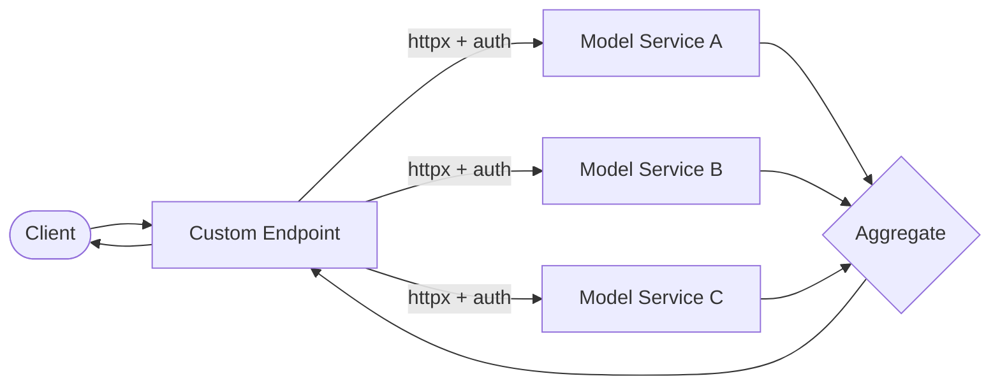

# Custom Endpoints

Custom endpoints are a first-class building block in Agentomatic — right
alongside agents, plugins, and pipelines. An **endpoint** is a user-defined
HTTP API that typically calls one or more **deployed model services** (or any
HTTP API) via authenticated `httpx` requests, aggregates their outputs, and
exposes the result as a clean REST route.

They are designed for the common production need: *"call my deployed models
(with auth), combine the results, and feed them into an agent or pipeline"* —
with minimal code.

Endpoints give you:

- Auto-discovery from the `endpoints/` directory
- Auto-generated `/{path}`, `/health`, and `/info` routes
- Strict Pydantic request/response validation
- Built-in authentication to upstreams (API key, bearer, basic, OAuth2)
- Fan-out to multiple upstreams with aggregation strategies
- Retries, timeouts, and Prometheus metrics out of the box
- Direct use as a [pipeline step](pipelines.md)

## How it works



1. Place each endpoint in the `endpoints/` directory (its own folder or module).
2. Subclass `BaseEndpoint`, declare `upstreams`, and pick an `aggregation`.
3. The platform discovers it and mounts routes under
   `/api/v1/endpoints/{endpoint_name}`.

## Scaffolding an endpoint

```bash
agentomatic init ensemble --template endpoint --dir endpoints
```

This creates:

```text
endpoints/ensemble/
├── __init__.py       # Package marker
├── endpoint.py       # BaseEndpoint subclass with upstreams
├── .env.example      # Upstream URLs + credentials
└── README.md         # Usage docs
```

## Minimal example

The default `handle` fans out to every configured upstream — so you often only
need configuration, no imperative code:

```python
from agentomatic.endpoints import (
    AggregationStrategy,
    AuthType,
    BaseEndpoint,
    UpstreamAuthConfig,
    UpstreamConfig,
)


class EnsembleEndpoint(BaseEndpoint):
    endpoint_name = "ensemble"
    endpoint_description = "Aggregate predictions from deployed models."
    path = "/predict"
    aggregation = AggregationStrategy.MAJORITY

    upstreams = [
        UpstreamConfig(
            name="model_a",
            base_url="${MODEL_A_URL}",
            path="/v1/predict",
            auth=UpstreamAuthConfig(type=AuthType.BEARER, api_key="${MODEL_A_TOKEN}"),
        ),
        UpstreamConfig(
            name="model_b",
            base_url="${MODEL_B_URL}",
            path="/v1/predict",
            auth=UpstreamAuthConfig(
                type=AuthType.OAUTH2_CLIENT_CREDENTIALS,
                token_url="${MODEL_B_TOKEN_URL}",
                client_id="${MODEL_B_CLIENT_ID}",
                client_secret="${MODEL_B_CLIENT_SECRET}",
            ),
        ),
    ]
```

Mounted routes:

- `POST /api/v1/endpoints/ensemble/predict` — invoke the endpoint
- `GET  /api/v1/endpoints/ensemble/health` — readiness
- `GET  /api/v1/endpoints/ensemble/info` — metadata
- `GET  /api/v1/endpoints` — list all endpoints

!!! tip "Secrets stay out of code"
    Any string field supports `${ENV}` interpolation, resolved lazily at
    request time and never persisted or logged.

## Authentication to upstreams

Each upstream configures its own `auth`, so different models can authenticate
differently.

=== "API key"
    ```python
    UpstreamAuthConfig(
        type=AuthType.API_KEY,
        api_key="${SERVICE_KEY}",
        header_name="X-API-Key",
        header_prefix="",  # no prefix
    )
    ```

=== "Bearer"
    ```python
    UpstreamAuthConfig(type=AuthType.BEARER, api_key="${SERVICE_TOKEN}")
    ```

=== "Basic"
    ```python
    UpstreamAuthConfig(
        type=AuthType.BASIC,
        username="${SERVICE_USER}",
        password="${SERVICE_PASSWORD}",
    )
    ```

=== "OAuth2 (client credentials)"
    ```python
    UpstreamAuthConfig(
        type=AuthType.OAUTH2_CLIENT_CREDENTIALS,
        token_url="${TOKEN_URL}",
        client_id="${CLIENT_ID}",
        client_secret="${CLIENT_SECRET}",
        scope="predict:read",       # optional
        audience="${AUDIENCE}",     # optional
    )
    ```
    The access token is fetched from `token_url` and cached until shortly
    before expiry (controlled by `token_leeway`).

## Aggregation strategies

When an endpoint calls multiple upstreams, `aggregation` controls how their
responses combine:

| Strategy | Behaviour |
| -------- | --------- |
| `ALL` | Return a mapping of `{upstream_name: data}`; succeeds only if all succeed. |
| `FIRST_SUCCESS` | Return the first successful response. |
| `MAJORITY` | Return the most common response (weighted by `UpstreamConfig.weight`). |

## Typed schemas

Provide typed request/response schemas via generics for full OpenAPI docs:

```python
from pydantic import BaseModel
from agentomatic.endpoints import BaseEndpoint


class ScoreRequest(BaseModel):
    text: str


class ScoreResponse(BaseModel):
    label: str
    confidence: float


class ScorerEndpoint(BaseEndpoint[ScoreRequest, ScoreResponse]):
    endpoint_name = "scorer"
    path = "/score"

    async def handle(self, request: ScoreRequest) -> ScoreResponse:
        ok, aggregated, results = await self.models.fan_out(request.model_dump())
        return ScoreResponse(label=aggregated["label"], confidence=aggregated["score"])
```

## Custom logic

Override `handle` for anything beyond fan-out — call upstreams conditionally,
post-process, merge with local computation, etc. The `self.models` client
exposes `fan_out(...)` and per-upstream `get(name).request(...)`.

## Using endpoints in pipelines

Endpoints are usable as a pipeline step, so you can fetch data from your
deployed models and pass it straight to an agent:

```yaml
name: enrich_then_answer
steps:
  - endpoint: ensemble
    name: predictions
    input:
      payload: $.input.*
  - agent: answerer
    name: answer
    input:
      current_query: $.input.query
      predictions: $.steps.predictions.aggregated
```

See the [Pipelines guide](pipelines.md) for the full step reference.

## Registering programmatically

You can also register endpoints without discovery:

```python
from agentomatic import AgentPlatform

platform = AgentPlatform(endpoints_dir="endpoints")
platform.register_endpoint(EnsembleEndpoint())
app = platform.build()
```

## Observability

Every endpoint call emits Prometheus metrics
(`agentomatic_endpoint_calls_total`, `agentomatic_endpoint_duration_seconds`),
and every upstream call emits `agentomatic_upstream_*` metrics. See the
[Observability guide](observability.md) for the ready-to-run Grafana stack.
