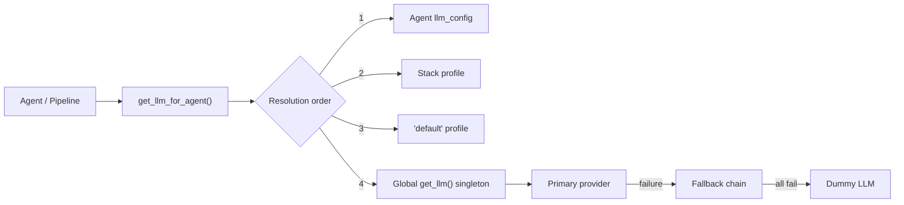
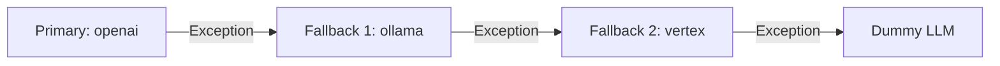

# LLM Providers & Failovers

Agentomatic abstracts LLM access behind a **provider layer** that handles
instantiation, caching, failover chains, retry logic, and structured output
binding. You never construct LangChain chat-model objects directly — instead
you call one of the `get_llm*` helpers and let the framework manage the rest.



---

## Supported Providers

| Provider Key   | LangChain Class      | Package                       | Streaming | Status    |
|----------------|----------------------|-------------------------------|-----------|-----------|
| `ollama`       | `ChatOllama`         | `langchain-ollama`            | ✅        | Stable    |
| `openai`       | `ChatOpenAI`         | `langchain-openai`            | ✅        | Stable    |
| `azure`        | `AzureChatOpenAI`    | `langchain-openai`            | ✅        | Stable    |
| `vertex`       | `ChatVertexAI`       | `langchain-google-vertexai`   | ✅        | Stable    |
| `google_genai` | —                    | `langchain-google-genai`      | ✅        | Planned   |
| `dummy`        | `FakeListChatModel`  | `langchain-core`              | ❌        | Testing   |

!!! note "Google GenAI"
    The `google_genai` provider key is accepted by the stack manager
    configuration but is not yet wired into the low-level `_build_llm`
    factory.  Use `vertex` for production Google model access today.

---

## Provider Setup

=== "OpenAI"

    ```bash
    # Required environment variables
    export OPENAI_API_KEY="sk-..."
    ```

    ```python
    from agentomatic.providers import get_llm

    llm = get_llm(
        provider="openai",
        model="gpt-4",          # or "gpt-4o", "gpt-4o-mini", etc.
        temperature=0.3,
        api_key="sk-...",       # falls back to OPENAI_API_KEY env var
    )
    ```

    **Model name format:** OpenAI model slugs — `gpt-4`, `gpt-4o`,
    `gpt-4o-mini`, `gpt-3.5-turbo`.

=== "Ollama"

    ```bash
    # Start the Ollama server (default: http://localhost:11434)
    ollama serve
    ollama pull llama3
    ```

    ```python
    from agentomatic.providers import get_llm

    llm = get_llm(
        provider="ollama",
        model="llama3",
        base_url="http://localhost:11434",   # default
        temperature=0.7,
    )
    ```

    **Model name format:** Ollama model tags — `llama3`, `mistral`,
    `codellama:13b`, `phi3:medium`.

=== "Azure OpenAI"

    ```bash
    # Required environment variables
    export AZURE_OPENAI_API_KEY="..."
    export AZURE_OPENAI_ENDPOINT="https://<resource>.openai.azure.com/"
    ```

    ```python
    from agentomatic.providers import get_llm

    llm = get_llm(
        provider="azure",
        api_key="...",
        azure_endpoint="https://<resource>.openai.azure.com/",
        azure_deployment="gpt-4o",
        api_version="2024-02-15-preview",   # default
        temperature=0.2,
    )
    ```

    **Model name format:** Your Azure *deployment name*, not the
    underlying OpenAI model id.

=== "Google Vertex AI"

    ```bash
    # Authenticate with Google Cloud
    gcloud auth application-default login
    ```

    ```python
    from agentomatic.providers import get_llm

    llm = get_llm(
        provider="vertex",
        model_name="gemini-1.5-pro",
        project="my-gcp-project",
        location="us-central1",       # default
        temperature=0.4,
    )
    ```

    **Model name format:** Vertex AI model ids — `gemini-1.5-pro`,
    `gemini-1.5-flash`, `gemini-2.0-flash`.

---

## Environment Variables

| Variable                    | Provider   | Description                         |
|-----------------------------|------------|-------------------------------------|
| `OPENAI_API_KEY`            | `openai`   | OpenAI API key                      |
| `AZURE_OPENAI_API_KEY`      | `azure`    | Azure OpenAI resource key           |
| `AZURE_OPENAI_ENDPOINT`     | `azure`    | Azure resource endpoint URL         |
| `GOOGLE_CLOUD_PROJECT`      | `vertex`   | GCP project id                      |
| `GOOGLE_APPLICATION_CREDENTIALS` | `vertex` | Path to service-account JSON   |

---

## Failover Chain Configuration

`get_llm` accepts a `fallbacks` list so you can build an automatic failover
chain. If the primary provider fails, LangChain transparently routes to the
next provider in the list.

```python
from agentomatic.providers import get_llm

llm = get_llm(
    provider="openai",
    model="gpt-4o",
    fallbacks=["ollama", "vertex"],   # tried in order on failure
    temperature=0.3,
)
```

Under the hood Agentomatic calls LangChain's
`.with_fallbacks(fallback_models, exceptions_to_handle=(Exception,))`,
catching **all** exceptions so that transient errors, rate-limits, and
network issues all trigger a failover.

!!! warning "Last-resort dummy"
    If the primary provider **and** every fallback fail to build, the
    framework silently falls back to a `FakeListChatModel` (dummy) so that
    your process never crashes at import time. Check logs for
    `record_failover` warnings in production.



---

## Retry & Timeout Settings

For transient failures *within* a single provider, use `invoke_with_retry`
which wraps `llm.ainvoke` with **exponential back-off**:

```python
from agentomatic.providers import get_llm, invoke_with_retry

llm = get_llm(provider="openai", model="gpt-4o")

response = await invoke_with_retry(
    llm,
    messages=[{"role": "user", "content": "Hello!"}],
    max_retries=3,       # default
    retry_delay=1.0,     # base delay in seconds (default)
)
```

The delay doubles after each attempt: `delay × 2^attempt`.

| Attempt | Wait before retry |
|---------|-------------------|
| 0       | 1.0 s             |
| 1       | 2.0 s             |
| 2       | 4.0 s             |

!!! tip "Failover vs. Retry"
    **Retry** re-attempts the *same* provider (good for transient 429 / 503
    errors). **Failover** switches to a *different* provider (good for
    persistent outages). Combine both for maximum resilience.

---

## Named LLM Instances

`get_named_llm` lets you maintain multiple cached LLM instances under
human-readable names — for example a *fast* model for routing and a
*powerful* model for complex reasoning:

```python
from agentomatic.providers import get_named_llm

fast  = get_named_llm("fast",  provider="openai", model="gpt-4o-mini", temperature=0.1)
judge = get_named_llm("judge", provider="openai", model="gpt-4o",      temperature=0.0)
```

Subsequent calls with the same `name` return the **cached** instance
(thread-safe). Call `reset_llm()` to clear all named instances.

---

## Agent-Specific LLMs

`get_llm_for_agent` resolves the LLM for a particular agent using a strict
priority order:

```python
from agentomatic.providers import get_llm_for_agent

llm = get_llm_for_agent(
    agent_name="planner",
    role="default",           # or "judge", "fast", etc.
    stack_manager=manager,    # optional StackManager instance
)
```

**Resolution order:**

1. **Agent's own `llm_config`** — defined in the agent manifest.
2. **Stack profile** — the named profile matching `role` in the active stack.
3. **`"default"` profile** — the stack's default profile.
4. **Global singleton** — `get_llm()` with default settings.

!!! note
    This layered resolution means you can override LLM settings at any
    granularity — per-agent, per-stack, or globally — without touching
    other agents' configuration.

---

## Structured Output

`get_structured_llm` binds a Pydantic model to the LLM so every response is
automatically parsed and validated:

```python
from pydantic import BaseModel
from agentomatic.providers import get_structured_llm


class SentimentResult(BaseModel):
    label: str
    score: float


llm = get_structured_llm(
    response_model=SentimentResult,
    provider="openai",
    model="gpt-4o-mini",
)

result = await llm.ainvoke("Analyze: 'I love this product!'")
# result -> SentimentResult(label="positive", score=0.97)
```

!!! tip "Fallback wrapper"
    If the underlying provider does not support native structured output,
    Agentomatic transparently wraps it with a
    `StructuredOutputFallbackWrapper` that prompts the model for JSON and
    parses the response against your Pydantic schema.

---

## Custom LLM Injection

Every `get_llm*` function accepts an `instance=` keyword argument so
you can **bypass the factory** and inject a pre-built LLM directly.
This is the recommended approach for custom models, fine-tuned endpoints,
or any LLM that doesn't fit the built-in provider system.

### Inject a Global Custom LLM

The simplest way is `set_llm()` — it stores your model as the global
singleton used by all agents, pipelines, and the platform:

```python
from agentomatic.providers import set_llm, get_llm

# Any object with ainvoke/invoke works (LangChain models, etc.)
from langchain_openai import ChatOpenAI

set_llm(ChatOpenAI(model="gpt-4o", temperature=0.2))

# Now every get_llm() call returns your custom model
llm = get_llm()  # → your ChatOpenAI instance
```

Or equivalently via `get_llm(instance=...)`:

```python
from agentomatic.providers import get_llm

llm = get_llm(instance=ChatOpenAI(model="gpt-4o"))
```

### Named Custom Instances

Use `get_named_llm(instance=...)` for per-role models:

```python
from agentomatic.providers import get_named_llm

get_named_llm("judge", instance=my_judge_model)
get_named_llm("fast",  instance=my_fast_model)

# Later lookups return the cached instance
judge = get_named_llm("judge")  # → my_judge_model
```

### Structured Output with Custom LLMs

```python
from agentomatic.providers import get_structured_llm

structured = get_structured_llm(
    SentimentResult,
    instance=my_custom_llm,   # bypasses the factory
)
```

### Async / Sync Callables

Any async or sync callable matching `(prompt, *, system_prompt=None) → str`
works everywhere:

```python
from agentomatic.providers import set_llm

# Async callable
async def my_llm(prompt: str, *, system_prompt: str | None = None) -> str:
    return await my_inference_api(prompt, system=system_prompt)

set_llm(my_llm)

# Sync callable (run in executor automatically)
def my_sync_llm(prompt: str, *, system_prompt: str | None = None) -> str:
    return requests.post("https://my-api/v1/chat", json={"prompt": prompt}).text

set_llm(my_sync_llm)
```

### LLMSpec — Custom Models in the Optimize Pipeline

The `optimize` module (prompt optimizers, metrics, synthesizers) uses the
`LLMSpec` type — a union of `str | LLMCallable` — so you can pass
custom callables to **every** optimization component:

```python
from agentomatic.optimize import (
    LLMSpec,
    LLMCallable,
    call_llm,
    call_llm_json,
    PromptOptimizer,
    PromptFitter,
)

# Custom callable
async def my_eval_llm(prompt: str, *, system_prompt: str | None = None) -> str:
    return await my_api.complete(prompt, system=system_prompt)

# Use in optimizer
optimizer = PromptOptimizer(
    agent="my_agent",
    llm=my_eval_llm,         # Custom callable ✓
    rewrite_llm="openai/gpt-4o",  # String spec ✓
)

# Use directly
text = await call_llm(my_eval_llm, "Hello")
data = await call_llm_json(my_eval_llm, "Return {\"ok\": true}")
```

!!! important "Graceful degradation"
    If your callable raises an exception, `call_llm()` catches it and
    returns an empty string `""` with a warning log — matching the
    resilience behavior of the string-model path. Your optimisation
    pipeline will never crash due to a transient LLM failure.

---

## Embedding Providers

Embeddings follow the same singleton pattern via `get_embeddings`:

```python
from agentomatic.providers.embeddings import get_embeddings, reset_embeddings

embeddings = get_embeddings(provider="ollama", model="nomic-embed-text")
vectors = embeddings.embed_documents(["Hello world", "Goodbye world"])
```

| Provider Key | Class                        | Notes                        |
|-------------|------------------------------|------------------------------|
| `ollama`    | `OllamaEmbeddings`           | Requires running Ollama      |
| *(other)*   | `DeterministicFakeEmbedding`  | Deterministic dummy vectors  |

Call `reset_embeddings()` to clear the cached instance.

---

## Streaming Support

All LangChain providers support token-level streaming via `astream_events`.
Agentomatic exposes this through an **SSE (Server-Sent Events)** endpoint:

```
POST /invoke/stream
Content-Type: application/json

{"input": "Explain quantum computing", "config": {"provider": "openai"}}
```

Enable streaming in your settings:

```python
# settings.yaml
platform:
  enable_streaming: true
```

!!! note
    The `dummy` provider does **not** support streaming. Use a real
    provider when testing streaming behaviour.

---

## Failover Telemetry

Agentomatic tracks every failover event so you can monitor provider
reliability in production:

```python
from agentomatic.providers import (
    get_failover_count,
    record_failover,
    reset_llm,
)

# Manually record a failover (usually called internally)
record_failover(
    primary="openai",
    fallback="ollama",
    error="RateLimitError: 429",
)

# Query cumulative failover count
count = get_failover_count()   # -> int

# Reset everything (instances + telemetry)
reset_llm()
```

Each `record_failover` call emits a **loguru warning** with the primary
provider, the fallback that took over, and the error message — making it
easy to set up alerts in your logging pipeline.

---

## Troubleshooting

??? question "API key not found — `AuthenticationError`"
    Verify the environment variable is set in the shell where your process
    runs. Common mistakes:

    - Setting the variable in `.bashrc` but running the process in a
      different shell (e.g. a VS Code terminal that sources `.zshrc`).
    - Passing `api_key` as a kwarg with a typo.
    - Using `OPENAI_API_KEY` when the provider is `azure` (needs
      `AZURE_OPENAI_API_KEY`).

    ```bash
    echo $OPENAI_API_KEY   # should print your key
    ```

??? question "Model not available — `NotFoundError`"
    Each provider uses a different model naming scheme:

    - **OpenAI**: `gpt-4o`, not `gpt4o` or `gpt-4-o`.
    - **Azure**: Use your *deployment name*, not the OpenAI model id.
    - **Ollama**: Run `ollama list` to see locally pulled models.
    - **Vertex**: Ensure the model is enabled in your GCP project.

??? question "Timeout errors — `TimeoutError` / `ReadTimeout`"
    - Increase `max_retries` and `retry_delay` in `invoke_with_retry`.
    - For Ollama, ensure the server is running (`ollama serve`) and the
      model is fully loaded (first invocation can take 30 s+).
    - For cloud providers, check your network / proxy configuration.

??? question "Rate limited — `429 Too Many Requests`"
    - `invoke_with_retry` handles transient 429s automatically via
      exponential back-off.
    - For sustained rate-limiting, add a cheaper provider as a fallback:
      ```python
      llm = get_llm(provider="openai", model="gpt-4o", fallbacks=["ollama"])
      ```
    - Consider using `get_named_llm` to route high-volume, low-stakes
      calls to a faster / cheaper model.

---

## Related Documentation

| Topic                        | Page                                              |
|------------------------------|----------------------------------------------------|
| Agent Manifest & Config      | [Agent Structure](agent-structure.md)              |
| Stack Manager                | [Stacks & Profiles](stacks.md)                     |
| Prompt Engineering           | [Prompt Management](prompts.md)                    |
| Platform Settings            | [Configuration](configuration.md)                  |
| API Reference — Providers    | [API Reference](../architecture/api-reference.md)  |
