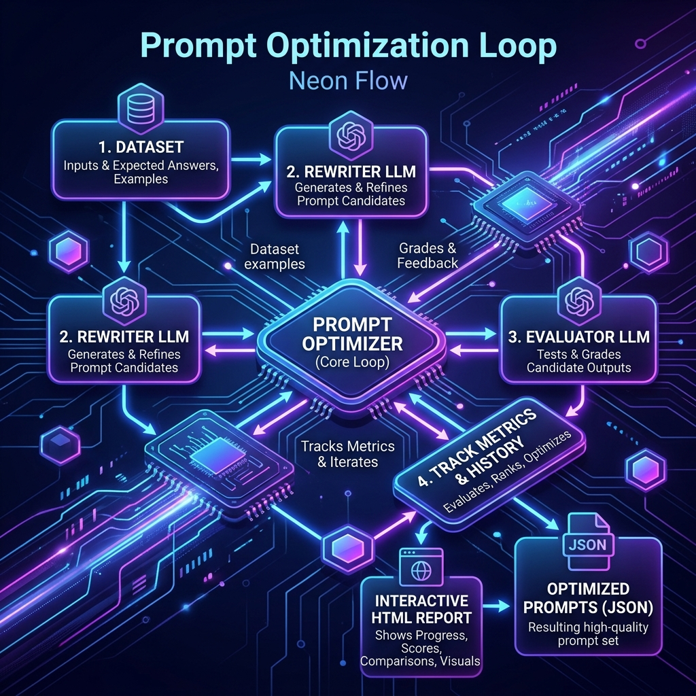

# Prompt Optimization

Prompt engineering is often a manual, fragile trial-and-error process. Agentomatic solves this by providing a built-in **Prompt Optimization Engine** that acts like `model.fit()` but for your agent prompts.

Inspired by Stanford's [DSPy](https://github.com/stanfordnlp/dspy), the framework allows you to evaluate agent performance over a dataset, automatically generate prompt candidates using a powerful rewriter model, score them using evaluation metrics, and export the best-performing prompt version back into your `prompts.json` file.

---

## 🏗️ The Optimization Flow

The optimization loop coordinates datasets, rewriter LLMs, evaluator LLMs, and scoring metrics to iteratively improve prompt versions:



---

## ⚡ Quick Start — `train_and_report` / `evaluate_and_report`

The recommended public API for class agents is a **thin script** that delegates
stack load, metrics, augmentation, PromptFitter, evaluate, and HolySheet HTML
reports to `agentomatic.optimize`. Scaffolded agents ship with matching
`agents/<name>/train.py` and `agents/<name>/eval.py`
(`agentomatic init … --template class`).

### Train (fit prompts)

```python
from pathlib import Path

from agentomatic.optimize import TrainConfig, print_train_result, train_and_report
from agentomatic.providers import apply_stack_defaults, get_llm_for_agent
from agentomatic.stacks.manager import StackManager

from agents.assistant.agent import AssistantAgent

ROOT = Path(".")  # project root
stacks = StackManager(ROOT / "stacks")
stacks.load("gemini")
apply_stack_defaults(stacks)

agent = AssistantAgent(llm=get_llm_for_agent("assistant", stack_manager=stacks))
result = train_and_report(
    agent,
    config=TrainConfig(
        agent_name="assistant",
        agent_dir=ROOT / "agents" / "assistant",
        stacks_dir=ROOT / "stacks",
        env_path=ROOT / ".env",
        stack="gemini",
        epochs=2,
        max_trials=12,
        patience=2,
        optimizer="rewrite",  # rewrite | gepa_like | mipro_like | few_shot_bootstrap | param_search
        required_keys=["content", "next_action"],
        judge_criteria=(
            "Evaluate pertinence, groundedness, and actionability. "
            "Score each dimension 0–1 with clear motivation."
        ),
        judge_dimensions=["pertinence", "groundedness", "actionability"],
        augment=True,          # LLM-expand seed JSONL before fit
        n_examples=40,         # alias: nr_examples; default 3× seed when omitted
        persist=True,          # write datasets/all.augmented.jsonl
        apply=False,           # set True to persist best prompt when improved
        apply_as="v2_fit",
        persist_fit_store=False,  # True → also audit to DATABASE_URL / FIT_STORE_URL
        min_absolute_improvement=0.001,
    ),
)
print_train_result(result)          # or result.print_summary()
print(result.report_path)           # HolySheet HTML under agents/.../reports/
```

```bash
# Scaffolded train.py (same knobs as CLI flags)
AGENTOMATIC_STACK=gemini uv run python agents/assistant/train.py \
  --augment --n-examples 40 --persist --optimizer rewrite --epochs 2 --trials 12
# Persist improved prompt + optional DB retrain audit:
#   ... --apply --apply-as v2_fit --persist-fit-store
```

### Evaluate (score a split)

```python
from agentomatic.optimize import EvalConfig, evaluate_and_report

result = evaluate_and_report(
    agent,
    config=EvalConfig(
        agent_name="assistant",
        agent_dir=ROOT / "agents" / "assistant",
        stacks_dir=ROOT / "stacks",
        env_path=ROOT / ".env",
        stack="gemini",
        split="test",              # test | validation | train | eval | all
        prefer_augmented=True,     # reuse datasets/all.augmented.jsonl when present
        required_keys=["content", "next_action"],
        judge_dimensions=["pertinence", "groundedness", "actionability"],
        use_judge=True,
    ),
)
print(result.scores, result.report_path)
```

```bash
AGENTOMATIC_STACK=gemini uv run python agents/assistant/eval.py \
  --split test --prefer-augmented --limit 3
```

### Knob reference

| Knob | Where | Purpose |
|---|---|---|
| `optimizer` | `TrainConfig` / `--optimizer` | Fitter strategy: `rewrite`, `gepa_like`, `mipro_like`, `few_shot_bootstrap`, `param_search` |
| `epochs` / `max_trials` / `patience` | train | Outer Keras epochs, inner trial budget, EarlyStopping on `val_loss` |
| `augment` / `n_examples` / `persist` | train (eval rare) | LLM-augment seed data, target size, write `all.augmented.jsonl` |
| `apply` / `apply_as` | train | Persist best prompt to `prompts.json` when improved (guards refuse zero/overfit) |
| `min_absolute_improvement` | train | Acceptance threshold for candidates (default `0.001`) |
| `required_keys` + `judge_*` | train & eval | Structured schema metrics + LLM-as-judge criteria/dimensions |
| `split` / `prefer_augmented` / `limit` | eval | Which examples to score; reuse augmented dataset |
| HolySheet reports | automatic | Nested `Section`/`Tabs`/`Accordion` dashboards (score curves, prompts, judge rationales); fallback HTML if HolySheet absent |
| `persist_fit_store` / `fit_store_url` | train | Audit retrain runs via `OptimizationRunStore` → `AGENTOMATIC_FIT_STORE_URL` / `DATABASE_URL` |
| `logs_history` / `allow_logsllm_analysis` | platform | Persist sync invoke I/O for agents/plugins/pipelines/ingestion/endpoints + optional LLM log analysis (`AGENTOMATIC_LOGS_HISTORY`, `AGENTOMATIC_ALLOW_LOGSLLM_ANALYSIS`); REST `GET /api/v1/logs?resource=&name=` (+ `/analyze`). Async tasks and per-plugin `/logs` routes are not covered — see [Platform Features](platform-features.md#invocation-log-history-llm-analysis) |

!!! tip "Nested projects (e.g. SCOOPER `ai_platform/`)"
    When the agent package lives one level under a monorepo (`.env` beside the
    parent folder), set `env_path=ROOT.parent / ".env"` — the scaffolded
    templates default to `ROOT / ".env"` for flat `agentomatic new` projects.

### CLI alternative

```bash
agentomatic optimize my_agent \
  --dataset eval.jsonl \
  --metrics exact_match,contains \
  --strategy iterative_rewrite \
  --max-iterations 10 \
  --apply
```

### Lower-level `PromptOptimizer` (optional)

```python
from agentomatic.optimize import PromptOptimizer, Dataset

optimizer = PromptOptimizer(
    agent="my_agent",
    metrics=["exact_match", "contains"],
    strategy="iterative_rewrite",
)
dataset = Dataset.from_jsonl("eval.jsonl")
result = await optimizer.optimize(dataset=dataset, max_iterations=10, target_score=0.9)
print(result.report())
result.apply()
```

---

## 🧠 Optimization Strategies

Agentomatic supports **6 optimization strategies** suited for different task formats and complexities:

| Strategy Name | CLI / String ID | How It Works | Best Used For |
|---|---|---|---|
| **Iterative Rewrite** | `iterative_rewrite` | Evaluates prompts, feeds errors/scores to a powerful rewriter LLM, and refines instructions iteratively. | General instruction-following and system prompt refinement. |
| **Few-Shot Bootstrap** | `few_shot_bootstrap` | Runs the agent over the dataset, collects high-scoring successful traces, and bootstraps them into the prompt as examples. | Complex logic requiring demonstration of correct formatting/reasoning. |
| **Chain of Thought** | `chain_of_thought` | Rewrites the prompt to enforce step-by-step reasoning instructions and generates visual scratchpad examples. | Multi-step reasoning and mathematical/logical problems. |
| **MIPRO** | `mipro` | Bayesian-based prompt optimizer. Jointly optimizes both the instruction strings and few-shot examples using search space trials. | High-complexity pipelines where both instructions and examples matter. |
| **Bootstrap Random Search** | `bootstrap_randomsearch` | Bootstraps multiple few-shot example sets and runs a random search to find the optimal examples for the prompt. | Large datasets where handpicking examples is impossible. |
| **Ensemble** | `ensemble` | Evaluates and compiles multiple high-performing prompt variants into a weighted ensemble prompt. | Robust prompt engineering requiring high generalization. |

---

## 📊 Evaluation Metrics

Agentomatic supports standard matches, LLM judges, and full **DeepEval** validation suites.

### 1. Text Matching Metrics
- **Exact Match** (`exact_match`): Verifies if the agent response matches the expected answer exactly.
- **Contains** (`contains`): Verifies if the agent response contains a set of defined target keywords.

### 2. LLM-as-a-Judge Metrics
- **LLM Judge** (`llm_judge`): Asks an evaluator LLM to grade the response on a scale of 0 to 1 based on custom criteria instructions.
- **G-Eval** (`g_eval`): Uses the G-Eval framework protocol to evaluate complex criteria (e.g. coherence, readability) with detailed scoring rubrics.

### 3. DeepEval Metrics (`deepeval`)
Requires `pip install agentomatic[optimize]`. Integrates directly with the Confident AI DeepEval framework:
- **Answer Relevancy** (`answer_relevancy`): Measures how relevant the agent response is to the user query.
- **Faithfulness** (`faithfulness`): Evaluates Hallucination by comparing the agent response to retrieved context.
- **Context Recall** (`context_recall`): Measures whether the RAG retriever fetched all the required context.

### 4. Custom Metrics (Python)
You can define any custom Python function returning a score between `0.0` (worst) and `1.0` (best):

```python
from agentomatic.optimize import CustomMetric

def check_word_count(response: str, expected: str, **kwargs) -> float:
    # Reward responses under 100 words
    words = len(response.split())
    return 1.0 if words < 100 else 0.0

metric = CustomMetric(name="short_answers", scorer=check_word_count)

optimizer = PromptOptimizer(
    agent="my_agent",
    metrics=[metric],
    strategy="iterative_rewrite",
)
```

---

## 🗄️ Loading Datasets

The `Dataset` loader accepts JSONL, CSV, or raw Python dictionaries:

=== "JSONL"
    ```jsonl
    {"query": "What is the capital of France?", "expected_answer": "Paris"}
    {"query": "What is the capital of Spain?", "expected_answer": "Madrid", "context": ["Europe wiki"]}
    ```
    ```python
    dataset = Dataset.from_jsonl("qa.jsonl")
    ```

=== "CSV"
    ```csv
    query,expected_answer
    What is the capital of France?,Paris
    What is the capital of Spain?,Madrid
    ```
    ```python
    dataset = Dataset.from_csv("qa.csv")
    ```

=== "Python"
    ```python
    dataset = Dataset.from_list([
        {"query": "Q1", "expected_answer": "A1"},
        {"query": "Q2", "expected_answer": "A2", "context": ["context_doc"]},
    ])
    ```

---

## 🧪 Synthetic Data Generation

If you don't have a dataset, Agentomatic's `DataSynthesizer` can auto-generate high-quality evaluation sets from a textual description or from raw text files (e.g. employee handbooks, text documentation):

```python
from agentomatic.optimize import DataSynthesizer

synth = DataSynthesizer(model="ollama/llama3:8b")

# Generate 50 test cases covering specific categories
dataset = await synth.generate(
    description="Customer support assistant answering questions about orders and returns",
    n_samples=50,
    categories=["returns", "shipping", "refunds"],
)

# Save to disk
dataset.to_jsonl("synthetic_eval.jsonl")
```

To generate directly from local text files or markdown files:

```python
from agentomatic.optimize import generate_from_docs

dataset = await generate_from_docs(
    docs_path="docs/handbook.txt",
    model="ollama/llama3:8b",
    n_samples=30,
)
```

---

## 🧠 PromptFitter: learnings, generalization, apply guards

`PromptFitter.fit()` now keeps an auditable **epoch learning trail** and an
always-on **generalization safety net** so prompt rewrites improve without
overfitting to the evaluation examples.

### What is recorded each epoch

- Prompt snapshot (system prompt at end of the round)
- Score + per-dimension scores
- What worked / what failed (from eval + judge motivation)
- Next-focus guidance for the following rewrite
- Optional holdout score and train/holdout gap

Access via `result.prompt_history` (list of dicts) and the Keras-style
`result.history` score curve. Artefacts are written under
`.optimize/<agent>/fit_result_*.json` plus append-only
`retrain_history.jsonl`.

### Generalization safety net

When no explicit `testset` is provided, the fitter auto-splits a holdout
slice from the validation set. Candidates that beat val but overfit the
holdout (`fit − holdout > max_generalization_gap`, default `0.15`) are
**rejected**.

```python
fitter = PromptFitter(
    agent="assistant",
    max_generalization_gap=0.15,
    holdout_fraction=0.2,
    sequential=True,       # default: concurrency=1 (local-SLM safe)
    drain_seconds=1.5,     # cool-down after the async loop
)
result = await fitter.fit(train, val, metric, testset=test)
print(result.summary())    # includes holdout, gap, score curve
```

### apply() refuses zero-improvement

```python
# Refuses when absolute_improvement <= 0 or generalization gap is too large
written = result.apply(version="v2_fit", agent_dir="agents/assistant")
if written is None:
    print("Kept baseline — no safe improvement")

# Override only when you intentionally want to write anyway
result.apply(version="v2_fit", agent_dir="agents/assistant", force=True)
```

Judge metrics (`LocalJudgeMetric`) default to `temperature=0.0` for stable
scoring and return extensive `motivation` / `what_worked` / `what_failed` /
`improvement_hints` so rewriters have real signal across epochs.

---

## 🛡️ Red Teaming (Adversarial Testing)

Run red-team evaluations to test your agents against adversarial inputs, prompt injections, and toxic prompts:

```python
from agentomatic.optimize import red_team, RedTeamMetric

# Generate 20 adversarial prompts targeting prompt injection and jailbreaks
adversarial_dataset = await red_team(
    agent_name="my_agent",
    categories=["prompt_injection", "pii_leakage", "toxicity"],
    n_samples=20,
)

# Optimize system instructions to resist these vulnerabilities
optimizer = PromptOptimizer(
    agent="my_agent",
    metrics=[RedTeamMetric(vulnerability="prompt_injection")],
    strategy="iterative_rewrite",
)

result = await optimizer.optimize(dataset=adversarial_dataset, max_iterations=5)
result.apply()
```

---

## 🔭 Observability & Callbacks

To give you a perfect understanding of what is happening during a multi-hour optimization run, Agentomatic uses a rich event system (`CallbackManager`) embedded into `PromptFitter` and `PromptOptimizationLoop`.

### 1. Terminal Progress (Rich)

By default, optimization runs use a `RichProgressCallback` if `rich` is installed. It provides:
- A live progress bar for overall rounds and step-level evaluations.
- Real-time score trends using a block sparkline (e.g. `📈 ▁▂▃▅▇`).
- Metrics on candidates evaluated, failures found, and score deltas.

If `rich` is not available, it gracefully degrades to a log-based `LogProgressCallback`.

### 2. TUI Dashboard (Textual)

For maximum observability, you can spin up an interactive terminal dashboard. If you have `textual` installed, pass `dashboard=True` to the `PromptFitter`.

```python
from agentomatic.optimize import PromptFitter

fitter = PromptFitter(
    agent="my_agent",
    dataset=dataset,
    contract=eval_contract,
    metrics=my_metrics,
    dashboard=True  # Opens the Textual TUI
)

result = await fitter.fit()
```

The TUI provides:
- Live metrics and per-dimension scores
- A candidate evaluation table
- Event logging pane
- Real-time performance chart

### 3. Custom Callbacks

You can hook into the event stream directly without subclassing any optimizers. Implement the `OptimizationCallback` protocol and pass your callbacks to the `PromptFitter` or `PromptOptimizationLoop`.

```python
from agentomatic.optimize.events import OptimizationCallback, OptimizationEvent, EventData

class MyNotifier(OptimizationCallback):
    async def on_event(self, event: OptimizationEvent, data: EventData) -> None:
        if event == OptimizationEvent.RUN_COMPLETE:
            send_slack_message(f"Optimization finished. Best score: {data.best_score}")

fitter = PromptFitter(..., callbacks=[MyNotifier()])
```

## 📊 Interactive HTML Reports (HolySheet)

`train_and_report` and `evaluate_and_report` write interactive HTML dashboards
via **HolySheet** when installed (`pip install holysheet` / `agentomatic[optimize]`).
Content is nested under `Section` / `Tabs` / `Accordion` children so cards render
correctly — empty top-level sections are avoided.

**Fit reports** (`generate_fit_report` / `TrainResult.report_path`) include:

- Score / loss curves and Keras-style epoch history
- Trial table, early-stop reason, dataset sizes, optimizer
- Prompt evolution diffs + full baseline/best prompts
- Judge motivations / what-worked / what-failed
- Deployment recommendation

**Eval reports** (`generate_eval_report` / `EvaluateResult.report_path`) include:

- Aggregate scores and per-example tables
- Judge rationale panels (when `OptimizeMetricAdapter.last_result` is available)
- Split / stack / model metadata

When HolySheet is absent, a built-in static HTML fallback is written instead.

```python
from agentomatic.optimize import generate_fit_report, generate_eval_report, generate_html_report

generate_fit_report(fit_result, output_path="reports/train_assistant.html")
generate_eval_report(eval_report, output_path="reports/eval_assistant.html")
# Lower-level PromptOptimizer loop:
generate_html_report(result, filepath="reports/my_agent_optimization.html")
```

---

## 🔧 Prompt Fitting (Deployment-First Optimization)

### Overview

Traditional prompt engineering is manual and ad-hoc: you tweak words, run a few tests, and hope
for the best. **Prompt Fitting** replaces that with a principled, ML-like workflow where every
change is evaluated against a scored dataset and the result is a *better deployment configuration*
— not a compiled program.

The core API mirrors scikit-learn:

```python
fitter = PromptFitter(agent="scope_agent", ...)
result = await fitter.fit(trainset, valset, metric)
```

**What the fitter produces:**

- A better system prompt (rewritten, restructured, with stronger guardrails)
- Optimized model parameters (temperature, top_p, penalties)
- Curated few-shot examples (bootstrapped from high-scoring traces)
- Tuned RAG parameters (top_k, rerank strategy)
- A `DeploymentRecommendation` with rollout strategy and confidence level

> **Key insight:** Your agent is already deployed and serving traffic. Optimization does not
> produce a new artifact — it produces a *better version* of the existing deployment. Every
> result includes canary weights, confidence scores, and failure diagnostics so you can ship
> changes safely.

---

### EvalContract — Structural Quality Gate

Before optimizing, define what a valid agent response *must* look like. The `EvalContract`
enforces structural constraints and can be used as a metric or as judge criteria:

```python
from agentomatic.optimize import EvalContract

contract = EvalContract(
    name="scoping_response",
    input_fields=["query", "context"],
    output_format="json",
    required_output_fields=["answer", "confidence", "risks", "next_questions"],
    constraints=["confidence must be between 0.0 and 1.0"],
)

# Structural validation — returns a score between 0.0 and 1.0
score = contract.validate(response_text)

# Detailed validation — field-by-field breakdown
details = contract.validate_details(response_text)
# details.missing_fields   → ["next_questions"]
# details.constraint_violations → ["confidence was 1.5, expected 0.0-1.0"]
# details.score            → 0.75

# Use as a weighted metric inside CompositeMetric
metric = contract.as_metric(weight=0.10)

# Use as judge criteria for LLM-based evaluation
criteria = contract.as_judge_criteria()
```

The contract acts as a lightweight schema enforcer. When used inside `CompositeMetric`, it
ensures that optimization never sacrifices structural correctness for content quality.

---

### Metrics: CompositeMetric and Friends

Agentomatic ships several metric types that compose into a single scoring function.

#### Metric Types

| Metric | Description |
|---|---|
| `LocalJudgeMetric(criteria)` | Asks a local LLM judge to score the response on a named criterion (e.g. "completeness", "business_relevance"). Returns 0.0–1.0. |
| `DeterministicMetric(fn)` | Wraps a pure Python function `fn(response, expected) → float`. No LLM calls — fast and reproducible. |
| `LatencyMetric()` | Measures agent response latency in seconds. Normalized to 0.0–1.0 (lower latency = higher score). |
| `CostMetric()` | Estimates token cost per response. Normalized to 0.0–1.0 (lower cost = higher score). |
| `WeightedMetric(name, metric, weight)` | Wraps any metric with a scalar weight. **Negative weights** penalize the dimension (useful for cost/latency). |

#### CompositeMetric — Multi-Dimensional Scoring

Combine quality judges with negative-weight cost/latency penalties so the optimizer balances
accuracy against operational cost:

```python
from agentomatic.optimize import (
    CompositeMetric,
    WeightedMetric,
    LocalJudgeMetric,
    DeterministicMetric,
    LatencyMetric,
    CostMetric,
)

metric = CompositeMetric(metrics=[
    # Quality dimensions — positive weights
    WeightedMetric("completeness",   LocalJudgeMetric("completeness"),      weight=0.30),
    WeightedMetric("relevance",      LocalJudgeMetric("business_relevance"),weight=0.25),
    WeightedMetric("risk_detection", LocalJudgeMetric("risk_detection"),    weight=0.20),
    WeightedMetric("format",         contract.as_metric(),                  weight=0.10),

    # Operational dimensions — negative weights (penalties)
    WeightedMetric("latency",        LatencyMetric(),                       weight=-0.10),
    WeightedMetric("cost",           CostMetric(),                          weight=-0.05),
])
```

The composite score is calculated as:

```
score = Σ (weight_i × metric_i)
```

Negative weights on `LatencyMetric` and `CostMetric` mean that slower or more expensive
candidates are penalized, steering the fitter toward cost-effective configurations without
sacrificing quality.

You can also use `DeterministicMetric` for fast, reproducible checks:

```python
def check_json_parseable(response: str, expected: str, **kwargs) -> float:
    try:
        json.loads(response)
        return 1.0
    except json.JSONDecodeError:
        return 0.0

metric = DeterministicMetric(fn=check_json_parseable)
```

---

### PromptSearchSpace — Full Configuration Surface

The search space defines what the fitter is allowed to change. Every axis can be toggled
independently:

```python
from agentomatic.optimize import PromptSearchSpace

space = PromptSearchSpace(
    # Prompt optimization
    optimize_system_prompt=True,     # rewrite system instructions
    optimize_few_shot=True,          # select/bootstrap few-shot examples

    # Model selection
    optimize_model_choice=True,      # try different models
    model_choices=["ollama/qwen2.5:7b", "openai/gpt-4.1"],
    fallback_models=["openai/gpt-4.1-mini"],

    # Model parameters
    optimize_model_params=True,
    model_param_space={
        "temperature": [0.0, 0.1, 0.2, 0.4, 0.7],
        "top_p": [0.7, 0.9, 1.0],
    },

    # RAG parameters
    optimize_rag_params=True,
    rag_param_space={
        "top_k": [3, 5, 8, 12],
        "rerank": [True, False],
    },
)
```

| Parameter | Type | Description |
|---|---|---|
| `optimize_system_prompt` | `bool` | Allow the fitter to rewrite system instructions |
| `optimize_few_shot` | `bool` | Allow bootstrapping/selection of few-shot examples |
| `optimize_model_choice` | `bool` | Try different models from `model_choices` |
| `model_choices` | `list[str]` | Candidate models to evaluate |
| `fallback_models` | `list[str]` | Models to fall back to if primary fails |
| `optimize_model_params` | `bool` | Search over `model_param_space` values |
| `model_param_space` | `dict` | Grid of parameter values to search |
| `optimize_rag_params` | `bool` | Tune RAG retrieval settings |
| `rag_param_space` | `dict` | Grid of RAG parameter values |

---

### The 5 Fitter Optimizers

Agentomatic includes five optimizer strategies, each suited to different optimization
scenarios:

| Strategy | CLI ID | How It Works | Best For |
|---|---|---|---|
| **RewriteOptimizer** | `rewrite` | Analyzes failure clusters, generates a diagnostic summary, and asks the rewriter LLM to produce an improved system prompt. Iterates until improvement stalls. | General prompt improvement; fixing instruction ambiguities and missing guardrails. |
| **FewShotBootstrapOptimizer** | `few_shot_bootstrap` | Runs the agent on the training set, scores every trace, selects the top examples using Score²-weighted sampling with diversity scoring, and injects them as few-shot demonstrations. | Tasks where showing the right examples matters more than instruction tuning. |
| **MIPROLikeOptimizer** | `mipro_like` | Generates multiple instruction variants from different perspectives (clarity, brevity, domain expertise), creates few-shot example sets, and performs a cross-product search over all combinations. | Complex pipelines where both instructions and examples interact. |
| **GEPALikeOptimizer** | `gepa_like` | Uses evaluation feedback to identify specific weaknesses, applies targeted mutations to the relevant prompt sections, and validates each mutation against the failure cases. Most sample-efficient strategy. | Iterative refinement when you have a decent baseline and want targeted improvements. |
| **ParamSearchOptimizer** | `param_search` | Performs a structured grid search over model parameters (temperature, top_p), RAG settings (top_k, rerank), and tool policies. Evaluates each configuration on a minibatch for speed. | Finding the optimal operating point for model/RAG/tool configuration. |

You can combine strategies by running multiple fit passes:

```python
# First pass: optimize the prompt
fitter_prompt = PromptFitter(agent="scope_agent", optimizer="gepa_like", ...)
result1 = await fitter_prompt.fit(trainset, valset, metric)
result1.apply(version="v2_prompt")

# Second pass: optimize parameters with the new prompt
fitter_params = PromptFitter(agent="scope_agent", optimizer="param_search", ...)
result2 = await fitter_params.fit(trainset, valset, metric)
result2.apply(version="v2_full")
```

---

### PromptFitter — Full API

The `PromptFitter` is the main entry point for all optimization:

```python
from agentomatic.optimize import PromptFitter

fitter = PromptFitter(
    agent="scope_agent",                    # agent name from agents.json
    task_model="ollama/qwen2.5:7b",         # model used for agent execution
    rewrite_model="openai/gpt-4.1",         # model used for prompt rewriting
    optimizer="gepa_like",                  # optimization strategy
    search_space=space,                     # PromptSearchSpace config
    max_trials=30,                          # maximum optimization trials
    min_absolute_improvement=0.05,          # stop if gain < 5%
    concurrency=5,                          # parallel evaluation workers
)

result = await fitter.fit(
    trainset,                               # training examples (for few-shot)
    valset,                                 # validation set (for scoring)
    metric,                                 # CompositeMetric instance
    testset=testset,                        # optional held-out test set
)
```

**Local-mode — no HTTP server required:**

Pass `local_agent` to bypass the HTTP runner and call your agent in-process.
Also pass `llm_base_url` / `llm_api_key` to route the optimizer's LLM calls to
a local OpenAI-compatible server (omlx, Ollama, vLLM, LM Studio):

```python
fitter = PromptFitter(
    agent="scope_agent",
    task_model="openai/my-local-model",
    local_agent=agent_instance,             # bypasses HTTP — calls transform() directly
    llm_base_url="http://127.0.0.1:8000/v1",  # routes openai/ specs to local server
    llm_api_key="local-key",               # arbitrary for local servers
    optimizer="rewrite",                  # full briefing + multi-pass
    rewrite_passes=None,                  # None = auto (3 SLM / 2 frontier LLM)
    multipass=True,
    slm_multipass=True,
    llm_multipass=True,
    max_trials=8,
)
result = await fitter.fit(trainset, valset, metric)
print(result.summary())
print(result.history)   # list[float] — per-round best scores
result.apply(version="v2_fit")
```

!!! tip "Multi-pass rewrite (SLM + LLM)"
    Every rewrite / GEPA / MIPRO call receives a **full briefing**: system
    prompt, model / RAG / tool params, search space, dataset samples, metrics,
    history, and per-example input / expected / actual / scores / judge
    feedback.

    Auto multi-pass (when `rewrite_passes=None` and `multipass=True`):

    | Rewrite model | Default passes | Loop |
    |---|---|---|
    | SLM / local (`omlx/`, `ollama/`, `7b`…) | **3** | draft → critique → revise |
    | Frontier LLM (`openai/`, `anthropic/`…) | **2** | draft → self-check revise |

    Prompt wording and briefing size adapt to the model class. Override with
    `rewrite_passes=1` (single shot), `rewrite_passes=5` (extra rounds), or
    disable with `multipass=False` / `llm_multipass=False` / `slm_multipass=False`.

```python
# Frontier rewrite model — draft + self-check by default
fitter = PromptFitter(
    agent="scope_agent",
    task_model="openai/gpt-4.1-mini",
    rewrite_model="openai/gpt-4.1",
    optimizer="rewrite",
    llm_multipass=True,          # default
    llm_default_passes=2,        # draft → revise
)

# Force a deeper LLM critique loop
fitter = PromptFitter(
    agent="scope_agent",
    rewrite_model="anthropic/claude-sonnet-4",
    optimizer="rewrite",
    rewrite_passes=3,            # draft → critique → revise
)
```

!!! tip "OpenAI cloud vs local OpenAI-compatible"
    Optimize model specs:

    | Spec | Routes to | Credentials |
    |---|---|---|
    | `openai/gpt-4o-mini` | OpenAI cloud (`api.openai.com`) | `OPENAI_API_KEY=sk-…` |
    | `omlx/Qwen3.5-9B-…` | Local oMLX / OpenAI-compatible | `OMLX_BASE_URL` + `OMLX_API_KEY` |
    | `openai/local-model` + `llm_base_url=` | Explicit local server | `llm_api_key` / configure |

    A local `OPENAI_BASE_URL=http://127.0.0.1:8000/v1` (common when developing
    with oMLX) is **ignored** for first-party cloud ids (`gpt-*`, `o1`/`o3`/`o4`)
    unless you pass an explicit `llm_base_url` / `LLMCaller.configure(...)`.
    That way `openai/gpt-4o-mini` keeps working even with a local base URL in
    your shell.

```python
# Cloud OpenAI rewrite (needs OPENAI_API_KEY=sk-…)
fitter = PromptFitter(
    agent="assistant",
    task_model="openai/gpt-4o-mini",
    rewrite_model="openai/gpt-4o-mini",
    optimizer="rewrite",
    local_agent=agent,
    # do NOT set llm_base_url — hits api.openai.com
)
```

| Parameter | Type | Default | Description |
|---|---|---|---|
| `agent` | `str` | — | Agent name as defined in `agents.json` |
| `task_model` | `str` | — | Model used for running the agent during evaluation |
| `rewrite_model` | `str` | — | Model used by the optimizer for prompt rewriting |
| `optimizer` | `str` | `"rewrite"` | Strategy: `rewrite`, `few_shot_bootstrap`, `mipro_like`, `gepa_like`, `param_search` |
| `search_space` | `PromptSearchSpace` | — | Configuration surface to search |
| `max_trials` | `int` | `20` | Maximum number of candidate evaluations |
| `min_absolute_improvement` | `float` | `0.02` | Early stop if best improvement is below this threshold |
| `concurrency` | `int` | `3` | Number of parallel evaluation workers |
| `local_agent` | `Any \| None` | `None` | Live agent instance — bypasses HTTP runner entirely |
| `rewrite_passes` | `int \| None` | `None` | Multi-pass refine count (`None` = auto by model class) |
| `multipass` | `bool` | `True` | Master switch for auto multi-pass refine |
| `slm_multipass` | `bool` | `True` | Auto multi-pass when rewrite model looks like an SLM |
| `llm_multipass` | `bool` | `True` | Auto multi-pass for frontier / cloud rewrite LLMs |
| `slm_default_passes` | `int` | `3` | Passes used when SLM auto-detect fires |
| `llm_default_passes` | `int` | `2` | Passes used when LLM auto-detect fires |
| `llm_base_url` | `str \| None` | `None` | Base URL for the optimizer's OpenAI-compatible LLM server |
| `llm_api_key` | `str \| None` | `None` | API key for the optimizer LLM server |

---

### Local-mode Training: `compile → fit → evaluate`

The `PromptFitterBridge` (used via `BaseGraphAgent.compile()` + `fit()`) runs the
full optimization loop **without a running agentomatic HTTP server**.  All you need
is a local OpenAI-compatible LLM server (omlx, Ollama, LM Studio, vLLM).

**Architecture:**

```
your script
  └─ agent.compile(dataset, metrics, optimizer=PromptFitterBridge(...))
       └─ agent.fit(dataset)
            └─ PromptFitterBridge.optimize(agent, dataset, metrics)
                 └─ PromptFitter.fit(trainset, valset, metric)
                      ├─ AgentRunner._run_local()   ← calls agent.transform() in-process
                      └─ LLMCaller._call_openai()   ← routed to http://127.0.0.1:8000/v1
```

**Key concepts:**

| Class | Role | Import path |
|---|---|---|
| `agents.WeightedMetric` | Composite loss — has `.score()` | `agentomatic.agents` |
| `OptimizeMetricAdapter` | Bridge async `optimize.BaseMetric` → sync `.score()` | `agentomatic.agents` |
| `MetricLoss` | Wraps any `Metric` as a training loss | `agentomatic.agents` |
| `PromptFitterBridge` | Drives `PromptFitter` from `fit()` | `agentomatic.agents` |
| `LocalJudgeMetric` | LLM-as-judge over a local server | `agentomatic.optimize` |
| `CustomMetric` | Function-based fitter objective | `agentomatic.optimize` |
| `PromptSearchSpace` | Defines what the fitter can change | `agentomatic.optimize` |

!!! tip "Prefer `train_and_report` for day-to-day fitting"
    The example below wires `PromptFitterBridge` manually. For project scripts,
    use `train_and_report` / `TrainConfig` in the Quick Start section above —
    same stack/metrics/HolySheet path with far less boilerplate.

**Complete example — stack-driven, no env-var hacks, no HTTP server:**

```python
import json, os
from pathlib import Path

from agentomatic.agents import (
    AgentDataset, CallableMetric, EarlyStopping, ExactKeyMatchMetric,
    MetricLoss, OptimizeMetricAdapter, PromptFitterBridge, WeightedMetric,
)
from agentomatic.config.settings import load_environment
from agentomatic.optimize import (
    CustomMetric, LocalJudgeMetric, PromptSearchSpace, generate_fit_report,
)
from agentomatic.providers import apply_stack_defaults, get_llm_for_agent
from agentomatic.stacks.manager import StackManager

from agents.my_agent.agent import MyAgent   # your BaseGraphAgent subclass

# ── 0. Stack ─────────────────────────────────────────────────────────────────
load_environment(Path(".env"))
stacks = StackManager(Path("stacks"))
stacks.load("local")
apply_stack_defaults(stacks)
entry = stacks.get_llm_config("default")
model = f"{entry.provider}/{entry.model}"  # e.g. "openai/LFM2.5-8B-A1B-MLX-4bit"

# ── 1. Data ───────────────────────────────────────────────────────────────────
dataset = AgentDataset.from_jsonl("agents/my_agent/datasets/all.jsonl",
                                   name="my_agent")
print(f"train={len(dataset.train)} val={len(dataset.validation)}")

# ── 2. Agent ──────────────────────────────────────────────────────────────────
llm   = get_llm_for_agent("my_agent", role="default", stack_manager=stacks)
agent = MyAgent(llm=llm)

# ── 3. Metrics ────────────────────────────────────────────────────────────────
# LLM-as-judge: OptimizeMetricAdapter bridges async .evaluate() → sync .score()
judge   = LocalJudgeMetric(
    model=model,
    criteria="Is the response relevant, grounded, and actionable?",
    dimensions=["relevance", "groundedness", "actionability"],
)
judge_m   = OptimizeMetricAdapter(judge, name="judge")
key_m     = ExactKeyMatchMetric(["content", "next_action"])
json_m    = CallableMetric("json_valid",
                lambda ex, pred: 1.0 if isinstance(pred, dict) and pred else 0.0)

metrics = [judge_m, key_m, json_m]

# agents.WeightedMetric has .score() → compatible with MetricLoss
loss_metric = WeightedMetric(
    [("judge", judge_m, 0.40), ("key_match", key_m, 0.35), ("json", json_m, 0.25)],
    name="composite_loss",
)

# ── 4. Fitter objective (used by PromptFitter internally) ────────────────────
def composite_fn(query, response, expected=None, context=None):
    """Score for the fitter's candidate ranking (query/response strings)."""
    try:
        pred = json.loads(response) if response else {}
    except (json.JSONDecodeError, TypeError):
        pred = {}
    key_score = sum(1 for k in ["content", "next_action"] if k in pred) / 2
    return key_score

# ── 5. Search space ──────────────────────────────────────────────────────────
space = PromptSearchSpace(
    optimize_system_prompt=True,
    optimize_few_shot=True,
    optimize_model_params=True,
    model_param_space={
        "temperature": [0.0, 0.1, 0.2, 0.4],
        "top_p":       [0.9, 1.0],
    },
)

# ── 6. PromptFitterBridge ────────────────────────────────────────────────────
fitter = PromptFitterBridge(
    agent_name="my_agent",
    task_model=model,
    rewrite_model=model,
    # local_agent is wired automatically from the live agent in optimize()
    llm_base_url=entry.base_url,     # routes openai/ specs → local server
    llm_api_key=entry.api_key or "local",
    max_trials=8,
    metric=CustomMetric(fn=composite_fn, name="composite"),
    base_prompt_version="v1",
    search_space=space,
    optimizer="gepa_like",
    min_absolute_improvement=0.02,
    concurrency=2,
    experiment_dir="reports/.fit",
    auto_report=True,
)

# ── 7. compile → fit → evaluate ──────────────────────────────────────────────
agent.compile(dataset, metrics=metrics, optimizer=fitter,
              loss=MetricLoss(loss_metric))

history = agent.fit(
    dataset,
    epochs=1,
    validation_data=dataset.validation,
    callbacks=[EarlyStopping(monitor="val_loss", patience=1, mode="min")],
    max_trials=8,
    search_space=space,
    optimize_mode="gepa_like",
    optimize_prompt=True,
    optimize_params=True,
    verbose=1,
)

print(f"History: {history.history}")
print(f"Status:  {getattr(agent, '_last_optimize_status', '')!r}")

report = agent.evaluate(dataset.test or dataset.validation, metrics)
print(f"Scores:  {report.scores}")

# ── 8. Report + apply ────────────────────────────────────────────────────────
fit_result = getattr(agent, "_last_fit_result", None)
if fit_result:
    print(fit_result.summary())
    print(f"Score history: {fit_result.history}")   # list[float]
    generate_fit_report(fit_result, output_path="reports/fit.html")
    # Persist the best prompt (set to True when satisfied):
    # fit_result.apply(version="v2_fit", agent_dir="agents/my_agent")
```

!!! tip "Metric roles explained"
    - **`agents.WeightedMetric` + `MetricLoss`** — drives the training loss that `fit()` minimises. Must use `agents.WeightedMetric` because it implements `score(example, prediction)`.
    - **`OptimizeMetricAdapter`** — wraps any `optimize.BaseMetric` (e.g. `LocalJudgeMetric`) so it satisfies the `Metric` protocol expected by `agents.WeightedMetric`.
    - **`CustomMetric`** — the fitter's internal objective, evaluated as `fn(query_str, response_str, expected_str)`. Separate from the training loss; used by `PromptFitter` to rank candidates.

!!! warning "Do NOT use `optimize.CompositeMetric` directly as a MetricLoss"
    `optimize.CompositeMetric` is designed for the `PromptFitter` pipeline (it takes string query/response args). For training loss, use `agents.WeightedMetric` wrapping `OptimizeMetricAdapter`-adapted metrics.

---

### The 10-Step Fit Loop

When you call `fitter.fit()`, the following steps execute:

1. **Load baseline config** — Read the current prompt, model params, and RAG settings from `prompts.json` and `agents.json`.

2. **Evaluate baseline on validation set** — Run the agent with the current config on every validation example and score with the composite metric. This establishes the baseline score.

3. **Cluster failures** — Group low-scoring examples into failure clusters based on error patterns (e.g., "missed retrieval context", "malformed JSON output"). Each cluster includes `affected_params` and `expected_metric_gain`.

4. **Generate candidates** — The optimizer generates candidate configurations. For `rewrite`, this means new prompts. For `param_search`, this means parameter grid points. For `few_shot_bootstrap`, this means example subsets.

5. **Score candidates on minibatch** — Each candidate is evaluated on a representative minibatch (subset of validation set) for speed. Candidates are ranked by composite score.

6. **Promote top candidates** — The top-k candidates advance to full validation set evaluation. This two-stage approach reduces cost while maintaining quality.

7. **Compare in absolute improvement space** — The best candidate's score is compared against the baseline. Improvement is measured in absolute terms (e.g., 0.72 → 0.79 = +0.07 improvement).

8. **Produce param suggestions** — Based on failure cluster analysis and candidate performance, the fitter generates actionable parameter suggestions (e.g., "increase `rag.top_k` to 8").

9. **Validate on testset** — If a held-out test set was provided, the best candidate is evaluated on it to check for overfitting. A significant gap between validation and test scores triggers a warning.

10. **Build and return `PromptFitResult`** — The final result object contains the optimized configuration, metric deltas, suggestions, and deployment recommendation.

---

### PromptFitResult API

The `PromptFitResult` object returned by `fitter.fit()` provides full access to the
optimization outcome:

```python
# Optimized configuration
result.best_prompt              # str — the optimized system prompt
result.best_params              # dict — optimized model parameters
                                # e.g. {"temperature": 0.2, "top_p": 0.9}
result.best_few_shot_examples   # list[dict] — selected few-shot examples

# Evaluation metrics
result.metric_deltas            # dict — per-dimension improvement
                                # e.g. {"completeness": +0.12, "latency": -0.03}

# Per-round history
result.history                  # list[float] — best score per optimization round
                                # e.g. [0.61, 0.67, 0.73, 0.79] (Keras-style)

# Actionable output
result.suggestions              # list[str] — human-readable recommendations
result.deployment_recommendation # DeploymentRecommendation object
result.failure_clusters         # list[FailureCluster] — grouped failure patterns

# Serialization
result.summary()                # str — human-readable summary for terminal output
result.to_dict()                # dict — full serializable representation

# Apply to project
result.apply(version="v2_fit")  # writes optimized config to prompts.json
                                # under the specified version name
```

Example `summary()` output:

```
╭─────────────────────────────────────────────╮
│ PromptFitResult: scope_agent                │
├─────────────────────────────────────────────┤
│ Baseline score:  0.61                       │
│ Best score:      0.79  (+0.18)              │
│ Trials run:      24 / 30                    │
│ Strategy:        gepa_like                  │
├─────────────────────────────────────────────┤
│ Metric deltas:                              │
│   completeness:    +0.15                    │
│   relevance:       +0.08                    │
│   risk_detection:  +0.22                    │
│   format:          +0.12                    │
│   latency:         −0.03  (faster)          │
│   cost:            +0.01  (cheaper)         │
├─────────────────────────────────────────────┤
│ Deployment:  canary @ 40% (confidence: high)│
╰─────────────────────────────────────────────╯
```

---

### DeploymentRecommendation

Every `PromptFitResult` includes a `DeploymentRecommendation` calculated from the observed
improvement magnitude, metric variance, and test-set generalization:

```python
rec = result.deployment_recommendation

# Confidence level based on improvement stability
print(rec.confidence)              # "high" / "medium" / "low"

# Rollout strategy
print(rec.rollout.strategy)        # "canary"
print(rec.rollout.initial_weight)  # 0.40  (40% of traffic)
print(rec.rollout.ramp_schedule)   # ["40%@0h", "70%@24h", "100%@48h"]

# Human-readable summary
print(rec.summary())
# "Recommend canary rollout at 40% initial traffic. Confidence: high.
#  Ramp to 100% over 48 hours if error rate stays below 2%."

# Machine-readable for CI/CD integration
config = rec.to_dict()
# {
#   "confidence": "high",
#   "rollout": {
#     "strategy": "canary",
#     "initial_weight": 0.40,
#     "ramp_schedule": ["40%@0h", "70%@24h", "100%@48h"]
#   },
#   "abort_conditions": {"error_rate_above": 0.02}
# }
```

The confidence level is determined by:

| Confidence | Criteria |
|---|---|
| **High** | Improvement ≥ 0.10, low variance across validation folds, test score within 0.02 of validation score |
| **Medium** | Improvement ≥ 0.05, moderate variance, test score within 0.05 of validation |
| **Low** | Improvement < 0.05, high variance, or significant test/validation gap |

---

### Failure Clusters

During optimization, the fitter clusters validation failures into actionable groups.
Each cluster identifies the failure pattern, the parameters most likely to resolve it,
and the expected metric gain if the issue is fixed:

```
Failure cluster 1:
  Agent answered without using retrieval context.
  → Suggested fix: force context-first behavior.
  → Affected params: rag.top_k, tool_policy.force_retrieval
  → Expected metric gain: faithfulness +0.18

Failure cluster 2:
  Agent produced unstructured answers.
  → Suggested fix: stronger output format block.
  → Affected params: prompt.output_contract
  → Expected metric gain: format_compliance +0.12

Failure cluster 3:
  Agent missed secondary risks in multi-risk queries.
  → Suggested fix: add explicit "enumerate all risks" instruction.
  → Affected params: prompt.system_instructions
  → Expected metric gain: risk_detection +0.09
```

Access clusters programmatically:

```python
for cluster in result.failure_clusters:
    print(f"Pattern: {cluster.description}")
    print(f"Fix: {cluster.suggested_fix}")
    print(f"Params: {cluster.affected_params}")
    print(f"Expected gain: {cluster.expected_metric_gain}")
```

---

### End-to-End CLI Flow

The complete optimization lifecycle from deployment to promotion:

```bash
# 1. Deploy your agents
agentomatic run

# 2. Generate a synthetic evaluation dataset from your documentation
agentomatic dataset synth scope_agent \
  --from-docs docs/scoping.md \
  --n 100 \
  --out scope_eval.jsonl

# 3. Evaluate the current prompt version
agentomatic eval scope_agent \
  --dataset scope_eval.jsonl \
  --prompt-version v1

# 4. Fit a better configuration
agentomatic optimize scope_agent \
  --dataset scope_eval.jsonl \
  --optimize prompt,params,rag,tools \
  --judge ollama/qwen2.5:7b \
  --rewriter gpt-4.1 \
  --max-trials 40 \
  --apply-as v2_optimized

# 5. Canary release — send 20% of traffic to the new version
agentomatic route scope_agent --version v2_optimized --weight 20

# 6. Monitor and promote when satisfied
agentomatic promote scope_agent --version v2_optimized
```

Each command maps to a stage in the optimization lifecycle:

| Command | Stage | What It Does |
|---|---|---|
| `agentomatic run` | Deploy | Starts the agent server with current configuration |
| `agentomatic dataset synth` | Data | Generates synthetic evaluation data from docs or descriptions |
| `agentomatic eval` | Evaluate | Scores a prompt version against a dataset with metrics |
| `agentomatic optimize` | Fit | Runs the optimization loop and produces a new version |
| `agentomatic route` | Canary | Splits traffic between versions for safe rollout |
| `agentomatic promote` | Ship | Promotes a version to receive 100% of traffic |

---

### Vocabulary

To maintain consistency across documentation and code, use deployment-first terminology:

| ❌ Avoid | ✅ Use instead | Why |
|----------|----------------|-----|
| Program | Agent endpoint | Agents are deployed services, not standalone programs |
| Compile | Fit / optimize / tune | The output is a configuration, not a binary |
| Signature | EvalContract | Contracts define structural requirements, not type signatures |
| Module | Deployment component | Components are parts of a deployed system |
| Predictor | Agent version | Agents serve versioned configurations, not predictions |
| Compiled artifact | Optimized config version | The artifact is a JSON config, not compiled code |
