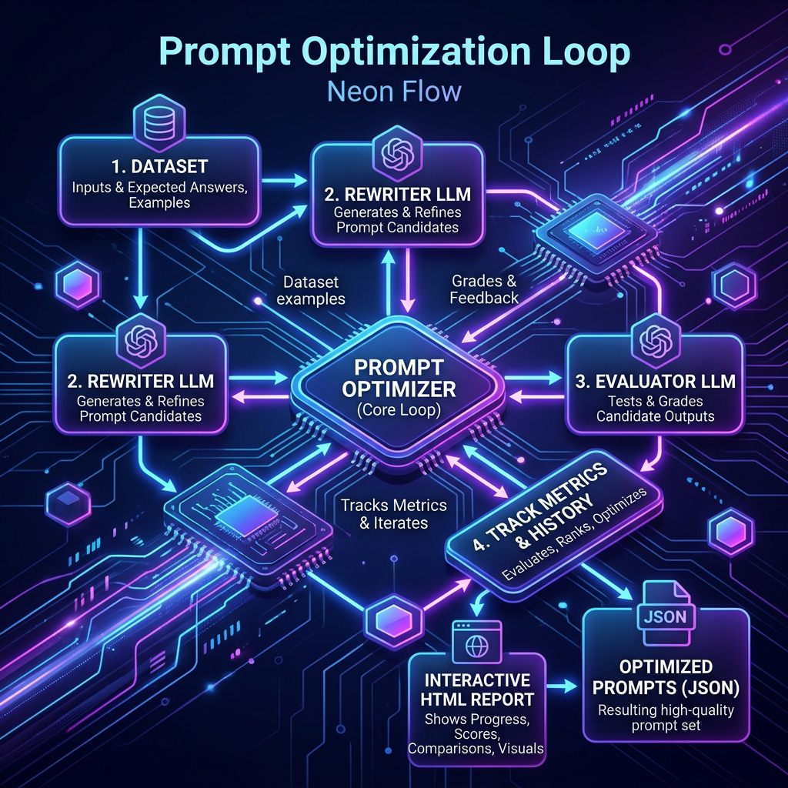

# Prompt optimization

Agentomatic evaluates an agent against a labelled dataset, searches for a
better prompt or runtime configuration, validates the candidate on held-out
examples, and only then offers to write a new prompt version. It does not
alter live traffic, route versions, or promote deployments. Treat a generated
version as a candidate: review it, run your deployment verification, then
release it through your normal delivery process.



## Choose one entry point

There are three supported entry points. They share the same dataset format but
serve different integration needs. Pick one for a run; they are alternatives,
not steps to chain together.

| Use case | Supported entry point | What it talks to |
|---|---|---|
| Optimize a deployed agent from a terminal | `agentomatic optimize` | The running Agentomatic API (`--host`) |
| Optimize an in-process agent with full control over metrics and search space | `PromptFitter` | A local agent instance or the API |
| Keep an existing integration working | `PromptOptimizer` / `--mode prompt_only` | The running Agentomatic API |

For new work, use the CLI with a fitter mode or use `PromptFitter` directly.
`PromptOptimizer` remains supported for backwards compatibility, but has a
smaller search surface.

## Before you start

Install the optimization dependencies and create a dataset with a stable,
measurable expectation for each request:

```bash
pip install "agentomatic[optimize]"
```

```jsonl
{"query":"What is the refund period?","expected_answer":"30 days"}
{"query":"How do I reset my password?","expected_answer":"reset, password"}
```

`query` is required. `expected_answer`, `context` (a list of strings), and
`metadata` are optional. Use `exact_match` when the expected answer should
match exactly; use `contains` with comma-separated required phrases when a
response can vary in wording. For generative quality, use a calibrated judge
metric and a held-out test dataset.

Start the target platform before running the API-backed paths:

```bash
agentomatic run --port 8000
```

## Recommended: CLI fitter modes

The CLI has two families. `prompt_only` is the legacy default; every other
mode uses the modern `PromptFitter` path.

```bash
# Prompt + configuration rewrite against the running agent.
agentomatic optimize support_bot \
  --dataset eval.jsonl \
  --val-dataset validation.jsonl \
  --test-dataset holdout.jsonl \
  --mode rewrite \
  --metrics contains \
  --llm omlx/Qwen3.5-9B-MLX-4bit \
  --rewrite-llm omlx/Qwen3.5-9B-MLX-4bit \
  --host http://127.0.0.1:8000 \
  --max-trials 20 \
  --apply
```

`--apply` writes a prompt version only when the result passes the fitter's
improvement and generalization guards. Omit it to inspect the report first.
The command writes reports and trial artifacts under `.optimize/` by default.

### Mode reference

| CLI mode | Fitter optimizer | Best for |
|---|---|---|
| `rewrite` | `RewriteOptimizer` | Improving system instructions from failure patterns |
| `gepa_like` | `GEPALikeOptimizer` | Targeted edits once evaluator feedback is useful |
| `mipro_like` | `MIPROLikeOptimizer` | Exploring prompt and few-shot combinations |
| `few_shot` | `FewShotBootstrapOptimizer` | Selecting strong demonstrations from labelled data |
| `param_search` | `ParamSearchOptimizer` | Searching model, RAG, or tool parameter grids |
| `apo` | `APOOptimizer` | Trace-aware critique and edit search |

`--mode` accepts exactly the values in the first column plus `prompt_only`.
The fitter API also accepts the aliases `mipro`, `gepa`, and
`few_shot_bootstrap`; prefer the CLI spellings above in new scripts.

### Parameter-only search

Use a search space to make the allowed changes explicit. This avoids an
optimization run silently tuning parameters you did not intend to change.

```yaml
# search-space.yaml
optimize_system_prompt: false
optimize_few_shot: false
optimize_model_params: true
search_method: tpe
model_param_space:
  temperature: [0.0, 0.2, 0.5]
  top_p: [0.8, 0.95]
rag_param_space:
  top_k: [3, 5, 8]
```

```bash
agentomatic optimize support_bot \
  --dataset eval.jsonl \
  --mode param_search \
  --search-space search-space.yaml \
  --search-method tpe \
  --no-optimize-prompt \
  --param temperature=0.0,0.2,0.5 \
  --max-trials 18
```

`--param` adds or replaces a model parameter grid entry. `--search-method`
accepts `grid`, `random`, or `tpe`. For `apo`, `--node-match` scopes trace
critique to matching graph-node or subagent names; `--n-runners` sets fitter
evaluation concurrency.

Run `agentomatic optimize --help` for the complete, version-specific CLI
contract. Do not use undocumented commands such as `agentomatic eval`,
`agentomatic route`, or `agentomatic promote`: they are not Agentomatic CLI
commands.

## Modern Python API: `PromptFitter`

Use `PromptFitter` when your application already owns the agent instance or
needs custom metrics, callbacks, and search spaces. The example below uses a
local agent and an oMLX-compatible endpoint for all optimizer model calls.

```python
from agentomatic.optimize import (
    Dataset,
    ExactMatchMetric,
    PromptFitter,
    PromptSearchSpace,
)

# Import and construct your project's BaseGraphAgent subclass.
from agents.support_bot.agent import SupportBotAgent

dataset = Dataset.from_list(
    [
        {"query": "What is the refund period?", "expected_answer": "30 days"},
        {"query": "How do I reset my password?", "expected_answer": "reset password"},
        {"query": "Where is my order?", "expected_answer": "tracking"},
        {"query": "Can I change an address?", "expected_answer": "before shipping"},
    ]
)
trainset, valset = dataset.split(ratio=0.75)

search_space = PromptSearchSpace(
    optimize_system_prompt=True,
    optimize_few_shot=False,
    optimize_model_params=True,
    model_param_space={"temperature": [0.0, 0.2]},
)

fitter = PromptFitter(
    agent="support_bot",
    local_agent=SupportBotAgent(),
    task_model="omlx/Qwen3.5-9B-MLX-4bit",
    rewrite_model="omlx/Qwen3.5-9B-MLX-4bit",
    llm_base_url="http://127.0.0.1:8000/v1",
    llm_api_key="local",
    optimizer="rewrite",
    search_space=search_space,
    max_trials=12,
)

result = await fitter.fit(trainset, valset, ExactMatchMetric())
print(result.summary())

# Writes prompts.json only when the acceptance and generalization checks pass.
result.apply(version="v2_fit", agent_dir="agents/support_bot")
```

Use a realistic validation set. If you do not supply `testset` to `fit`, the
fitter reserves a holdout slice automatically when possible. Pass a separate
`testset` when you have one:

```python
result = await fitter.fit(trainset, valset, ExactMatchMetric(), testset=holdout)
```

### Metrics

Metrics are async and are evaluated for each candidate. The core options are:

```python
from agentomatic.optimize import (
    CompositeMetric,
    ContainsMetric,
    ExactMatchMetric,
    LLMJudgeMetric,
)

deterministic = CompositeMetric([ExactMatchMetric(), ContainsMetric()])
judge = LLMJudgeMetric(
    criteria="The answer must be accurate, concise, and safe.",
    model="omlx/Qwen3.5-9B-MLX-4bit",
)
```

Start with deterministic metrics where a response contract permits them.
Judge metrics are useful for open-ended quality, but require a reachable model
and a rubric that is stable enough to compare candidates fairly.

### Result and apply safeguards

`PromptFitResult` records the baseline and best scores, trial history,
suggested parameter changes, failure clusters, and any holdout score:

```python
print(result.best_prompt)
print(result.best_params)
print(result.absolute_improvement)
print(result.holdout_score)
print(result.generalization_gap)
print(result.to_dict())
```

`result.apply(...)` refuses a non-improving candidate by default and can reject
a candidate with an excessive generalization gap. Review the report and use
`force=True` only when an operator has deliberately accepted that risk.

## Compatibility API: `PromptOptimizer`

`PromptOptimizer` and CLI `--mode prompt_only` remain available for existing
API-backed integrations. It supports three legacy strategies only:
`iterative_rewrite`, `few_shot`, and `chain_of_thought`.

```python
from agentomatic.optimize import Dataset, PromptOptimizer

optimizer = PromptOptimizer(
    agent="support_bot",
    metrics=["contains"],
    strategy="iterative_rewrite",
    llm="omlx/Qwen3.5-9B-MLX-4bit",
    api_base="http://127.0.0.1:8000",
)

dataset = Dataset.from_jsonl("eval.jsonl")
result = await optimizer.optimize(
    dataset=dataset,
    max_iterations=10,
    target_score=0.9,
)
print(result.report())
```

Equivalent CLI:

```bash
agentomatic optimize support_bot \
  --dataset eval.jsonl \
  --mode prompt_only \
  --strategy iterative_rewrite \
  --host http://127.0.0.1:8000
```

Do not use old names such as `mipro`, `ensemble`, or
`bootstrap_randomsearch` with `--strategy`; they are not legacy CLI strategy
values. Use the fitter modes above instead.

## Advanced extensions

These are extensions to `PromptFitter`, not additional quick-start paths.

### Callbacks and reports

Use callbacks when a long-running fit needs an operator-visible stopping or
checkpoint policy. `PromptFitter` accepts them directly:

```python
from agentomatic.optimize import EarlyStopping, ModelCheckpoint, PromptFitter

fitter = PromptFitter(
    agent="support_bot",
    optimizer="gepa_like",
    callbacks=[
        EarlyStopping(monitor="score", patience=3, min_delta=0.01),
        ModelCheckpoint(save_dir="optimization_results/support_bot"),
    ],
)
```

The fitter generates a report by default. For a serializable result from any
supported path, create a standalone HTML report with:

```python
from agentomatic.optimize import generate_html_report

report_path = generate_html_report(result, output_path="reports/support-fit.html")
```

### Synthetic seed data

`DataSynthesizer` is a Python API for creating a seed dataset; it is not an
`agentomatic dataset` CLI command. Always review generated examples and keep a
separate human-verified validation set.

```python
from agentomatic.optimize import DataSynthesizer

synthesizer = DataSynthesizer(model="omlx/Qwen3.5-9B-MLX-4bit")
dataset = await synthesizer.generate(
    description="A support assistant that explains order status and refunds.",
    n_samples=40,
    categories=["orders", "refunds"],
)
dataset.to_jsonl("seed-eval.jsonl")
```

### Scaffolded training scripts

Class-agent project templates may include `train.py` and `eval.py` helpers.
They use `TrainCliSettings`, `train_and_report`, and the same fitter
primitives described here; they are project scripts, not global
`agentomatic train` or `agentomatic eval` commands. Use the generated script's
`--help` output as its contract, and keep agent-specific metrics and schema
requirements in that project.

## Local oMLX verification

The live optimization tests exercise the actual OpenAI-compatible provider
path. Point them at a real local model rather than demo mode:

```bash
export OMLX_BASE_URL=http://127.0.0.1:8000/v1
export OMLX_API_KEY=local
export AGENTOMATIC_LIVE_MODEL=omlx/Qwen3.5-9B-MLX-4bit

uv run pytest tests/test_live_omlx_optimize.py \
  tests/test_live_omlx_keras_optimize.py \
  -q --override-ini='addopts='
```

Those tests are intentionally skipped when no reachable model endpoint is
configured. The standard test suite still verifies deterministic optimizer
logic, but a production rollout should run the live suite with a real model and
your own representative evaluation dataset.

## Production checklist

1. Keep a labelled validation set and a separate held-out test set.
2. Use a deterministic metric or a calibrated judge before trusting a score.
3. Run without `--apply` first and review the report, prompt diff, and failure
   clusters.
4. Verify the saved version in a staging deployment with the same auth,
   connections, tools, and model configuration as production.
5. Run the [deployment verifier](verifying-a-deployment.md) before promoting
   the application through your normal release process.
