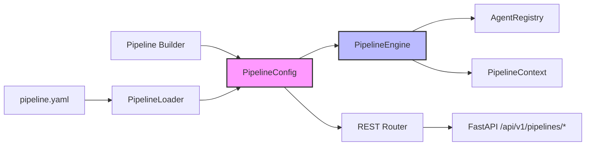
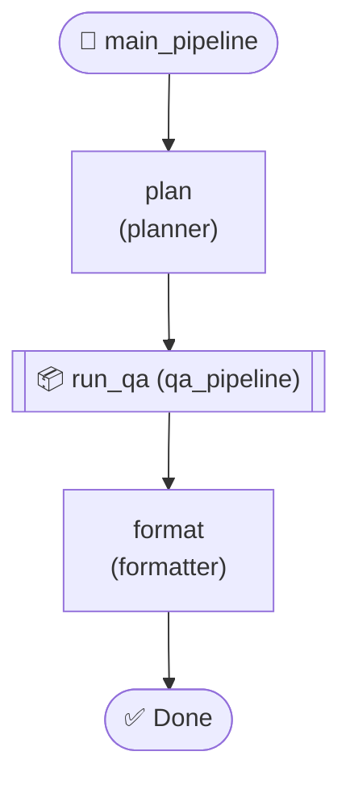
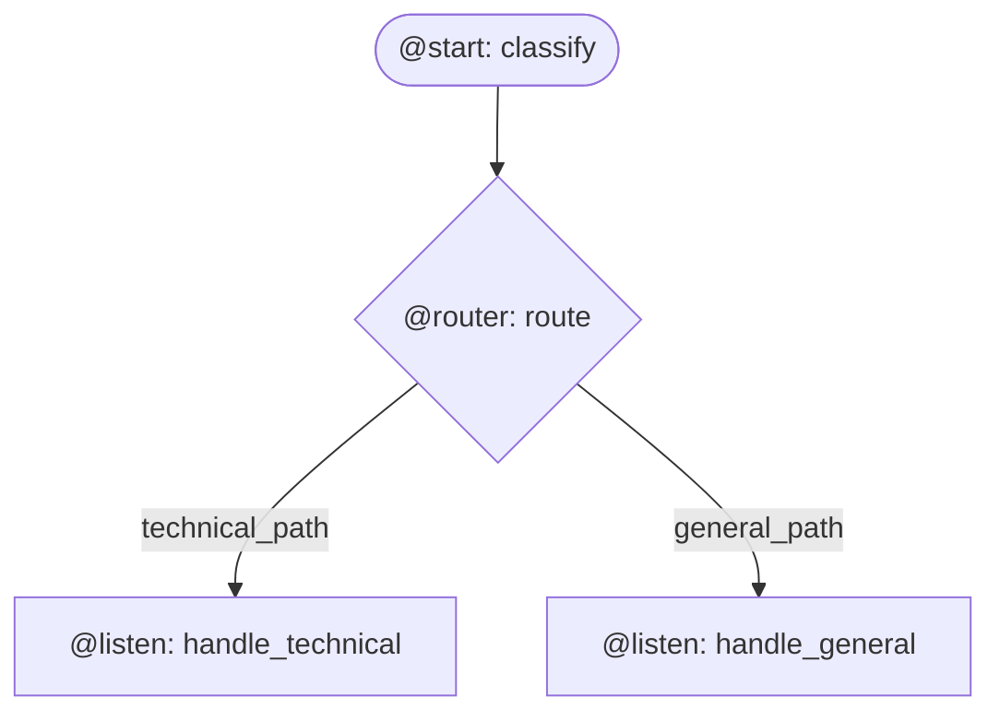
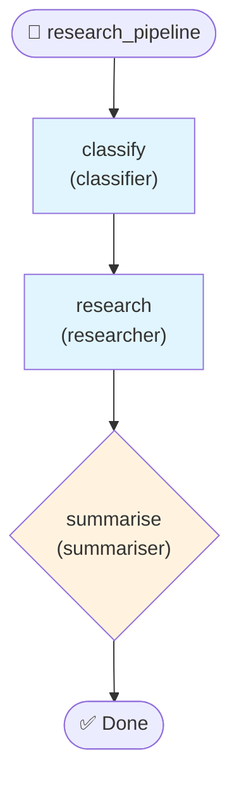

# Agent Pipelines

<div align="center">
  
  <h3>Compose Multi-Agent Workflows with Zero Boilerplate</h3>
</div>

---

## When to Use Pipelines

Pipelines are **static, deterministic** workflows: you define the order of execution
up front and the platform runs each step in sequence (or in parallel, as configured).
Use a pipeline when:

- **The workflow shape is known at design time** — e.g. _classify → research →
  summarise_.
- **You need reproducibility** — same input always follows the same path.
- **You want REST endpoints generated automatically** — every pipeline is
  accessible via `POST /api/v1/pipelines/{name}/run` without extra code.
- **You need built-in validation, retries, and timeouts** — the engine handles
  all of this declaratively.

!!! tip "Pipeline vs Delegation"
    If the _model_ should decide which agent to call at runtime, use
    [Delegation](delegation.md) instead.  See the
    [comparison table](#pipeline-vs-delegation-vs-direct-api) at the bottom
    of this page.

---

## Architecture Overview



---

## Quick Start

Define the **same** three-step pipeline — _classify → research → summarise_ — in
all three styles.

=== "YAML"

    ```yaml title="pipelines/research_pipeline.yaml"
    name: research_pipeline
    description: "Classify a query, research it, then summarise"
    version: "1.0.0"

    input_schema:
      query:
        type: string
      max_depth:
        type: int
        default: 3

    output_schema:
      summary:
        type: string
      sources:
        type: list

    on_error: continue
    timeout: 120.0

    steps:
      - name: classify
        agent: classifier
        timeout: 10.0

      - name: research
        agent: researcher
        input:
          topic: "$.steps.classify.category"
          depth: "$.input.max_depth"
        timeout: 60.0
        retry:
          max_attempts: 3
          backoff: exponential
          base_delay: 1.0

      - name: summarise
        agent: summariser
        input:
          findings: "$.steps.research.response"
        condition: "len(ctx.get_step_output('research').get('response', '')) > 0"
    ```

=== "Builder API"

    ```python title="pipelines/research_pipeline.py"
    from __future__ import annotations

    from agentomatic.pipelines import Pipeline

    config = (
        Pipeline("research_pipeline")
        .description("Classify a query, research it, then summarise")
        .input_schema(query=str, max_depth=(int, 3))
        .output_schema(summary=str, sources=list)
        .on_error("continue")
        .timeout(120.0)
        # Step 1 — classify
        .step(
            "classify",
            agent="classifier",
            timeout=10.0,
        )
        # Step 2 — research (with retry)
        .step(
            "research",
            agent="researcher",
            input={"topic": "$.steps.classify.category", "depth": "$.input.max_depth"},
            timeout=60.0,
            retry={"max_attempts": 3, "backoff": "exponential", "base_delay": 1.0},
        )
        # Step 3 — summarise (conditional)
        .step(
            "summarise",
            agent="summariser",
            input={"findings": "$.steps.research.response"},
            condition="len(ctx.get_step_output('research').get('response', '')) > 0",
        )
        .to_config()
    )
    ```

=== "Flow Decorators"

    ```python title="pipelines/research_flow.py"
    from __future__ import annotations

    from agentomatic.pipelines import Flow, listen, start

    class ResearchFlow(Flow):
        """Classify → research → summarise using reactive decorators."""

        @start()
        async def classify(self, input_data: dict) -> dict:
            return await self.agent("classifier").run(input_data)

        @listen(classify)
        async def research(self, classify_output: dict) -> dict:
            return await self.agent("researcher").run(
                {"topic": classify_output.get("category"), "depth": 3},
            )

        @listen(research)
        async def summarise(self, research_output: dict) -> dict:
            if not research_output.get("response"):
                return {"summary": "", "sources": []}
            return await self.agent("summariser").run(
                {"findings": research_output["response"]},
            )
    ```

---

## Where to Put Pipeline Files

The platform **auto-discovers** pipelines from two locations:

```
my_project/
├── pipelines/                 # ① Dedicated pipeline directory
│   ├── research_pipeline.yaml
│   ├── qa_pipeline.yaml
│   └── ingestion_pipeline.yml
├── agents/
│   ├── classifier/
│   │   ├── agent.yaml
│   │   └── pipeline.yaml      # ② Agent-scoped pipeline
│   ├── researcher/
│   │   └── agent.yaml
│   └── summariser/
│       └── agent.yaml
└── pipeline.yaml              # ③ Root-level pipeline (optional)
```

!!! info "Discovery Rules"
    1. `pipeline.yaml` / `pipeline.yml` in the **project root**.
    2. Every `*.yaml` / `*.yml` file inside a `pipelines/` subdirectory.
    3. `pipeline.yaml` inside each `agents/*/` folder.

    Duplicates (same `name` field) are skipped with a warning — the first
    discovered file wins.

---

## Step Types

### Sequential (default)

Steps run one after another. Each step receives the pipeline
[context](#context-and-data-mapping) enriched by previous outputs.

```yaml
steps:
  - name: plan
    agent: planner
  - name: execute
    agent: executor
```

### Parallel

Fan-out to multiple agents concurrently, then collect results.

=== "YAML"

    ```yaml
    steps:
      - name: research
        parallel:
          steps:
            - agent: web_researcher
            - agent: knowledge_base
            - agent: arxiv_search
          strategy: all          # all | first | majority
          max_concurrency: 5
        timeout: 60.0
    ```

=== "Builder API"

    ```python
    from __future__ import annotations

    from agentomatic.pipelines import Pipeline

    config = (
        Pipeline("parallel_research")
        .parallel(
            "research",
            steps=[
                Pipeline.agent("web_researcher"),
                Pipeline.agent("knowledge_base"),
                Pipeline.agent("arxiv_search", on_error="skip"),
            ],
            strategy="all",
            max_concurrency=5,
            timeout=60.0,
        )
        .to_config()
    )
    ```

=== "Flow Decorators"

    ```python
    from __future__ import annotations

    from agentomatic.pipelines import Flow, start

    class ParallelResearch(Flow):
        @start()
        async def research(self, input_data: dict) -> list[dict]:
            return await self.parallel(
                [
                    self.agent("web_researcher"),
                    self.agent("knowledge_base"),
                    self.agent("arxiv_search"),
                ],
                input=input_data,
                strategy="all",
            )
    ```

| Strategy     | Behaviour                                          |
|-------------|-----------------------------------------------------|
| `all`       | Wait for **every** sub-step; return all results.     |
| `first`     | Return as soon as the **first** sub-step completes.  |
| `majority`  | Return when >50 % of sub-steps have succeeded.       |

### Conditional

Attach a Python expression to any step. The step is **skipped** when
the condition evaluates to falsy.

```yaml
steps:
  - name: deep_analysis
    agent: deep_analyser
    condition: "ctx.get_step_output('classify').get('confidence', 0) < 0.7"
```

!!! warning "Condition Sandbox"
    Conditions run in a restricted namespace. Available builtins:
    `len`, `any`, `all`, `str`, `int`, `float`, `bool`, `list`, `dict`,
    `max`, `min`, `sum`, `sorted`, `isinstance`.
    The `ctx` variable is a `PipelineContext` instance.

### Loop

Repeat a step until a condition is met or a maximum iteration count is
reached.

=== "YAML"

    ```yaml
    steps:
      - name: refine
        loop:
          step:
            agent: refiner
          max_iterations: 5
          until: "ctx.get_step_output('refine').get('quality_score', 0) >= 0.9"
        timeout: 120.0
    ```

=== "Builder API"

    ```python
    from __future__ import annotations

    from agentomatic.pipelines import Pipeline

    config = (
        Pipeline("iterative_refine")
        .loop(
            "refine",
            agent="refiner",
            max_iterations=5,
            until="ctx.get_step_output('refine').get('quality_score', 0) >= 0.9",
            timeout=120.0,
        )
        .to_config()
    )
    ```

### Transform

Run arbitrary Python code between agent steps to reshape data.
The code block executes with `ctx` in scope and must `return` a `dict`.

=== "YAML"

    ```yaml
    steps:
      - name: merge_results
        transform: |
          web = ctx.get_step_output("web_researcher")
          kb  = ctx.get_step_output("knowledge_base")
          return {
              "combined": web.get("results", []) + kb.get("results", []),
              "source_count": len(web.get("results", [])) + len(kb.get("results", [])),
          }
    ```

=== "Builder API"

    ```python
    from __future__ import annotations

    from agentomatic.pipelines import Pipeline

    config = (
        Pipeline("with_transform")
        .step("research", agent="researcher")
        .transform(
            "merge_results",
            code="""
            data = ctx.get_step_output("research")
            return {"clean": data.get("response", "").strip()}
            """,
        )
        .step("write", agent="writer")
        .to_config()
    )
    ```

### Sub-pipeline

Embed one pipeline inside another for reusable composition.

```yaml
steps:
  - name: run_qa
    sub_pipeline: qa_pipeline          # references another pipeline by name
    input:
      question: "$.steps.plan.question"
    timeout: 120.0
```

---

## Context and Data Mapping

Each pipeline execution creates a `PipelineContext` that flows through
every step. You reference context values using `$` expressions.

### Expression Reference

| Expression                        | Resolves to                                |
|-----------------------------------|--------------------------------------------|
| `$.input.query`                   | Original pipeline input field `query`      |
| `$.input.*`                       | Entire input dict                          |
| `$.steps.plan.response`           | Step `plan`'s output field `response`      |
| `$.steps.plan.*`                  | Step `plan`'s entire output                |
| `$.steps.research`                | Parallel results (list of outputs)         |
| `$.steps.research[0].text`        | First parallel result's `text` field       |
| `$.defaults.language`             | Pipeline-level default `language`          |
| `$.context.key`                   | Shared mutable context field `key`         |
| `$.current.field`                 | Most recent step's output field            |

### Example: Wiring Steps Together

```yaml
steps:
  - name: classify
    agent: classifier

  - name: research
    agent: researcher
    input:
      topic: "$.steps.classify.category"   # ← from classify output
      query: "$.input.query"               # ← from pipeline input

  - name: summarise
    agent: summariser
    input:
      findings: "$.steps.research.*"       # ← entire research output
    output:
      summary: "$.response"               # ← store in shared context
```

---

## Error Handling

### Pipeline-Level Policy

```yaml
on_error: fail_fast   # fail_fast | continue | rollback
timeout: 300.0        # seconds — overall pipeline timeout
```

| Policy      | Behaviour                                                  |
|-------------|------------------------------------------------------------|
| `fail_fast` | Stop immediately when any step fails (default).            |
| `continue`  | Run remaining steps; final status is `partial` or `failed`.|
| `rollback`  | Stop and mark the pipeline as failed.                      |

### Step-Level Policy

Each step can override the pipeline policy:

```yaml
steps:
  - name: risky_lookup
    agent: web_scraper
    on_error: skip          # fail | skip | retry | fallback
    fallback_agent: cached_lookup
    retry:
      max_attempts: 3
      backoff: exponential  # fixed | linear | exponential
      base_delay: 1.0       # seconds
    timeout: 30.0
```

| Step Policy  | Behaviour                                                    |
|-------------|---------------------------------------------------------------|
| `fail`      | Propagate failure to pipeline-level policy (default).         |
| `skip`      | Mark step as `skipped` and continue.                          |
| `retry`     | Retry up to `max_attempts` with configurable backoff.         |
| `fallback`  | On failure, invoke `fallback_agent` instead.                  |

### Builder API — Error Handling

```python
from __future__ import annotations

from agentomatic.pipelines import Pipeline

config = (
    Pipeline("resilient")
    .on_error("continue")
    .timeout(180.0)
    .step(
        "fetch",
        agent="web_scraper",
        on_error="skip",
        fallback_agent="cached_lookup",
        retry={"max_attempts": 3, "backoff": "exponential", "base_delay": 1.0},
        timeout=30.0,
    )
    .step("summarise", agent="summariser")
    .to_config()
)
```

---

## Sub-pipeline Composition

Compose large workflows from smaller, reusable pipelines.

```yaml title="pipelines/qa_pipeline.yaml"
name: qa_pipeline
description: "Reusable question-answering pipeline"
steps:
  - name: retrieve
    agent: retriever
  - name: answer
    agent: answerer
    input:
      context: "$.steps.retrieve.documents"
```

```yaml title="pipelines/main_pipeline.yaml"
name: main_pipeline
description: "Full pipeline with embedded QA"
steps:
  - name: plan
    agent: planner

  - name: run_qa
    sub_pipeline: qa_pipeline
    input:
      question: "$.steps.plan.question"

  - name: format
    agent: formatter
    input:
      answer: "$.steps.run_qa.response"
```



---

## Calling Pipelines from a Frontend

The platform auto-generates REST endpoints for every discovered pipeline
under `/api/v1/`.

### List All Pipelines

```bash
curl http://localhost:8000/api/v1/pipelines | jq
```

```json
[
  {
    "name": "research_pipeline",
    "description": "Classify a query, research it, then summarise",
    "version": "1.0.0",
    "steps": ["classify", "research", "summarise"],
    "agents_used": ["classifier", "researcher", "summariser"]
  }
]
```

### Execute a Pipeline

```bash
curl -X POST http://localhost:8000/api/v1/pipelines/research_pipeline/run \
  -H "Content-Type: application/json" \
  -d '{
    "input": {"query": "Explain transformer attention mechanisms"},
    "metadata": {"user_id": "u-123"}
  }' | jq
```

```json
{
  "pipeline_name": "research_pipeline",
  "status": "success",
  "output": {
    "summary": "Transformer attention mechanisms allow ...",
    "sources": ["arxiv:1706.03762"]
  },
  "steps": {
    "classify":  {"status": "success", "duration_ms": 230.5},
    "research":  {"status": "success", "duration_ms": 4520.1},
    "summarise": {"status": "success", "duration_ms": 1100.3}
  },
  "duration_ms": 5872.4,
  "error": null
}
```

### Validate Before Running

```bash
curl http://localhost:8000/api/v1/pipelines/research_pipeline/validate | jq
```

```json
{
  "pipeline_name": "research_pipeline",
  "valid": true,
  "errors": []
}
```

### Get Pipeline Configuration

```bash
curl http://localhost:8000/api/v1/pipelines/research_pipeline/config | jq
```

### Visualise as Mermaid

```bash
curl http://localhost:8000/api/v1/pipelines/research_pipeline/visualize | jq -r .mermaid
```

```
graph TD
    START(["🚀 research_pipeline"])
    classify["classify\n(classifier)"]
    START --> classify
    research["research\n(researcher)"]
    classify --> research
    summarise{"summarise\n(summariser)"}
    research --> summarise
    END(["✅ Done"])
    summarise --> END
```

---

## REST API Reference

All endpoints are mounted under the `/api/v1/` prefix.

| Method   | Endpoint                            | Description                       | Request Body                          | Response Model               |
|----------|-------------------------------------|-----------------------------------|---------------------------------------|------------------------------|
| `GET`    | `/pipelines`                        | List all discovered pipelines     | —                                     | `list[PipelineInfo]`         |
| `POST`   | `/pipelines/{name}/run`             | Execute a pipeline                | `{"input": {…}, "metadata": {…}}`     | `PipelineRunResponse`        |
| `GET`    | `/pipelines/{name}/config`          | Get pipeline configuration        | —                                     | `dict` (full config dump)    |
| `GET`    | `/pipelines/{name}/validate`        | Pre-flight validation             | —                                     | `PipelineValidationResponse` |
| `GET`    | `/pipelines/{name}/visualize`       | Mermaid diagram of the pipeline   | —                                     | `{"mermaid": "…"}`           |

### Response Models

=== "PipelineRunResponse"

    ```json
    {
      "pipeline_name": "string",
      "status": "success | partial | failed",
      "output": {},
      "steps": {
        "step_name": {
          "name": "string",
          "status": "success | failed | skipped",
          "output": {},
          "error": "string | null",
          "duration_ms": 0.0,
          "agent_used": "string | null",
          "retries": 0
        }
      },
      "duration_ms": 0.0,
      "error": "string | null"
    }
    ```

=== "PipelineInfo"

    ```json
    {
      "name": "string",
      "description": "string",
      "version": "1.0.0",
      "steps": ["step_a", "step_b"],
      "agents_used": ["agent_x", "agent_y"]
    }
    ```

=== "PipelineValidationResponse"

    ```json
    {
      "pipeline_name": "string",
      "valid": true,
      "errors": []
    }
    ```

---

## Flow Decorators — Advanced Patterns

The `Flow` class provides a reactive, DAG-driven execution model using
three decorators: `@start()`, `@listen()`, and `@router()`.

### Routing

Use `@router` to create conditional branches based on step output:

```python
from __future__ import annotations

from agentomatic.pipelines import Flow, listen, router, start


class TriageFlow(Flow):
    """Route queries to different handlers based on classification."""

    @start()
    async def classify(self, input_data: dict) -> dict:
        return await self.agent("classifier").run(input_data)

    @router(classify)
    def route(self, classify_output: dict) -> str:
        category = classify_output.get("category", "general")
        if category == "technical":
            return "technical_path"
        return "general_path"

    @listen("technical_path")
    async def handle_technical(self, data: dict) -> dict:
        return await self.agent("tech_expert").run(data)

    @listen("general_path")
    async def handle_general(self, data: dict) -> dict:
        return await self.agent("generalist").run(data)
```



### Running a Flow

```python
from __future__ import annotations

from agentomatic.pipelines import Flow

# Instantiate and bind the agent registry
flow = TriageFlow()
flow.bind_registry(registry)

# Execute
result = await flow.run({"query": "How do I optimise CUDA kernels?"})
print(result.status)       # "success"
print(result.output)       # final step output
print(result.duration_ms)  # wall-clock time
```

---

## Pipeline vs Delegation vs Direct API { #pipeline-vs-delegation-vs-direct-api }

| Feature                   | Pipeline                                  | Delegation                               | Direct API                    |
|---------------------------|-------------------------------------------|------------------------------------------|-------------------------------|
| **Who decides the path?** | Developer (static definition)             | The model (dynamic routing)              | Caller (single agent call)    |
| **Definition**            | YAML / Builder / Flow                     | `delegation.py` + handoff tools          | `POST /api/v1/agent/{name}`   |
| **Multi-step**            | ✅ Built-in                               | ✅ Via orchestrator                       | ❌ One agent at a time        |
| **Parallel execution**    | ✅ `type: parallel`                       | ❌ Sequential handoffs                    | ❌                            |
| **Retry & fallback**      | ✅ Declarative                            | ⚠️ Manual in agent code                  | ⚠️ Manual                    |
| **REST endpoint**         | ✅ Auto-generated                         | ✅ Via orchestrator agent                 | ✅ Per-agent                  |
| **Validation**            | ✅ Pre-flight `/validate`                 | ❌                                        | ❌                            |
| **Visualisation**         | ✅ Mermaid `/visualize`                   | ✅ Studio graph                           | ❌                            |
| **Best for**              | ETL, multi-step processing, batch jobs    | Chat, creative tasks, open-ended queries | Simple single-agent calls     |

---

## Scaffolding

Generate a ready-to-customise pipeline scaffold:

```bash
agentomatic init my_pipeline --template pipeline
```

This creates `pipelines/my_pipeline.yaml` with a sample multi-step
workflow.

---

## Full Pipeline Flow Diagram



!!! note "Conditional Steps"
    Diamond-shaped nodes indicate steps with a `condition`.
    The step is skipped if the condition evaluates to `False`.

---

## Further Reading

- [Delegation & Multi-Agent Orchestration](delegation.md) — dynamic, model-driven routing
- [Templates](templates.md) — all available scaffolding templates
- [Class-Based Agents](class-agents.md) — define agents as Python classes
- [Architecture Overview](../architecture/overview.md) — how pipelines fit into the platform
- [API Reference](../architecture/api-reference.md) — full REST API documentation
