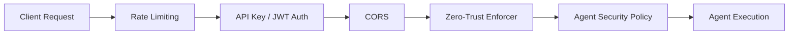

# Security & Zero Trust

Agentomatic ships with a **layered security model** that protects your
agent platform from the network edge all the way down to individual tool
invocations.  Each layer is independently configurable and designed to
degrade gracefully when optional dependencies are absent.



| Layer | Component | Purpose |
|-------|-----------|---------|
| **1 – Transport** | Rate Limiter | Sliding-window throttle per client IP |
| **2 – Identity** | API Key / JWT Middleware | Authenticate callers |
| **3 – Origin** | CORS Middleware | Restrict browser origins |
| **4 – Authorisation** | Zero-Trust Enforcer | Per-agent RBAC, delegation, and audit |
| **5 – Execution** | Agent Security Policy | Tool allow/block lists, token budgets |

---

## API Key Authentication

The simplest authentication method — a shared secret verified on every
request via an HTTP header or query parameter.

### Enabling API Key Auth

=== "Environment Variables"

    ```bash
    export FEATURES__ENABLE_AUTH=true
    export AUTH__API_KEY="your-secret-api-key"
    ```

=== "Python"

    ```python
    from agentomatic.middleware.auth import AuthMiddleware

    app.add_middleware(
        AuthMiddleware,
        api_key="your-secret-api-key",
        header_name="X-API-Key",     # default
        query_param="api_key",       # default
        skip_paths=["/health"],      # additional paths to skip
    )
    ```

### How It Works

1. The middleware reads the key from the **`X-API-Key`** header first, then
   falls back to the **`api_key`** query parameter.
2. If neither matches, a `401 Unauthorized` JSON response is returned.
3. The following paths are **skipped by default** and never require a key:

| Path | Purpose |
|------|---------|
| `/health` | Liveness probe |
| `/healthz` | Kubernetes liveness |
| `/readiness` | Kubernetes readiness |
| `/docs` | Swagger UI |
| `/openapi.json` | OpenAPI schema |
| `/redoc` | ReDoc UI |
| `/` | Root / landing page |

!!! tip "Use headers, not query params"
    Query parameters are logged by proxies and browsers.  Always prefer the
    `X-API-Key` header in production.

---

## JWT Token Authentication

For production deployments, Agentomatic supports **JSON Web Token** (JWT)
authentication with JWKS key rotation — the industry standard for
microservice-to-microservice auth.

### JWTConfig Reference

```python
from agentomatic.security import JWTConfig

config = JWTConfig(
    enabled=True,
    jwks_url="https://your-idp.example.com/.well-known/jwks.json",
    issuer="https://your-idp.example.com/",
    audience="agentomatic-api",
    algorithms=["RS256"],
    header_name="Authorization",   # default
    header_prefix="Bearer",        # default
)
```

| Field | Type | Default | Description |
|-------|------|---------|-------------|
| `enabled` | `bool` | `False` | Master switch for JWT validation |
| `jwks_url` | `str` | `""` | URL to the JWKS endpoint for public key discovery |
| `issuer` | `str` | `""` | Expected `iss` claim value |
| `audience` | `str` | `""` | Expected `aud` claim value |
| `algorithms` | `list[str]` | `["RS256"]` | Accepted signing algorithms |
| `header_name` | `str` | `"Authorization"` | HTTP header carrying the token |
| `header_prefix` | `str` | `"Bearer"` | Prefix stripped before decoding |
| `skip_paths` | `set[str]` | Health & docs paths | Paths that bypass JWT checks |

### Registering the Middleware

```python
from agentomatic.security import JWTAuthMiddleware, JWTConfig

config = JWTConfig(
    enabled=True,
    jwks_url="https://idp.example.com/.well-known/jwks.json",
    issuer="https://idp.example.com/",
    audience="agentomatic",
)

app.add_middleware(JWTAuthMiddleware, config=config)
```

On successful validation the middleware populates two attributes on the
request state:

- **`request.state.jwt_claims`** — the full decoded JWT payload.
- **`request.state.user_id`** — the `sub` (subject) claim value.

!!! note "Optional dependency"
    JWT support requires the `PyJWT[crypto]` extra.  If the package is not
    installed, the middleware logs a warning and allows all requests through
    — ensuring graceful degradation during development.

!!! warning "Dev-mode bypass"
    When `jwks_url` is left **empty**, tokens are decoded **without
    signature verification**.  This is convenient for local development but
    **must never be used in production**.

---

## Agent-Level Permissions (RBAC)

Each agent can be assigned an `AgentSecurityPolicy` that governs what it
is allowed to do at runtime.

```python
from agentomatic.security import AgentSecurityPolicy

policy = AgentSecurityPolicy(
    require_auth=True,
    allowed_roles=["admin", "operator"],
    allowed_scopes=["agents:execute", "tools:read"],
    max_execution_time=60.0,
    max_tokens_per_request=4096,
    allowed_tools=["web_search", "calculator"],
    blocked_tools=["shell_exec"],
    env_vars_whitelist=["OPENAI_API_KEY"],
    allowed_delegation_targets=["summariser", "researcher"],
    rate_limit_requests=100,
    rate_limit_window=60,
)
```

### Full Field Reference

| Field | Type | Default | Description |
|-------|------|---------|-------------|
| `require_auth` | `bool` | `False` | Reject unauthenticated requests |
| `allowed_roles` | `list[str]` | `[]` | JWT roles that may invoke this agent (empty = any) |
| `allowed_scopes` | `list[str]` | `[]` | OAuth scopes required (empty = any) |
| `max_execution_time` | `float` | `30.0` | Hard timeout in seconds per request |
| `max_tokens_per_request` | `int` | `8192` | Maximum LLM tokens the agent may consume |
| `allowed_tools` | `list[str] \| None` | `None` | Explicit allow-list (`None` = all tools allowed) |
| `blocked_tools` | `list[str]` | `[]` | Tools that are always denied |
| `env_vars_whitelist` | `list[str] \| None` | `None` | Environment variables the agent may read |
| `allowed_delegation_targets` | `list[str]` | `[]` | Agents this agent may delegate work to |
| `rate_limit_requests` | `int \| None` | `None` | Per-agent request cap (overrides global) |
| `rate_limit_window` | `int \| None` | `None` | Window in seconds for the per-agent cap |

### Tool Access Resolution Order

The policy evaluates tool access in the following order:

1. **Blocked tools** — if the tool appears in `blocked_tools`, access is
   **denied** immediately.
2. **Allowed tools** — if `allowed_tools` is a list, the tool must appear
   in it.  If `allowed_tools` is `None`, all tools are permitted.
3. **Default deny** — if neither condition is met, access is **denied**.

```python
assert policy.is_tool_allowed("calculator") is True
assert policy.is_tool_allowed("shell_exec") is False
```

---

## Zero-Trust Enforcement

The `ZeroTrustEnforcer` is the central authority that ties policies to
agents and provides three verification primitives:

```python
from agentomatic.security import ZeroTrustEnforcer, AgentSecurityPolicy

enforcer = ZeroTrustEnforcer(require_auth_globally=True)

# Register per-agent policies
enforcer.register_policy("researcher", AgentSecurityPolicy(
    allowed_tools=["web_search"],
    allowed_delegation_targets=["summariser"],
))

enforcer.register_policy("summariser", AgentSecurityPolicy(
    allowed_tools=["text_summarise"],
    max_tokens_per_request=2048,
))
```

### Verification Methods

=== "verify_request"

    Checks authentication presence, role claims, and scope claims against
    the agent's policy.

    ```python
    ok, reason = enforcer.verify_request(request, agent_name="researcher")
    if not ok:
        raise HTTPException(status_code=403, detail=reason)
    ```

    Verification steps performed:

    1. Is authentication present when `require_auth` is `True`?
    2. Does the JWT contain a permitted **role** claim?
    3. Does the JWT contain a permitted **scope** claim?

=== "verify_delegation"

    Confirms that one agent is permitted to delegate work to another.

    ```python
    ok, reason = enforcer.verify_delegation(
        source_agent="researcher",
        target_agent="summariser",
    )
    ```

=== "enforce_tool_access"

    Checks tool-level permissions for a specific agent.

    ```python
    ok, reason = enforcer.enforce_tool_access(
        agent_name="researcher",
        tool_name="web_search",
    )
    ```

### Audit Logging

Every verification call is recorded via **loguru** in a structured format:

```python
enforcer.audit_log(
    event="tool_access_denied",
    agent_name="researcher",
    context={"tool": "shell_exec"},
)
```

!!! tip "Centralised audit trail"
    Pipe loguru output to a JSON sink (file or stdout) and forward it to
    your SIEM for real-time alerting on denied events.

---

## Rate Limiting Configuration

Agentomatic includes a sliding-window rate limiter that operates **per
client IP**.

### Enabling Rate Limiting

```bash
export FEATURES__ENABLE_RATE_LIMIT=true
```

```python
from agentomatic.middleware.rate_limit import RateLimitMiddleware

app.add_middleware(
    RateLimitMiddleware,
    max_requests=100,      # requests per window
    window_seconds=60,     # window duration
)
```

### Client Identification

The middleware resolves the client IP using:

1. The **`X-Forwarded-For`** header (first entry), when behind a reverse
   proxy.
2. Falls back to **`request.client.host`** otherwise.

### Response Headers

Every response includes rate-limit metadata:

| Header | Description |
|--------|-------------|
| `X-RateLimit-Limit` | Maximum requests allowed in the window |
| `X-RateLimit-Remaining` | Requests remaining in the current window |

When the limit is exceeded, a **`429 Too Many Requests`** response is
returned with a `Retry-After` header indicating when the client may
retry.

---

## CORS Configuration

Cross-Origin Resource Sharing is configured at the platform level via
FastAPI's built-in `CORSMiddleware`.

```python
from agentomatic import AgentPlatform

platform = AgentPlatform(
    cors_origins=["https://studio.example.com", "http://localhost:3000"],
)
```

The middleware is registered with the following defaults:

| Setting | Value |
|---------|-------|
| `allow_credentials` | `True` |
| `allow_methods` | `["*"]` |
| `allow_headers` | `["*"]` |
| `expose_headers` | `["X-Studio-Run-Id"]` |

!!! warning "Restrict origins in production"
    Never use `["*"]` for `cors_origins` in production.  Always enumerate
    the exact domains that should be allowed to make cross-origin requests.

---

## Input Validation

All request and configuration models in Agentomatic are built on
**Pydantic v2**, which provides automatic input validation and
serialisation.

!!! tip "Best practices"
    - Use `AgentSecurityPolicy` fields like `max_tokens_per_request` and
      `max_execution_time` to bound agent resource consumption.
    - Validate user-supplied prompts and tool arguments at the application
      layer before they reach the agent runtime.
    - Prefer allow-lists (`allowed_tools`) over block-lists
      (`blocked_tools`) for defence in depth.

---

## Environment Variable Security

!!! danger "Keep secrets out of source control"
    - Store all secrets (`AUTH__API_KEY`, database URIs, LLM provider keys)
      in a **`.env`** file or a secrets manager — never commit them to Git.
    - Ensure **`.env`** is listed in your **`.gitignore`**.
    - Use `env_vars_whitelist` in `AgentSecurityPolicy` to restrict which
      variables each agent can access at runtime.
    - Rotate API keys and JWT signing keys on a regular schedule.

---

## Production Security Checklist

!!! danger "Review before deploying to production"
    - [x] **API Key Auth** enabled (`FEATURES__ENABLE_AUTH=true`)
    - [x] **JWT validation** enabled with a real `jwks_url` — dev-mode
      bypass is disabled
    - [x] **CORS origins** restricted to known domains (no `["*"]`)
    - [x] **Rate limiting** enabled (`FEATURES__ENABLE_RATE_LIMIT=true`)
    - [x] **Secrets** stored in `.env` or a vault — never in source code
    - [x] **`allowed_tools`** set per agent — no agent has unrestricted
      tool access
    - [x] **`blocked_tools`** includes high-risk tools like `shell_exec`
    - [x] **`max_execution_time`** and **`max_tokens_per_request`** tuned
      per agent
    - [x] **Delegation targets** explicitly listed — no open delegation
    - [x] **Audit logging** piped to a persistent sink / SIEM
    - [x] **TLS termination** handled by a reverse proxy (nginx, Caddy,
      cloud LB)
    - [x] **Dependency audit** — `pip audit` run in CI

---

## Troubleshooting

??? question "I get 401 even though I'm sending the API key"
    Make sure the key is in the **`X-API-Key`** header (case-sensitive) or
    the `api_key` query parameter.  Confirm that
    `FEATURES__ENABLE_AUTH=true` **and** `AUTH__API_KEY` are set in the
    same environment that the server process reads.

??? question "JWT middleware silently allows all requests"
    This usually means `PyJWT[crypto]` is not installed.  The middleware
    degrades gracefully and logs a warning.  Install the dependency:
    ```bash
    pip install "PyJWT[crypto]"
    ```

??? question "Rate limiter counts are wrong behind a load balancer"
    The middleware reads `X-Forwarded-For` to identify clients.  Ensure
    your reverse proxy sets this header correctly and that only **trusted
    proxies** can override it — otherwise clients can spoof their IP.

---

## Related Documentation

| Topic | Link |
|-------|------|
| Quick Start | [Quick Start](../getting-started/quickstart.md) |
| Configuration Reference | [configuration.md](configuration.md) |
| Agent Manifest | [Agent Structure](agent-structure.md) |
| Multi-Agent Orchestration | [Swarm Delegation](delegation.md) |
| Studio Integration | [studio.md](studio.md) |
| API Reference | [API Reference](../architecture/api-reference.md) |
