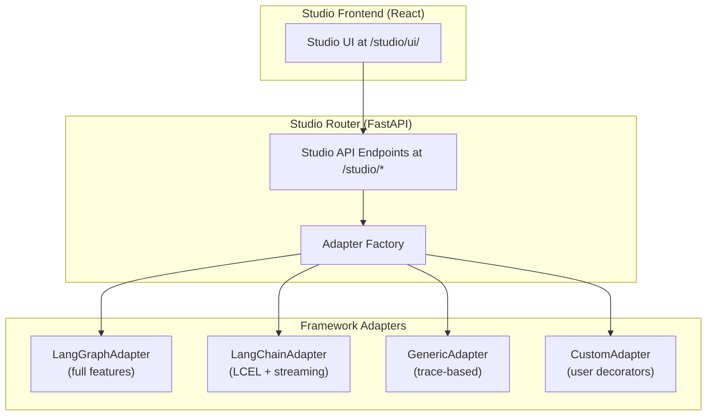

# Agentomatic Studio :material-palette:

Agentomatic Studio is a built-in visual development environment for debugging, inspecting, and tracing the execution of your agents in real-time. It works with **any agent framework** — LangGraph, LangChain, CrewAI, AutoGen, or raw Python — via a universal adapter system.

!!! info "Studio vs Chat Interface"
    Agentomatic provides **two** debug interfaces optimized for different workflows:

    | | **Agentomatic Studio** (this page) | [Chat Interface](debug-ui.md) |
    |---|---|---|
    | **Purpose** | Visual debugging & state inspection | Conversational testing & feedback |
    | **Launch flag** | `--studio` | `--with-ui` |
    | **URL** | `/studio/ui/` | `/chat` |
    | **Best for** | Graph visualization, time-travel, breakpoints, state editing | Response quality testing, prompt A/B, feedback collection |
    | **Interface** | Node graph + debug panels (React) | Chat bubbles (Chainlit) |

    **Studio is the primary debug tool.** Use it when developing and debugging agents. Use the Chat Interface for conversational testing and evaluation.

---

## Quick Start

The Studio is bundled directly into the `agentomatic` pip package. No separate setup required.

```bash
pip install "agentomatic[studio]"
agentomatic run --studio
```

The unified platform starts serving your API endpoints at `http://localhost:8000` and the Studio UI at `http://localhost:8000/studio/ui/`.

!!! tip "Quick Demo"
    Want to try Studio without setting up any agents? Use the built-in demo command:

    ```bash
    agentomatic demo
    ```

    This scaffolds a temporary demo agent and launches the platform with Studio enabled, giving you an instant hands-on experience with graph visualization, streaming, and state inspection.

---

## Framework Support

Agentomatic Studio uses a **universal adapter system** to provide the best possible debugging experience for every agent framework:

| Capability | LangGraph | LangChain | Custom / Raw Python | With Decorators |
|---|:---:|:---:|:---:|:---:|
| Graph Topology | ✅ Real graph | ✅ LCEL extraction or synthetic chain | ✅ Synthetic linear | ✅ Custom graph |
| SSE Node Streaming | ✅ `astream_events` | ✅ `astream_events` (v2) | ✅ Trace-based | ✅ Custom stream |
| Time-Travel History | ✅ Checkpointer | ✅ In-memory traces | ✅ In-memory traces | ✅ In-memory traces |
| State Inspection | ✅ Checkpointer | ✅ Message + I/O capture | ✅ Last I/O capture | ✅ Custom provider |
| State Mutation | ✅ `aupdate_state` | ⚠️ In-memory only | ⚠️ In-memory only | ⚠️ In-memory only |
| Breakpoints | ✅ `interrupt_before` | ❌ | ❌ | ❌ |
| HITL Support | ✅ Native | ❌ | ❌ | ❌ |

!!! note "Adapter Selection is Automatic"
    The Studio automatically selects the best adapter based on the `framework` field in your agent's manifest. You don't need to configure anything — just set `framework="langgraph"`, `"langchain"`, or `"custom"` in your `AgentManifest`.

---

## LangGraph Integration

LangGraph agents get the richest Studio experience with full graph extraction, checkpointer-based state management, breakpoints, and human-in-the-loop support.

### Example: LangGraph Agent

```python
# agents/researcher/__init__.py
from agentomatic import AgentManifest
from .graph import get_graph

manifest = AgentManifest(
    name="researcher",
    slug="researcher-agent",
    description="Multi-step research agent with web search",
    framework="langgraph",  # ← Triggers the LangGraphAdapter
)

graph_fn = get_graph  # Export the compiled graph factory
```

```python
# agents/researcher/graph.py
from langgraph.graph import StateGraph, START, END
from .nodes import search_web, analyze_results, write_report

def get_graph():
    builder = StateGraph(dict)
    builder.add_node("search", search_web)
    builder.add_node("analyze", analyze_results)
    builder.add_node("report", write_report)

    builder.add_edge(START, "search")
    builder.add_edge("search", "analyze")
    builder.add_conditional_edges(
        "analyze",
        lambda state: "report" if state.get("ready") else "search",
    )
    builder.add_edge("report", END)

    return builder.compile()
```

When launched with `--studio`, the Studio automatically:

1. **Extracts the real graph topology** from the `CompiledGraph`
2. **Streams node transitions** via `astream_events` — nodes pulse and light up as execution progresses
3. **Captures checkpoints** for time-travel debugging and state replay
4. **Supports breakpoints** — pause execution before any node
5. **Enables state editing** — modify graph state mid-execution via `aupdate_state`

---

## LangChain Integration

Agentomatic Studio provides first-class support for LangChain-based agents, chatbots, and LCEL chains. When your agent's manifest declares `framework='langchain'`, the Studio automatically uses the dedicated `LangChainAdapter`.

### Automatic Features

The LangChain adapter automatically provides:

- **LCEL graph extraction** — If your chain/runnable exposes `.get_graph()`, Studio extracts the real topology.
- **Synthetic chain graph** — If no `.get_graph()` is found, Studio renders a typical chain layout: `Input → Prompt → LLM → Output Parser → Output`.
- **Rich SSE streaming** — If `astream_events` is available on the runnable, the Studio streams `on_chain_start`, `on_chain_end`, `on_chat_model_stream`, `on_tool_start`, `on_tool_end`, and `on_llm_start/end` events in real-time.
- **Automatic message tracking** — Captures conversation messages per thread for the State tab.

### Example: LangChain Chatbot

```python
# agents/chatbot/__init__.py
from agentomatic.core.manifest import AgentManifest

manifest = AgentManifest(
    name="chatbot",
    slug="my-langchain-chatbot",
    description="A conversational chatbot using LangChain",
    framework="langchain",  # ← This triggers the LangChain adapter
)

async def node_fn(state: dict) -> dict:
    from langchain_openai import ChatOpenAI
    from langchain_core.prompts import ChatPromptTemplate

    prompt = ChatPromptTemplate.from_messages([
        ("system", "You are a helpful assistant."),
        ("human", "{query}"),
    ])
    llm = ChatOpenAI(model="gpt-4o-mini")
    chain = prompt | llm

    result = await chain.ainvoke({"query": state["current_query"]})
    return {"response": result.content}
```

That's it! Drop this agent into your `agents/` folder and launch with `agentomatic run --studio`. The Studio will automatically:

1. Show a chain-style graph in the Graph View
2. Stream LLM tokens in real-time via SSE
3. Track conversation state per thread
4. Record execution history for the History tab

### Advanced: Exposing LCEL Graphs

For richer graph visualization, export your runnable as a module-level variable named `chain`, `runnable`, or `agent`. The `LangChainAdapter` will discover it and extract the real LCEL graph:

```python
# agents/rag_bot/__init__.py
from langchain_openai import ChatOpenAI
from langchain_core.prompts import ChatPromptTemplate
from langchain_core.output_parsers import StrOutputParser

prompt = ChatPromptTemplate.from_messages([
    ("system", "Answer based on the context: {context}"),
    ("human", "{query}"),
])
llm = ChatOpenAI(model="gpt-4o-mini")
parser = StrOutputParser()

# Export as module-level — Studio will discover this automatically
chain = prompt | llm | parser
```

### Example: LangChain Agent with Tools

```python
# agents/tool_agent/__init__.py
from agentomatic.core.manifest import AgentManifest
from langchain_openai import ChatOpenAI
from langchain_core.tools import tool
from langchain.agents import create_tool_calling_agent, AgentExecutor
from langchain_core.prompts import ChatPromptTemplate

manifest = AgentManifest(
    name="tool_agent",
    slug="langchain-tool-agent",
    description="Agent with tool calling via LangChain",
    framework="langchain",
)

@tool
def get_weather(city: str) -> str:
    """Get the current weather for a city."""
    return f"The weather in {city} is 22°C and sunny."

@tool
def search_database(query: str) -> str:
    """Search the internal knowledge database."""
    return f"Found 3 results for: {query}"

llm = ChatOpenAI(model="gpt-4o-mini")
tools = [get_weather, search_database]
prompt = ChatPromptTemplate.from_messages([
    ("system", "You are a helpful assistant with access to tools."),
    ("placeholder", "{chat_history}"),
    ("human", "{input}"),
    ("placeholder", "{agent_scratchpad}"),
])

agent = create_tool_calling_agent(llm, tools, prompt)
runnable = AgentExecutor(agent=agent, tools=tools)  # (1)!

async def node_fn(state: dict) -> dict:
    result = await runnable.ainvoke({"input": state["current_query"]})
    return {"response": result["output"]}
```

1. Exported as `runnable` — Studio auto-discovers this for graph extraction

---

## Generic / Raw Python Integration

For agents that don't use LangGraph or LangChain, the Studio provides a `GenericAdapter` that wraps your `node_fn()` with timing, I/O capture, and trace events.

### Example: Raw Python Agent

```python
# agents/classifier/__init__.py
from agentomatic import AgentManifest

manifest = AgentManifest(
    name="classifier",
    slug="text-classifier",
    description="Classifies text into categories",
    framework="custom",  # ← Triggers the GenericAdapter
)

async def node_fn(state: dict) -> dict:
    query = state.get("current_query", "")

    # Your custom logic — any Python code
    if "urgent" in query.lower():
        category = "high-priority"
    elif "question" in query.lower():
        category = "inquiry"
    else:
        category = "general"

    return {
        "response": f"Classified as: {category}",
        "metadata": {"category": category, "confidence": 0.95},
    }
```

The Studio will show a synthetic linear graph (`__start__ → classifier → __end__`) and capture execution timing, inputs, and outputs.

---

## Key Features

### 1. Live Node Streaming

When you execute an agent query, the **Graph View** maps directly to your agent's topology. As the execution progresses, nodes pulse and light up in real-time.

- **LangGraph agents**: Server-Sent Events stream node transitions directly from `astream_events`.
- **LangChain agents**: SSE events stream `on_chain_start`, `on_chat_model_stream`, `on_tool_start/end` events.
- **Other agents**: The generic adapter wraps execution with trace events that capture timing, input/output payloads, and exceptions.

### 2. Time-Travel Debugging

Agentomatic records every execution step for historical replay.

- **History View**: The **Time Travel** tab lists all past checkpoints (LangGraph) or execution traces (other frameworks).
- **Replay**: Click **"Replay from here"** on any snapshot to branch your thread and resume from that state.

!!! warning "Framework limitations"
    Full checkpoint-based time-travel is available for **LangGraph** agents only. Other frameworks use in-memory trace stores which provide history viewing but limited replay capabilities.

### 3. Conditional Breakpoints

Freeze execution before a critical node (LangGraph only).

- **Setting Breakpoints**: Right-click any node in the Graph View → **"Add Breakpoint"**.
- **Execution**: The graph pauses before the target node. The node pulses, and the thread is suspended.
- **Resuming**: Resume execution or edit the state before continuing.

### 4. Live State Editing

During a breakpoint pause or HITL interrupt, you can mutate the graph state.

- **State View**: Navigate to the **State** tab in the Debug Console.
- **Editing**: Click **"Edit State"**, modify the JSON, and click **"Save"**.
- **LangGraph**: Changes are persisted via `graph.aupdate_state()`.
- **Other frameworks**: Changes are stored in the in-memory trace store.

---

## Studio Decorators

For non-LangGraph agents, you can incrementally opt-in to richer Studio capabilities using decorators. These let you provide custom graph topologies, state providers, and stream functions.

### `@studio_graph`

Register a custom graph topology for your agent:

```python
from agentomatic.studio import studio_graph

@studio_graph
def my_topology():
    return {
        "nodes": [
            {"id": "__start__", "name": "Start", "type": "start"},
            {"id": "fetch_data", "name": "Fetch Data", "type": "tool"},
            {"id": "process", "name": "Process", "type": "agent"},
            {"id": "validate", "name": "Validate", "type": "condition"},
            {"id": "__end__", "name": "End", "type": "end"},
        ],
        "edges": [
            {"source": "__start__", "target": "fetch_data"},
            {"source": "fetch_data", "target": "process"},
            {"source": "process", "target": "validate"},
            {"source": "validate", "target": "__end__", "condition": "valid"},
            {"source": "validate", "target": "process", "condition": "retry"},
        ]
    }
```

### `@studio_state`

Register a custom state provider:

```python
from agentomatic.studio import studio_state

@studio_state
async def get_my_state(thread_id: str) -> dict:
    """Return the current state for a thread."""
    return await my_database.get_thread_state(thread_id)
```

### `@studio_stream`

Register a custom SSE event stream:

```python
from agentomatic.studio import studio_stream
from agentomatic.studio.models import StudioRunEvent

@studio_stream
async def my_streamer(state, config, breakpoints):
    yield StudioRunEvent(event="node_start", run_id="", timestamp="...", node="my_node")
    result = await my_agent.process(state)
    yield StudioRunEvent(event="node_end", run_id="", timestamp="...", node="my_node", data={"output": result})
```

!!! tip "Combining decorators"
    You can use any combination of decorators. For example, provide a custom graph topology while using the default trace-based streaming:
    ```python
    @studio_graph
    def my_graph():
        return {"nodes": [...], "edges": [...]}

    # node_fn uses default GenericAdapter streaming
    async def node_fn(state: dict) -> dict:
        ...
    ```

---

## The `agentomatic demo` Command

For a quick hands-on experience with Studio, use the built-in demo command:

```bash
agentomatic demo
```

This command:

1. **Scaffolds a temporary demo agent** with a pre-built LangGraph workflow
2. **Launches the platform** with Studio enabled
3. **Opens the Studio UI** in your default browser

It's the fastest way to see Studio's graph visualization, node streaming, and state inspection in action.

!!! note "Demo agents are temporary"
    The demo agent is created in a temporary directory and cleaned up when the server stops. To create a permanent agent, use `agentomatic init` instead.

---

## Architecture

The Studio uses a layered adapter architecture:



- **Studio Router**: Framework-agnostic FastAPI endpoints that delegate to adapters.
- **Adapter Factory**: Automatically selects the best adapter based on the agent's `framework` field and available decorators.
- **LangGraphAdapter**: Full-featured — uses `CompiledGraph` APIs natively for graph extraction, checkpoint state, breakpoints, and HITL.
- **LangChainAdapter**: Extracts LCEL graphs via `.get_graph()`, streams via `astream_events`, and tracks messages per thread.
- **GenericAdapter**: Trace-based — wraps `node_fn()` with timing and I/O capture for any Python agent.
- **Custom Adapter**: User-registered via `@studio_graph`, `@studio_state`, and `@studio_stream` decorators.

### API Endpoints

| Endpoint | Method | Description |
|---|---|---|
| `/studio/info` | GET | Platform metadata and capabilities |
| `/studio/agents` | GET | List agents with Studio capabilities |
| `/studio/agents/{name}/graph` | GET | Graph topology (real or synthetic) |
| `/studio/agents/{name}/schemas` | GET | Input/output JSON schemas |
| `/studio/agents/{name}/runs/stream` | POST | SSE-streamed execution |
| `/studio/agents/{name}/threads/{tid}/state` | GET | Thread state snapshot |
| `/studio/agents/{name}/threads/{tid}/state` | POST | Update thread state (LangGraph: persistent) |
| `/studio/agents/{name}/threads/{tid}/history` | GET | Checkpoint/trace history |

---

## Troubleshooting

??? question "Studio page shows a blank screen"
    Ensure you have the `studio` extra installed:
    ```bash
    pip install "agentomatic[studio]"
    ```
    Check that the Studio static files are present in your installation with `agentomatic doctor`.

??? question "Graph shows a generic linear layout instead of my real graph"
    - **LangGraph**: Ensure your `graph_fn` returns a `CompiledGraph` (not a `StateGraph`). Call `.compile()`.
    - **LangChain**: Export your chain as a module-level variable named `chain`, `runnable`, or `agent`.
    - **Custom**: Use the `@studio_graph` decorator to register a custom topology.

??? question "SSE streaming doesn't show real-time node updates"
    - Check that your browser supports Server-Sent Events (all modern browsers do).
    - For LangChain agents, ensure you're using a runnable that supports `astream_events` (v2).
    - Check the browser's Network tab for SSE connection issues.
