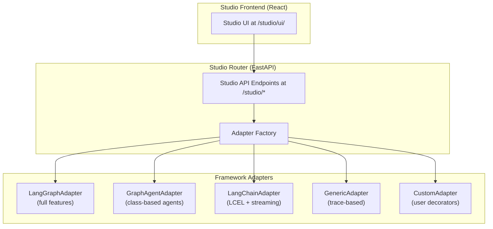

# Agentomatic Studio :material-palette:

Agentomatic Studio is a built-in visual development environment for debugging, inspecting, and tracing the execution of your agents in real-time. It works with **any agent framework** — LangGraph, LangChain, class-based (`BaseGraphAgent`), or any Python framework via `GenericAdapter` — through a universal adapter system.

!!! info "Studio vs Chat Interface"
    Agentomatic provides **two** debug interfaces optimized for different workflows:

    | | **Agentomatic Studio** (this page) | [Chat Interface](debug-ui.md) |
    |---|---|---|
    | **Purpose** | Visual debugging & state inspection | Conversational testing & feedback |
    | **Launch flag** | `--studio` | `--with-ui` |
    | **URL** | `/studio/ui/` | `/chat` |
    | **Best for** | Graph visualization, time-travel, breakpoints, state editing | Response quality testing, prompt A/B, feedback collection |
    | **Interface** | Node graph + debug panels (React) | Chat bubbles (Chainlit) |

    **Studio is the primary debug tool.** Use it when developing and debugging agents. Use the Chat Interface for conversational testing and evaluation.

---

## Quick Start

The Studio is bundled directly into the `agentomatic` pip package. No separate setup required.

```bash
pip install "agentomatic[studio]"
agentomatic run --studio
```

The unified platform starts serving your API endpoints at `http://localhost:8000` and the Studio UI at `http://localhost:8000/studio/ui/`.

The setup screen verifies the live `/studio/info` and `/studio/agents` contracts
before it opens a workspace. A generic health endpoint is not sufficient for
Studio: it cannot provide schema-driven forms, graph topology, SSE execution,
or task controls. If either contract is unavailable, start the deployment with
`--studio` and fix the reported authentication or connection error; Studio does
not substitute sample agents.

!!! tip "Temporary scaffold — not production validation"
    Want to try Studio without setting up any agents? Use the built-in demo command:

    ```bash
    agentomatic demo
    ```

    This scaffolds a temporary demo agent and launches the platform with Studio enabled, giving you an instant hands-on experience with graph visualization, streaming, and state inspection. It is not a substitute for deployment validation: use the [deployment verifier](verifying-a-deployment.md) against real agents, connections, storage, and model endpoints before release.

---


## Schema-driven forms and live contracts

Studio never invents a fixed request body for a resource. It renders the
inputs that the running platform actually declares, then displays the matching
output contract beside the result:

Chat is equally live-only: it requires a selected agent returned by the active
deployment and never creates a placeholder assistant. When a completed run
returns structured state without a textual response, Studio says so and points
to the execution logs and Graph State; it does not generate a plausible answer
in the browser.

When authentication is enabled, the setup screen keeps the API key only in the
current browser tab session so a normal refresh can restore the workspace, but
closing the tab removes the secret. Studio migrates and removes the legacy
long-lived browser copy on first use. The non-secret server URL may still be
remembered for convenience.

Conversation records are durable too. The sidebar lists the selected agent's
`/api/v1/{agent}/threads` records after connection or agent selection; opening
one fetches its server messages, and creating or deleting a conversation calls
that same API. Reloading Studio therefore restores real conversations instead
of fabricating browser-only thread identifiers. If durable thread storage is
unavailable, Studio reports the API error and does not silently start a local
conversation.

| Surface | Contract source | What Studio renders |
|---|---|---|
| Agent Chat and Graph | `GET /studio/agents/{name}/schemas` | Agent input/output schemas and provenance |
| Plugins, endpoints, and ingestors | The operation request/response schemas and documented path/query/header parameters in `GET /openapi.json` | Resource-specific form, Dict, or Raw JSON request editor |
| Pipelines | The pipeline's published `input_schema` / `output_schema` | Pipeline input form plus step statuses and durations |
| Pipeline Builder | Live agent, plugin, endpoint, ingestor, and sub-pipeline contracts | Available target fields and sensible upstream output mappings |
| Task Board | Live resource contracts plus `GET /api/v1/tasks` | Submit, poll, cancel, inspect, and remove durable task records |

In the **Pipeline Builder**, selecting any agent, plugin, endpoint, ingestor,
or sub-pipeline step opens its editable inspector. It shows the live **Accepts** and
**Produces** fields, limits the visual connection chooser to that resource's
real input fields, and exposes matching upstream outputs. Sub-pipeline
contracts come from that pipeline's published `input_schema` and
`output_schema`; the other resource contracts come from Studio or OpenAPI.
For a **Map** step, the inspector distinguishes the selected agent's per-item
input contract from the map's actual aggregate result. Downstream links can
choose `items`, `by_key`, `count`, or `succeeded`—the fields the pipeline
runtime really emits—rather than incorrectly treating one agent response as
the whole fan-out result.
Click an output and target field and choose **Link fields**, or drag the output
onto the target. Studio creates the mapping, renders the field link on the
canvas, and records a referenced `$.steps.<name>` output as an explicit DAG
upstream dependency. The serialized YAML remains standard and portable.
Existing pipeline steps use the same inspector, so they can be reviewed and
edited without falling back to YAML.
From the operational **Pipelines** page, choose **Edit in Builder** to load
that exact deployed pipeline into this editor. Builder fetches the current
server configuration after navigation (it does not pass a stale browser copy),
then lets you change cards, mappings, dependencies, and test input before
saving or using **Save & Run**.
The same schema-aware routing is available for outputs: select a field the
step produces and a declared pipeline output to create a visual route. Adding
a child step to a parallel container opens that child's inspector immediately,
so configuration never requires finding an unconfigured card manually.
The Builder's **Save & Run** dialog uses that draft pipeline input schema too;
it offers the same Form, Dict, and Raw JSON modes used by operational resource
pages rather than requiring a hand-written test payload. Before an author has
declared a pipeline input schema, it derives a clearly labelled **Suggested
test input** form from the unconnected fields in the draft's live resource
contracts. Fields already supplied by a step, default, or shared context stay
out of that form; an explicit pipeline schema always takes precedence.

Every schema form offers **Form**, **Dict**, and **Raw JSON** modes for object
contracts. A service that publishes a root scalar or array (for example a
Pydantic `RootModel[str]` or `RootModel[list[Item]]`) receives its native
single-value editor. Its native `/invoke` route receives that value unchanged.
Studio carries the value in its run envelope and exposes it to the agent as
`state["__root__"]`, the same convention used by pipeline mappings. **Raw JSON**
remains available for every schema shape. Required values are validated before a
real request is started, including nested object fields and object values within
arrays. The validation message names the exact path (for example,
`context.region` or `items[1].id`), so an operator can fix the request without
reading a backend `422` response.

Agent runs use the same live schema rather than requiring a chat-shaped
`query`. A structured agent can declare fields such as `label` and `priority`
only; Studio forwards those fields unchanged and supplies an empty query to
the execution envelope solely for framework compatibility.

For an OpenAPI operation with both a JSON body and parameters, Studio composes
one form from the complete live contract. It sends body fields as JSON, query
fields in the URL, header fields as headers, and path fields after URL-encoding
them. Where a scalar or array body also has transport parameters, Studio shows
the body as a clearly labelled **Request body** field and preserves it exactly.
If a parameter name collides with an object-body field, Studio gives the
parameter a clear location-prefixed form name rather than silently sending it
to the wrong place.

When a field declares multiple non-null `oneOf` or `anyOf` shapes, the Form
view shows an **Input shape** selector and renders the chosen branch. Nullable
fields remain a single control; the selector is reserved for genuinely
different request structures. Dict and Raw JSON remain available for advanced
or recursive contracts. Enum choices retain the JSON type published by the
service (for example `0`, `false`, or an object choice are not coerced to
strings), and a `const` value is displayed as a fixed contract field. Raw JSON
validation accepts any valid union branch instead of assuming the first branch.

If a resource is discovered but its live contract cannot be read, Studio shows
the resource-specific contract error and disables its test action. It does not
quietly substitute an empty payload: refresh after fixing the deployed
OpenAPI/pipeline configuration, then test against the recovered schema.
The Builder follows the same rule for its palette: a failed resource discovery
is shown as a visible warning with **Retry live resources**, never as a silent
empty inventory.

The **Pipelines**, **Plugins**, **Custom Endpoints**, and **Ingestors** pages
also provide an in-place **Refresh** action. It re-discovers the running
resource inventory and its current schemas without reconnecting Studio, while
leaving independently displayed results available for review. Use it after a
deployment changes a plugin, endpoint, ingestor, or pipeline contract.

The **Connections** view shows the safe backend/provider metadata, any
configuration guidance returned for an unconfigured connection, and the status
from the last independently-run live probe. It never shows a URL, DSN, request
headers, or raw driver exception.

The embedded production UI keeps its SPA document revalidatable (`Cache-Control:
no-cache`) while cache-busting hashed JavaScript and CSS chunks are immutable
for one year. This keeps new deployments visible immediately without making
operators re-download unchanged Builder, Graph, or Chat code.

Studio loads each workspace on demand. If a browser has retained an obsolete
chunk during a deployment, the workspace shows a clear recovery message with a
**Reload Studio** action instead of leaving the page blank. Reloading obtains
the revalidated application shell and its current chunk manifest.

The **Plugins** view also exposes the live **Reload** action from each
plugin's API, then displays the returned loaded status and model-card snapshot.
The **Ingestors** view runs each registered `/run` route independently and
shows the standard `IngestionResult` output schema and real result.

The **Task Board** is the operational surface for asynchronous, synchronous,
and batch work. Select a live agent, plugin, pipeline, endpoint, or ingestor;
Studio then loads its deployed input contract before submission. Active records
refresh only while work is queued or running, and task details retain the real
input, progress, result, duration, attempts, or failure message returned by
the durable task API. Operators can cancel non-terminal work and remove only
terminal records. For a batch, **Use current form as first item** converts the
schema-form value into an editable one-item JSON array; duplicate or adjust
that item for the remaining records. The editor accepts object, array, and
scalar JSON items whenever the selected live contract does. See [Tasks & Execution Modes](tasks.md)
for the API and SSE event protocol.

If an operation publishes no input schema, Studio explicitly says so and
starts with an empty object; **it does not fabricate a `{ "query": ... }`
payload**. Use Dict or Raw JSON in that case to provide the resource's actual
contract. Output schemas remain visible as a compact reference while debugging.

Declare agent schemas in `agents/<name>/schemas.py`
(`CustomInvokeRequest` / `CustomInvokeResponse` or `<Agent>Request` /
`<Agent>Response` Pydantic models). Plugin, endpoint, and ingestor schemas are normally
their request and response Pydantic models, which Agentomatic exposes through
OpenAPI automatically.

## Framework Support

Agentomatic Studio uses a **universal adapter system** to provide the best possible debugging experience for every agent framework:

| Capability | LangGraph | Deep Agent | LangChain | Custom / Raw Python | With Decorators |
|---|:---:|:---:|:---:|:---:|:---:|
| Graph Topology | ✅ Real graph | ✅ Real graph + planning nodes | ✅ LCEL extraction or synthetic chain | ✅ Synthetic linear | ✅ Custom graph |
| SSE Node Streaming | ✅ `astream_events` | ✅ `astream_events` + subagent events | ✅ `astream_events` (v2) | ✅ Trace-based | ✅ Custom stream |
| Time-Travel History | ✅ Checkpointer | ✅ Checkpointer | ✅ Store-backed traces* | ✅ Store-backed traces* | ✅ Custom provider |
| State Inspection | ✅ Checkpointer | ✅ Checkpointer | ✅ Captured I/O* | ✅ Captured I/O* | ✅ Custom provider |
| State Mutation | ✅ `aupdate_state` | ✅ `aupdate_state` | ⚠️ In-memory only | ⚠️ In-memory only | ⚠️ In-memory only |
| Breakpoints | ✅ `interrupt_before` | ✅ Interrupt + middleware | ❌ | ❌ | ❌ |
| HITL Support | ✅ Native | ✅ Native + resume | ❌ | ❌ | ❌ |
| Subagent Tracking | ❌ | ✅ `subagent_start/end` | ❌ | ❌ | ❌ |
| Task Planning | ❌ | ✅ `task_update` events | ❌ | ❌ | ❌ |

\* Durable whenever Agentomatic is configured with a persistent store such as PostgreSQL. Without one, the adapter keeps the same information in its in-process cache for local development.

!!! tip "Using LangChain Deep Agents?"
    See the dedicated **[Deep Agent Integration Guide](deep-agents.md)** for setup, subagent tracking, HITL interrupts, and the `deepagent` scaffold template.

!!! note "Adapter Selection is Automatic"
    The Studio automatically selects the best adapter based on the `framework` field in your agent's manifest. You don't need to configure anything — just set `framework="langgraph"`, `"graph_agent"`, `"langchain"`, or `"custom"` in your `AgentManifest`.

---

## LangGraph Integration

LangGraph agents get the richest Studio experience with full graph extraction, checkpointer-based state management, breakpoints, and human-in-the-loop support.

### Example: LangGraph Agent

```python
# agents/researcher/__init__.py
from agentomatic import AgentManifest
from .graph import get_graph

manifest = AgentManifest(
    name="researcher",
    slug="researcher-agent",
    description="Multi-step research agent with web search",
    framework="langgraph",  # ← Triggers the LangGraphAdapter
)

graph_fn = get_graph  # Export the compiled graph factory
```

```python
# agents/researcher/graph.py
from langgraph.graph import StateGraph, START, END
from .nodes import search_web, analyze_results, write_report

def get_graph():
    builder = StateGraph(dict)
    builder.add_node("search", search_web)
    builder.add_node("analyze", analyze_results)
    builder.add_node("report", write_report)

    builder.add_edge(START, "search")
    builder.add_edge("search", "analyze")
    builder.add_conditional_edges(
        "analyze",
        lambda state: "report" if state.get("ready") else "search",
    )
    builder.add_edge("report", END)

    return builder.compile()
```

When launched with `--studio`, the Studio automatically:

1. **Extracts the real graph topology** from the `CompiledGraph`
2. **Streams node transitions** via `astream_events` — nodes pulse and light up as execution progresses
3. **Captures checkpoints** for time-travel debugging and state replay
4. **Supports breakpoints** — pause execution before any node
5. **Enables state editing** — modify graph state mid-execution via `aupdate_state`

---

## LangChain Integration

Agentomatic Studio provides first-class support for LangChain-based agents, chatbots, and LCEL chains. When your agent's manifest declares `framework='langchain'`, the Studio automatically uses the dedicated `LangChainAdapter`.

### Automatic Features

The LangChain adapter automatically provides:

- **LCEL graph extraction** — If your chain/runnable exposes `.get_graph()`, Studio extracts the real topology.
- **Synthetic chain graph** — If no `.get_graph()` is found, Studio renders a typical chain layout: `Input → Prompt → LLM → Output Parser → Output`.
- **Rich SSE streaming** — If `astream_events` is available on the runnable, the Studio streams `on_chain_start`, `on_chain_end`, `on_chat_model_stream`, `on_tool_start`, `on_tool_end`, and `on_llm_start/end` events in real-time.
- **Automatic message tracking** — Captures conversation messages per thread for the State tab.

### Example: LangChain Chatbot

```python
# agents/chatbot/__init__.py
from agentomatic.core.manifest import AgentManifest

manifest = AgentManifest(
    name="chatbot",
    slug="my-langchain-chatbot",
    description="A conversational chatbot using LangChain",
    framework="langchain",  # ← This triggers the LangChain adapter
)

async def node_fn(state: dict) -> dict:
    from langchain_openai import ChatOpenAI
    from langchain_core.prompts import ChatPromptTemplate

    prompt = ChatPromptTemplate.from_messages([
        ("system", "You are a helpful assistant."),
        ("human", "{query}"),
    ])
    llm = ChatOpenAI(model="gpt-4o-mini")
    chain = prompt | llm

    result = await chain.ainvoke({"query": state["current_query"]})
    return {"response": result.content}
```

That's it! Drop this agent into your `agents/` folder and launch with `agentomatic run --studio`. The Studio will automatically:

1. Show a chain-style graph in the Graph View
2. Stream LLM tokens in real-time via SSE
3. Track conversation state per thread
4. Record execution history for the History tab

### Advanced: Exposing LCEL Graphs

For richer graph visualization, export your runnable as a module-level variable named `chain`, `runnable`, or `agent`. The `LangChainAdapter` will discover it and extract the real LCEL graph:

```python
# agents/rag_bot/__init__.py
from langchain_openai import ChatOpenAI
from langchain_core.prompts import ChatPromptTemplate
from langchain_core.output_parsers import StrOutputParser

prompt = ChatPromptTemplate.from_messages([
    ("system", "Answer based on the context: {context}"),
    ("human", "{query}"),
])
llm = ChatOpenAI(model="gpt-4o-mini")
parser = StrOutputParser()

# Export as module-level — Studio will discover this automatically
chain = prompt | llm | parser
```

### Example: LangChain Agent with Tools

```python
# agents/tool_agent/__init__.py
from agentomatic.core.manifest import AgentManifest
from langchain_openai import ChatOpenAI
from langchain_core.tools import tool
from langchain.agents import create_tool_calling_agent, AgentExecutor
from langchain_core.prompts import ChatPromptTemplate

manifest = AgentManifest(
    name="tool_agent",
    slug="langchain-tool-agent",
    description="Agent with tool calling via LangChain",
    framework="langchain",
)

@tool
def get_weather(city: str) -> str:
    """Get the current weather for a city."""
    return f"The weather in {city} is 22°C and sunny."

@tool
def search_database(query: str) -> str:
    """Search the internal knowledge database."""
    return f"Found 3 results for: {query}"

llm = ChatOpenAI(model="gpt-4o-mini")
tools = [get_weather, search_database]
prompt = ChatPromptTemplate.from_messages([
    ("system", "You are a helpful assistant with access to tools."),
    ("placeholder", "{chat_history}"),
    ("human", "{input}"),
    ("placeholder", "{agent_scratchpad}"),
])

agent = create_tool_calling_agent(llm, tools, prompt)
runnable = AgentExecutor(agent=agent, tools=tools)  # (1)!

async def node_fn(state: dict) -> dict:
    result = await runnable.ainvoke({"input": state["current_query"]})
    return {"response": result["output"]}
```

1. Exported as `runnable` — Studio auto-discovers this for graph extraction

---

## Generic / Raw Python Integration

For agents that don't use LangGraph or LangChain, the Studio provides a `GenericAdapter` that wraps your `node_fn()` with timing, I/O capture, and trace events.

### Example: Raw Python Agent

```python
# agents/classifier/__init__.py
from agentomatic import AgentManifest

manifest = AgentManifest(
    name="classifier",
    slug="text-classifier",
    description="Classifies text into categories",
    framework="custom",  # ← Triggers the GenericAdapter
)

async def node_fn(state: dict) -> dict:
    query = state.get("current_query", "")

    # Your custom logic — any Python code
    if "urgent" in query.lower():
        category = "high-priority"
    elif "question" in query.lower():
        category = "inquiry"
    else:
        category = "general"

    return {
        "response": f"Classified as: {category}",
        "metadata": {"category": category, "confidence": 0.95},
    }
```

The Studio will show a synthetic linear graph (`__start__ → classifier → __end__`) and capture execution timing, inputs, and outputs.

---

## Key Features

### 1. Live Node Streaming

When you execute an agent query, the **Graph View** maps directly to your agent's topology. As the execution progresses, nodes pulse and light up in real-time.

- **LangGraph agents**: Server-Sent Events stream node transitions directly from `astream_events`.
- **LangChain agents**: SSE events stream `on_chain_start`, `on_chat_model_stream`, `on_tool_start/end` events.
- **Other agents**: The generic adapter wraps execution with trace events that capture timing, input/output payloads, and exceptions.

### 2. Time-Travel Debugging

Agentomatic records every execution step for historical replay.

- **History View**: The **Time Travel** tab lists all past checkpoints (LangGraph) or execution traces (other frameworks).
- **Replay**: Click **"Replay from here"** on any snapshot. LangGraph resumes
  through its checkpointer. For a generic adapter, Studio re-executes the
  stored input for that trace in the same thread; it does not claim to resume
  inside an arbitrary user function.

!!! warning "Framework limitations"
    Full checkpoint-based time-travel is available for **LangGraph** agents
    only. Other frameworks replay a trace's original input (persisted when a
    platform store is configured); they cannot resume a node halfway through
    execution.

### 3. Conditional Breakpoints

Freeze execution before a critical node (LangGraph only).

- **Setting Breakpoints**: Click the breakpoint marker on a node in the Graph
  View. Studio only enables it when the selected deployment advertises
  server-side breakpoint support.
- **Execution**: The graph pauses before the target node. The node pulses, and the thread is suspended.
- **Resuming**: Resume execution or edit the state before continuing.

### 4. Live State Editing

During a breakpoint pause or HITL interrupt, you can mutate the graph state.

- **State View**: Navigate to the **State** tab in the Debug Console.
- **Editing**: Click **"Edit State"**, modify the JSON, and click **"Save"**.
- **LangGraph**: Changes are persisted via `graph.aupdate_state()`.
- **Other frameworks**: Captured execution state and trace history are stored
  in the configured Agentomatic store. Manual state edits remain in the
  adapter's local cache because they do not have a framework-native mutation
  API.

!!! note "Generic trace durability"
    With a configured Agentomatic store (for example PostgreSQL), captured
    generic and LangChain traces, their I/O snapshots, and replay inputs
    survive worker and platform restarts. Manual state edits remain local to
    the worker. Use a checkpointer-backed LangGraph agent when you need native
    state mutation, breakpoint resume, or a durable mid-graph continuation.

---

## Studio Decorators

For non-LangGraph agents, you can incrementally opt-in to richer Studio capabilities using decorators. These let you provide custom graph topologies, state providers, and stream functions.

### `@studio_graph`

Register a custom graph topology for your agent:

```python
from agentomatic.studio import studio_graph

@studio_graph
def my_topology():
    return {
        "nodes": [
            {"id": "__start__", "name": "Start", "type": "start"},
            {"id": "fetch_data", "name": "Fetch Data", "type": "tool"},
            {"id": "process", "name": "Process", "type": "agent"},
            {"id": "validate", "name": "Validate", "type": "condition"},
            {"id": "__end__", "name": "End", "type": "end"},
        ],
        "edges": [
            {"source": "__start__", "target": "fetch_data"},
            {"source": "fetch_data", "target": "process"},
            {"source": "process", "target": "validate"},
            {"source": "validate", "target": "__end__", "condition": "valid"},
            {"source": "validate", "target": "process", "condition": "retry"},
        ]
    }
```

### `@studio_state`

Register a custom state provider:

```python
from agentomatic.studio import studio_state

@studio_state
async def get_my_state(thread_id: str) -> dict:
    """Return the current state for a thread."""
    return await my_database.get_thread_state(thread_id)
```

### `@studio_stream`

Register a custom SSE event stream:

```python
from agentomatic.studio import studio_stream
from agentomatic.studio.models import StudioRunEvent

@studio_stream
async def my_streamer(state, config, breakpoints):
    yield StudioRunEvent(event="node_start", run_id="", timestamp="...", node="my_node")
    result = await my_agent.process(state)
    yield StudioRunEvent(event="node_end", run_id="", timestamp="...", node="my_node", data={"output": result})
```

!!! tip "Combining decorators"
    You can use any combination of decorators. For example, provide a custom graph topology while using the default trace-based streaming:
    ```python
    @studio_graph
    def my_graph():
        return {"nodes": [...], "edges": [...]}

    # node_fn uses default GenericAdapter streaming
    async def node_fn(state: dict) -> dict:
        ...
    ```

---

## The `agentomatic demo` Command

For a quick hands-on experience with Studio, use the built-in demo command:

```bash
agentomatic demo
```

This command:

1. **Scaffolds a temporary demo agent** with a pre-built LangGraph workflow
2. **Launches the platform** with Studio enabled
3. **Opens the Studio UI** in your default browser

It's the fastest way to see Studio's graph visualization, node streaming, and state inspection in action.

!!! note "Demo agents are temporary"
    The demo agent is created in a temporary directory and cleaned up when the server stops. To create a permanent agent, use `agentomatic init` instead.

---

## Architecture

The Studio uses a layered adapter architecture:


```mermaid
graph TB
    subgraph Frontend["Studio Frontend (React)"]
        UI["Studio UI at /studio/ui/"]
    end

    subgraph Router["Studio Router (FastAPI)"]
        SR["Studio API Endpoints at /studio/*"]
        AF["Adapter Factory"]
    end

    subgraph Adapters["Framework Adapters"]
        LGA["LangGraphAdapter<br/>(full features)"]
        GAA["GraphAgentAdapter<br/>(class-based agents)"]
        LCA["LangChainAdapter<br/>(LCEL + streaming)"]
        GA["GenericAdapter<br/>(trace-based)"]
        CA["CustomAdapter<br/>(user decorators)"]
    end

    UI --> SR
    SR --> AF
    AF --> LGA
    AF --> GAA
    AF --> LCA
    AF --> GA
    AF --> CA
```

- **Studio Router**: Framework-agnostic FastAPI endpoints that delegate to adapters.
- **Adapter Factory**: Automatically selects the best adapter based on the agent's `framework` field and available decorators.
- **LangGraphAdapter**: Full-featured — uses `CompiledGraph` APIs natively for graph extraction, checkpoint state, breakpoints, and HITL. Triggered by `framework="langgraph"` / `"deepagent"` (or a non-class agent with `graph_fn`).
- **GraphAgentAdapter**: For class-based agents (`BaseGraphAgent`). Provides graph topology extraction, streaming, and trace support. Triggered by `framework="graph_agent"` or a registered `class_instance` — resolved **before** the generic `graph_fn` → LangGraph branch, because class agents also expose `graph_fn`.
- **LangChainAdapter**: Extracts LCEL graphs via `.get_graph()`, streams via `astream_events`, and tracks messages per thread. Triggered by `framework="langchain"`.
- **GenericAdapter**: Trace-based — wraps `node_fn()` with timing and I/O capture for any Python agent. Fallback for `framework="custom"` or unknown frameworks.
- **Custom Adapter**: User-registered via `@studio_graph`, `@studio_state`, and `@studio_stream` decorators.

### API Endpoints

| Endpoint | Method | Description |
|---|---|---|
| `/studio/info` | GET | Platform metadata and capabilities |
| `/studio/agents` | GET | List agents with Studio capabilities |
| `/studio/agents/{name}/graph` | GET | Graph topology (real or synthetic) |
| `/studio/agents/{name}/schemas` | GET | Input/output JSON schemas |
| `/studio/agents/{name}/runs/stream` | POST | SSE-streamed execution |
| `/studio/agents/{name}/threads/{tid}/state` | GET | Thread state snapshot |
| `/studio/agents/{name}/threads/{tid}/state` | POST | Update thread state (LangGraph: persistent; other adapters: best-effort local override) |
| `/studio/agents/{name}/threads/{tid}/history` | GET | Checkpoint/trace history |

---

## Troubleshooting

??? question "Studio page shows a blank screen"
    Ensure you have the `studio` extra installed:
    ```bash
    pip install "agentomatic[studio]"
    ```
    Check that the Studio static files are present in your installation with `agentomatic doctor`.

??? question "Graph shows a generic linear layout instead of my real graph"
    - **LangGraph**: Ensure your `graph_fn` returns a `CompiledGraph` (not a `StateGraph`). Call `.compile()`.
    - **LangChain**: Export your chain as a module-level variable named `chain`, `runnable`, or `agent`.
    - **Custom**: Use the `@studio_graph` decorator to register a custom topology.

??? question "SSE streaming doesn't show real-time node updates"
    - Check that your browser supports Server-Sent Events (all modern browsers do).
    - For LangChain agents, ensure you're using a runnable that supports `astream_events` (v2).
    - Check the browser's Network tab for SSE connection issues.
