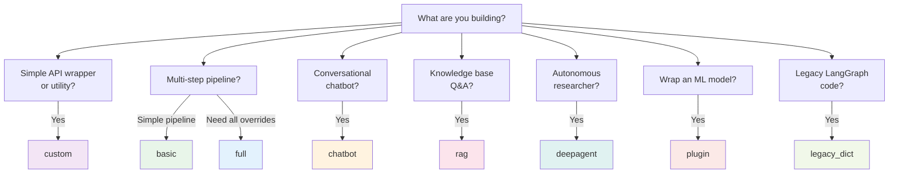

# Scaffolding Templates

<div align="center">
  
  <h3>Agent Scaffolding and Project Generation</h3>
</div>

---

Agentomatic ships with **14 templates** for rapid agent creation. Each template generates a complete, runnable agent package with the right files, structure, and boilerplate for your use case.

---

## 🚀 Quick Start

=== "Interactive (Recommended)"

    ```bash
    # Launches a guided questionnaire to pick template and configure
    agentomatic init my_agent
    ```

    !!! tip "Requires `questionary`"
        Install with `pip install questionary` for the interactive prompt experience.

=== "Non-Interactive"

    ```bash
    # Specify template directly
    agentomatic init my_agent --template basic
    ```

Both commands create the agent folder at `agents/my_agent/` with all necessary files.

---

## 📊 Template Comparison

| Template | Framework | Graph | Config | Tools | Custom API | Best For |
|----------|:---------:|:-----:|:------:|:-----:|:----------:|----------|
| **`basic`** | Built-in | ✅ | ❌ | ❌ | ❌ | Quick prototyping and learning |
| **`full`** | Built-in | ✅ | ✅ | ✅ | ✅ | Production agents with all overrides |
| **`rag`** | Built-in | ✅ | ❌ | ❌ | ❌ | Knowledge bases, Q&A over documents |
| **`chatbot`** | Built-in | ✅ | ❌ | ❌ | ❌ | Conversational agents with memory |
| **`deepagent`** | LangGraph | ❌¹ | ❌ | ✅ | ❌ | Autonomous planning with sub-agents |
| **`custom`** | Custom | ❌ | ❌ | ❌ | ❌ | Framework-agnostic, minimal deps |
| **`legacy_dict`** | LangGraph | ✅ | ❌ | ❌ | ❌ | Legacy functional agent (3 files) |
| **`plugin`** | N/A | ❌ | ❌ | ❌ | ❌ | ML Model Plugins with REST endpoints |

¹ *Deep agent uses `agent.py` with `create_deep_agent()` instead of `build_graph()`*

!!! note "All class-based templates use `AgentGraph`"
    Templates `basic`, `full`, `rag`, and `chatbot` generate `BaseGraphAgent` subclasses that use agentomatic's built-in `AgentGraph` runtime — **no LangGraph dependency required**.

---

## 📁 Generated Files by Template

### `basic` — Minimal Agent

The simplest starting point — a class-owned ``BaseGraphAgent`` (also
available as ``--template class``).

```bash
agentomatic init my_agent --template basic
# or: agentomatic init my_agent --template class
```

```text
agents/my_agent/
├── __init__.py          # AgentManifest card
├── agent.py             # BaseGraphAgent subclass
├── llm.py               # Stack-aware LLM helpers
├── prompts.json         # v1/v2 prompt templates
├── langgraph.json       # LangGraph Studio config
├── .env.example         # Environment variable template
└── README.md            # Agent documentation
```

!!! tip "Class-agent layout"
    `basic` / `class` emit `agent.py` + `llm.py` — not the legacy
    `graph.py` / `nodes.py` layout (use `--template legacy_dict` for that).

---

### `full` — All Override Files

Includes every possible override file. Ideal for production agents that need full control.

```bash
agentomatic init my_agent --template full
```

```text
agents/my_agent/
├── __init__.py          # AgentManifest card
├── agent.py             # BaseGraphAgent subclass (+ get_graph export)
├── llm.py               # Stack-aware LLM helpers
├── config.py            # Pydantic config (MyAgentConfig)
├── schemas.py           # Custom request/response models
├── tools.py             # Tool definitions
├── api.py               # Optional custom FastAPI router
├── dataset.jsonl        # Sample train/eval data
├── train.py / eval.py / optimize.py / predict.py
├── search_space.yaml    # PromptFitter search space
├── Makefile
├── prompts.json
├── langgraph.json       # Points at ./agent.py:get_graph
├── .env.example
└── README.md
```

??? example "Generated `config.py`"

    ```python
    """Configuration for My Agent agent."""
    from pydantic import BaseModel, Field

    class MyAgentConfig(BaseModel):
        """Agent-specific configuration."""
        prompt_version: str = Field("v1", description="Active prompt version")
        temperature: float = Field(0.1, ge=0.0, le=2.0)
        max_tokens: int = Field(2048, ge=1)
        enable_memory: bool = Field(True, description="Enable conversation memory")
    ```

??? example "Generated `schemas.py`"

    ```python
    """Custom schemas for my_agent."""
    from pydantic import BaseModel, Field

    class MyAgentRequest(BaseModel):
        """Custom request model."""
        query: str = Field(..., description="User query")
        context: dict = Field(default_factory=dict)

    class MyAgentResponse(BaseModel):
        """Custom response model."""
        answer: str
        confidence: float = Field(0.0, ge=0.0, le=1.0)
        sources: list[str] = Field(default_factory=list)
    ```

??? example "Generated `api.py`"

    ```python
    """Custom API router for my_agent.

    If this file exports a `router`, it REPLACES the auto-generated endpoints.
    Remove this file to use auto-generated endpoints instead.
    """
    from fastapi import APIRouter

    router = APIRouter()

    @router.get("/status")
    async def status() -> dict:
        """Custom status endpoint."""
        return {"agent": "my_agent", "custom_router": True}
    ```

!!! warning "Custom Router Override"
    When `api.py` is present and exports a `router`, **all 12 auto-generated endpoints are dropped**. Remove `api.py` to restore the default REST API.

---

### `rag` — Retrieval-Augmented Generation

A two-stage pipeline (`retrieve → generate`) pre-configured for knowledge-base Q&A.

```bash
agentomatic init knowledge_bot --template rag
```

```text
agents/knowledge_bot/
├── __init__.py          # AgentManifest with RAG keywords
├── agent.py             # BaseGraphAgent: retrieve → generate
├── llm.py               # Stack-aware LLM helpers
├── config.py            # Pydantic config
├── tools.py             # Search tool stubs
├── prompts.json
├── langgraph.json       # ./agent.py:get_graph
├── .env.example
└── README.md
```

!!! tip "Class-agent RAG"
    The `rag` template is a `BaseGraphAgent` with `retrieve` + `generate`
    nodes — not the legacy `graph.py` / `nodes.py` layout.

---

### `chatbot` — Conversational Agent

Optimized for multi-turn conversations with memory support.

```bash
agentomatic init assistant --template chatbot
```

```text
agents/assistant/
├── __init__.py          # AgentManifest with chat keywords
├── agent.py             # BaseGraphAgent conversational agent
├── llm.py               # Stack-aware LLM helpers
├── config.py            # Pydantic config
├── prompts.json
├── langgraph.json       # ./agent.py:get_graph
├── .env.example
└── README.md
```

!!! tip "Class-agent chatbot"
    The `chatbot` template is a `BaseGraphAgent` subclass with prompt-backed
    conversation, not the legacy `graph.py` / `nodes.py` layout.

---

### `deepagent` — Deep Agent with Planning

Uses the `deepagents` package for autonomous planning, tool usage, and sub-agent delegation.

```bash
agentomatic init researcher --template deepagent
```

```text
agents/researcher/
├── __init__.py          # Manifest + graph_fn + node_fn
├── agent.py             # Deep agent definition with tools
├── config.py            # Pydantic config
├── prompts.json         # v1/v2 prompt templates
├── .env.example         # Environment variable template
└── README.md            # Agent documentation
```

??? example "Generated `agent.py`"

    ```python
    """Deep Agent definition for researcher.

    Uses LangChain's `deepagents` harness for planning, tools,
    subagent delegation, and context management.
    """
    from functools import lru_cache

    def internet_search(query: str, max_results: int = 5) -> str:
        """Search the internet for information."""
        # TODO: Replace with real search (Tavily, SerpAPI, etc.)
        return f"Search results for: {query} ({max_results} results)"

    @lru_cache(maxsize=1)
    def create_agent():
        """Create and compile the deep agent."""
        from deepagents import create_deep_agent

        return create_deep_agent(
            model="openai:gpt-4o",
            system_prompt=(
                "You are Researcher, "
                "an expert AI assistant. Be thorough and accurate."
            ),
            tools=[internet_search],
        )
    ```

!!! info "Dependency"
    The `deepagent` template requires the `deepagents` package: `pip install deepagents`

---

### `custom` — Framework-Agnostic

The most minimal template. Pure Python with no LangGraph dependency — ideal for simple API wrappers or custom frameworks.

```bash
agentomatic init simple --template custom
```

```text
agents/simple/
├── __init__.py          # Manifest + node_fn (framework="custom")
├── prompts.json         # v1/v2 prompt templates
├── .env.example         # Environment variable template
└── README.md            # Agent documentation
```

??? example "Generated custom `__init__.py`"

    ```python
    """Agent: simple (framework-agnostic)."""
    from __future__ import annotations
    from typing import Any
    from agentomatic import AgentManifest

    manifest = AgentManifest(
        name="simple",
        slug="agent-simple",
        description="Simple agent",
        intent_keywords=["simple"],
        framework="custom",
    )

    async def node_fn(state: dict[str, Any]) -> dict[str, Any]:
        """Process the request directly — no graph framework needed."""
        query = state.get("current_query", "")
        return {
            "response": f"Hello from simple! You asked: {query}",
            "agent_type": "agent-simple",
        }
    ```

---

### `legacy_dict` — Legacy Functional Agent

The classic agentomatic pattern using `__init__.py` with `manifest` + `node_fn`. Ideal for quick utilities or migrating existing LangGraph code.

```bash
agentomatic init helper --template legacy_dict
```

```text
agents/helper/
├── __init__.py          # Manifest + node_fn entrypoint
├── .env.example         # Environment config
└── README.md            # Agent documentation
```

??? example "Generated `__init__.py`"

    ```python
    """Agent: helper (legacy functional pattern)."""
    from __future__ import annotations
    from typing import Any
    from agentomatic import AgentManifest

    manifest = AgentManifest(
        name="helper",
        slug="agent-helper",
        description="Helper agent",
        intent_keywords=["helper", "assist"],
        framework="custom",
    )

    async def node_fn(state: dict[str, Any]) -> dict[str, Any]:
        """Process the user's request and return a response."""
        query = state.get("current_query", "")
        return {
            "response": f"Processed: {query}",
            "agent_type": "helper",
            "suggestions": [],
        }
    ```

!!! tip "When to use `legacy_dict`"
    Use this template when you want the simplest possible agent — a single async function with no graph, no class, no state management. Perfect for wrappers around external APIs.

---

### `plugin` — ML Model Plugin

Wrap a classical ML model (scikit-learn, XGBoost, etc.) as a REST endpoint using `BaseMLPlugin`.

```bash
agentomatic init my_classifier --template plugin
```

```text
agents/my_classifier/
├── agent.py             # BaseMLPlugin subclass
├── .env.example         # Environment config
└── README.md            # Plugin documentation
```

??? example "Generated `agent.py`"

    ```python
    """ML Plugin: my_classifier."""
    from __future__ import annotations
    from typing import Any
    from pydantic import BaseModel, Field
    from agentomatic.plugins import BaseMLPlugin

    class PredictInput(BaseModel):
        features: list[float] = Field(..., description="Input feature vector")

    class PredictOutput(BaseModel):
        prediction: float = Field(..., description="Model prediction")
        confidence: float = Field(0.0, description="Prediction confidence")

    class MyClassifierPlugin(BaseMLPlugin[PredictInput, PredictOutput]):
        plugin_name = "my_classifier"
        plugin_description = "Classification model plugin"
        plugin_version = "1.0.0"

        def load_model(self) -> Any:
            """Load and return the trained model."""
            # Example: return joblib.load("model.pkl")
            return None

        def predict(self, model: Any, input_data: PredictInput) -> PredictOutput:
            """Run prediction on the loaded model."""
            return PredictOutput(
                prediction=0.0,
                confidence=0.95,
            )
    ```

!!! info "ML Plugin Features"
    Plugins get automatic REST endpoints (`/predict`, `/health`, `/model-card`) and can be deployed alongside agents in the same platform. See [ML Plugins](ml-plugins.md) for the full guide.

---

!!! note "This is the `basic` template pattern"
    The code below shows the class-based agent structure generated by `agentomatic init analyzer --template basic`. All class-based templates (`basic`, `full`, `rag`, `chatbot`) generate this pattern.

```bash
agentomatic init analyzer --template basic
```

```text
agents/analyzer/
├── __init__.py          # AgentManifest + node_fn for auto-discovery
├── agent.py             # BaseGraphAgent subclass with build_graph()
├── llm.py               # LLM configuration
├── prompts.json         # Prompt templates
├── dataset.jsonl        # Sample training/test dataset
├── train.py             # ML-like training script
├── .env.example         # Environment config
└── README.md            # Agent documentation
```

??? example "Generated `agent.py`"

    ```python
    """Class-based agent: analyzer."""
    from __future__ import annotations

    from dataclasses import dataclass, field
    from typing import Any

    from agentomatic.agents import BaseGraphAgent


    @dataclass
    class AnalyzerState:
        """Agent state — per-run transient data."""

        request: str = ""
        context: list[str] = field(default_factory=list)
        output: dict[str, Any] = field(default_factory=dict)


    class AnalyzerAgent(BaseGraphAgent[AnalyzerState]):
        """ML-like class agent for analyzer.

        Usage::

            agent = AnalyzerAgent(llm=my_llm)
            result = agent.transform({"request": "Hello"})
        """

        agent_name = "analyzer"
        agent_description = "Analyzer agent"

        def __init__(self, *, llm: Any = None) -> None:
            super().__init__()
            self.llm = llm
            self.system_prompt = "You are a helpful assistant."

        # --- Graph Definition ---

        def build_graph(self):
            """Wire the execution graph."""
            g = self.new_graph()
            g.add_node("process", self.process)
            g.add_node("generate", self.generate)
            g.set_entry_point("process")
            g.add_edge("process", "generate")
            g.set_finish_point("generate")
            return g.compile()

        # --- Node Methods ---

        def process(self, state: AnalyzerState) -> AnalyzerState:
            """Process the input request."""
            state.context = [f"Processed: {state.request}"]
            return state

        def generate(
            self, state: AnalyzerState,
        ) -> AnalyzerState:
            """Generate the final output."""
            state.output = {
                "response": f"Result for: {state.request}",
                "agent_type": "analyzer",
            }
            return state

        # --- State Conversion ---

        def input_to_state(
            self, input_data: dict[str, Any],
        ) -> AnalyzerState:
            return AnalyzerState(
                request=input_data.get("request", ""),
            )

        def state_to_output(
            self, state: AnalyzerState,
        ) -> dict[str, Any]:
            return state.output
    ```

??? example "Generated `dataset.jsonl`"

    ```jsonl
    {"id": "analyzer_001", "split": "train", "input": {"request": "Help me with task planning"}, "expected_output": {"response": "Here is a plan..."}, "metadata": {"domain": "general", "difficulty": "easy"}}
    {"id": "analyzer_002", "split": "train", "input": {"request": "Summarize this document"}, "expected_output": {"response": "Summary: ..."}, "metadata": {"domain": "general", "difficulty": "medium"}}
    {"id": "analyzer_003", "split": "test", "input": {"request": "Analyze the risks"}, "expected_output": {"response": "Risks identified: ..."}, "metadata": {"domain": "general", "difficulty": "hard"}}
    ```

??? example "Generated `train.py` (flat `TrainCliSettings` + staged comment)"

    Scaffolded class agents use a flat script: settings → agent →
    [`train_and_report`](optimization.md) (full abstraction). The same file
    includes a **commented staged Keras-like** example
    (`load_data` → `build_default_metrics` → `compile_agent` → `fit_agent` →
    `evaluate_agent`) for full control — both tiers share the same primitives.

    ```python
    from agentomatic.optimize import TrainCliSettings, print_train_result, train_and_report
    from agents.analyzer.agent import AnalyzerAgent

    cli = TrainCliSettings.parse()  # AGENTOMATIC_* env + --help CLI flags
    result = train_and_report(
        agent,
        config=cli.to_train_config(
            agent_name="analyzer",
            agent_dir=HERE,
            stacks_dir=ROOT / "stacks",
            env_path=ROOT / ".env",
            required_keys=["response"],
            judge_dimensions=["relevance", "accuracy", "structure"],
        ),
    )
    print_train_result(result)
    ```

    Matching `eval.py` uses `EvalCliSettings` → `evaluate_and_report` →
    `print_eval_result`. See [Prompt Optimization](optimization.md) for both
    tiers and the full knob table.

!!! info "No LangGraph Required"
    Class agents use the built-in `AgentGraph` runtime. Wire your graph in `build_graph()` using `new_graph()` — no need for `langgraph` or `StateGraph`.

---

## 🤔 Which Template Should I Use?



| If you need... | Use template |
|----------------|:------------:|
| Quick prototype, minimum files | `basic` |
| Full control over API, schemas, tools | `full` |
| Document retrieval + answer generation | `rag` |
| Multi-turn conversation with memory | `chatbot` |
| Autonomous planning with tools | `deepagent` |
| No framework dependency, pure Python | `custom` |
| Legacy functional agent (dict-based) | `legacy_dict` |
| Wrap a classical ML model | `plugin` |

---

## 📁 Common Files

All templates (except `custom` and `deepagent`) include these common files:

| File | Purpose |
|------|---------|
| `prompts.json` | Two prompt versions (`v1` concise, `v2` detailed) with system and user templates |
| `langgraph.json` | LangGraph Studio config (`./agent.py:get_graph` for class agents, `./graph.py:get_graph` for legacy) |
| `.env.example` | Template for agent-specific env vars (LLM settings, feature flags) |
| `README.md` | Auto-generated documentation with quick start commands and file reference |

### Common `prompts.json` Content

```json
{
  "v1": {
    "system": "You are a helpful AI assistant. Be concise and accurate.",
    "user_template": "{query}"
  },
  "v2": {
    "system": "You are an advanced AI assistant. Provide detailed, well-structured responses with examples when helpful.",
    "user_template": "Please help with the following: {query}"
  }
}
```

### Common `.env.example` Content

```bash
# my_agent agent configuration
# Copy to .env and fill in values

# LLM Settings
MY_AGENT_LLM_PROVIDER=ollama
MY_AGENT_LLM_MODEL=mistral:7b
MY_AGENT_TEMPERATURE=0.1
MY_AGENT_MAX_TOKENS=2048

# Feature Flags
MY_AGENT_ENABLE_MEMORY=true
MY_AGENT_ENABLE_STREAMING=true
```

---

## 🧪 After Scaffolding

Once your agent is generated, start the platform and test:

```bash
# Start the platform
agentomatic run

# Test your agent
curl -X POST http://localhost:8000/api/v1/my_agent/invoke \
  -H "Content-Type: application/json" \
  -d '{"query": "Hello, world!"}'

# Check health
curl http://localhost:8000/api/v1/my_agent/health

# View in Swagger docs
open http://localhost:8000/docs
```
