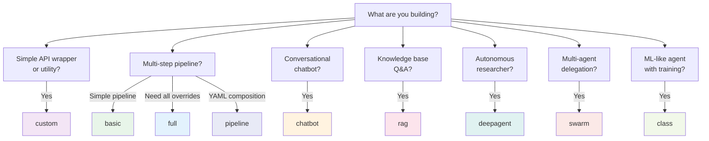

# Scaffolding Templates

<div align="center">
  
  <h3>Agent Scaffolding and Project Generation</h3>
</div>

---

Agentomatic ships with **9 templates** for rapid agent creation. Each template generates a complete, runnable agent package with the right files, structure, and boilerplate for your use case.

---

## 🚀 Quick Start

=== "Interactive (Recommended)"

    ```bash
    # Launches a guided questionnaire to pick template and configure
    agentomatic init my_agent
    ```

    !!! tip "Requires `questionary`"
        Install with `pip install questionary` for the interactive prompt experience.

=== "Non-Interactive"

    ```bash
    # Specify template directly
    agentomatic init my_agent --template basic
    ```

Both commands create the agent folder at `agents/my_agent/` with all necessary files.

---

## 📊 Template Comparison

| Template | Files | Framework | Graph | Config | Tools | Custom API | Best For |
|----------|:-----:|:---------:|:-----:|:------:|:-----:|:----------:|----------|
| **`basic`** | 7 | LangGraph | ✅ | ❌ | ❌ | ❌ | Quick prototyping and learning |
| **`full`** | 11 | LangGraph | ✅ | ✅ | ✅ | ✅ | Production agents with all overrides |
| **`rag`** | 9 | LangGraph | ✅ | ✅ | ✅ | ❌ | Knowledge bases, Q&A over documents |
| **`chatbot`** | 8 | LangGraph | ✅ | ✅ | ❌ | ❌ | Conversational agents with memory |
| **`deepagent`** | 6 | LangGraph | ❌¹ | ✅ | ✅ | ❌ | Autonomous planning with sub-agents |
| **`custom`** | 4 | Custom | ❌ | ❌ | ❌ | ❌ | Framework-agnostic, minimal deps |
| **`swarm`** | 12 | LangGraph | ✅ | ✅ | ❌ | ❌ | Multi-agent delegation and handoffs |
| **`pipeline`** | 2 | YAML | ❌ | ❌ | ❌ | ❌ | Multi-agent workflow composition |
| **`class`** | 4 | Built-in | ✅² | ❌ | ❌ | ❌ | ML lifecycle: compile/fit/evaluate |

¹ *Deep agent uses `agent.py` with `create_deep_agent()` instead of `graph.py`*
² *Class agent uses `AgentGraph` (built-in runtime) — no LangGraph dependency*

---

## 📁 Generated Files by Template

### `basic` — Minimal Agent

The simplest starting point. Three core files plus common scaffolding.

```bash
agentomatic init my_agent --template basic
```

```text
agents/my_agent/
├── __init__.py          # Manifest + node_fn (delegates to graph)
├── graph.py             # Single-node StateGraph: process → END
├── nodes.py             # process() node function
├── prompts.json         # v1/v2 prompt templates
├── langgraph.json       # LangGraph Studio config
├── .env.example         # Environment variable template
└── README.md            # Agent documentation
```

??? example "Generated `__init__.py`"

    ```python
    """Agent: my_agent."""
    from __future__ import annotations
    from typing import Any
    from agentomatic import AgentManifest

    manifest = AgentManifest(
        name="my_agent",
        slug="agent-my_agent",
        description="My Agent agent",
        intent_keywords=["my_agent"],
        framework="langgraph",
    )

    async def node_fn(state: dict[str, Any]) -> dict[str, Any]:
        from .graph import get_graph
        return await get_graph().ainvoke(state)
    ```

??? example "Generated `graph.py`"

    ```python
    """LangGraph graph for my_agent."""
    from functools import lru_cache
    from langgraph.graph import END, StateGraph
    from agentomatic import BaseAgentState
    from . import nodes

    def build_graph() -> StateGraph:
        g = StateGraph(BaseAgentState)
        g.add_node("process", nodes.process)
        g.set_entry_point("process")
        g.add_edge("process", END)
        return g

    @lru_cache(maxsize=1)
    def get_graph():
        return build_graph().compile()
    ```

---

### `full` — All Override Files

Includes every possible override file. Ideal for production agents that need full control.

```bash
agentomatic init my_agent --template full
```

```text
agents/my_agent/
├── __init__.py          # Manifest + node_fn
├── graph.py             # Single-node StateGraph
├── nodes.py             # process() node function
├── config.py            # Pydantic config (MyAgentConfig)
├── schemas.py           # Custom request/response models
├── tools.py             # LangChain tool definitions
├── api.py               # Custom FastAPI router (replaces auto-routes)
├── prompts.json         # v1/v2 prompt templates
├── langgraph.json       # LangGraph Studio config
├── .env.example         # Environment variable template
└── README.md            # Agent documentation
```

??? example "Generated `config.py`"

    ```python
    """Configuration for My Agent agent."""
    from pydantic import BaseModel, Field

    class MyAgentConfig(BaseModel):
        """Agent-specific configuration."""
        prompt_version: str = Field("v1", description="Active prompt version")
        temperature: float = Field(0.1, ge=0.0, le=2.0)
        max_tokens: int = Field(2048, ge=1)
        enable_memory: bool = Field(True, description="Enable conversation memory")
    ```

??? example "Generated `schemas.py`"

    ```python
    """Custom schemas for my_agent."""
    from pydantic import BaseModel, Field

    class MyAgentRequest(BaseModel):
        """Custom request model."""
        query: str = Field(..., description="User query")
        context: dict = Field(default_factory=dict)

    class MyAgentResponse(BaseModel):
        """Custom response model."""
        answer: str
        confidence: float = Field(0.0, ge=0.0, le=1.0)
        sources: list[str] = Field(default_factory=list)
    ```

??? example "Generated `api.py`"

    ```python
    """Custom API router for my_agent.

    If this file exports a `router`, it REPLACES the auto-generated endpoints.
    Remove this file to use auto-generated endpoints instead.
    """
    from fastapi import APIRouter

    router = APIRouter()

    @router.get("/status")
    async def status() -> dict:
        """Custom status endpoint."""
        return {"agent": "my_agent", "custom_router": True}
    ```

!!! warning "Custom Router Override"
    When `api.py` is present and exports a `router`, **all 12 auto-generated endpoints are dropped**. Remove `api.py` to restore the default REST API.

---

### `rag` — Retrieval-Augmented Generation

A two-stage pipeline (`retrieve → generate`) pre-configured for knowledge-base Q&A.

```bash
agentomatic init knowledge_bot --template rag
```

```text
agents/knowledge_bot/
├── __init__.py          # Manifest with RAG keywords
├── graph.py             # Two-stage: retrieve → generate → END
├── nodes.py             # retrieve() + generate() nodes
├── config.py            # Pydantic config
├── tools.py             # Search tool definitions
├── prompts.json         # v1/v2 prompt templates
├── langgraph.json       # LangGraph Studio config
├── .env.example         # Environment variable template
└── README.md            # Agent documentation
```

??? example "Generated RAG `graph.py`"

    ```python
    """RAG graph for knowledge_bot: retrieve -> generate."""
    from functools import lru_cache
    from langgraph.graph import END, StateGraph
    from agentomatic import BaseAgentState
    from . import nodes

    def build_graph() -> StateGraph:
        g = StateGraph(BaseAgentState)
        g.add_node("retrieve", nodes.retrieve)
        g.add_node("generate", nodes.generate)
        g.set_entry_point("retrieve")
        g.add_edge("retrieve", "generate")
        g.add_edge("generate", END)
        return g

    @lru_cache(maxsize=1)
    def get_graph():
        return build_graph().compile()
    ```

??? example "Generated RAG `nodes.py`"

    ```python
    """RAG node functions for knowledge_bot."""

    async def retrieve(state: dict) -> dict:
        """Retrieve relevant documents."""
        query = state.get("current_query", "")
        # TODO: Replace with real vector search
        docs = [
            {"content": f"Document about {query}", "source": "knowledge_base"},
        ]
        return {"citations": docs, "steps_taken": ["retrieved_docs"]}

    async def generate(state: dict) -> dict:
        """Generate response using retrieved context."""
        query = state.get("current_query", "")
        citations = state.get("citations", [])
        context = "\n".join(d.get("content", "") for d in citations)
        return {
            "response": f"Based on the knowledge base: Answer to '{query}'",
            "agent_type": "agent-knowledge_bot",
            "steps_taken": ["generated_response"],
        }
    ```

---

### `chatbot` — Conversational Agent

Optimized for multi-turn conversations with memory support.

```bash
agentomatic init assistant --template chatbot
```

```text
agents/assistant/
├── __init__.py          # Manifest with chat keywords
├── graph.py             # Single-node: respond → END
├── nodes.py             # respond() with conversation history access
├── config.py            # Pydantic config
├── prompts.json         # v1/v2 prompt templates
├── langgraph.json       # LangGraph Studio config
├── .env.example         # Environment variable template
└── README.md            # Agent documentation
```

??? example "Generated chatbot `nodes.py`"

    ```python
    """Chatbot node functions for assistant with conversation memory."""

    async def respond(state: dict) -> dict:
        """Generate a conversational response."""
        query = state.get("current_query", "")
        messages = state.get("messages", [])
        history_len = len(messages)

        # TODO: Replace with real LLM call
        return {
            "response": f"[Turn {history_len + 1}] You said: {query}",
            "agent_type": "agent-assistant",
            "suggestions": ["Tell me more", "Change topic", "Goodbye"],
        }
    ```

---

### `deepagent` — Deep Agent with Planning

Uses the `deepagents` package for autonomous planning, tool usage, and sub-agent delegation.

```bash
agentomatic init researcher --template deepagent
```

```text
agents/researcher/
├── __init__.py          # Manifest + graph_fn + node_fn
├── agent.py             # Deep agent definition with tools
├── config.py            # Pydantic config
├── prompts.json         # v1/v2 prompt templates
├── .env.example         # Environment variable template
└── README.md            # Agent documentation
```

??? example "Generated `agent.py`"

    ```python
    """Deep Agent definition for researcher.

    Uses LangChain's `deepagents` harness for planning, tools,
    subagent delegation, and context management.
    """
    from functools import lru_cache

    def internet_search(query: str, max_results: int = 5) -> str:
        """Search the internet for information."""
        # TODO: Replace with real search (Tavily, SerpAPI, etc.)
        return f"Search results for: {query} ({max_results} results)"

    @lru_cache(maxsize=1)
    def create_agent():
        """Create and compile the deep agent."""
        from deepagents import create_deep_agent

        return create_deep_agent(
            model="openai:gpt-4o",
            system_prompt=(
                "You are Researcher, "
                "an expert AI assistant. Be thorough and accurate."
            ),
            tools=[internet_search],
        )
    ```

!!! info "Dependency"
    The `deepagent` template requires the `deepagents` package: `pip install deepagents`

---

### `custom` — Framework-Agnostic

The most minimal template. Pure Python with no LangGraph dependency — ideal for simple API wrappers or custom frameworks.

```bash
agentomatic init simple --template custom
```

```text
agents/simple/
├── __init__.py          # Manifest + node_fn (framework="custom")
├── prompts.json         # v1/v2 prompt templates
├── .env.example         # Environment variable template
└── README.md            # Agent documentation
```

??? example "Generated custom `__init__.py`"

    ```python
    """Agent: simple (framework-agnostic)."""
    from __future__ import annotations
    from typing import Any
    from agentomatic import AgentManifest

    manifest = AgentManifest(
        name="simple",
        slug="agent-simple",
        description="Simple agent",
        intent_keywords=["simple"],
        framework="custom",
    )

    async def node_fn(state: dict[str, Any]) -> dict[str, Any]:
        """Process the request directly — no graph framework needed."""
        query = state.get("current_query", "")
        return {
            "response": f"Hello from simple! You asked: {query}",
            "agent_type": "agent-simple",
        }
    ```

---

### `swarm` — Multi-Agent Delegation

A swarm-style agent pre-configured for delegation and handoffs between agents. Includes delegation config, security policy, eval scaffolding, and a model card.

```bash
agentomatic init coordinator --template swarm
```

```text
agents/coordinator/
├── __init__.py          # Manifest + graph_fn + node_fn (delegation_targets)
├── graph.py             # Swarm graph with delegation support
├── nodes.py             # process() node function
├── config.py            # Pydantic config
├── delegation.py        # Delegation targets + handoff tools
├── security.py          # Agent security policy
├── evals.py             # Evaluation test cases
├── model_card.yaml      # Agent model card
├── prompts.json         # v1/v2 prompt templates
├── langgraph.json       # LangGraph Studio config
├── .env.example         # Environment variable template
└── README.md            # Agent documentation
```

??? example "Generated swarm `__init__.py`"

    ```python
    """Agent: coordinator (swarm participant)."""
    from __future__ import annotations
    from typing import Any
    from agentomatic import AgentManifest

    manifest = AgentManifest(
        name="coordinator",
        slug="agent-coordinator",
        description="Coordinator swarm agent",
        intent_keywords=["coordinator", "swarm", "delegation"],
        framework="langgraph",
        delegation_targets=[],  # Add agent names to delegate to
    )

    def graph_fn():
        """Return the compiled swarm agent graph."""
        from .graph import get_graph
        return get_graph()

    async def node_fn(state: dict[str, Any]) -> dict[str, Any]:
        """Invoke the swarm agent."""
        return await graph_fn().ainvoke(state)
    ```

??? example "Generated swarm `graph.py`"

    ```python
    """Swarm graph for coordinator with delegation support."""
    from __future__ import annotations
    from functools import lru_cache
    from langgraph.graph import END, StateGraph
    from langgraph.prebuilt import create_react_agent
    from agentomatic import BaseAgentState
    from agentomatic.delegation import AgentDelegator
    from . import nodes
    from .delegation import DELEGATION_TARGETS

    def build_graph() -> StateGraph:
        g = StateGraph(BaseAgentState)
        g.add_node("process", nodes.process)
        g.set_entry_point("process")
        g.add_edge("process", END)
        return g

    @lru_cache(maxsize=1)
    def get_graph():
        return build_graph().compile()
    ```

??? example "Generated `delegation.py`"

    ```python
    """Delegation configuration for coordinator agent."""
    from __future__ import annotations
    from agentomatic.delegation import create_agent_handoff

    # Define which agents this agent can delegate to
    DELEGATION_TARGETS: list[str] = []

    def get_handoff_tools() -> list:
        """Get handoff tools for delegation targets."""
        return [
            create_agent_handoff(
                target, description=f"Delegate to {target}"
            )
            for target in DELEGATION_TARGETS
        ]
    ```

!!! tip "Configuring Delegation"
    Add agent names to `DELEGATION_TARGETS` in `delegation.py` and to `delegation_targets` in the manifest to enable inter-agent handoffs.

---

### `pipeline` — Multi-Agent Workflow

A YAML-based pipeline definition for composing multiple agents into a sequential workflow. No Python code needed — just declare the steps.

```bash
agentomatic init data_pipeline --template pipeline
```

```text
agents/data_pipeline/
├── pipeline.yaml        # Pipeline definition (steps, conditions, I/O)
└── README.md            # Pipeline documentation
```

??? example "Generated `pipeline.yaml`"

    ```yaml
    # data_pipeline Pipeline
    # Documentation: https://agentomatic.dev/pipelines

    name: data_pipeline
    description: "Multi-agent pipeline for data_pipeline"
    version: "1.0.0"

    # Input/output contract (optional)
    input:
      query: str

    output:
      response: str

    # Pipeline steps
    steps:
      # Step 1: Plan the approach
      - name: plan
        agent: planner
        input:
          current_query: "$.input.query"
        output:
          plan: "$.response"

      # Step 2: Execute the plan
      - name: execute
        agent: executor
        input:
          current_query: "$.steps.plan.plan"

      # Step 3: Review the result
      - name: review
        agent: reviewer
        condition: >
          len(ctx.steps.execute.output.get('response', '')) > 0
        on_error: skip

    # Error handling
    on_error: continue
    timeout: 120.0
    ```

!!! info "Pipeline Interfaces"
    Pipelines can be defined via **YAML**, **Builder API**, or **Flow decorators**. The `pipeline` template generates the YAML variant. See the [Pipelines guide](../guide/pipelines.md) for all three interfaces.

---

### `class` — Class-Based Agent with ML Lifecycle

Define agents as Python classes with an ML-inspired lifecycle: `compile()` → `fit()` → `evaluate()` → `transform()`. Uses the built-in `AgentGraph` runtime — no LangGraph dependency.

```bash
agentomatic init analyzer --template class
```

```text
agents/analyzer/
├── __init__.py          # AgentManifest + node_fn for auto-discovery
├── agent.py             # BaseGraphAgent subclass with build_graph()
├── llm.py               # LLM configuration
├── prompts.json         # Prompt templates
├── dataset.jsonl        # Sample training/test dataset
├── train.py             # ML-like training script
├── .env.example         # Environment config
└── README.md            # Agent documentation
```

??? example "Generated `agent.py`"

    ```python
    """Class-based agent: analyzer."""
    from __future__ import annotations

    from dataclasses import dataclass, field
    from typing import Any

    from agentomatic.agents import BaseGraphAgent


    @dataclass
    class AnalyzerState:
        """Agent state — per-run transient data."""

        request: str = ""
        context: list[str] = field(default_factory=list)
        output: dict[str, Any] = field(default_factory=dict)


    class AnalyzerAgent(BaseGraphAgent[AnalyzerState]):
        """ML-like class agent for analyzer.

        Usage::

            agent = AnalyzerAgent(llm=my_llm)
            result = agent.transform({"request": "Hello"})
        """

        agent_name = "analyzer"
        agent_description = "Analyzer agent"

        def __init__(self, *, llm: Any = None) -> None:
            super().__init__()
            self.llm = llm
            self.system_prompt = "You are a helpful assistant."

        # --- Graph Definition (LangGraph-style) ---

        def build_graph(self):
            """Wire the execution graph."""
            g = self.new_graph()
            g.add_node("process", self.process)
            g.add_node("generate", self.generate)
            g.set_entry_point("process")
            g.add_edge("process", "generate")
            g.set_finish_point("generate")
            return g.compile()

        # --- Node Methods ---

        def process(self, state: AnalyzerState) -> AnalyzerState:
            """Process the input request."""
            state.context = [f"Processed: {state.request}"]
            return state

        def generate(
            self, state: AnalyzerState,
        ) -> AnalyzerState:
            """Generate the final output."""
            state.output = {
                "response": f"Result for: {state.request}",
                "agent_type": "analyzer",
            }
            return state

        # --- State Conversion ---

        def input_to_state(
            self, input_data: dict[str, Any],
        ) -> AnalyzerState:
            return AnalyzerState(
                request=input_data.get("request", ""),
            )

        def state_to_output(
            self, state: AnalyzerState,
        ) -> dict[str, Any]:
            return state.output
    ```

??? example "Generated `dataset.jsonl`"

    ```jsonl
    {"id": "analyzer_001", "split": "train", "input": {"request": "Help me with task planning"}, "expected_output": {"response": "Here is a plan..."}, "metadata": {"domain": "general", "difficulty": "easy"}}
    {"id": "analyzer_002", "split": "train", "input": {"request": "Summarize this document"}, "expected_output": {"response": "Summary: ..."}, "metadata": {"domain": "general", "difficulty": "medium"}}
    {"id": "analyzer_003", "split": "test", "input": {"request": "Analyze the risks"}, "expected_output": {"response": "Risks identified: ..."}, "metadata": {"domain": "general", "difficulty": "hard"}}
    ```

??? example "Generated `train.py`"

    ```python
    """Train script for analyzer — ML-like workflow."""
    from __future__ import annotations

    from pathlib import Path

    from .agent import AnalyzerAgent

    from agentomatic.agents import AgentDataset
    from agentomatic.agents.metrics import (
        ContainsTermsMetric,
        ExactKeyMatchMetric,
    )
    from agentomatic.agents.optimizers import NoOpOptimizer


    def main() -> None:
        """Run the ML-like training workflow."""
        # 1. Create agent
        agent = AnalyzerAgent(llm=None)

        # 2. Load dataset
        data_path = Path(__file__).parent / "dataset.jsonl"
        dataset = AgentDataset.from_jsonl(str(data_path))
        print(f"Loaded {len(dataset)} examples")

        # 3. Compile
        metrics = [
            ExactKeyMatchMetric(["response"]),
            ContainsTermsMetric(["Result"]),
        ]
        agent.compile(dataset, metrics, optimizer=NoOpOptimizer())

        # 4. Fit
        agent.fit(dataset)

        # 5. Evaluate
        report = agent.evaluate(dataset.test, metrics)
        print(report.summary())

        # 6. Inference
        result = agent.transform({"request": "Test query"})
        print(f"Output: {result}")

        # 7. Save
        agent.save("compiled/analyzer")
        print("Done!")


    if __name__ == "__main__":
        main()
    ```

!!! info "No LangGraph Required"
    Class agents use the built-in `AgentGraph` runtime. Wire your graph in `build_graph()` using `new_graph()` — no need for `langgraph` or `StateGraph`.

---

## 🤔 Which Template Should I Use?



| If you need... | Use template |
|----------------|:------------:|
| Quick prototype, minimum files | `basic` |
| Full control over API, schemas, tools | `full` |
| Document retrieval + answer generation | `rag` |
| Multi-turn conversation with memory | `chatbot` |
| Autonomous planning with tools | `deepagent` |
| No LangGraph, pure Python | `custom` |
| Multi-agent delegation and handoffs | `swarm` |
| YAML-based multi-agent workflow | `pipeline` |
| ML lifecycle: compile → fit → evaluate | `class` |

---

## 📁 Common Files

All templates (except `custom` and `deepagent`) include these common files:

| File | Purpose |
|------|---------|
| `prompts.json` | Two prompt versions (`v1` concise, `v2` detailed) with system and user templates |
| `langgraph.json` | LangGraph Studio configuration pointing to `./graph.py:get_graph` |
| `.env.example` | Template for agent-specific env vars (LLM settings, feature flags) |
| `README.md` | Auto-generated documentation with quick start commands and file reference |

### Common `prompts.json` Content

```json
{
  "v1": {
    "system": "You are a helpful AI assistant. Be concise and accurate.",
    "user_template": "{query}"
  },
  "v2": {
    "system": "You are an advanced AI assistant. Provide detailed, well-structured responses with examples when helpful.",
    "user_template": "Please help with the following: {query}"
  }
}
```

### Common `.env.example` Content

```bash
# my_agent agent configuration
# Copy to .env and fill in values

# LLM Settings
MY_AGENT_LLM_PROVIDER=ollama
MY_AGENT_LLM_MODEL=mistral:7b
MY_AGENT_TEMPERATURE=0.1
MY_AGENT_MAX_TOKENS=2048

# Feature Flags
MY_AGENT_ENABLE_MEMORY=true
MY_AGENT_ENABLE_STREAMING=true
```

---

## 🧪 After Scaffolding

Once your agent is generated, start the platform and test:

```bash
# Start the platform
agentomatic run

# Test your agent
curl -X POST http://localhost:8000/api/v1/my_agent/invoke \
  -H "Content-Type: application/json" \
  -d '{"query": "Hello, world!"}'

# Check health
curl http://localhost:8000/api/v1/my_agent/health

# View in Swagger docs
open http://localhost:8000/docs
```
