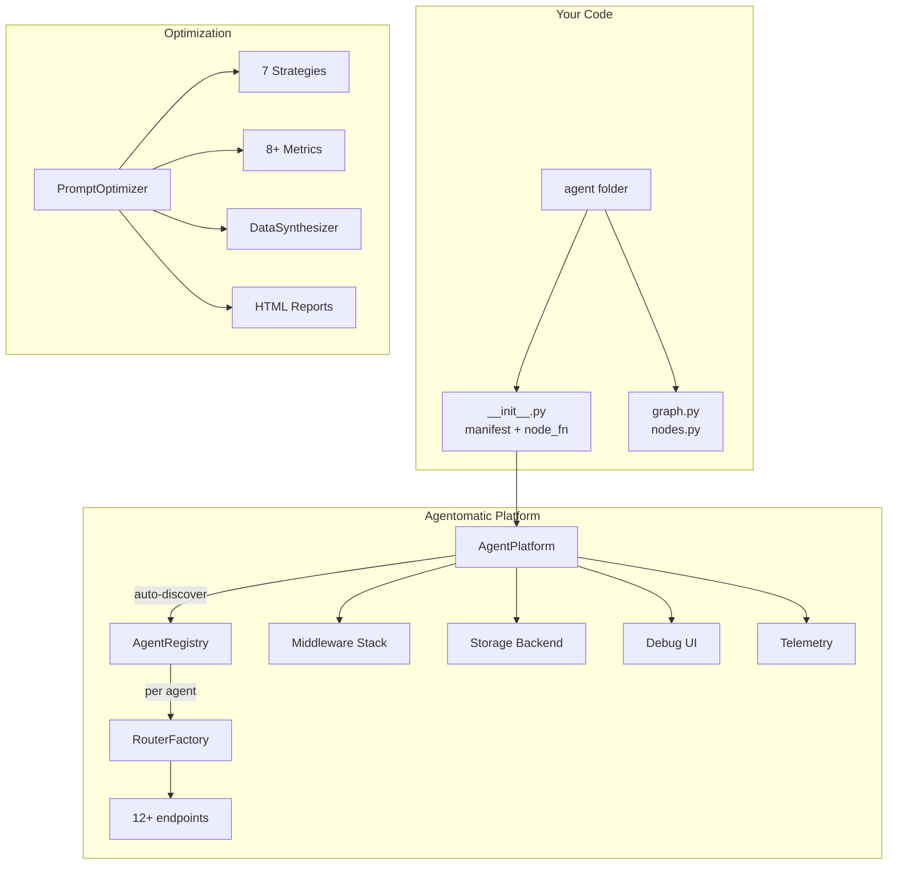

---
hide:
  - navigation
---

# Agentomatic

[](https://pypi.org/project/agentomatic/)
[](https://www.python.org/downloads/)
[](https://opensource.org/licenses/MIT)
[](#)
[](https://unicolab.github.io/agentomatic)

## Drop agents, not code ⚡

**Agentomatic** is a zero-code multi-agent API platform framework. Create production-ready AI agent APIs with auto-discovery, auto-routing, streaming, A2A protocol, and full observability — in 3 lines of code.

```python
from agentomatic import AgentPlatform

platform = AgentPlatform.from_folder("agents/")
app = platform.build()  # Full FastAPI app — ready to deploy
```

---

## Why Agentomatic?

| Feature | What You Get |
|---|---|
| 🔍 **Auto-Discovery** | Drop an agent folder → endpoints appear automatically |
| 🚀 **12+ Endpoints Per Agent** | invoke, stream, chat, A2A, health, config, threads, feedback |
| 🗄️ **Pluggable Storage** | MemoryStore, SQLAlchemy, or bring your own |
| 🔒 **Middleware Pipeline** | Auth, rate limiting, metrics — all toggleable |
| 🎯 **Prompt Optimization** | 7 DSPy-inspired strategies, 8+ metrics, DataSynthesizer |
| 🎨 **Built-in Debug UI** | ChatGPT-like interface via Chainlit |
| 📦 **5 Scaffolding Templates** | basic, full, rag, chatbot, custom |
| 🤖 **A2A Protocol** | Agent-to-agent communication out of the box |
| 📊 **Observability** | OpenTelemetry tracing + Prometheus metrics |
| 🔌 **Framework Agnostic** | LangGraph, LangChain, or raw Python |
| 🛡️ **Red Team Testing** | Adversarial evaluation for safety & security |
| ⚡ **CLI Tooling** | init, run, list, test, inspect, doctor, ui |

---

## Quick Install

```bash
pip install agentomatic

# With all batteries
pip install agentomatic[all]
```

## Create Your First Agent

```bash
agentomatic init my_agent --template basic
agentomatic run
# → http://localhost:8000/docs
```

---

## Architecture



---

## Feature Highlights

### 🎯 Prompt Optimization (DSPy-inspired)

```python
from agentomatic.optimize import PromptOptimizer, Dataset

optimizer = PromptOptimizer(
    agent="hr_bot",
    metrics=["answer_relevancy", "faithfulness"],
    strategy="iterative_rewrite",
)
result = await optimizer.optimize(
    dataset=Dataset.from_jsonl("eval.jsonl"),
    max_iterations=10,
)
result.apply()  # Save optimized prompt
```

### 📊 Full Observability

```python
platform = AgentPlatform.from_folder(
    "agents/",
    enable_metrics=True,     # Prometheus at /metrics
    enable_telemetry=True,   # OpenTelemetry tracing
    enable_feedback=True,    # User feedback collection
)
```

### ⚡ Click-Based CLI

```bash
agentomatic init hr_bot --template rag
agentomatic run --reload --with-ui
agentomatic test hr_bot
agentomatic doctor
```

---

[Get Started :material-arrow-right:](getting-started/installation.md){ .md-button .md-button--primary }
[View on GitHub :material-github:](https://github.com/UnicoLab/agentomatic){ .md-button }
