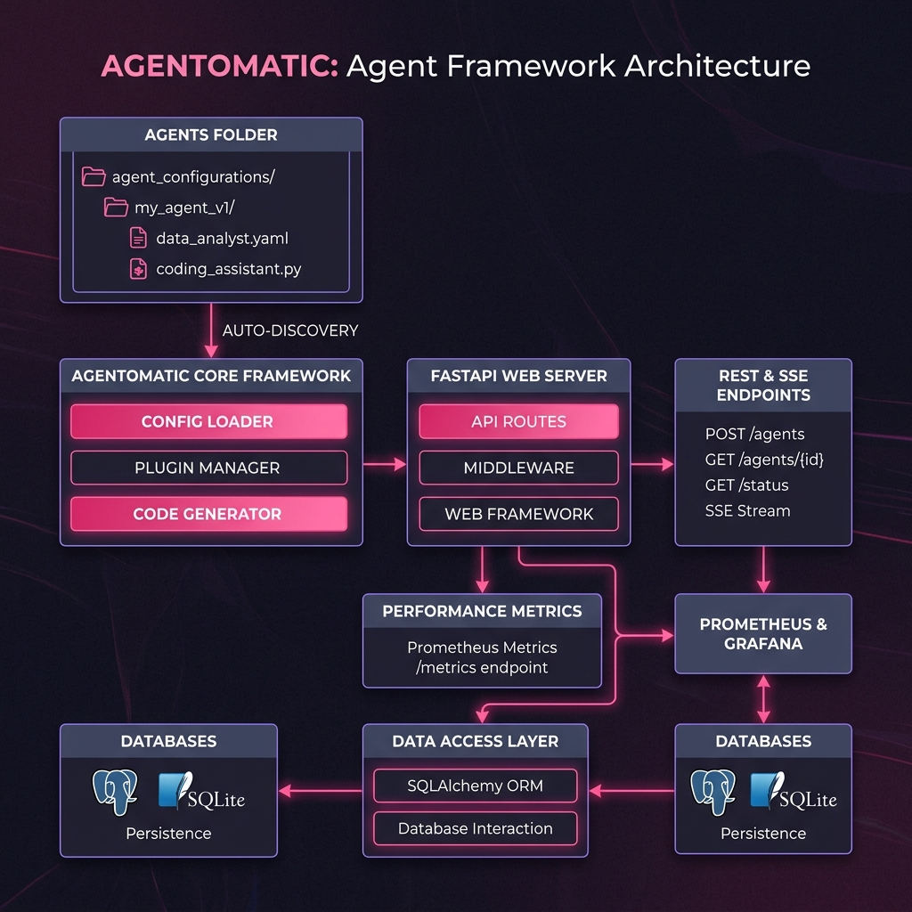

---
hide:
  - navigation
---

# Agentomatic

<div align="center">
  <p align="center">
    
  </p>
  
  <h3>Drop agents, not code. ⚡</h3>
  <p><b>The zero-code multi-agent API platform framework.</b> Turn any agent script or graph into a secure, resilient, enterprise-grade microservice with auto-discovery, SSE streaming, thread persistence, and prompt optimization — in 3 lines of code.</p>

  <p>
    <a href="https://pypi.org/project/agentomatic/"></a>
    
    
    
  </p>
</div>

---

## ⚡ What is Agentomatic?

**Agentomatic** acts as a production-ready application server for AI agents. Whether you write raw Python functions, build complex multi-agent orchestrations with **LangGraph**, or chain tools together with **LangChain**, Agentomatic auto-discovers your code and mounts a complete FastAPI application with standard REST routes, server-sent events (SSE) streaming, database adapters, telemetry, and rate limiting.

### The 3-Line Deploy

```python
from agentomatic import AgentPlatform

# 1. Discover agents, 2. Build the API, 3. Deploy
platform = AgentPlatform.from_folder("agents/")
app = platform.build()
```

Run with `uvicorn main:app --reload` and visit `/docs` for a fully documented OpenAPI specification!

---

## 🏗️ Platform Architecture

Agentomatic's core principle is **Convention over Configuration**. By dividing agents into isolated directories containing a manifest, configuration, and a execution graph, the framework automatically maps directory files to API endpoints, database adapters, and prompt templates.



---

## 🚀 Key Features

### 🔍 1. Auto-Discovery & Hot Reloading
Drop a directory containing an `__init__.py` file (which exports an `AgentManifest` and execution function) into your `agents/` folder. Agentomatic automatically spins up a custom FastAPI router, parses your input/output schemas, and mounts a complete suite of **12+ REST endpoints** for that specific agent.

### 🌊 2. Synchronous & SSE Streaming
Standardize how clients talk to your agents. Every agent gets a synchronous `/invoke` endpoint and an asynchronous `/invoke/stream` Server-Sent Events (SSE) streaming endpoint that streams intermediate agent thought steps, tool calls, and final answers in real-time.

### 🗄️ 3. Session-Aware Chat & Persistence
The `/chat` endpoint manages full context history automatically. By passing a `thread_id`, Agentomatic reads the conversation log, formats it as history, and executes your agent. Swappable database adapters (**MemoryStore**, **SQLAlchemyStore**) let you persist user messages to PostgreSQL, MySQL, or SQLite out of the box.

### 🛡️ 4. Enterprise-Grade Middleware
Keep your agents safe and monitored. Toggle middleware filters globally or per-agent:
- **API Key Auth**: Secured endpoints with customizable key authorization.
- **Token Bucket Rate Limiting**: Prevent abuse by limiting queries per IP/User.
- **Prometheus Metrics**: Monitor latency, request counts, and active connections at `/metrics`.
- **Structured Logging**: Context-scoped loguru logs tracking execution durations and exceptions.

### 📊 5. Prompt Tuning & Optimization (DSPy-inspired)
Tune prompts like hyper-parameters. Agentomatic includes a prompt optimization module with **7 optimization strategies** (e.g. `iterative_rewrite`, `few_shot_bootstrap`) and **8 evaluation metrics** (answer relevancy, faithfulness, toxic speech check, etc.). Generate synthetic datasets with a single command and track prompt version history with side-by-side HTML reports.

### 🎨 6. ChatGPT-like Debug UI
No frontend development required. Run `agentomatic run --with-ui` to launch a built-in, production-quality **Chainlit** chat interface where you can test agents, select prompt versions, inspect step-by-step tool invocations, and submit feedback ratings.

---

## 🗺️ How does it compare?

| Feature | Raw FastAPI + LangChain | Agentomatic Platform |
| :--- | :--- | :--- |
| **Route Generation** | Manual routing code per agent | **Auto-generated** (12+ routes/agent) |
| **SSE Streaming** | Custom generator/FastAPI event parser | **Native SSE wrapper** |
| **History Storage** | Manual DB schema and connection pools | **SQLAlchemy/Memory adapters** |
| **Metrics / APM** | Manual Prometheus exporters | **Plug-and-play middleware** |
| **Prompt Tuning** | Hardcoded, untracked templates | **prompts.json hot-reload + DSPy optimizer** |
| **Debug Console** | None or expensive third-party tools | **Built-in Chainlit Chat UI** |

---

## 🏁 Quick Installation

Install Agentomatic and all its production components (including optimizer and web UI) using `pip` or `uv`:

```bash
# Complete install with all databases, UI, and optimizer features
pip install agentomatic[all]

# Or with uv
uv add agentomatic --extra all
```

---

## 🛠️ Create Your First Agent

Scaffold a basic chatbot and start the local API platform with two terminal commands:

```bash
# 1. Initialize a chatbot template
agentomatic init helper_bot --template basic

# 2. Run the platform with the interactive debugging UI
agentomatic run --with-ui
```

Your Swagger API documentation is available at `http://localhost:8000/docs`, and the Chat UI is ready at `http://localhost:8000/chat`!

---

[Get Started :material-arrow-right:](getting-started/installation.md){ .md-button .md-button--primary }
[View CLI Reference :material-card-search:](cli/commands.md){ .md-button }
[View on GitHub :material-github:](https://github.com/UnicoLab/agentomatic){ .md-button }
