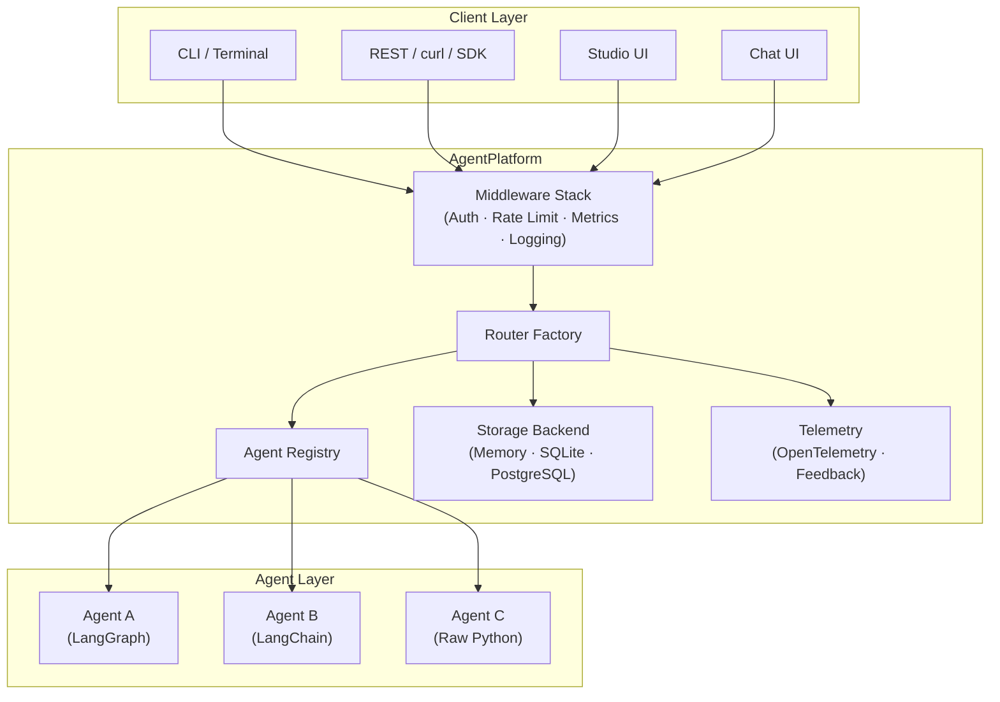

---
hide:
  - navigation
---

# Agentomatic

<div align="center">
  <p align="center">
    
  </p>

  <h3>Drop agents, not code. :octicons-zap-24:</h3>
  <p><b>The zero-config multi-agent API platform framework.</b><br>
  Turn any Python function, LangGraph workflow, or LangChain pipeline into a production-ready microservice — with auto-discovery, SSE streaming, thread persistence, visual debugging, and prompt optimization.</p>

  <p>
    <a href="https://pypi.org/project/agentomatic/"></a>
    
    
    
    
  </p>
</div>

---

## :octicons-zap-24: What is Agentomatic?

**Agentomatic** is a production-ready application server for AI agents. Drop a Python folder containing a manifest and an execution function into your `agents/` directory — Agentomatic auto-discovers the code and mounts a complete FastAPI application with REST endpoints, SSE streaming, database persistence, middleware, telemetry, and a visual debugging studio.

It works with **any agent framework** — LangGraph, LangChain, CrewAI, or raw Python — and requires **zero boilerplate configuration**.

<div class="grid cards" markdown>

- :material-flash:{ .lg .middle } **Auto-Discovery & REST API**

    ---

    Drop a folder with `__init__.py` + `manifest` into `agents/`. Agentomatic generates **12+ REST endpoints** per agent automatically — invoke, stream, chat, health, config, and more.

- :material-waves:{ .lg .middle } **SSE Streaming**

    ---

    Every agent gets synchronous `/invoke` and asynchronous `/invoke/stream` endpoints. Stream intermediate thoughts, tool calls, and final answers to clients in real-time via Server-Sent Events.

- :material-database:{ .lg .middle } **Multi-Turn Threads**

    ---

    The `/chat` endpoint manages conversation history automatically. Pass a `thread_id` and Agentomatic handles context. Swap between **MemoryStore**, **SQLite**, or **PostgreSQL** backends.

- :material-palette:{ .lg .middle } **Agentomatic Studio**

    ---

    Visual debugging environment with graph visualization, SSE node streaming, time-travel debugging, state inspection, and live editing. Works with every framework via universal adapters.

- :material-tune-vertical:{ .lg .middle } **Prompt Optimization**

    ---

    DSPy-inspired prompt tuning with **7 optimization strategies** and **8 evaluation metrics**. Generate synthetic datasets, run tuning loops, and track prompt version history with HTML reports.

- :material-shield-key:{ .lg .middle } **Enterprise Middleware**

    ---

    API key auth, token-bucket rate limiting, Prometheus metrics at `/metrics`, structured logging with Loguru, and OpenTelemetry tracing — toggle globally or per-agent.

- :material-swap-horizontal:{ .lg .middle } **Universal Frameworks**

    ---

    First-class support for **LangGraph**, **LangChain**, **CrewAI**, and raw Python. The adapter pattern ensures every framework gets the best debugging experience possible.

- :material-console:{ .lg .middle } **Powerful CLI**

    ---

    Scaffold agents, run the platform, test interactively, inspect configurations, diagnose environments, optimize prompts, and launch debug interfaces — all from the terminal.

</div>

---

## :material-rocket-launch: The 3-Line Deploy

```python
from agentomatic import AgentPlatform

platform = AgentPlatform.from_folder("agents/")  # (1)!
app = platform.build()  # (2)!
# Run: uvicorn main:app --reload  (3)
```

1. Scans the `agents/` directory and auto-discovers all agent packages
2. Builds a complete FastAPI application with routes, middleware, and storage
3. Visit `http://localhost:8000/docs` for your auto-generated OpenAPI spec

---

## :material-sitemap: Platform Architecture



---

## :material-swap-horizontal: How Does It Compare?

| Feature | Raw FastAPI + LangChain | Agentomatic Platform |
| :--- | :--- | :--- |
| **Route Generation** | Manual routing code per agent | **Auto-generated** (12+ routes/agent) |
| **SSE Streaming** | Custom generator / event parser | **Native SSE wrapper** |
| **History Storage** | Manual DB schema and connections | **SQLAlchemy / Memory adapters** |
| **Metrics / APM** | Manual Prometheus exporters | **Plug-and-play middleware** |
| **Prompt Tuning** | Hardcoded, untracked templates | **prompts.json hot-reload + optimizer** |
| **Visual Debugging** | None or expensive third-party | **Built-in Studio with graph view** |
| **Framework Support** | Single framework, locked in | **LangGraph, LangChain, CrewAI, Python** |

---

## :material-download: Quick Installation

=== "Full Install (Recommended)"

    ```bash
    pip install agentomatic[all]
    ```

=== "Minimal Install"

    ```bash
    pip install agentomatic
    ```

=== "With uv"

    ```bash
    uv add agentomatic --extra all
    ```

!!! tip "Install Extras"
    Agentomatic uses optional extras to keep the base package light:

    | Extra | Includes |
    |-------|----------|
    | `all` | Everything below |
    | `ui` | Chainlit chat interface |
    | `studio` | Visual debugging studio |
    | `db` | SQLAlchemy + database drivers |
    | `optimize` | Prompt optimization (DeepEval) |
    | `metrics` | Prometheus metrics exporter |
    | `cli` | Rich terminal output + questionary |
    | `telemetry` | OpenTelemetry tracing |

---

## :material-play: Create Your First Agent

```bash
# 1. Scaffold a chatbot from the built-in template
agentomatic init my_chatbot --template basic

# 2. Launch the platform with Studio
agentomatic run --studio --reload
```

Your platform is now running:

| Service | URL |
|---------|-----|
| **API Docs** (Swagger) | `http://localhost:8000/docs` |
| **Agentomatic Studio** | `http://localhost:8000/studio/ui/` |
| **Agent Endpoint** | `http://localhost:8000/api/v1/my_chatbot/invoke` |

```bash
# 3. Query your agent
curl -X POST http://localhost:8000/api/v1/my_chatbot/invoke \
  -H "Content-Type: application/json" \
  -d '{"query": "Hello!"}'
```

---

## :material-compass: Where to Go Next

<div class="grid cards" markdown>

- :material-play-circle:{ .lg .middle } **[Quick Start](getting-started/quickstart.md)**

    ---

    Install, scaffold, and run your first agent in under 60 seconds.

- :material-folder-cog:{ .lg .middle } **[Agent Structure](guide/agent-structure.md)**

    ---

    Understand the convention-over-configuration folder layout.

- :material-palette:{ .lg .middle } **[Agentomatic Studio](guide/studio.md)**

    ---

    Visual debugging with graph view, state inspection, and time-travel.

- :material-console:{ .lg .middle } **[CLI Reference](cli/commands.md)**

    ---

    Every command, flag, and workflow documented.

- :material-tune-vertical:{ .lg .middle } **[Prompt Optimization](guide/optimization.md)**

    ---

    Auto-tune your prompts with DSPy-inspired optimization loops.

- :material-cogs:{ .lg .middle } **[Architecture](architecture/overview.md)**

    ---

    Deep dive into platform internals, request flow, and adapters.

</div>

---

[Get Started :material-arrow-right:](getting-started/quickstart.md){ .md-button .md-button--primary }
[CLI Reference :material-card-search:](cli/commands.md){ .md-button }
[View on GitHub :material-github:](https://github.com/UnicoLab/agentomatic){ .md-button }
