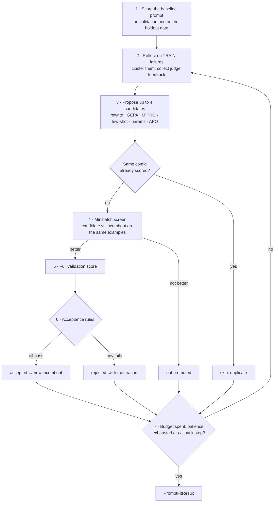

# How optimization works

This page follows one optimization run from start to finish. Every entry point
(`train_and_report`, `agent.fit()`, `PromptFitter`, `agentomatic optimize`)
runs this loop.

## The agent must read its prompt through the framework

Candidates are scored by running your real agent with a different prompt. The
prompt reaches the agent through
`BaseGraphAgent.resolve_system_prompt(...)`, which resolves, first match wins:

1. the per-request `system_prompt_override` — how each **candidate** is injected;
2. `compiled_config["system_prompt"]` — what `fit()` keeps as the best prompt;
3. the agent's `system_prompt` attribute — the **baseline**;
4. the active version in `prompts.json`;
5. the `default=` you pass.

```python
class SupportAgent(BaseGraphAgent[SupportState]):
    system_prompt = "You are a support assistant for Acme Cloud."   # baseline

    def answer(self, state: SupportState) -> SupportState:
        prompt = self.resolve_system_prompt(default=self.system_prompt)  # ← required
        reply = self.llm.invoke([{"role": "system", "content": prompt}, ...])
        ...
```

A node that hard-codes its prompt string cannot be optimized: every candidate
would produce identical answers. Overrides are per request (a `ContextVar`),
so candidates evaluated concurrently on one agent instance never see each
other's prompt.

## One `fit`, step by step



1. **Baseline.** The starting prompt is scored on the validation set (the
   fitter's `valset`) and, if there is one, on the holdout gate. These are the
   first incumbent's scores.
2. **Reflection.** Up to `reflection_size` (default 8) **train** examples are
   run and scored; examples scoring below 0.5 are clustered into failure
   patterns (with a suggested fix each), and judge feedback is collected. This
   is what the optimizer learns from. It is drawn from train so the optimizer
   never studies the examples it is then selected on (`reflect_on="train"`).
3. **Proposal.** The optimizer (see the table below) proposes up to four
   candidate configurations per round from the incumbent and the reflection.
   A candidate identical to one already scored is skipped for free: a weak
   rewrite model often re-proposes the current prompt.
4. **Minibatch screen.** Each candidate runs on a slice of validation (30 %,
   at least 5 examples) and is compared with the incumbent **on the same
   examples**. Only candidates that beat it are promoted.
5. **Full validation.** Promoted candidates are scored on all of validation
   and on the holdout gate.
6. **Acceptance.** A candidate replaces the incumbent only if every rule
   holds: a minimum validation lift, statistical confidence that the lift is
   real, and no sign of overfitting on the holdout gate. See
   [Generalization & overfitting](generalization.md) for the rules and their
   knobs. Every candidate records a `decision` (`duplicate`, `not_promoted`,
   `accepted`, `rejected`) and a human-readable `reason`.
7. **Stopping.** Rounds continue until `max_trials` distinct candidates have
   been evaluated (rounds = `ceil(max_trials / 4)`), `patience` rounds pass
   without an accepted candidate (default 3), or a callback asks to stop
   (`ScoreThreshold`, `EarlyStopping`, …).

The result, a `PromptFitResult`, carries the baseline and best configs and
scores, the holdout scores, every trial with its decision and reason,
per-example results for the baseline and the best config, failure clusters,
suggestions and the settings used.

## Optimizers — how candidates are proposed

| `optimizer=` | Proposes | Good when |
| --- | --- | --- |
| `"rewrite"` | A system prompt rewritten from the failure clusters, plus variants with few-shot demos or answer tips | Instructions are vague or missing rules |
| `"gepa_like"` (default in `PromptFitter`) | Targeted edits driven by judge feedback | A judge gives useful feedback |
| `"mipro_like"` | Combinations of instruction variants and few-shot sets | Examples matter as much as instructions |
| `"few_shot"` | Demonstration sets selected from train | The format is right but answers drift |
| `"param_search"` | Grid / random / TPE over `model_param_space` (temperature, top_p, …) | The prompt is fine; sampling is not |
| `"apo"` | Critique of the full execution trace, then an edit | Multi-node agents; scope with `node_match` |
| any object | Whatever its `async propose(current_config, eval_results, dataset_sample, search_space, iteration, context)` returns | Custom strategies (see [`anti_overfitting.py`](examples.md)) |

What an optimizer *may* change is declared by the
[`PromptSearchSpace`](prompt-fitter.md#search-space).

## Epochs: `agent.fit(epochs=N)`

With class agents, each epoch runs one complete `PromptFitter.fit` starting
from the previous epoch's best config, so improvements compound. After each
epoch the agent keeps the new prompt only if that epoch improved it, then
records `loss`/`val_loss` and your compiled metrics in `History`.

`History.fit_results` holds one `PromptFitResult` per epoch;
`merge_fit_results(history.fit_results)` (and `generate_fit_report(history)`)
combine them into one result from the **original** prompt to the **final**
one. Looking only at the last epoch's result would compare the final prompt
with a prompt an earlier epoch had already improved.

## What is never done

* The **test** split is never passed to the fitter. It exists so you can
  measure the final prompt on data nothing was selected on — evaluate it
  before and after `fit()`.
* Nothing is written to `prompts.json` unless you call `apply()`, and
  `apply()` refuses a result that did not improve or whose
  validation/holdout gap is too large (override with `force=True` after a
  review).
