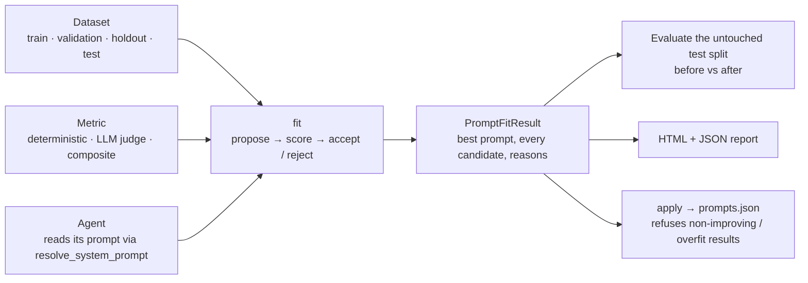

# Prompt optimization

Agentomatic can improve an agent's **system prompt** (and, if you allow it,
its few-shot examples and model parameters) against a labelled dataset. It
scores the current prompt, proposes better ones with an LLM, keeps a candidate
only when it wins on validation data **and** carries over to data the
optimizer never selected on, and reports exactly what changed.

It never changes live traffic. The result is a candidate prompt version that
you review, verify, and release through your normal delivery process.



## Pick an entry point

All entry points drive the same engine, `PromptFitter`. Pick the one that
matches how much control you need.

| You want to… | Use | Page |
| --- | --- | --- |
| Optimize a scaffolded project agent with one command | `python agents/NAME/train.py` (`train_and_report`) | [Class agents](class-agents.md#one-call-train_and_report) |
| Write the Keras-style loop yourself: data, metrics, loss, `compile`, `fit`, `evaluate` | `agent.compile(...)` / `agent.fit(...)` | [Class agents](class-agents.md) |
| Control every knob: datasets, metric, search space, callbacks, acceptance rules | `PromptFitter` | [Low level: PromptFitter](prompt-fitter.md) |
| Optimize an agent that is already running behind the API | `agentomatic optimize` | [CLI & legacy API](cli.md) |

## A complete run in 40 lines

```python
from agentomatic.agents import CallableMetric, MetricLoss, PromptFitterBridge, WeightedMetric
from agentomatic.optimize import LocalJudgeMetric, generate_fit_report, load_data

from my_project.agents.support.agent import SupportAgent  # any BaseGraphAgent

data = load_data("agents/support/datasets/all.jsonl")  # train / validation / holdout / test
agent = SupportAgent()

judge = LocalJudgeMetric(
    name="judge",
    model="omlx/Qwen3.5-9B-MLX-4bit",
    criteria="Correct, grounded in the policy, complete and concise.",
    dimensions=["correctness", "completeness"],
)
facts = CallableMetric(  # deterministic: the example's key facts are in the answer
    "facts",
    lambda ex, pred: sum(f in pred["response"] for f in ex.metadata["must_include"])
    / len(ex.metadata["must_include"]),
)
quality = WeightedMetric([("judge", judge, 0.6), ("facts", facts, 0.4)], name="quality")

optimizer = PromptFitterBridge(
    agent_name=agent.agent_name,
    task_model="omlx/Qwen3.5-9B-MLX-4bit",
    rewrite_model="omlx/Qwen3.5-9B-MLX-4bit",
    llm_base_url="http://127.0.0.1:8000/v1",
    optimizer="gepa_like",
    metric=quality,          # what candidates are selected on
    max_trials=8,
)
agent.compile(data, metrics=[judge, facts, quality], optimizer=optimizer, loss=MetricLoss(quality))

before = agent.evaluate(data.test)                  # the split fit() never sees
history = agent.fit(data, epochs=2)
after = agent.evaluate(data.test)

generate_fit_report(history, output_path="reports/support.html",
                    baseline_eval=before, final_eval=after, eval_dataset=data.test)
```

The runnable version of this, with every option listed in comments, is
[`examples/prompt_optimization/train.py`](examples.md).

## What to read next

1. [How it works](how-it-works.md) — the fit loop step by step, how a
   candidate prompt reaches your agent, what epochs do.
2. [Metrics, judges & loss](metrics.md) — which metric to use, LLM-as-judge,
   judge panels, composite objectives, how metrics, the objective and the loss
   relate.
3. [Generalization & overfitting](generalization.md) — the data roles and the
   acceptance rules that stop the optimizer from memorising your validation set.
4. [Datasets & augmentation](data.md) — the JSONL format, splits, and
   leak-free synthetic training data.
5. [Reports](reports.md) — reading the before/after report.
6. [Examples](examples.md) — runnable scripts from "score some answers" to a
   full training run.
